암호론 03
=========

-	제목의 인덴트 하나씩 줄임.
-	정수론 등의 기본 수학이 되어야 고전암호를 배울 수 있음 (곧 배울 예정)

2장 암호의 세계
===============

SECTION 02 암호
---------------

### 2.1 암호 시스템의 요소

-	평문 (plaintext)
-	암호문 (ciphertext)
-	암호화 / 복호화 알고리즘 (encryption / decryption algorithm)
	-	주어진 수가 소수인지 파악하는 알고리즘 등을 배울거다
-	키 (key) : 복호화할 때 사용
	-	키가 뭐에요?
	-	`무슨 일이 있으면 노예를 보내겠다. 머리카락을 깎아봐라. 머리에 내 메시지가 담겨있을거다`
	-	왕재산 사건 : 요즘 북한군은 지령을 동영상으로 보낸다
	-	key 관리하는 부분이 중요.

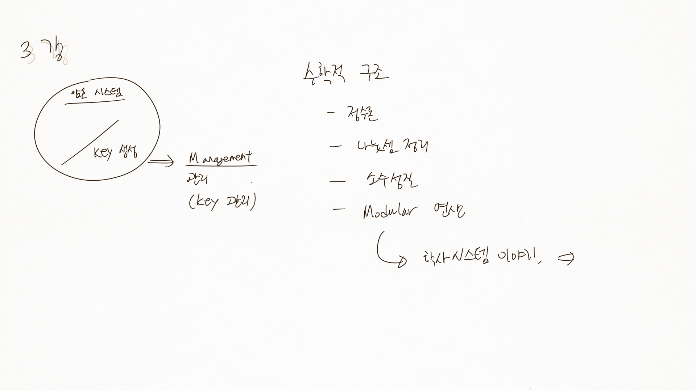 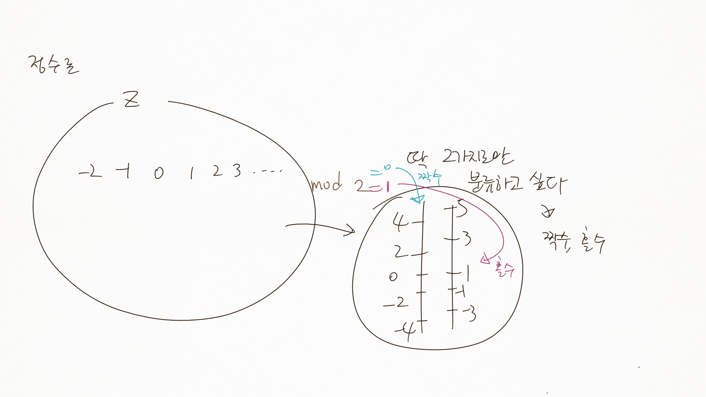 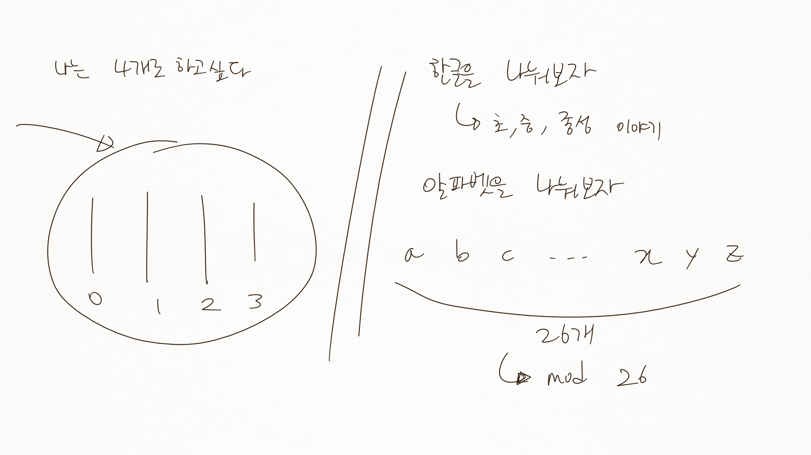 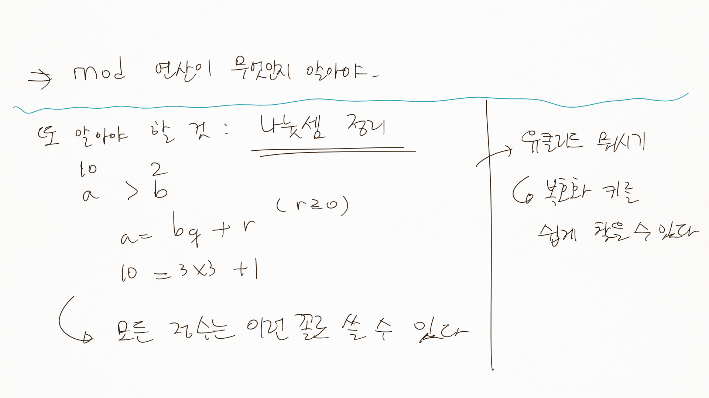 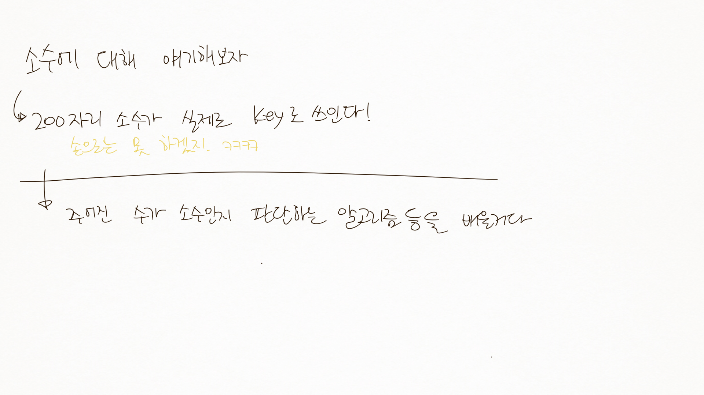

### 2.2 암호 시스템의 기호적 표현

-	`C = E_k(P)`
	-	평문 P를 키 K를 이용하여 암호화하여 (E) 암호문 C를 얻는다
	-	C : cipher
-	`P = D_k(C)`
	-	암호문 C를 키 K를 이용하여 복호화하여 (D) 평문 P를 얻는다

↓ 그림으로

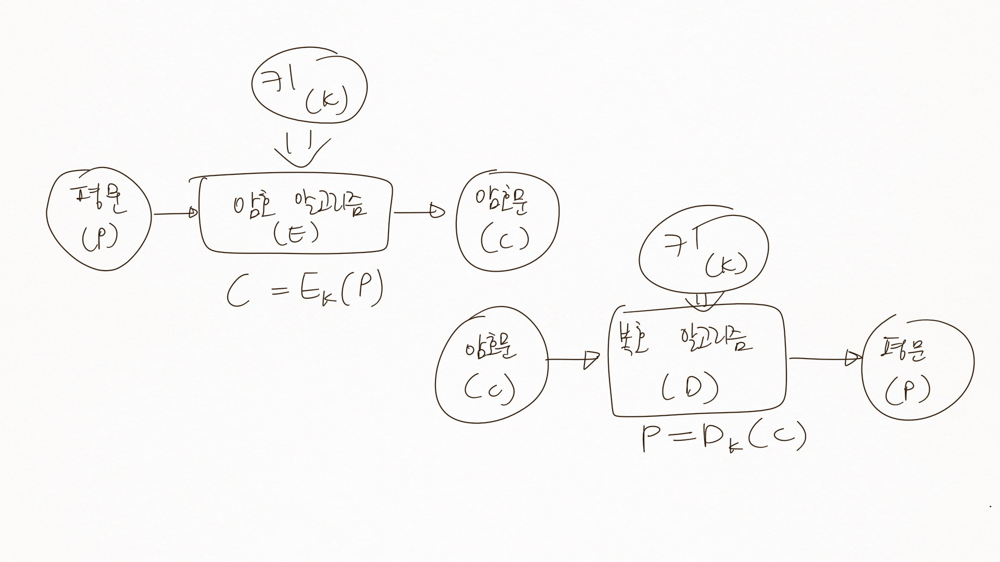

섹션 03 대칭 암호와 공개 키 암호
--------------------------------

`카이사르 왕이 썼던 암호화 알고리즘도 배워볼거다`

### 목차

-	키 교환 알고리즘
	-	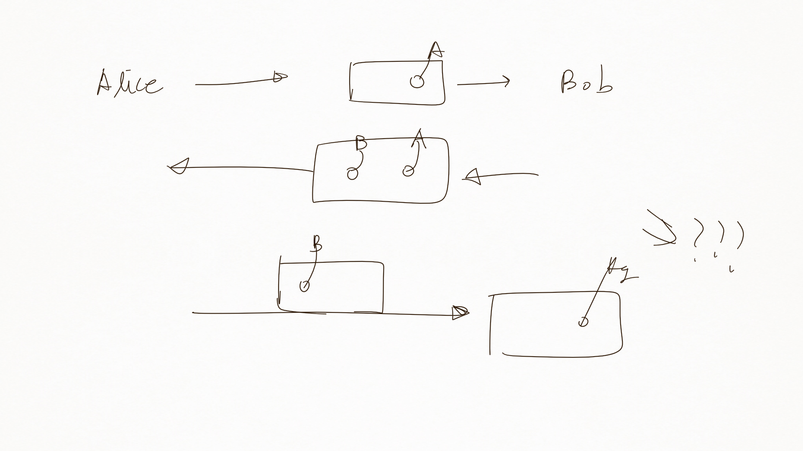
-	대칭키와 비대칭키
-	하이브리드가 뭔지 보자 (간단한 거 보낼땐 은행에서도...)

### 3.1 암호 알고리즘

-	암호화 알고리즘 : 평문을 암호문으로 만드는 절차, 암호화 과정
-	복호화 알고리즘 : 복호화 과정

아이고 내 인생아... 필기 다 놓치네

### 3.2 키

-	암호 알고리즘의 키 : 매우 긴 숫자
-	2진화된 숫자로 변경하여 사용
-	암호키의 안전
	-	키가 안전하다 = 적이 알아낼 수 없다
	-	0~9 2자리면 100개만 시도해보면 암호를 알 수 있다
	-	요즘 은행 암호는 4자리 → 10^4개 : 비밀번호가 겹칠 수 있 : 맞출 확률 = 4/10000 → 0.0025???
	-	키가 길수록 안전해질것이다

### 3.3 대칭 암호와 비대칭 암호

-	대칭 암호 (symmetric cryptography)
	-	암호화, 복호화 키가 동일
-	비대칭 암호 (asymmetric cryptography)
	-	암호화, 복호화 키가 서로 다름
	-	DES
	-	송신자 (키 한 쌍), 수신자 (키 한 쌍)
		-	(개인키, 공개키) 쌍
			-	→ 수학적으로 밀접한 연관
-	공개키 암호 (public-key cryptography)
	-	키 중 공개키는 공개 → 이름이 공개키

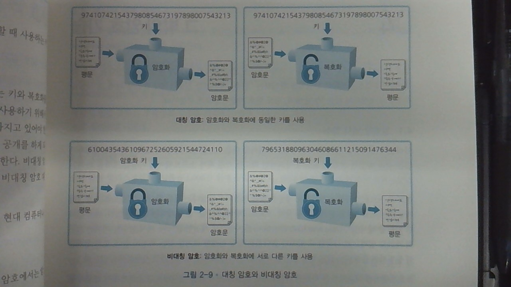

### 3.4 하이브리드 암호 시스템

-	암호의 목표 3가지
	-	기밀성
	-	무결성
	-	가용성
-	→ **가용성**의 중요성
	-	느리면 못 써먹음
	-	그렇다고 보안이 안 되면...
	-	→ 적절히 조합
-	하이브리드 암호
	-	대칭 암호와 공개 암호를 조합
	-	→ 장점 조합
-	한국의 보안에 대해.
	-	주민번호 = 중국에
	-	아이핀 = 최근에 털림
	-	암호는 **언젠간 다 뚫림** → 암호는 깨지라고 있는거다
	-	과제... 한수원...

`가급적 수학은 배제중`

---

휴식

---

섹션 04 그 밖의 암호기술
------------------------

### 4.1 일방향 해시 함수

-	해시
	-	여러 값을 계산값으로 묶는다
	-	해시값 = 일방향 해시함수를 사용하여 계산한 값
	-	지금은 잘 몰라도 됨
-	암호를 해시 → 짧아짐, 암호가 달라진다 → 해시가 달라진다

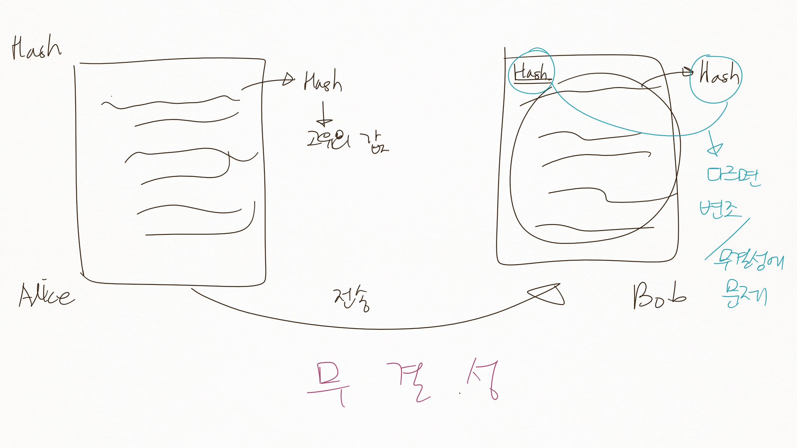

### 4.2 메시지 인증 코드

-	메시지의 주인이 누구인지 확인
	-	Alice가 보냈는지, Malley가 보냈는지.
-	보낸 사람, 즉 사용자 인증.

### 4.3 디지털 서명 (digital signature)

-	디지털 서명
	-	인감도장
	-	내가 보낸 것임을 인증
	-	*ps. 디지털 서명은 싸인이나 도장 찍는게 아니고 숫자로 감*

### 4.4 부인 (repudiation)

-	통신 사실을 나중에 아니라고 하는 것
-	→ 방지해야.
	-	사례 : 전화 안 오던데? (나중에 폰에서 부재중 이력을 삭제...)

### 4.5 의사 난수 생성기

세션 05 암호학자의 도구상자
---------------------------

-	암호학자의 도구 상자
	-	대칭 암호
	-	공개 키 암호
	-	일방향 해시 함수
	-	메시지 인증코드
	-	디지털 서명
	-	의사 난수 생성기

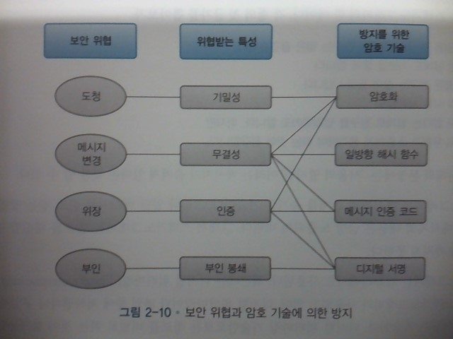

-	암호 기술들이 사용되고 있다

섹션 06 스테가노그래피, 디지털 워터마킹
---------------------------------------

저작권 컨텐츠 등에 사용.

-	크립토그래피 (cryptography) → 암호화 : 메시지의 내용을 읽지 못하게
-	스테가노그래피 (steganography) → **은닉기법** : 메시지의 존재 자체를 숨김
	-	→ 방법을 알게 되면 금방 내용 노출
-	디지털 워터마킹 (digital watermarking)
	-	파일 중에 *저작권자나 구입자의 정보*를 집어넣는 기술
	-	여기에 스테가노그래피를 적용
-	지금은 또 다 깨죠...

섹션 07 암호와 보안 상식
------------------------

-	7.1 비밀 암호 알고리즘을 사용하지 말 것
	-	암호화, 복호화 과정이 공개된 걸 써야
	-	소수 집단이 사용하는 것 : 금방 다 깨짐
-	7.2 약한 암호는 암호화 하지 않는 것보다 위험.
	-	안심하고 썼는데 암호화된 자료라 중요한 걸로 고려될 수 있
-	7.3 어떤 암호라도 언젠가는 해독된다
-	7.4 암호는 보안의 아주 작은 부분
	-	암호 공부가 보안의 전부가 아니다.

### 7.1 비밀 암호 알고리즘을 사용하지 말 것

-	암호 알고리즘의 비밀은 반드시 폭로된다
-	강한 암호 알고리즘 만들기 = 매우 어렵다
-	숨기는 것에 의한 보안 (security by obscurity)
	-	DES의 숨겨진 부분의 공개 → 키를 찾을 수 있었음
	-	숨기는 것 = 어리석음

### 7.2 약한 암호는 암호화 하지 않는 것보다 위험

-	어떤 암호라도 언젠가는 깨지게 되어있음
-	사용자 = 암호의 강도와 관계없이 암호화만으로 안심 하는 경향
-	모든 키를 하나도 빠짐없이 시도해 봄 → 언젠가는 반드시 해독
	-	암호문 해독까지의 시간으로 강도를 판단
	-	tradeoff : 평문의 가치와 암호 해독까지의 시간의 밸런스가 중요

### 7.3 어떤 암호라도 언젠가는 해독된다

-	일회용 패드 (one-time pad)
	-	나중에 배움

### 7.4 암호는 보안의 작은 부분이다

-	사회공학적인 공격 방법
-	신상 털리는 이야기.
-	보안 시스템의 강도는 보안 시스템을 구성하는 여러 링크 중 가장 약한 링크의 강도와 같다
	-	가장 약한 링크는 암호가 아니라 사람
-	인적 보안이 매우 중요하다

챕터 03. 암호의 역사 : 고전암호
===============================

목차
----

1.	시저 암호
2.	단일 **치환** 암호
	-	치환 = permutation → 순열 : 순서대로 늘어놓는 방법
3.	다중 치환 암호
	-	한 문자가 여러 문자로 바뀌는 암호
4.	에니그마 : 암호 기계?
5.	전치암호 : 전치행렬 이용, 치환 암호
6.	암호 알고리즘과 키

---

-	시저 암호에서 발전 → 아핀 암호 : 선형 함수 : 역함수를 찾아야 복호화 가능
-	역함수를 찾아야 복호화 가능한 것 : 힐 암호

과제 : KISA에 거의 다 나와있을것, 전자신문, 종이신문 비즈니스 부분 등

### 1.1 시저 암호란?

-	시저 암호 (Caesar chiper)
	-	줄리어스 시저 (유리우스 케사르) 가 사용하였다는 암호
	-	평문으로 사용되는 알파벳을 일정한 문자 수 만큼 **평행이동** 시킴으로서 암호화

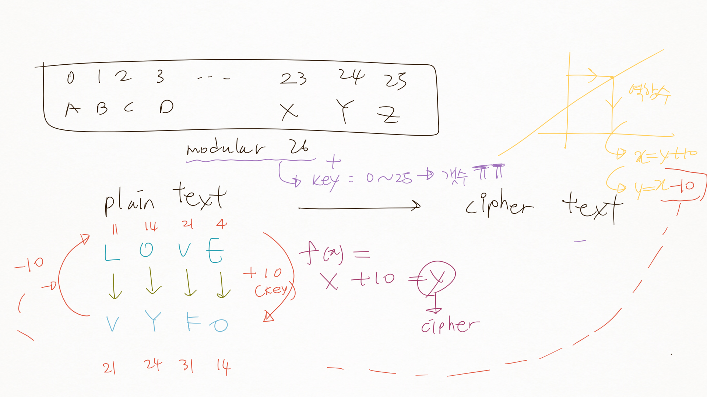

-	은어도 하나의 규칙 → 암호로 볼 수 있음 → 집단에서의 암호.
-	저 암호로는 아쉬우니 `y = ax` 로 바꿔볼까
	-	modular 26이 되어야
	-	→ `40 = 26 * 1 + 14`
	-	→ `14 = 40 mod 26`
	-	→ `14 ≡ 40` → 결과가 평행함 → 합동이다

1.2 ~ 1.3 시저 암호의 암호화, 복호화
------------------------------------

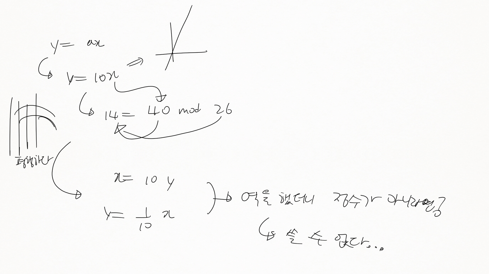

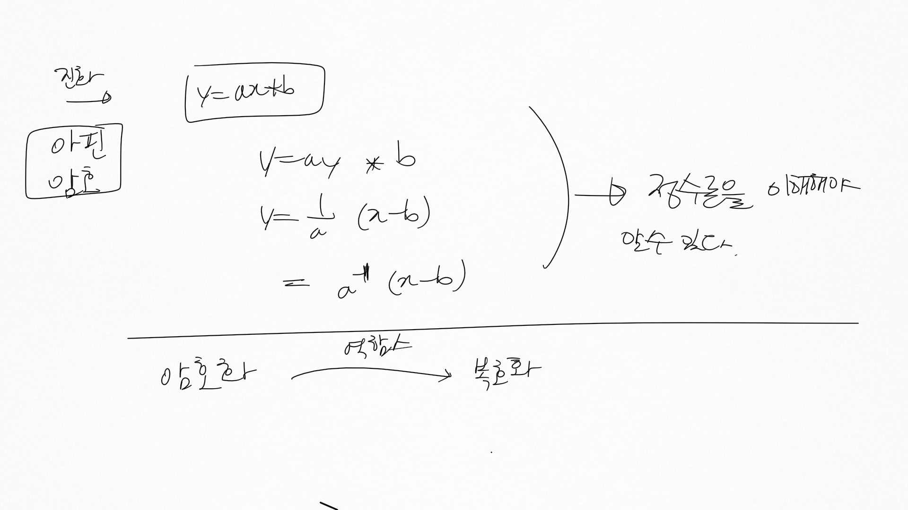

### 1.4 전사 공격에 의한 해독

-	모든 키를 시도. → 시저 암호는 매우 취약
