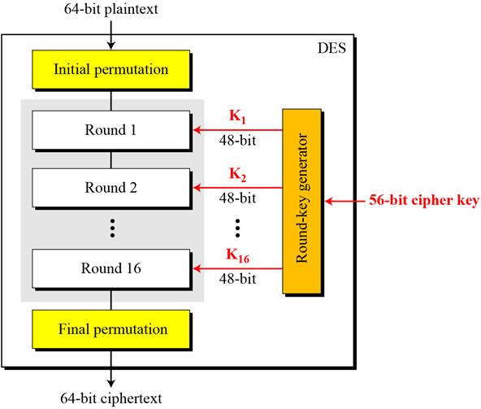
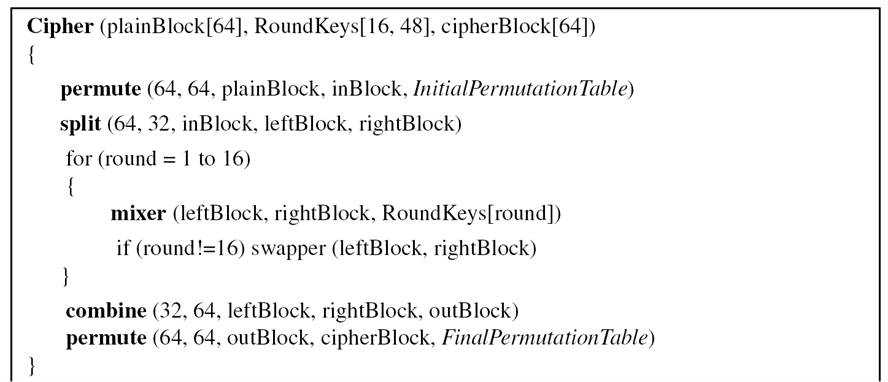
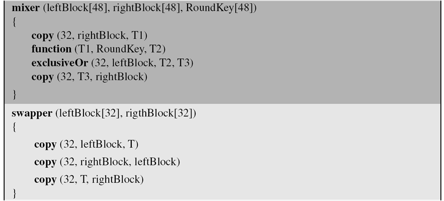

-	교재의 DES 암호는 굉장히 간결하게 나와있다
-	전수조사의 방어 : 키 집합의 갯수
-	→ 유클리드 알고리즘 = 기본
-	n이 소수가 되면 키집합이 아주 많아진다
-	→ 소수의 성질을 파악하자!
-	수론에서 정수를 다루는 사람들이 지금까지도 더 큰 소수를 찾아...
-	요새는 150자리 암호를 쓴다
-	양자 컴퓨터와 양자 암호...
-	hill 암호 : 키집합으로 쓸 수 있는 걸 바꾼다면.
	-	역행렬 : 1/det → (det의 역수를 찾아야!) → 몇 번 해야...
	-	복호화를 그대로 하면 안 된다 : ...?

DES
===

-	지난시간까지는 Permutation (치환)
	-	치환, 전치
		-	1:1 치환
			-	축소치환 (omit)
			-	확장치환 (중복이동)
-	DES : 블럭 단위 암호화
	-	키 생성에 따라 부분키를 만든다
	-	이러한걸 n 라운드를 돈다
	-	거꾸로 : 복호화

> standalone도 괜찮고, 서버 구축해놨으면 그걸로 과정 보여줄 수 있으면 좋겠다 이말이야
>
> 할 수 있는 사람만 해보세요.

-	비도 = 안정성

6.1 소개와 역사
---------------

-	대칭키, 블록 암호
-	미국 국립기술표준원 에서 공표 (1973년 제안 요청서 → 1975년 3월 초안(draft) 공표) -
-	지금은 다 뚫렸다 : 3중, 64비트에서 128, 256, 512비트....
-	사실 지금도 사용되고 있따...

### 개요

-	64 bit plaintext → \[ DES cipher \] → 64 bit ciphertext
-	key 는 56bit
-	64 bit ciphertext → \[ DES reverse cipher \] → 64 bit plaintext

6.2 DES의 구조
--------------

-	Feistel (페이스텔) 이라는 사람이 고안해내서 Feistel 라운드 함수라고 불림
-	여러 라운드를 거쳐 진행

---

-	6.2.1 초기치환과 최종치환 (Initial and Final Permutations)
-	6.2.2 라운드 (Rounds)
-	6.2.3 암호화와 복호화 (Cipher and Reverse Cipher)
-	6.2.4 예 (Example)
-	1라운드 거치는데만 해도 한참 걸림 → 코딩을 해야... → 예제를 통해 확인

### 6.2.1 초기 / 최종 치환

-	비트를 치환함
-	수많은 표 중 하나를 선택 : 이 사람들이 정한 것

-	key가 48bit인데 블록은 64bit잖아요! → 중간에 블록을 32bit로 쪼갭니다. 나중에 나옴
-	초기치환표, 최종치환표 두 개가 있음. 역치환임 (결국 원래대로.)
-	왜 그런 표를 택했는진 우리도 몰라요!
-	치환의 예
	-	0x0000_0080_0000_0002 → 0x0002_0000_0000_0001
-	표 보는 법 : 표안의 값은 원래 있던 값의 위치. 결과를 표현함
-	초기치환과 최종치환은 서로 역의 관계에 있는 단순 P-박스이다
	-	→ 자기 자신으로 돌아와야 하므로
	-	왼쪽부터 1, 2, 3, ... ???

### 6.2.2 라운드

-	L 32bit, R 32bit 로 분리
	-	R_new = L (+) f(R, K)
		-	L값이 R값의 함수로 연산된 뒤 R과 swap
	-	L_new = R
		-	R과 swap
-	expansion box! ← 2개씩 중복
-	어째 확장 후 축소
-	DES 함수
	-	32비트 → 확장 P 박스 → 48 비트 → 키와 XOR → → S-box → 32bit → 정방 P-box
		-	s-box 연산 연습 : 앞, 뒤를 10진수로, 가운데 4개를 10진수로 → 표에서 매칭
-	mixer와 swapper
-	64 비트 키 → 암호화에서 쓰일 각 라운드의 서브키를 생성 은 아직 설명하지 않음.

숙제
====

-	DES 암호가 끝나면.. 2주정도 시간을 줄게요
-	다음시간, 그리고 그 다음주. 그때까지 DES 암호를 코딩해오세요.
	-	인터넷에 떠도는 테이블을 이용 안 할 수도, 있기도 함.
	-	여기 나오는 테이블을 전부 구현해야 하나, 짜기 싫으면 인터넷에서 구해도 됨. 하지만 이해는 해야
	-	최대 2인
-	자기가 짰으면 다 압니다. 설명할 수 있어야
-	다음주에 누구랑 하는지 / 혼자 하는지를 제출할 것
-	암호 공부하는 사람들은 DES 말고 AES를 해보세요?
-	발표...는 아무나 찍어서...

---

### 6.2.3 계속 : 의사코드

### 6.2.3 라운드 키 생성

-	64비트를 32비트로 만들기 위해 compression P-box를 사용
-	2비트씩 시프트해서 압축 P-box
-	키 → Parity drop → 반으로 쪼갬 (28bit 씩)
-	다음에는 블록 암호의
