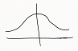
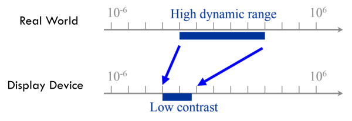
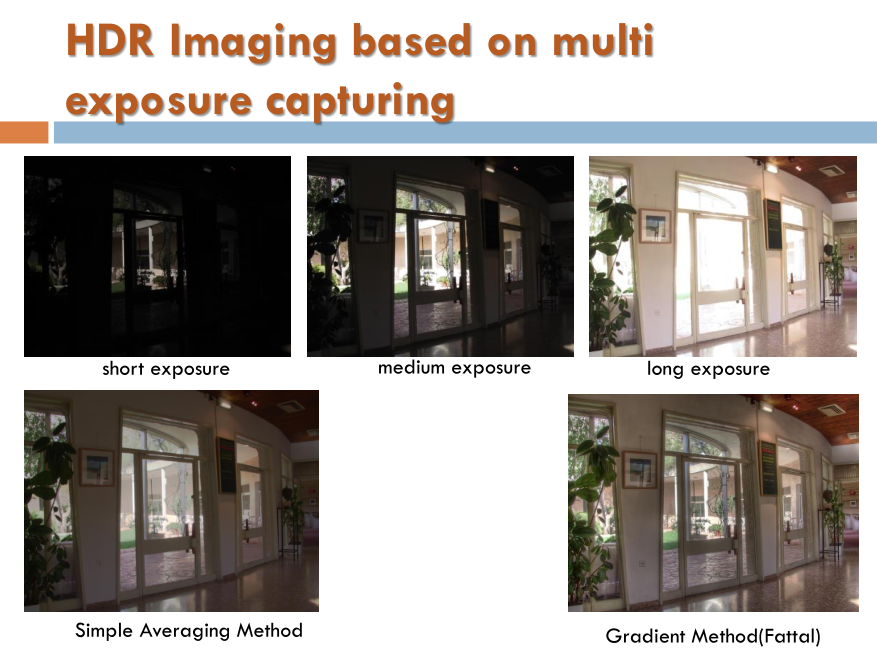

CV 4
====

-	이전까지 한 것들 : CV를 위한 WarmingUP들
	-	프로그래밍 테크닉 위주로
	-	저번 과제도 일맥상통 : HSV 방식으로 바꾸기
	-	극적으로 성능이 높아지지는 않을 것임
-	HSV에 대해.
	-	조명에 따라 RGB가 바뀜 → HS 기반 (V는 명도 : 명도를 제외하려고 HSV로 옮김)
	-	원하는 주 정보 : hue
	-	Satuation (채도)
	-	SoC Robot War 에서도 Hue가 주요 관심사.
	-	주요 관심사 : **왜 HS로 하느냐**
		-	(....이거 보고서에 너무 당연해서 안 썼네...)
	-	색상 검출의 다른 테크닉도 있음.
		-	5장 Histogram based Tracking : BackTracking (좀 더 고급)
	-	색상 검출 : RGB(엉터리), HSV(떨어짐), BackTracking(그나마 고급), ...
		-	완성이 아님.
	-	토론
		-	margin을 늘려가면서 얼굴의 형상을 확인한다? → 정확도를 높인다
		-	hue 값 20% 색상 : 너무 넓다 (360도 중 20% : 72도)
		-	원하던 대답 : hue는 적게(색상 범위가 너무 넓지 않게), satuation은 많게 (빛에 영향)
	-	보고서에는 코드 설명이 아니라 hue의 값에 대한 고찰이 나왔어야.... (orz)

CV 스타일로.
============

-	5장 BackTracking, 4장 (CV 기술), 3장은 ...
-	CV 기술인지 영상처리 기술인지 명확하게 나눌 수 없음.
-	3장 이미지 피라미드 : 보통 파노라마에 쓰임.

이미지 피라미드란?
------------------

-	Multi-resolution Analysis
	-	이미지를 여러 해상도로 만들어 파악
	-	성능이 좋음 : 못 했던 일들을 시도할 수 있음
-	가우시안 피라미드, 라플라시안 피라미드
	-	이미지 - 이미지/2*2 = 라플라시안 피라미드의 이미지
	-	작은 영상으로 줄이는 과정에서 정보 loose가 일어남
	-	Gaussian Pyramid : Low pass components
	-	Laplacian Pyramid : High pass components
-	논문에 관해
	-	논문.
	-	사람에 대해서 공부하면 배울 게 있다 : Burt
-	Reconstruction : 멀티 레벨 피라미드 → 원래 이미지
	-	탑 가우시안 피라미드 + 멀티 레벨 라플레시안 피라미드

이미지 피라미드의 Decomposition
-------------------------------

-	가우시안 블러링 (복습)
	-	가우시안 함수 : 
	-	가우시안 함수를 이용해 픽셀의 값을 인접한 픽셀과... (생략)
	-	멀리서 본 것과 같음 : 픽셀끼리 섞는다
-	왜 굳이 블러링? → 용량을 줄인다
-	단계
	1.	A를 가우시안 블러
	2.	A를 Down Sampling (짝수 번호나 홀수 번호만 가져오는 방식)
	3.	2를 Up Scailing
	4.	1에서 4를 뺌 : 라플라스 피라미드 LP(0)
-	이렇게 피라미드를 만드는 과정 = Decomposition

가우시안 피라미드와 라플레시안 피라미드의 예
--------------------------------------------

주루룩.

소스 보기 (출처도 기재됨)
-------------------------

-	[소스](http://eric-yuan.me/image-pyramids/PyramidBuildShow.cpp)

```cpp
#include "opencv2/imgproc/imgproc.hpp"
#include "opencv2/highgui/highgui.hpp"
#include <vector>
using namespace cv;
using namespace std;
int main(){
    Mat image = imread("vangogh.jpg"); // unsigned char
    int level =5;
    vector <Mat> GaussianPyramid;
    vector <Mat> LaplacianPyramid;
    Mat temp1, temp2, temp3;
    Mat Lap;
    GaussianPyramid.push_back(tem1);
    image.copyTo(temp1);
    for(int i=0; i<level; i++){
        pyrDown(temp1, temp2);
        pyrUp(temp2, temp3, temp1.size());
        Lap = temp1-temp3;
        GaussianPyramid.push_back(temp2);
        LaplacianPyramid.push_back(Lap);
        temp1=temp2;
    }
    //show whatever you want.
    imshow("Gaussian" , GaussianPyramid[2]);
    imshow("Laplacian", LaplacianPyramid[2]);

    waitKey(0);
    return 0;
}
```

Reconstruction : 피라미드로부터 이미지 다시 만들어내기
------------------------------------------------------

-	작은 Laplacian 으로부터 합침
-	예제 소스 작성한 사람이 큰 실수를 함

---

휴식

---

-	솔직히 강의 내용이 많아서 숙제로 넘기던 일단 넘어가야
-	2배 확대 = 자신의 픽셀의 우, 하, 우하단 픽셀을 만들어야.
	-	→ Gaussian 이다?
-	사용처
	-	두 이미지의 부드러운 합성 : Seamless Blending
		-	왼쪽 반은 사과, 오른쪽 반은 오렌지
		-	손바닥에 눈
		-	Feathering blend를 각 라플레시안 레벨에서 블렌딩, 리컨스트럭션.
	-	다른 PPT : Compuatational Photography
		-	사례도 적혀있음.
	-	비디오에서 프레임 캡처시에도...
	-	Image Blending
	-	Perez et al, 2003
	-	이러한 기술의 원조가 피라미드!

원래 걸로 돌아가서
------------------

-	우리가 할 수 있는 쉬운 수준
-	이미지 피라미드 사용처 : Template Matching 의 속도 3.5배 향상
-	OpenCV 함수
	-	buildPyramid
	-	pyrDown : convolution → 1/2
	-	pyrUp : upsample
	-	곳곳에서 이러한 것이 사용됨.

케이스 스터디
-------------

1.	Enhancement idea
	-	rebuild 할 때 쓰이는 라플레시안 피라미드에 Gain을 줄 수 있음 (곱하기 3 등...)
	-	→ 해당 층의 Edge가 강해짐
	-	→ 큰 노력 없이 해볼 수 있음
	-	→ 숙제 3. 라플라스 피라미드의 Gain을 조절(강화) 해서 강화를 통한 화질 개선 (Enhancment) 구현
	-	개선 정도가 포토샵보다 낫다
		-	Brightness 를 개선하는 부분은 소개하지 않음
			-	Gaussian 피라미드의 요소가 Brighness를 가지고 있음
2.	제외됨 (학부생 치고는 어려움)
3.	신기술 트렌드와 라플라스 변환? 의 관계
	-	HDR Image
		-	HDR On / Off 기능이 카메라에 있을 것이다
		-	Computational Photography : 계산으로 다시 만들어낸 사진.
		-	IPhone 6 : 동영상도 HDR이.
		-	다루는 문제 : High Dynamic Range
			-	Real World는 색의 범위가 넓다
			-	
			-	밝은 곳과 어두운 곳이 동시에 나오지 않는 문제
			-	우리 눈은 Dynamic Range가 넓다
	-	→ 해결법 : 노출을 짧게 한 번, 노출을 길게 한 번 찍어서 합친다
		-	
		-	평균 내는 방법은 누구나 생각해낼 수 있으며, 질이 후짐
		-	→ 피라미드 퓨전
			-	: 아이디어 : 특정 라플라스 층에 다른 양으로 가중치를 줌, 괜찮은 부분만 가중치를 주는 등 가중치를 통제.
		-	돈이 걸린 문제. (Computation Power가 너무 많이 들어감)

자투리 이야기
-------------

-	안 된다는 이유 : imread() 가 기본적으로 unsigned char 로 읽는다 : 뺄셈할때...
-	컴퓨터니까 속 편하게 32bit float로.. (웃음)
	-	임베디드 : 왠만하면 float는 안 쓰도록 : Floating Point 연산기가 없는 경우도.
-	`convertTo(temp1, CV_32FC3, 1.0/255.0)` : imshow는 부동소수의 경우 0~1로 가정 : 처음부터 0~1 사이로 normalization
-	파일로 저장할 때는 0~255로 다시 바꿔야.
