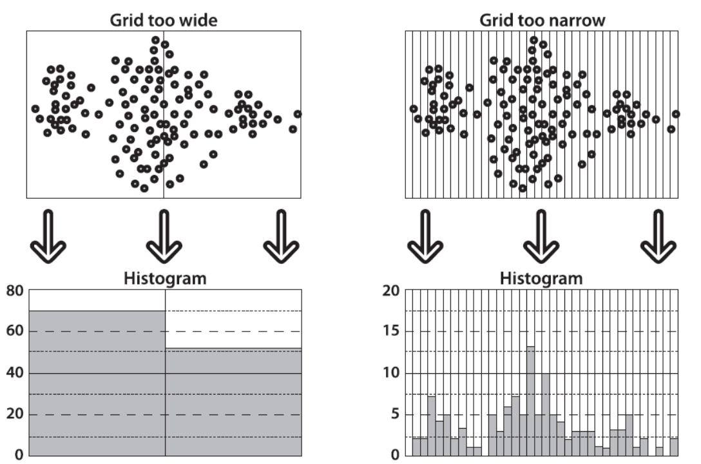
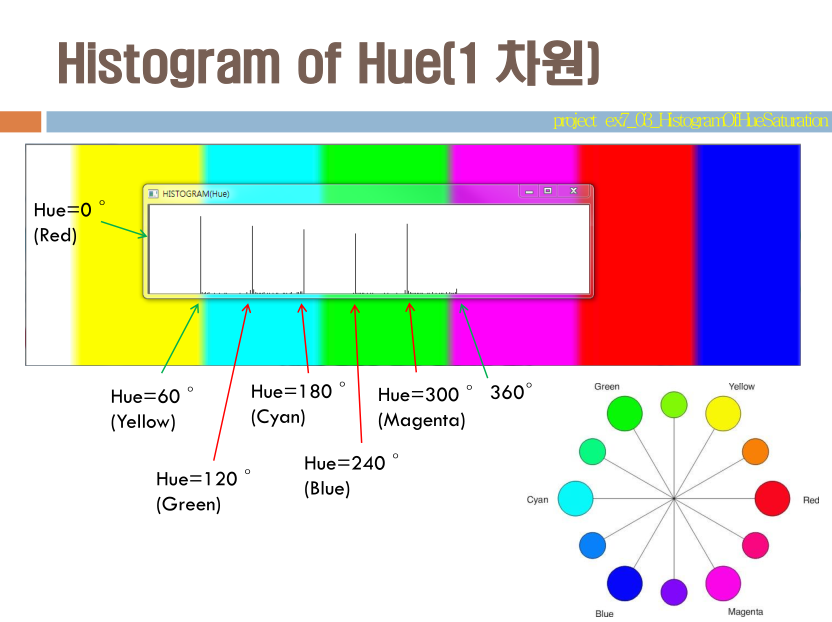
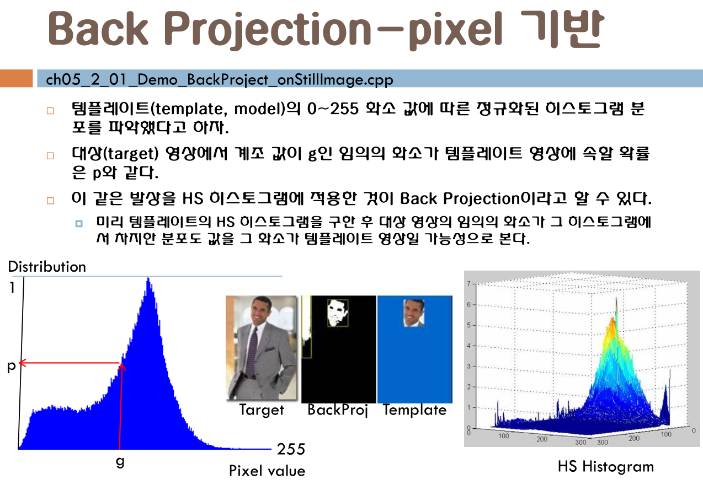
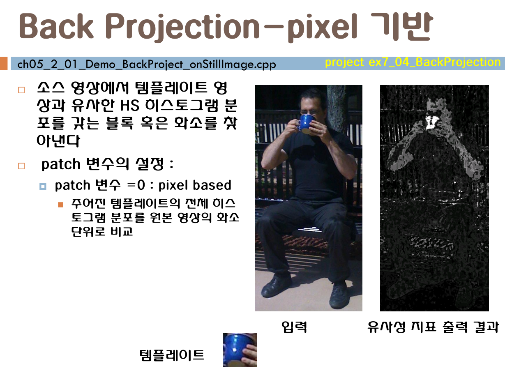

cv06
====

수업 전 잡담
------------

-	애들 가르치는거 → 학과추천장학생?
-	강연 하나

오늘 할 거 : 5장
----------------

-	최종 단계로 가면 analytics 같은 걸로...
-	Detection ← 나중
	-	← Color (HS Histogram)
	-	← Feature Points (t r l?????)
-	Detection에서 →
	-	→ Tracking
	-	→ Recognition
-	오늘 하는 거 HSV의 HS 기반
	-	→ 의 끝장판 Back Projection
	-	이 후로 → Mean Shift → Cam Shift
	-	이 두 개는 다음시간에.
-	Segmentation → Color / Feature Detection에 둘 다 들어감
	-	이 부분이 나무고, 이 부분이 뭐고...
	-	두 군데에 적용이 되면 퀄리티 ↑
-	나중에 flood-fill

Histogram Back Projection
=========================

-	이론이 필요해서 좀 딱딱한 강의가 될 듯
-	→ Trick (idea) 가 많은 생각을 하게 함

히스토그램이 뭐에요?
--------------------



-	격자로 분할해서 가로, 세로의 갯수를 따짐
	-	→ **분포도**
-	grid 하는 표현을 bean (바구니...? 네?) 이라고 함
-	→ grid 의 갯수에 따라 성능이 달라질수도.

Hue / Sat 히스토그램
--------------------

### Hue로 히스토그램 그리세요?



-	레인보우의 분포그림.
-	지글지글 → 그래픽으로 만든 게 아니고 TV에서 찍은거라 지지직...
-	교수님이 만드신 hue (가로), Saturation (세로축) 2차원 그림
	-	진한 초록색 : 분포량이 많음
-	제공하는 함수를 쓰는 편이 좋음 (고생...)
	-	`calcHist()`

### 히스토그램의 실습

-	여러 그림으로 예제 프로그램을 돌려봄.
	-	`ch05_1_00_Demo_calcHist_ShowHShistogram.cpp`
-	bean이 12개 이상이어야 함 → 360도 중 그림이 12시당 하나씩 색을 → 우리가 아는 색 그림
-	찾고자 하는 색을 **Template** / **Model** 이라고 함
	-	무엇을 인식하고 싶다면 Template / Model을 먼저 설정해야 함

```cpp
calcHist(
  &hsv,     // 1. images → Source Arrays
  // → CV_8U / CV_32F
  // 모든 이미지가 같은 크기어야  함
  1,        // 2. nimages → image 갯수
  channels,	// 3. channels → int[]
  Mat(), 				// do not use mask. Optional mask.
  hist, //cv::MatND	→ 왜 ND인지?			// Output histogram, which is a dense or sparse dims -dimensional array. 연산 결과 자료형은 float인 듯.
  2,					// dims ? Histogram dimensionality that must be positive
  histSize,			// histSize ? Array of histogram sizes in each dimension.
  ranges,			// ranges ? Array of the dims arrays of the histogram bin boundaries in each dimension.
  true,				// uniform ? Flag indicating whether the histogram is uniform or not
  false);			// Accumulation flag. This feature enables you to compute a single histogram from several sets of arrays.
```

-	calcHist
	-	마스크 → 해당 영역의 색상만을 확인, 비슷한걸 추적
-	결과를 정규화 → 확대해서 표시하고 싶음
	1.	최대값을 찾음 : `minMaxLoc(hist, 0, &maxVal, 0, 0);`
	2.	확대 : `int scale = 10;   Mat histImg = Mat::zeros(sbins*scale, hbins*scale, CV_8UC3);`
	3.	`rectangle()` 로 직접 그린다
		-	좌측 상단, 우측 하단 지점.

```cpp
for (int h = 0; h < hbins; h++)
  for (int s = 0; s < sbins; s++)
  {
    float binVal = hist.at<float>(h, s);
    int intensity = cvRound(binVal * 255 / maxVal);
    rectangle(histImg,												// 출력하고자 하는 HS 히스토그램 영상 어레이
      Point(h*scale, s*scale),							// 시작점
      Point((h + 1)*scale - 1, (s + 1)*scale - 1),		// 대각되는 방향의 끝점
      //Scalar::all(intensity),								// 흑백으로 표현할 경우..
      Scalar(0, intensity, 0),								// 눈에 잘 띄는 녹색으로 표현하고자 함.
      CV_FILLED);
  }
```

개인적으로 조금 더 보기 쉽게 바꿈 ↓

```cpp
const int scale = 20;
Mat histImg = Mat::zeros(sbins*scale, hbins*scale, CV_8UC3);

cvtColor(histImg, histImg, CV_BGR2HSV);

for (int h = 0; h < hbins; h++)
  for (int s = 0; s < sbins; s++)
  {
    float binVal = hist.at<float>(h, s);
    int intensity = cvRound(binVal * 255 / maxVal);
    rectangle(histImg,												// 출력하고자 하는 HS 히스토그램 영상 어레이
      Point(h*scale, s*scale),							// 시작점
      Point((h + 1)*scale - 1, (s + 1)*scale - 1),		// 대각되는 방향의 끝점
      //Scalar::all(intensity),								// 흑백으로 표현할 경우..
      Scalar(h*(179/hbins), s*(255/sbins), intensity),								// 눈에 잘 띄는 녹색으로 표현하고자 함.
      CV_FILLED);
  }

cvtColor(histImg, histImg, CV_HSV2BGR);
```

2 → FloodFill
=============

-	전체를 보는 방법 : 비슷한 영역은 하나로 보게
-	FloodFill 이 back projection에 적용됨

3 → 히스토그램 백 프로젝션
==========================

-	주어짐 : 타겟 영상 / Template 영상
-	비슷한 HS (Hue / Satuation) 분포를 갖는 픽셀 / 패치를 타겟에서 찾아내는 기법
-	2개의 함수
	-	픽셀 기반 : CalcBackProjection, cvCalcBackProject
	-	패치 기반 : cvCalcBackProjectionPatch

pixel 기반으로 설명
-------------------



-	back projection
	-	픽셀값 - 분포 그래프 에서
	-	분포도 → 픽셀 이 아닌 거꾸로
	-	픽셀 → 분포도
		-	→ 특정 색상의 화면만 나타난다 → 탐지
-	흑백으로 생각하면 쉬움



Patch 기반
----------

-	비교할 때 아예 Patch를 비교 → pixel 기반으로 비교하지 않음
-	원본의 크기와 같은 크기로 히스토그램 분포를 확인, 유사한 걸 찾는다
-	→ HSV의 모양까지 본다
	-	C++ 함수 삭제됨... → 성능 문제.
-	→ Pixel 기반으로 하되, 그걸 보상?해줄 알고리즘을 찾자 라는 느낌?

2 → FloodFill 로 다시 돌아와서.
-------------------------------

-	Pixel 기반의 취약점 → 성능을 높이기 위해.
-	`ch05_1_01_Demo_floodFill_onStillImage.cpp`
-	→ flood fill 에 기반해서 칠함
-	`ch05_2_01_Demo_BackProject_onStillImage.cpp`
-	`ch05_2_02_BackProjectionTracking_onCamera.cpp`
-	알고리즘 자체는 어렵지 않은데 코드 쓰기가 어렵다
-	교수님 : 왜 RGB? HSV가 아니고요?
-	기니까 생략...
-	[OpenCV : FloodFill](http://docs.opencv.org/modules/imgproc/doc/miscellaneous_transformations.html#floodfill)
-	뭔가 복잡...
-	pseudo color → 주로 적외선 촬영 (온도 높으면 붉은색)
-	floatling? 알고리즘? → 너무 복잡해보여?

---

휴식

---

-	이미지냐, 영상이냐 차이
	-	`ch05_2_01_Demo_BackProject_onStillImage.cpp`
	-	`ch05_2_02_BackProjectionTracking_onCamera.cpp`
-	추적을 하고 싶지만... → 나중에 feature detection 같은 부분에 나옴.
-	*내가 원하는 box를 어떻게 좇아가냐*를 소개한 적이 없다
	-	segmentation → 성능 모름

과제
----

-	다음시간 : 발표용으로 과제를!
-	idea를 고민해보라
	-	어떻게 추적할까?
	-	tracking은 어떻게?
	-	box를 그려서?
	-	얼굴을 가까히 가져다대면 크기가 바뀔텐데?
	-	어딜 중심으로 오릴거냐?
	-	noise?
	-	크기가 안 변한다는 가정인 경우?
	-	좇아가는 모습을 보여야 할 텐데?
	-	cookbook에 제시가 되어있지만.
	-	rectangular
	-	ㅇㅁㅇ
	-	...
	-	.
	-	함수가 있지만, 여기에 적용할 수 있을 거 같지 않음 (noise)
	-	쿡북 : 만만치 않은 예제
	-	여러분이 한 번 생각해보세요
-	상자가 좇아가는 걸.
-	남들이 만들어놓은 다 해놓은 걸 발표하는건 의미가 없다
-	알고리즘은 반드시 back projection 을 기반으로.
	-	Object를 오려오는 알고리즘이 없다 → 어떻게든?
	-	드래그 → 상자 그려내는 예제 있음 (ROI, 마우스 드래그)
	-	→ 챕터 2 → ... 다시 공개해주실것. → 1장 → lab → SetMouseCallBack
-	다음시간은 같이 고민하며 쉬어가는 시간?

---

숙제 정리
---------

-	Back Projection 기반으로 Cam 영상의 일부를 Tracking 하는 프로그램을 제작하자
-	Spec
	-	마우스 드래그로 Template를 지정하는 방식
		-	→ HS 히스토그램
	-	타겟에서 Back Projection 한 결과를 *잘 가공해서*
		-	→ 초록색 테두리 상자로 좇아가보자
-	*잘 가공해서* 가 unclear → 여러분의 idea로 해보세요
	-	다른데서 발췌해올수도 있음
	-	순수하게 스스로의 idea로도 괜찮음
	-	size 변화는 안 된다고 가정 (하기 힘드니까.)
-	제출물
	-	PPT 유인물 인쇄
	-	원하면 2인 1조 허가 (→ 부담될지도 몰라서)
	-	USB ← 소스, PPT
		-	← 누가 발표할지 모름
		-	← 직접 돌려볼 수 있게

---

-	시험 : 8주차
