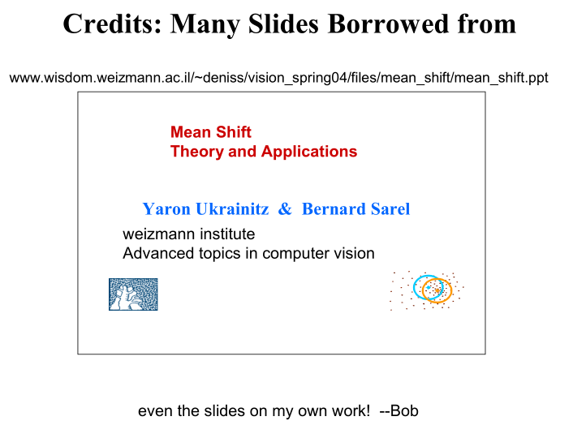
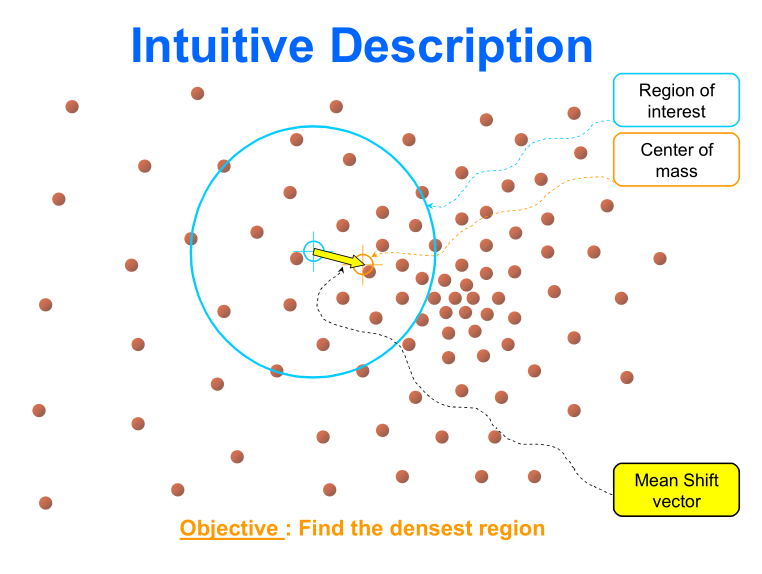

발표
====

발표 1
------

-	문제 정의 : 얼굴 영역을 사각형으로 드래그.
-	백프로젝션
	-	교수님 : 백프로젝션에는 템플릿 매칭의 아이디어가 없쟈.
		-	템플릿 매칭 : 벡터, 벡터 간의 비교.
-	matchTemplate 함수 사용함. (...)
-	> 교수님 : 그럼 백프로젝션을 왜 했어?
-	> 교수님 : 이론에 충실하게 안했어
-	> 교수님 : 백프로젝션을 입력으로 받지 않는대니까
-	템플릿 매칭은 시간이 오래걸린다 : Patch 개념
-	camShift 같은 걸 쓰면 훨씬 잘 되지만
	-	임베디드로 가면?
-	> 교수님 : 그런 함수를 찾아낸건 높이 사

발표 2
------

-	인식 이 아니라 검출. 표현을 정확하게 하자
-	선수조사
	-	일반적인 얼굴인식 소스
	-	인식이 아니라 검출 (detect)!
	-	XML 파일 → 얼굴 패턴
-	사각형 → 패턴 → 일치여부.
-	patch 기반 템플릿 매칭을 하려고 했는데 못 했다
-	> 교수님 : 기대한 대로 안 한거지. 혹시 차이점을 얘기할 수 있나요?
	-	(차이점에 대한 학생 발언)
	-	> 저건 패턴 (모양) 이고, 이건 HSV (컬러) 이다.
-	저 쪽 기술은 (Feature Point) → 영상이 명확하게 잡히고, 잘 변하지 않는 경우
-	이쪽 기술은 → 영상이 애매하게 생긴 경우 → 모양이 자주 변한다던가.

수업 : 5장 2, 3절
=================

-	`ch05_2_02_BackProjectionTracking_onCamera.cpp`
	-	플러드필 알고리즘으로 성능을 좀 더 올려보는 코드
-	2부
	-	클래스 사용
		-	Hue 기반 백프로젝션 카메라 추적 → 오늘은 안 해요
		-	마지막 파일 : MeanShift 예제. 오늘 할 얘기지만 자세히 안 볼 거임
	-	→ 이걸 캠시프트로 바꿔서 어떻게 좋아지나 파악하기
	-	→ 학생들 시킴..
-	바로 캠시트로 넘어감 (최대 성능)
	-	2가지 장르 : 색상으로 찾기 / 모양으로 찾기
-	백프로젝트 → 한번 더 계산 → meanshift → camshift
-	걍 타대학 자료를 가져와서 보기로 함.

Mean-shift Tracking
===================

-	이 알고리즘을 소개 ← 먼저 Mean-Shift를 소개해야

모양 vs 민시프트
----------------

-	모양 추적
-	히스토그램으로 나온 생김새를 활용한다
	-	색상에 제한되지는 않음
	-	h-s 면 이미 2D
	-	생김새에도 쓸 수 있지만 어리석음 (너무 큰 Array)

왜
--

-	non-rigid (경직되지 않은) 객체
	-	: 모양 막 바뀌는 객체를 대상
	-	: 추적하기 힘들다
	-	ex) 사람 걷는 거 추적

Mean-Shift
----------

[그 좋은 자료](http://www.wisdom.weizmann.ac.il/~deniss/vision_spring04/files/mean_shift/mean_shift.ppt)

-	평균 (Mean) 을 이동시킨다 (Shift)
-	→ (좋은 자료를 가져왔...)

### 졸라 좋은 설명

-	백프로젝션 결과가 점들
-	> 교수님 : 여러분들은 아이디어 얼마나 내는가 보려고 이번에 배울 걸 과제로 냈었어요
-	*어차피 그게 그 위치*임을 활용
	-	: 다음 프레임이 움직였으면 얼마나 움직였겠느냐
-	무게중심이라는 개념을 도입
	-	심하게 움직였으면 못 찾는다 (full search 해야 ㅋㅋㅋㅋㅋ → 노답 ㅋㅋㅋㅋㅋㅋ)
	-	→ 근처에서만 찾는다
-	무게중심이 움직이지 않을 때까지 무게중심 이동

### 무게중심을 어떻게 찾을까

-	알아듣기 어려우므로 [다른 자료](http://www.comp.nus.edu.sg/~cs4243/)로 간당
-	군집화 : 클러스터링과 유사
	-	군집 알고리즘에 쓰인당
-	오늘의 교수님 잔소리
	-	> 전문가가 아니면 봐도 모르니 졸작들을 학생들이 근사하게*만* 만드려고...
	-	> 그냥 쓰면 되지만 원리는 조금 알고 들어가길.
-	수식 덩어리... 1단계 / 2단계로 나뉨
-	수식 안 보고 일단 넘어갑니다...

### 코드 : CamShift 데모 (OpenCV 사이트)

-	주석 : 교수님. [파일](./files/ch05_4_02_Demo_camshift_camera.cpp)
-	b를 치면 backprojection 결과를 보여줌
-	특정 h 범위 내의 것을 확인.

백프로젝션
==========

-	아까 레포트 다른 방식으로 해본사람 없어요?
	-	중간정도 위치에다가...
	-	matchTemplate등...
	-	템플릿 매칭을 수동으로.. → 각각의 영역의 히스토그램 비교를 .... `compareHist()`
	-	correlation
-	상황에 따라 전처리가 다름 → 알맞은 것을 사용

다시 돌아와서. 평균이동
=======================

Mean Shift
----------

-	고급화시키는 알고리즘.

---

-	Consider a set of S of n data points x\_i in d-D Euclidean space X.
	-	n개 데이터 지점 x\_i 의 집합 S가 d-D 유클리드 공간 X에 있다고 가정
	-	K(x) 커널 함수, x가 얼마나 평균에 기여하는지를 나타내는 함수라고 명명 (denote)
	-	x에서의 샘플평균 m은 ...
-	커널을 사용한다는 아이디어. (보통 가우시안을 사용)
	-	새로운 중심점 m(x) = (sigma i=1 ~ n : K(x-x\_i)x\_i) / (sigma i=1 ~ n : K (x-x_i))
	-	커널과 가까우면 가중치를 높게 잡는다
	-	이렇게 안 하면 빨리 찾을 수 있지만, 튀어나갈 수 있음
-	m(x) - x 는 **mean shift** 라고 불림
	-	데이터 지점을 평균지점으로 이동하기 : 반복해서
-	커널 함수는 보통...
	-	K(x) = 소문자 k(||x||^2)
	-	거리가 중요하다 : 중심에서 떨어질수록 커진다? 작아진다?
	-	k에 대해
		-	음수가 아님
		-	안 늘어남
		-	연속적, k(x) 를 모두 적분하면 무한보다는 적음
		-	→ 가우시안 함수에 대한 설명
-	커널 Density estimation
	-	> Kernel density estimation (Parzen window technique) is a popular method for estimating proba
	-	수학인데 뭐라고 하는걸까... 농도.. 가중치.. 어..음...
	-	> The **quality** of **kernel density estimator** is measured by the mean squared error between the actual density and the estimate.
-	커널 함수들
	-	여러가지 있지만,
	-	가우시안을 잘 쓴다.
-	커널의 기울기?
	-	커널의 미분 → 미분한 방향으로 움직인다
	-	다른 커널 G(x) = g(||x||^2)
		-	g(x) = -k'(x) = -(dk(x) / dx)
-	최종 결론이란.
	-	**Bhattacharyya coefficient** : CV 하면 이걸 알아야 (이걸 알아야 인식)
		-	→ normalized correlation 등
		-	애블리단트? 디스턴스? → 두 벡터를 평균낸다? → 작으면 작을수록 가깝다?
		-	아 수학 ㅠㅠㅠㅠㅠ ← 아무래도 나는 수식이 나오면 아예 안 보려고 하는듯
	-	여전히 뭔소린지 모르것다
-	> 교수님 : Lv 1 아이디어 까지는 이해해주세요
	-	Lv 2 : f 틸다 (~\)
	-	→ 미분해서 0 가 되는 지점을..

CamShift (Continuous Adaptive Mean Shift)
-----------------------------------------

-	> 지금 말한 아이디어를 더 개선한 거에요
	-	깊이가 변하는 회전 (rotation in depth) 에 의해 색 분포가 아예 바뀌는 경우.
	-	→ 에 적응하게 하자
-	크게 두 가지를 추가 (Mean-Shift에)
	-	Continuous
	-	Adaptible
	-	Window 사이즈를 바꿀 수 있음 : 회전하면 바뀌니
		-	→ 수시로 윈도 사이즈가 변경
	-	**Rotation이 일어나는 Vector를 찾음**
-	moment
	-	0차, 1차, 2차, 3차..
	-	템플릿의 feature를 나타내는데 사용 가능
	-	0차 : 평균
	-	1차 : 거리에 따라서 (계조치를) : 무게중심 : 픽셀을 무거운 점이라고 본다
-	아 시X 뭔소릴까

뭔가 코드를 열었음
------------------

-	`inRange()`
-	`mixChannels()`
-	`RotatedRect` 구조체

배운 거
=======

-	피라미드
-	모폴로지
-	히스토그램 / 백프로젝션
-	C++...
-	출제는요? → 한 주만 더 강의하자
-	다음주 : Segmentation, contour ... 작은 주제 하나만 더. + 요약, 시험 공부법에 대해.
