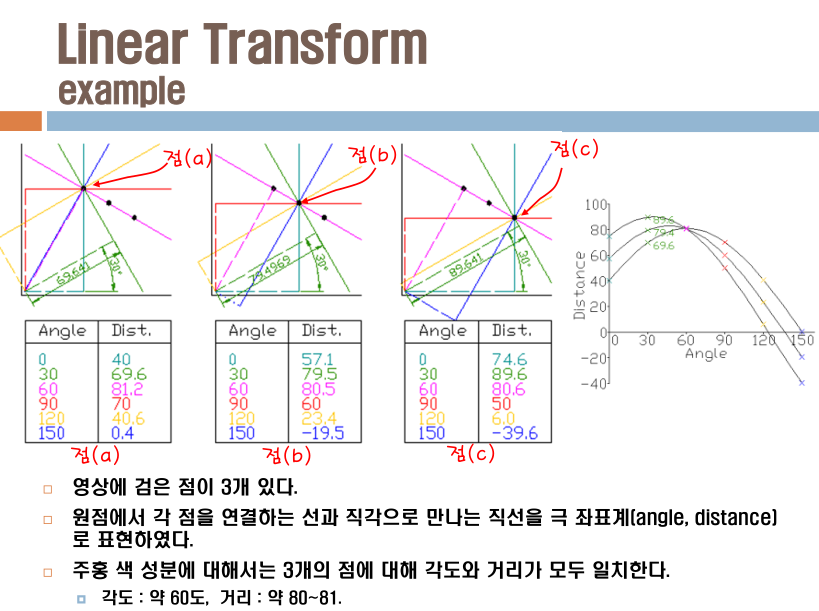

오늘
====

-	Hough Transform 을 하나 더 배우고나서 시험.
-	뭔가 잔뜩...
	-	2~4
-	허프 변환.

허프 변환
=========

-	교재에서는 엣지 검출 부분에 있음.
-	Intro
	-	형태기반 분석을 하고싶은데...
	-	...에지 추출이 엉망이면 엉망...
	-	> 교수님 : 학부생들도 이 정도는 다 해!
	-	자동차 차선 인식 등
-	어떤 형체가 될 수 있는지,
	-	가능한 집합에 대해
	-	그 가능성을 누적하여 추출
	-	→ 선의 집합이 있는지를 검출

뭐 어떤 원리인데요
------------------

-	형체 표현 : 파라미터로
	-	방정식임 ㅇㅇ
	-	`y = ax + b` 의 a, b를 좌표공간에 찍음
	-	→ 는 a가 0이나 무한대 되면... → 극좌표계로 모델링
	-	→ r, Θ 로 표시.
-	→ 나타나는 선들을 누적시켜서

```pseudocode
for all edge pixels // edge, 즉 화소가 있을때만 실행
  for (θ = 0; θ < 360 < θ++)
    p = x cos(θ) + y sin(θ) // 에지가 검출된 지점 (x, y)
      buffer(ρ, θ)++; // 해당 위치의 누적 값을 증가
```

이해를 돕기 위해
----------------

-	처리는 외곽선 영상으로.
-	놀랍게도 각 점마다 세타와 거리의 누적치를 모음
-	(슬라이드는 김진헌 교수님 자료)



그리고 교수님이 작성하신 프로그램...
------------------------------------

저걸로 라인을 어떻게 디텍트하나요
---------------------------------

-	으음... (이런... 못 들었군요 CH니뮤)
-	현재 각도가 왜 90도가 검출되는지가 이해가 안감
	-	→ 아래가 0도고 시계 반대방향이에요

연습
----

-	교수님이 만드신 함수
-	프로그램 예제
	-	엣지는 캐니 엣지임
-	x, y 는 왼쪽 위
	-	어째 0도가 아래방향이다?
-	가로로 죽 그어진 선분 : 가로 신호성분이 있다는 것만, 그래서 어디까지인지는 모름
-	p1 신호성분만?
-	아 실망... 허프만 트랜스폼 함수는 블랙박스네...
-	3개 함수
	-	HoughLines
	-	HoughLinesP
	-	HoughCircles

---

일찍 쉬는시간.

---

허프 Circle
-----------

-	Canny를 내부에서 해서 노출되지 않음...
-	처리된 결과를 컬러 영상에 그려봤을 뿐

```cpp
// Detect circles
cv::GaussianBlur(image, image, cv::Size(5, 5), 1.5);
std::vector<cv::Vec3f> circles;
cv::HoughCircles(image, circles, CV_HOUGH_GRADIENT,
  2,   // dp : 분해능 : accumulator resolution (size of the image / 2). 해상도를 떨어뜨리는 효과. minimum number of votes와 연관이 있다.
  50,  // minDist : 주변 원과의 최소 거리 : minimum distance between two circles
  // → 중심과 중심 사이의 거리로 보는걸로 추정
  100, // param 1 : Canny 엣지 high threshold
  200, // param 2 : 원이라고 파악힐 임계값 : minimum number of votes
  //50, // minimum number of votes				// 서클 가능성이 적은 원도 감지한다. 많은 수의 서클이 감지된다..
  25, 100); // min and max radius
//70, 100); // min and max radius				// 큰 원만 감지한다.
```

-	각각이 논문...
-	dp : 분해능. 값이 크면 분해능이 떨어진다 : 대신 빨라진다
-	[오픈씨브이](http://docs.opencv.org/doc/tutorials/imgproc/imgtrans/hough_circle/hough_circle.html)
-	[함수](http://docs.opencv.org/modules/imgproc/doc/feature_detection.html?highlight=houghcircles#houghcircles)
-	마악 값을 바꿔보면서 .. 각각 파라미터가 뭔지 실험

### 허프 서클 : 대학생이 쓴 책의 예제

-	가장 강도가 높은 검출정보부터 나올 것이다
-	함수 살펴봄.
	-	이런 삽질 `Point pt1(cvRound(x0 + 1000 * (-b)), cvRound(y0 + 1000 * (a)));`

---

시험에 관해
===========

-	이론 뿐만 아니라 프로그래밍 테크닉토 체크.
-	시험 : 프로그래밍 테크닉 묻기가 한계가 있다 → 시험은 이론...
-	→ 레포트 점수를 높인다
-	시험 : 결국 구술 중심의...
-	시험보기 전에 레포트를 내라? 뭔데요? : 실기 실력을 체크하기 위한 것
-	모자란 부분은 다른 곳을 참조해라
-	예제 프로그램을 많이 돌려보세요 : 전체 과정을 이해할 수 있도록
-	코딩은 아닌데... : 프로그램 flow를 이해할 수 있을 수준은 되어야
-	BackProjection 의 원리를 제대로 이해
	-	원리, 한계, ....추론....
	-	클래스 파일?은 하지 맙시다? MeanShift?
	-	MeanShift를 카메라 버전으로 정도는 해보세요
		-	나눠준 건 CamShift 카메라버전
	-	MeanShift의 자료 모두 이해할 수 없음
	-	애매함 : MeanShift 원리가 한 페이지에만 설명되어있음
	-	알고리즘 1과 2 : 1이 있었는데 성능을 향상시키기 위해...
	-	수식 : 기계적으로 알면 안 돼~ 제대로 이해해야~
	-	BackProjection을 이해 못 하면 MeanShift를 절대 모름
	-	BackProjection → MeanShift → 가중치 추가 알고리즘
		-	무게중심이 높은 곳을 경험적으로...
		-	Mean이 제일 높은 곳이 어디냐
			-	→ 커널 펑션
-	CamShift
	-	와 MeanShift의 가장 큰 차이는...
	-	...윈도우 사이즈가 바뀐다 : Adapt (적응)
	-	+ Rotation 정보를 뽑아낸다!
	-	중심점 찾는 아이디어가 조금 다르다 : 0차 모멘트 → 1차 모멘트
		-	모멘트?
-	과제는 mean shift를 cam shift로 바꾸는 것이 될 전망 (오늘중으로 공개)
