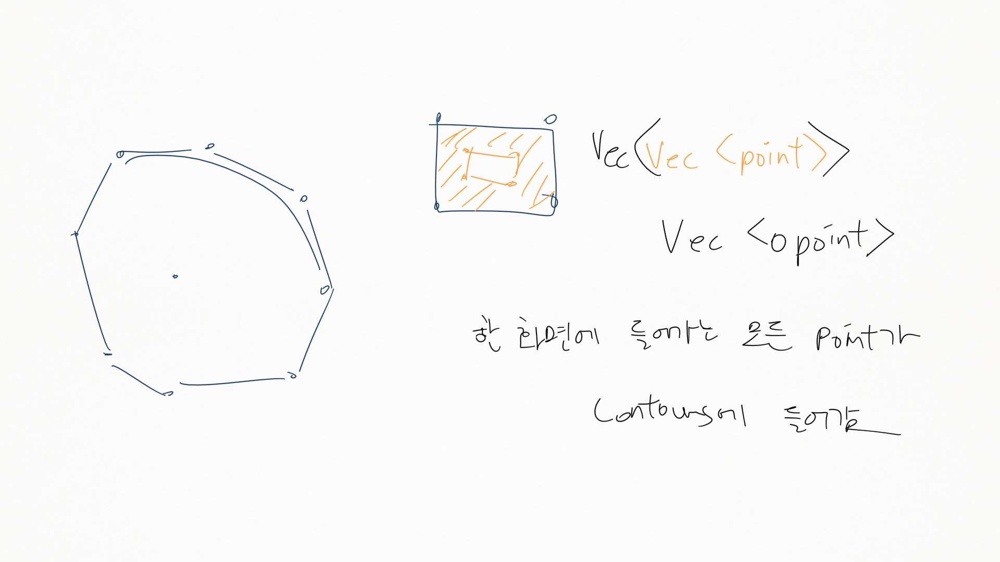
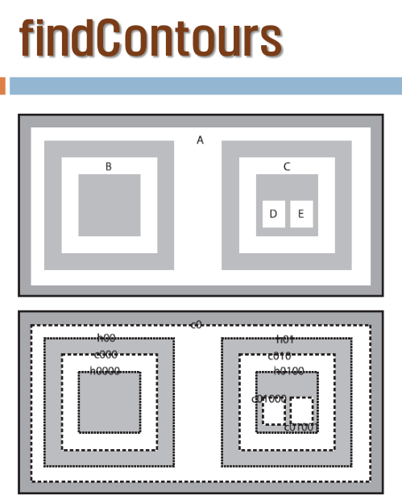
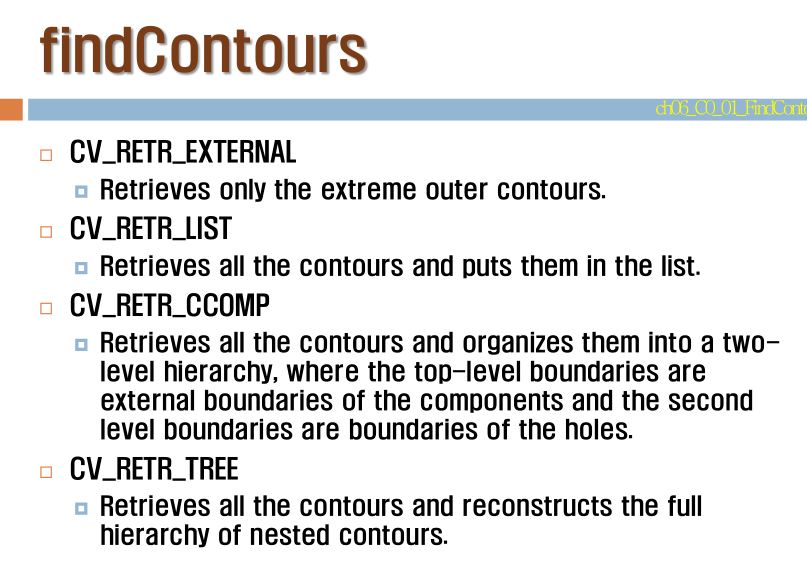
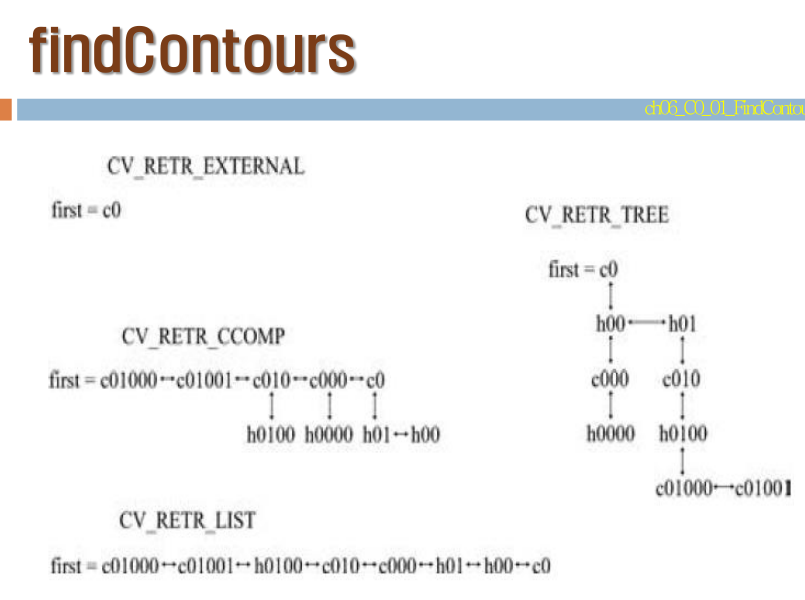

레포트, 성적
============

-	성적이 과하게 무난...
-	추가자료 제출시 2점 추가
-	10/13 10/12 10/11 10/10

이후 계획
=========

-	마우스로 글씨를 그림 → 인식 : 직접 트레이닝...
-	시간이 없다
-	오늘 : 6장
	-	6 :
	-	7 : segmentation ← 덜 중요하므로 날릴수도
	-	8 : feature detection ← 특징 뽑아내기
	-	9 : 머신 비전
		-	뉴로 네트워크

시험답안의 correction
---------------------

1.	이미지 피라미드 (/30)
	1.	라플라스 피라미드를 만드는 법 (9/10)
		-	레이어 k의...
		-	Level 0가 원본 영상임... (← 이거 틀림)
	2.	라플레시안 피라미드를 만들기 (10/10)
		-	서술에서...
		-	최상층의 가우시안 피라미드는 라플레시안 피라미드가 없어도 된다.
		-	K 단계 가우시안 /2 → 다시 확장 → 뺀다 : 라플레이시안
	3.	리컨스트럭션 단계 (7/10)
		-	가우시안 피라미드는 최상층 하나만 있으면 된다
	4.	과정 (절차) 언급이 없음 이라는 빨간색 글씨.. 흑
2.	백프로젝션 (25/?)
	-	히스토그램
	-	타깃 픽셀 : normalized
	-	거꾸로 가는 그림 그린 사람을 좋아함
	-	Patch 기반의 경우 답안 인정 안함.
3.	mean-shift (25/?)
	1.	(15/?) mean-shift의 입력이 백 프로젝션 이라는 언급이 있어야
	2.	(10/?) 진짜로 듣고싶었던 말은... feature detection은 영상이 분명할 때고, 그렇지 않을때나 민-시프트를. not a rigid body

오늘 : 6장. contour (윤곽 / 외형) (????)
========================================

허프는 이전시간, 하지만 같은 6장.

-	closed-loop를 주로 생성함 (그냥 라인을 하기도)
-	엣지 : 계조치의 급격한 변화가 있는 경우.
-	edge : data 성분, contour : information 성분 (처리된 데이터)
-	엣지에서 데이터를 선으로 이어서?
-	conour의 모멘트를 구하는 ??? 모멘트????

프로그램
--------

-	C 예제도 있지만 C는 쓰지 않도록.

프로그램 1
----------

-	스레숄드 → 컨투어 → 화면에 하나씩 보여주기
-	스레숄드를 잘 주어, B&W 바이너리 이미지가 제대로 형태를 구분할 수 있게.
-	귀찮으면 Canny 해도 됨 : 엣지 : 바이너리 이미지니까
	-	대신, 엣지를 쓰면 interior를 쓸지 exterior를 쓸 지 알아야 함.
-	점 2개가 하나의 contour를 형성.
-	Point가 모여서 vector가 됨.
-	Contour 가 모이면 Contours, 화면안에 들어가는 모든 점들이 하나의 COntour에 들어감.
-	Contour라는 객체는 없지만? 내부적으로는 여러개의 Contour로 됨.
-	interior와 exterior 라는 개념이 있는듯



```cpp
// part 1
threshold(gray, gray, 200, 255, THRESH_BINARY); cv::namedWindow("binary Image");	cv::imshow("binary Image", gray);

// part 2
// Find contours
	vector<vector<Point> > contours;		// 윤곽선 한개는 vector<Point> 로 충분. 한 화면에 윤곽선이 많기 때문에 이들의 벡터 표현으로 윤곽선 집합이 표현된다.
	vector<Vec4i> hierarchy;
	RNG rng(12345);

	findContours(gray,	// Source, an 8-bit single-channel image. Non-zero pixels are treated as 1’s.
		contours,		// output. Detected contours. Each contour is stored as a vector of points.
		hierarchy,

		//CV_RETR_EXTERNAL,	// retrieves only the extreme outer contours. It sets hierarchy[i][2]=hierarchy[i][3]=-1 for all the contours.
		CV_RETR_LIST,		// retrieves all of the contours without establishing any hierarchical relationships.
		//CV_RETR_TREE,		// retrieves all of the contours and reconstructs a full hierarchy of nested contours.
		//CV_RETR_CCOMP,		// retrieves all of the contours and organizes them into a two-level hierarchy

		CV_CHAIN_APPROX_SIMPLE, // Contour approximation method.  수평 수직 대각 성분의 끝점만 저장한다.

		Point(0, 0));		// Optional offset by which every contour point is shifted. This is useful if the contours are extracted from the image ROI and then they should be analyzed in the whole image context.

// part 3
// Draw contours
	Mat drawing = Mat::zeros(gray.size(), CV_8UC3);
	for (int i = 0; i< contours.size(); i++)
	{
		Scalar color = Scalar(rng.uniform(0, 255), 255, 255);

		drawContours(drawing,	// Destination image.
			contours,			// All the input contours. Each contour is stored as a point vector
			i,					// contourIdx – Parameter indicating a contour to draw. If it is negative, all the contours are drawn.
			color,				// color – Color of the contours.
			2,					// thickness – Thickness of lines the contours are drawn with.
			8,					// lineType – Line connectivity.
			hierarchy,			// hierarchy – Optional information about hierarchy. It is only needed if you want to draw only some of the contours (see maxLevel ).
			0,					// maxLevel – Maximal level for drawn contours. If it is 0, only the specified contour is drawn.
			Point());			// offset – Optional contour shift parameter.
		imshow("Result window", drawing);
		waitKey(0);
	}
```

-	숫자 붙이는 규칙
-	h : hole, c : ?







-	네 가지 contour 빌드의 방식
-	detect 중 크기가 작은 건 무시하는 방법!

다음 예제
---------

-	contour를 검출했다고 다 되는 게 아냐

```cpp
// 반전
threshold(gray, gray, 128, 255, THRESH_BINARY_INV);
```

```cpp
// 색 있는 그림을 그리기 위해
Mat gray_c;
cvtColor(gray, gray_c, CV_GRAY2BGR);
```

-	findContours() 함수가 원본 이미지를 망가트림.
-	→ 이걸 몰라서 해메신듯. (정줄놓은 1人)

---

↓ 잘못된 것 : sort 부분이 잘못됨 (예제 2번)

```cpp
// Find Countours & draw the contours from the lasgest areas.
// 입력 받은 영상의 윤곽선을 가장 면적이 큰 것부터 차례로 그린다.
// 주의 : 영상은 이진 영상에 대해 시행하기 때문에 미리 에지 변환 혹은 임계화 작업 등을 통해 2진 영상으로 만들어야 한다.

char	InputFile[80] = "e:/CV/Images/";

char	FileName[50] = "shape.jpg";				// 본 프로그램의 추천 영상
//char	FileName[50] = "CONTOUR_TEST.jpg";
//char	FileName[50] = "CONTOUR_TEST2.jpg";		// thresholding해서 사용할 경우 이진화의 임계치를 조정해야 한다.
//char	FileName[50] = "CONTOUR_TEST3.jpg";

//char	FileName[50] = "pens.jpg";
//char	FileName[50] = "lines.jpg";
//char	FileName[50] = "patterns.jpg";
//char	FileName[50] = "lenna.jpg";
//char	FileName[50] = "group.jpg";
//char	FileName[50] = "dog.jpg";
//char	FileName[50] = "cameraman.jpg";
//char	FileName[50] = "fruits.jpg";
//char	FileName[50] = "MORPHO.png";

#include "opencv2/core/core.hpp"
#include "opencv2/highgui/highgui.hpp"
#include "opencv2/imgproc/imgproc.hpp"
#include "iostream"
using namespace cv;
using namespace std;

int main()
{

	/////////////////////////////////////////////////////////////////////////////////////////////////////////////////////////////
	// 단계 1: Read input image
	/////////////////////////////////////////////////////////////////////////////////////////////////////////////////////////////

	strcat_s(InputFile, FileName);
	//cv::Mat image= cv::imread(InputFile,0);		// get source file, Mono
	cv::Mat image = cv::imread(InputFile, 1);			// get source file, color
	if (!image.data)		return 0;
	cv::namedWindow("Input Image");	cv::imshow("Input Image", image);

	Mat gray;
	cvtColor(image, gray, CV_BGR2GRAY);
	cv::namedWindow("gray Image");	cv::imshow("gray Image", gray);

	/////////////////////////////////////////////////////////////////////////////////////////////////////////////////////////////
	//  단계 2: 다음 2개 중의 하나로 2진화 작업을 행한다.
	/////////////////////////////////////////////////////////////////////////////////////////////////////////////////////////////
	medianBlur(gray, gray, 7);

	// 방법 1 : 캐니 에지.    주의 : 에지 처리를 하면 두개의 윤곽선이 나오게 된다.
	Canny(gray, gray, 200, 300, 3);	cv::namedWindow("edge Image");	cv::imshow("edge Image", gray);
	// 방법 2 : 이진화 처리
	// threshold(gray, gray, 128, 255, THRESH_BINARY); cv::namedWindow("binary Image");	cv::imshow("binary Image",gray);
	imshow("processed Image", gray);

	/////////////////////////////////////////////////////////////////////////////////////////////////////////////////////////////
	//  단계 3: Find contours & draw them  
	/////////////////////////////////////////////////////////////////////////////////////////////////////////////////////////////

	vector<vector<Point> > contours;		// 윤곽선 한개는 vector<Point> 로 충분. 한 화면에 윤곽선이 많기 때문에 이들의 벡터 표현으로 윤곽선 집합이 표현된다.
	vector<Vec4i> hierarchy;
	RNG rng(12345);

	findContours(gray,	// Source, an 8-bit single-channel image. Non-zero pixels are treated as 1’s.
		contours,		// output. Detected contours. Each contour is stored as a vector of points.
		hierarchy,

		//CV_RETR_EXTERNAL,	// retrieves only the extreme outer contours. It sets hierarchy[i][2]=hierarchy[i][3]=-1 for all the contours.
		CV_RETR_TREE,		// retrieves all of the contours and reconstructs a full hierarchy of nested contours.
		//CV_RETR_CCOMP,		// retrieves all of the contours and organizes them into a two-level hierarchy

		CV_CHAIN_APPROX_SIMPLE, // Contour approximation method.  compresses horizontal, vertical, and diagonal segments and leaves only their end points.
		Point(0, 0));		// Optional offset by which every contour point is shifted. This is useful if the contours are extracted from the image ROI and then they should be analyzed in the whole image context.

	// Draw contours
	Mat drawing = Mat::zeros(gray.size(), CV_8UC3);
	for (int i = 0; i< contours.size(); i++)
	{
		Scalar color = Scalar(rng.uniform(0, 255), rng.uniform(0, 255), rng.uniform(0, 255));
		drawContours(drawing,	// Destination image.
			contours,			// All the input contours. Each contour is stored as a point vector
			i,					// contourIdx – Parameter indicating a contour to draw. If it is negative, all the contours are drawn.
			color,				// color – Color of the contours.
			2,					// thickness – Thickness of lines the contours are drawn with.
			8,					// lineType – Line connectivity.
			hierarchy,			// hierarchy – Optional information about hierarchy. It is only needed if you want to draw only some of the contours (see maxLevel ).
			0,					// maxLevel – Maximal level for drawn contours. If it is 0, only the specified contour is drawn.
			Point());			// offset – Optional contour shift parameter.
		imshow("contour window", drawing);
	}

	waitKey(0);


	/////////////////////////////////////////////////////////////////////////////////////////////////////////////////////////////
	//  단계 4: Find largest contours & draw the bounding box
	/////////////////////////////////////////////////////////////////////////////////////////////////////////////////////////////

	int largest_area = 0;
	int largest_contour_index = 0;
	Rect bounding_rect;
	int	index[100];
	int	 k = 0;

	for (int i = 0; i< contours.size(); i++)
	{
		double a = contourArea(	// Calculates a contour area.
			contours[i],		// contour – Input vector of 2D points (contour vertices), stored in std::vector or Mat.
			false);		// oriented – Oriented area flag. If it is true, the function returns a signed area value, depending on the contour orientation (clockwise or counter-clockwise).

		// sort 하는 게 잘못된 부분.
		if (a>largest_area){
			largest_area = a;	cout << "Contour " << i << " : area = " << a << "\t\t\tindex[" << k << "] = " << i << endl;
			// Store the index of largest contour
			largest_contour_index = i;
			index[k++] = i;
			// Find the bounding rectangle for biggest contour
			bounding_rect = boundingRect(contours[i]);
		}
	}

	Mat gray_c;
	cvtColor(gray, gray_c, CV_GRAY2BGR);
	imshow("the_gray", gray_c);

	Scalar color(0, 255, 0);  // color of the contour in the
	//Draw the contour and rectangle
	drawContours(gray_c, contours, largest_contour_index, color, CV_FILLED, 8, hierarchy);
	rectangle(gray_c, bounding_rect, Scalar(0, 255, 0), 2, 8, 0);
	namedWindow("Largest Contour", CV_WINDOW_AUTOSIZE);
	imshow("Largest Contour", gray_c);
	waitKey(0);

	/////////////////////////////////////////////////////////////////////////////////////////////////////////////////////////////
	//  단계 5: Draw the contours step by step from the largest one
	/////////////////////////////////////////////////////////////////////////////////////////////////////////////////////////////
	//drawing = Mat::zeros( gray.size(), CV_8UC3 );
	drawing.setTo(Scalar(0, 0, 0));
	for (k = k - 1; k >= 1; k--) {
	//for (k = contours.size()-1; k >= 1; k--) {
		Scalar color = Scalar(rng.uniform(0, 255), rng.uniform(0, 255), rng.uniform(0, 255));
		cout << "index[" << k << "] = " << index[k] << endl;
		drawContours(drawing,	// Destination image.
			contours,			// All the input contours. Each contour is stored as a point vector
			index[k],			// contourIdx – Parameter indicating a contour to draw. If it is negative, all the contours are drawn.
			color,				// color – Color of the contours.
			2,					// thickness – Thickness of lines the contours are drawn with.
			8,					// lineType – Line connectivity.
			hierarchy,			// hierarchy – Optional information about hierarchy. It is only needed if you want to draw only some of the contours (see maxLevel ).
			0,					// maxLevel – Maximal level for drawn contours. If it is 0, only the specified contour is drawn.
			Point());			// offset – Optional contour shift parameter.
		imshow("Result window", drawing);
		waitKey(0);
	}

	//imshow( "Result window", drawing );
	waitKey(0);
	return 0;

}
```

1.	사이즈 검출
2.	Canny edge → 2겹 줄....
	-	contour 쓰던가
	-	Hole 쓰던가...
