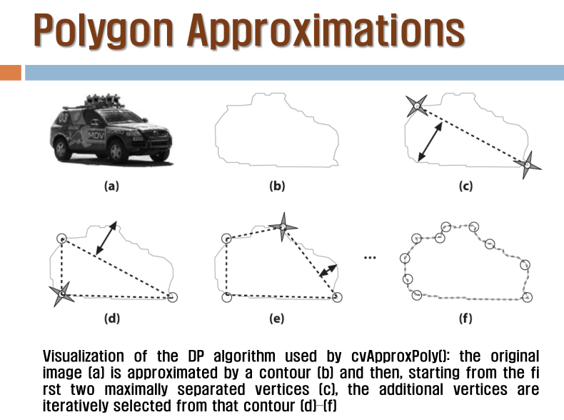

일정
====

-	오늘은 contour의 연속
-	+ UI 프로그래밍 → 계속 써먹을 수 있도록
-	12, 13, 14주...

---

-	contour (→ 인식 부분으로도 갈 수 있음)
-	feature detection (← contour)
-	ML - SVM, ANN (인공 뉴로 네트워크) (← contour)

contour v2 : 컨투어, polygon approx. , Moment (인식 용도)
=========================================================

edge vs contour
---------------

-	edge는 그림을 뿐.
-	contour는 edge를 가공한 벡터 성분
	-	함수에 넣어서 그냥 면적을 구할 수 있다
	-	윤곽선 정보도 다 관리 가능
-	Contours / Polygon Approximaton / Moment

ch06_C1_03_ShapeDescriptors . cpp
---------------------------------

-	이진화 →
-	contour 구하기 (흰색이 객체) →
-	여기서 contour size
	-	위험함 : 벡터의 갯수임 : 벡터가 적어도 크기가 클 수 있음
-	approximation
	-	원,
	-	사각형,
	-	polygon
-	convexity defects ← 바로 빼내는 것.
-	중심에 점 찍기 : moment (인식) 로 빠질 수 있다 -

### Step 2 : 컨투어 구하기

```cpp
// Get the contours of the connected components
std::vector<std::vector<cv::Point>> contours;
cv::findContours(image,
	contours,				// a vector of contours
	CV_RETR_EXTERNAL,		// retrieve the external contours
	CV_CHAIN_APPROX_NONE);	// retrieve all pixels of each contours
```

-	external 컨투어만 구함
-	approx 없이

```cpp
	int	kk = 0;
	std::cout << "Total Number of Contours = " << contours.size() << std::endl;
	std::vector<std::vector<cv::Point>>::const_iterator itContours = contours.begin();
	for (; itContours != contours.end(); ++itContours) {
		std::cout << "Size of Contour " << kk++ << " = " << itContours->size() << std::endl;
	}
```

-	`itContours->size()` : area가 아닌 vector의 크기

```cpp
// draw black contours on white background
cv::Mat result(image.size(), CV_8U, cv::Scalar(255));		// white background
cv::drawContours(result, contours,
	-1, // draw all contours
	cv::Scalar(0), // in black
	2); // with a thickness of 2
```

-	내가 그린 기린 그림

### Steip 3 : 컨투어 갯수 줄이기

```cpp
int cmin = 100;  // minimum contour length
	int cmax = 1000; // maximum contour length
	kk = 0;
	std::vector<std::vector<cv::Point>>::const_iterator itc = contours.begin();
	while (itc != contours.end()) {
		if (itc->size() < cmin || itc->size() > cmax) {
			std::cout << "contour " << kk << " deleted ! : size =  " << itc->size() << std::endl;
			itc = contours.erase(itc);
		}
		else
			++itc;
		kk++;
	}
```

-	컨투어를 재편성하고 삭제. 너무 큰 것, 작은 것을 삭제
-	vector의 사이즈 기준이므로 위험한 발상.

### step 4 : 바운더리 박스 그리기

-	`cv::boudingRect()` → `cv::rectangle()`
-	`cv::minEnclosingCircle` → `cv::circle()`
-	`cv::approxPolyDP()`

```cpp
cv::Rect r0 = cv::boundingRect(cv::Mat(contours[0]));	// contours[0]는 box로 둘러싸도록
	cv::rectangle(result, r0, cv::Scalar(0), 2);		// thickness=2.

	cv::minEnclosingCircle(cv::Mat(contours[1]), center, radius);	// contours[1]는 원으로 둘러싸도록
	cv::circle(result, cv::Point(center), static_cast<int>(radius), cv::Scalar(0), 2);

	std::vector<cv::Point> poly;
		cv::approxPolyDP(cv::Mat(contours[2]), poly, 5, true);				// contours[2]는 다각형으로 둘러싸도록 다각형 근사화
```

```cpp
// Iterate over each segment and draw it
	std::vector<cv::Point>::const_iterator itp = poly.begin();
	while (itp != (poly.end() - 1)) {
		cv::line(result, *itp, *(itp + 1), cv::Scalar(0), 2);
		++itp;
	}
	// last point linked to first point
	cv::line(result, *(poly.begin()), *(poly.end() - 1), cv::Scalar(20), 2);

	cv::imshow("Some Shape descriptors", result); cv::waitKey();
```

-	그린다

```cpp
// testing the convex hull
	std::vector<cv::Point> hull;
	cv::convexHull(cv::Mat(contours[3]), hull);				// contours[3]은 convex hull로 표현

	// Iterate over each segment and draw it
	std::vector<cv::Point>::const_iterator it = hull.begin();
	while (it != (hull.end() - 1)) {
		cv::line(result, *it, *(it + 1), cv::Scalar(0), 2);
		++it;
	}
	// last point linked to first point
	cv::line(result, *(hull.begin()), *(hull.end() - 1), cv::Scalar(20), 2);

	cv::imshow("Some Shape descriptors", result); cv::waitKey();
```

-	convex hull?

```cpp
// testing the moments

	// iterate over all contours
	itc = contours.begin();
	while (itc != contours.end()) {

		// compute all moments
		cv::Moments mom = cv::moments(cv::Mat(*itc++));

		// draw mass center
		cv::circle(result,
			// position of mass center converted to integer
			cv::Point(mom.m10 / mom.m00, mom.m01 / mom.m00),
			2, cv::Scalar(0), 2);		// draw black dot
	}

	std::cout << "black dot means 1st moment of the points" << std::endl;
```

-	모멘트
-	얘는 approximate한 걸 사용하지 않음 (contours.begin())

```cpp
cv::drawContours(result, contours,
		-1, // draw all contours
		cv::Scalar(0), // in black
		2); // with a thickness of 2
```

-	마이너스값 : 모든 컨투어

---

contour 를 표시하는 방법들
--------------------------

### 프리먼 체인 코드


### 폴리곤 approx 하는법

1.	일단 죽 긋고
2.	분할 공간에서 가장 넓은 곳을 찾아
3.	가장 긴 수선을 찾는다
4.	를 반복



-	cvBox2D 를 사용하면 기울어진 상자도 사용 가능

현재 문맥
---------


일정
----

-	2주동안 놀아야됨 → 강의를 과제로...
-	마우스로 그림 인식은 반드시 나올거고, contour도 해보고, ML / SVM / ANN도 해보고...
	-	머신 러닝을 쓰느냐 안 쓰느냐
	-	feature detect가 들어가면 짱이죠

---

UI 발표
=======

UI - Thinning (세선화)
----------------------

-	마우스 이벤트에 따라 흰색 Circle로 숫자를 그리며, resize
-	s 키 입력에 따라 완성된 그림을 thinning 작업

Zhang Suen 의 Thinning 알고리즘
-------------------------------

-	대상 물체의 표면 벗겨내기 → 두께 1로
-	과정 : 연결되는걸 제외하고 지우기
	-	픽셀의 연결수 세기 : connectivity
		-	픽셀 주위를 돌면서 검은색 → 흰색 전환을 연결수라 함
			-	연결수가 1이면 제거
			-	(자료는 검은색이 피사체)
	-	4가지 조건 만족시 삭제가능 : 루프 1, 2 : 알고리즘
		-	주변의 배경색이 2~6개 사이
		-	357, 135 중 하나가 흰색
		-	571, 713 중 하나가 흰색
-	코드 설명
	-	직접 구현
	-	그려서 인식

추가 설명
---------

-	thinning →
-	결국은 vector 로 만들어서 비교할것임.
-	머신 러닝 입장에서는 왼쪽의 1과 오른쪽의 1은 완전히 다름
-	전문가 시스템 : 직접 구현 (MIT) vs 머신 러닝 : 데이터를 줘서... (스탠포드)
-	→ 머신 러닝
-	thinning : 꼭 쓰라는건 아니고, 더 좋은 게 있으면 그거 써도 돼요

---

to be next
==========

-	숙제는 나비 그려진 책의... Moment 로 하는 것. : 미리 준비하시는게?
