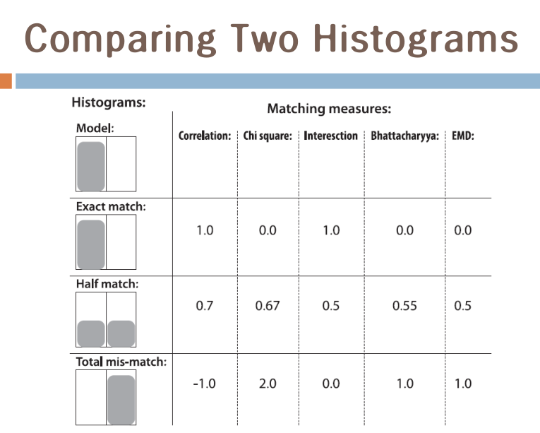

시험과 강의자료
===============

-	무리해서라도 이론 강의라도 진도를 뺀다
-	오늘 할 거
	-	7장 : 패턴 매칭
	-	8장 : 머신 러닝 : 뉴로네트워크
-	8장이 필요하므로 긴급하게 8장을 진도.
-	09 (Affline Perspective), 10 (Segmentation) 는 예전에 했었지만 요즘엔 뒤로.

Neural Network
==============

뇌세포의 구조
-------------

-	학부 강의에서 하는 것 = 자랑스러움
	-	상위 대학에서는 아예 과목으로 만들어서 강의
	-	교수님이 자신있는 부분이라 남들보다 쉽고 빠르게...
-	배경
	-	Artificial Neuro Network : ANN : 머신 러닝 기술의 큰 축
	-	만만치 않은 기술
	-	영상 인식에 유리하고 성능이 좋다
-	뇌의 동작을 수학으로 모델링
	-	연산식으로 만든다 → 연산한 결과를 잘 다듬어서 활용
	-	성능이 좋았다! (뇌를 따라해봤더니)
	-	트레이닝 → 인식 이 주요 관심 분야
-	규칙으로 가르치면 어렵다
	-	뉴로 네트워크에 가르치면 잘 맞추는 특징 : 뇌에는 그런 기능이 있다.
	-	왜인지는 설명하기 좀...
-	뇌세포 구조
	-	Dendrite(수상돌기, 덴드라이트) : 입력 (다른 뉴런에서 받아들임)
	-	Axon (축삭돌기, 엑손) : 출력
	-	Synapse (시냅스) : 이어지는 부분, 접합부
-	실제론 더 있지만 복잡하니 생각하지 말자

참고 : 뉴런
-----------

-	뇌에는 천 억개의 뉴런(neuron:뇌세포)이 존재
-	각 뉴론은 주위의 100~20,000개의 뉴런과 연결
-	초당 0.1~1000회의 임펄스 전기 신호가 전달됨.
-	시냅스 신호를 전달할 때 흥분성(excitory) or 억제성(inhibitory)을 갖고 있다.
-	각 뉴론은 모든 입력을 합산하고 그 값이 특정 임계치를 넘으면 신호를 출력한다.

뉴런의 수학적 모델링
--------------------

-	예술가가 반도체 소재로 만든 뉴런 (실제 동작하는건 아님.)
-	뉴런을 학습시킨다 : 시냅스의 연결강도를 바꾼다
	-	살아오면서 스스로 학습되는 것
-	입력 → 출력
	-	최말단 X\_i : 시신경 (수십억개의 Cell 정보)
		-	집어넣는 값이 원하는대로 달라질 수 있음 → 어떤 걸 넣으니까 잘 인식되더라
	-	연결의 강도 : 학습 대상 : 시냅스간...
-	Inputs → Weights → Adder → Activation Function → Output
	-	입력 : u1, u2, u3, ...
	-	가중치 : w1, w2, w3, ...
	-	가산기 : sigma
	-	활성 함수
	-	출력
-	제일 큰 값을 내보내고 있는게 그 값이다.
	-	문자 인식 : 제일 큰 값이 그거다

갯수
----

-	인공신경망 구축 : 레이어의 수와 노드의 수를 결정, 적절한 시냅스의 연결 강도(w)를 찾는 문제
	-	갯수!
-	레이어가 늘어나면 머리가 좋다? 해서 왕창 늘려도...?
	-	머리가 좋은 사람
	-	머리가 나쁜 사람 : 장점 : 인건비가 없다
-	노드가 갯수가 적다 → ...??? 이미 학습한 것과 그렇지 않은 것에 대한 이야기였는데... -

정리
----

-	뉴로 네트워크를 훈련시킨다 = W 매트릭스를 어느 값으로 수렴시킨다

역사
----

-	1957년 : 로젠블랫 (Rosenblatt)의 Perceptron 모델을 본 것.
	-	신경컴퓨터의 근본 원리
-	1969년 : 찬물을 끼얹은 Minsky & Papert : XOR 함수가 구현 불가능함을 밝힘
	-	선 하나로는 XOR을 분리시킬 수 없다 (그림)
-	1970 → 멀티 레이어면 된다! : 전성기
	-	한 개 이상의 은닉층을 사용
-	우리는 이 많은 기법중 한 가지만을 해봄.
	-	Perceptron, 그러나 멀티레이어.
	-	역전파 (Pack Progaton)으로 W를 찾아낸다
	-	에러를 거꾸로 돌린다 → 보상값 → 반영

Steepest Descent Method
-----------------------

-	델타 룰 : 가장 후지고 저렴한 Idea
-	`지점값 - 미분값 * 보상` : 보상값이 너무 크면 보상만 하다 끝남. -
-	실제 사례 : `y = x^2` 에서 0이 최소임.
	-	해를 모른다고 가정
	-	`x = 3?` 하고 추측
	-	미분 : `y' = 2x`
	-	예측 `w(1) = 3 → y = 9` ...????
-	리얼타임은 어렵겠지만. (오실레이션 발생 : 왔다갔다)
-	→ 역전파
-	적당한 값이어야지 수렴한다는 말이 교과서에 안 나온다

ANN 설계의 고려사항
-------------------

-	Learning Rate
	-	너무 작음 / 너무 큼 : 곤란
-	이 알고리즘 : local minimum 인지 알 수 없다 : 한계 (지역 최소값에 빠질 수 있다)
	-	회피 :
		-	Simulated annealing(담금질) : 점점 더 차가운....
			-	나온 해에 일부러 노이즈를 준다 → 지역 최소에서 빠져나올 수 있도록
			-	노이즈를 지나치게 주면...
			-	xilinx 회로설계에 쓰임. (초창기에는 담금질 수치 입력이 있었다)
		-	Genetic algorithms
-	최적 경로 찾기에 뉴로 네트워크를 사용...

레이어 갯수
-----------

-	대부분의 문제는 하나의 레이어로도 OK
-	뉴론의 갯수 문제
	-	너무 적으면 : 언더핏 ; 바보가 됨 (오차를 충분히 줄이지 않고 학습을 중지하였을 경우)
	-	너무 많으면 : 오버핏 : 트레이닝 된 자료 외에는 비슷하다고 하지 않음 : 학습에 사용된 데이터 세트가 지나치게 적은 경우
	-	언더핏 : ???
-	학습 진행이 안 될 때
	-	local minimum 에 빠진 경우
	-	주어진 입력으로는 분류 안 되는 경우
		-	같은 패턴을 다른 출력을 내도록 요구 : feature vector 디자인이 잘못되어서...
	-	B 살짝 배우고 A 막 가르치다 B 뭐냐고 묻기 : 제공되는 학습 데이터세트와 요구된 출력을 교차하지 않는 경우

---

휴식

---

히스토그램 매칭 & 템플릿 매칭
=============================

-	예전의 그것 : 패치 기반으로 백프로젝션
	-	함수가 통채로 있음
	-	bhattacharyya 거리 : compareHist
-	데이터 벡터

compareHist
-----------

-	d(H1, H2) = ...
-	방식 여러가지
	-	Correlation : 크다 = 일치 : 1 = 일치, -1 = 완전 불일치
		-	히스토그램 평균...?
	-	Chi-Square : 완전 일치 : 0, 불일치 : 값이 커진다
		-	차의 제곱을 활용
		-	값의 범위가 이리저리일 수 있음
	-	Intersection : 일치 : 작다, 불일치 : 크다
		-	minimum을 취한다
		-	일치하면 1이 나온다
	-	바타차야 : 완벽한 일치 : 0, 최대 불일치 (역상) : 1
	-	EMD는 별도 함수.

실험사례
--------

-	matchTemplateDemo : OpenCV의 예제를 개조.
-	compareHist의 비교는 히스토그램의 사이즈가 같아야
	-	영상대 영상의 비교가 아님
	-	영상의 사이즈가 달라도 비교 가능
-	intersection을 하려면 히스토그램이 정규화되어있어야 : 정규화 = 히스토그램을 모두 더했을 때 1이 되야 (보통 그런 정규화는 아님)

실험사례의 값 비교
------------------

-	intersect 는 2번째가, ...
-	소스는 분석하지 말자
	-	1. HSV로 변경
	-	2. calcHist로 히스토그램 생성
	-	3. ... 아 졸았어
	-	4.  
		\-

템플릿 매칭
===========

-	영상 & 영상 비교하는 것
-	데이터세트를 만들어놓는다 → 템플릿과 대응 → 일치하면 OK
-	이걸 왜 → 이걸 적품전시회에 내는 경우가 많아서.

유사성의 척도
-------------

-	못 쓰는 알고리즘
	-	MAD (Mean Absolut Difference) = SAD (Sum Of Absolute Difference)
	-	MSE (Mean Square Error)
	-	이름을 일부러 이렇게 지었을 것이다
	-	밝기 정보에 바로 영향을 받는 패턴 매칭 : SAD / MAD, MSE → 에러가 누적됨
-	아이디어 : 정규화

선진적인 기법
-------------

-	ma tchTemplate 함수 : 4가지 방식
	-	코릴레이션 ( 4번 )
	-	I다시 가 빠짐
-	0, 2, 4번은 함수, 홀수는 normalized 함수

---

오늘 잘 잠

---

다음시간
========

-	Feature Detection
-	뉴로 네트워크를 OpenCV에서.
-	텀프로젝트 : ...
	-	Hu 모멘트는 쉽기 때문에 해보세요라는 느낌으로
	-	인터넷으로 찾아봐
	-	성능을 높이기 위해 다른 파라미터를 사용하는걸 권장
	-	과제가 이런 방식으로 될것이다 라는 예고.
-	휴일, 연속으로 강의 두 번 그리고 끝
-	보강기간에 (6월 8일) 강의하지 말고 텀프로젝트 발표를 하는 걸 생각함
