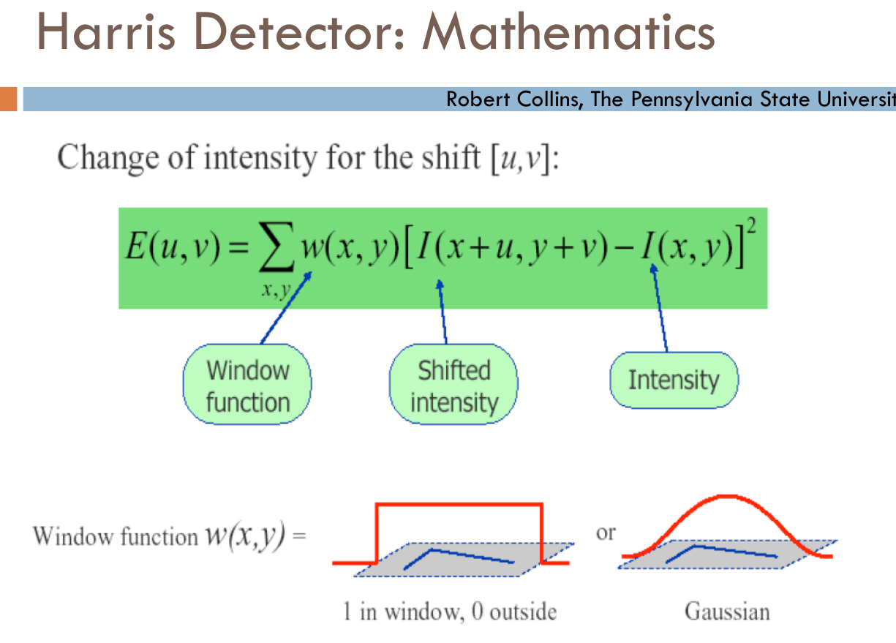

cv12
====

-	오늘 뉴로 네트워크 예제가 나옴
-	SVM 도 해보고 싶었지만.
-	좀 더 해보고 싶

뉴로 네트워크 예제
==================

-	eq 3번 : 탄젠트 함수
-	그래프를 두 부분으로 나누기
	-	`y = sin(x+10)`
	-	→ `y - sin(x+10) = 0` → x1, y1 넣으면 `>0` 이냐 `<0` 이냐
	-	→ 그래프를 뉴로 네트워크로
		1.	일부를 학습
		2.	나머지를 맞춘다


-	인식기들 (예제에 있는 거)
	-	MLP : multilayer perceptron
	-	KNN :
	-	BAYES :
	-	SVM : 서포트 벡터
-	나머지는 참고로. 지금 우리가 배운건 MLP만


-	openCV 에서 써먹으려면 대략적인 원리는 알아야.
-	출력값은 1, 0으로 딱 나뉘어있지 않다
	-	실제 상황에서는 딱 갈라서 쓰지 않는 게 좋다
-	테스트 데이터를 늘리고, 줄이기도 해봄.
-	데이터들
	-	테스트 포인트 (전체)
	-	트레이닝 포인트 (일부)
	-	normalize 화

코드 훑어보기
-------------

-	노드의 갯수를 늘리면 레이어 갯수 늘린거랑 똑같이...
-	→ 불필요할수도 있음. 단순화시킴. 오히려 과도하게 배울수도 있으니까

---

1.	단계 1 : 패턴 인식 실험에 사용할 trainingData와 testData를 확보한다.
2.	단계 2 : 패턴 인식 실험에 사용할 trainingData와 testData가 각각 어떤 패턴(-1 혹은 1)에 속하는지 미리 확인한다.
3.	단계 3 : 여러가지의 패턴 인식 알고리즘에 따라 그 판별 성공률을 화면에 출력한다.
	1.	단계 1 : 인공 신경망 모델을 설정한다.
	2.	단계 2 : 인공 신경망 모델을 학습시킨다.
	3.	단계 3 : 단계 3 : testData를 입력했을 때 나오는 결과가 미리 만들어 둔 testClasses와 같은 결과인지 비교해서 정확도를 판별한다.

---

-	evaluate 함수
	-	assert 함수
-	이걸 글자 인식에 활용해주세요
	-	방법 1 : 마우스로 써서 학습
	-	방법 2 : USB 카메라로 촬영
		-	USB 카메라를 모니터에!
	-	thinning, 2진화 후
		-	5 by 8 : 픽셀 40개의 이미지 입력
		-	→ 트레인
-	demo 할때 집에서 train을 시켜아야함.
	-	방법은 직접 결정하세요
	-	1. 파일로 저장하던가
	-	2. 그림으로 갖고있다가 데모할 때 파일에서 트레이닝
-	SVM도 똑같다. 패턴만 다를 뿐

---

-	연구소 브리핑, 예산지원해줘요
	-	25억이 왔다갔다하는 심사위원장 (교수님)
	-	머신 러닝
	-	현대자동차 바람 연구
	-	슈퍼컴퓨터로 시뮬레이션 : 돈덩어리...
		-	모델링 한 번 해보는게 엄청나게 돈 들어요!
		-	목업 만드는 거보다는 싸다
		-	웅진 정수기의 fan을 어떻게 조용히 돌릴까
			-	mockup 하나 만들때마다 엄청나게 돈이 든다 (금형)
	-	시뮬레이션은 몇 번만 하고
	-	나머지 데이터는 뉴로 네트워크에 넣는다 → 비슷한 결과를 낸다 -
-	15분 휴식
-	교수님이 검사일에 파일을 제공, 그걸로 검사를 함.
	-	이 파일이 9 인데 9 맞췄어요?
	-	입력 : 34AB 네 글자만 본다 (A, B는 대문자)
	-	파일 이름
	-	t01.JPG ~ t19.JPG : 20개의 테스트 데이터
	-	인식률 → 성적
	-	입력 파일을 → 크기를 조절해서 5 by 8 로 잘라내는걸 하셔야.
		-	이미지 크기는 가로 5, 세로 8로 정합시다.
		-	각도는 방법이 없음
			-	해결하려면 입력부터가 size-invariant 해야 (특징점을 찾아서 입력)
			-	→ 휴리에?
			-	특징량을 집어넣기 : 선택. (안해도 감점은 안 함)
-	출력 (콘솔, 엔터칠때마다)
	-	01 = 'A'
	-	02 = 'B'
	-	...
-	출력 (보조자료)

```
01 = {
      3 = ?;
      4 = ?;
      A = ?;
      B = ?;
     }
```

-	시연 + 레포트 (RPT)
-	시험
	-	머릿속에 있는 거 쓰세요
	-	혹은 루틴 쓰기 : 함수 이름을 쓰세요는 안 나옴 (암기 ㄴ)
	-	잘 이해하고 있나!
		-	외워야 할 사항이 있다면, 프린트물로 줄 것 (???)
	-	1. 소스 프로그램을 이해하고 있는가 (잘못된 루틴을 올바르게 고치라)
	-	2.
-	이거 10점, 중간 20, 기말 30? 나머지 20점?

8장. 해리스 코너 (특징검출기 : feature detect) + goodFeaturesToTrack
====================================================================

-	전체적 흐름만 이해해도 공부 잘 한 거에요
	-	(알고리즘을 굳이 자세히 이해하기는 힘들다)
	-	그래도 힘닿는데까지는 공부해야


-	이제는 edge가 중요하지 않다
	-	코너가 연결되어있으면...
-	flat : 모든 방향에 변화가 없음
-	edge : 엣지 방향의 변화가 없음
-	corner : 모든 방향에 있어 명백한 차이

---



-	수식의 값에 따라 코너인지 아닌지?
-	주변 값과의 차이를 제곱해서 window를 거쳐 합함
-	엣지도 코너도 값이 다 같다 → 어떻게 판별?

---


1.	미분 (차이) (미분하기 전에 블러링 : sigma라고 표현, 가우시안 안 하고 미분하면 잡음이 잘 걸림)
	-	실제로는 소벨.
2.	미분을 제곱한다
3.	각 픽셀의 곱의 합을 구한다
4.	매트릭스를 만든다
5.	Detect 함수 R → 어떤 함수보다 크면 참, 작으면 거짓?
	-	`det(H) - k(Trace(H))^2` : 디터미넌트 - 트레이스
6.	이게 코너다, 아니다

---

-	뭐가 안 되니까 테일러 함수로 확장을 하겠다
	-	모든 함수가 테일러 함수로 확산 가능하다
-	계산 오래걸리니까 그 중에서도 첫 번째 항만 쓸래
-	이리저리 해서, 함수가 나왔다 (...뭔소리지)
-	Covariance Matrix, M
-	covariance matrix의 **eigenvalue**는 직교 방향에 대해 각각 최대 평균 계조 변화를 의미한다.
	-	eigenvalue : ?????????
	-	두 방향 : 위아래, 왼쪽오른쪽
	-	두 방향의 크기 차이 (직교 방향에 대한 각각 최대 평균 계조 변화) 둘 다 크다 → 엣지다
-	Ix, Iy의 그래프 → 타원을 그려본다
-	λ1, λ2 를 일일히 구하지 말고,
	-	이 수식을 쓰자 : R (corner response measure)
-	실습

---

-	현재 하는 건 굉장히 뒷단 (최신 알고리즘들이 많아 나온다)

---

-	goodFeaturesToTrack : 논문 제목 자체를 함수로 만들었음
-	과제는 미리 하세요 (어려움)
-	과제 → 저거를 자기 힘으로 했느냐를 물을 것임
	-	뉴로 네트워크의 내용을 잘 이해했나
	-	발견할 사실을 물어볼것
