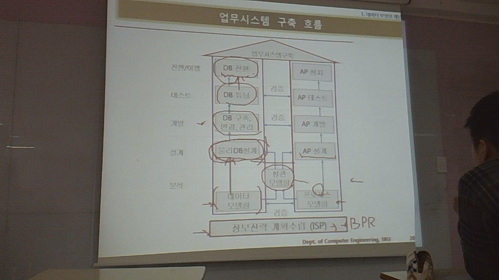
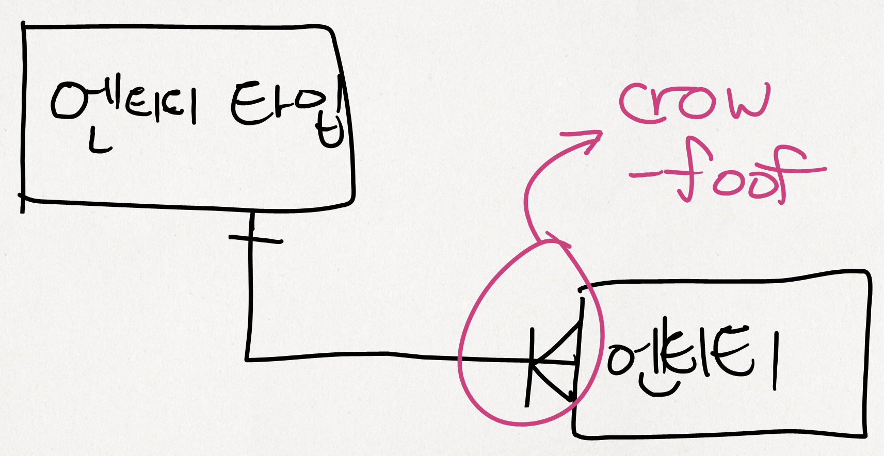
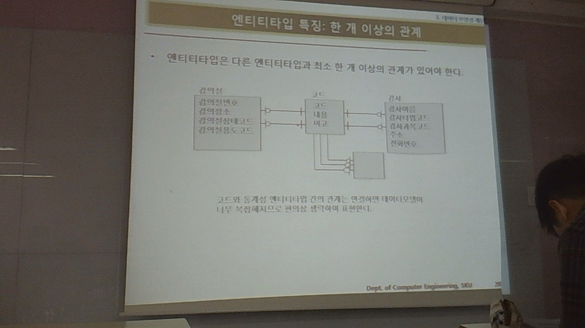
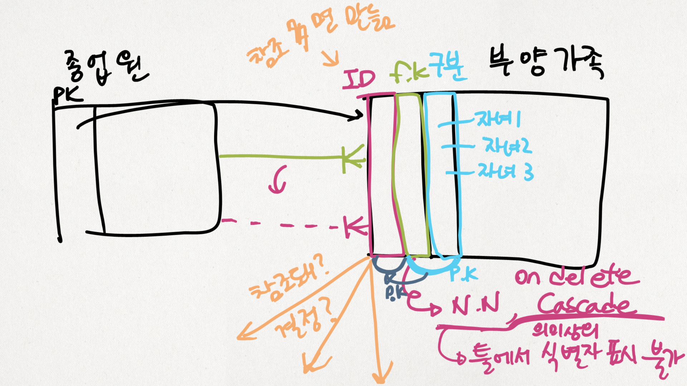
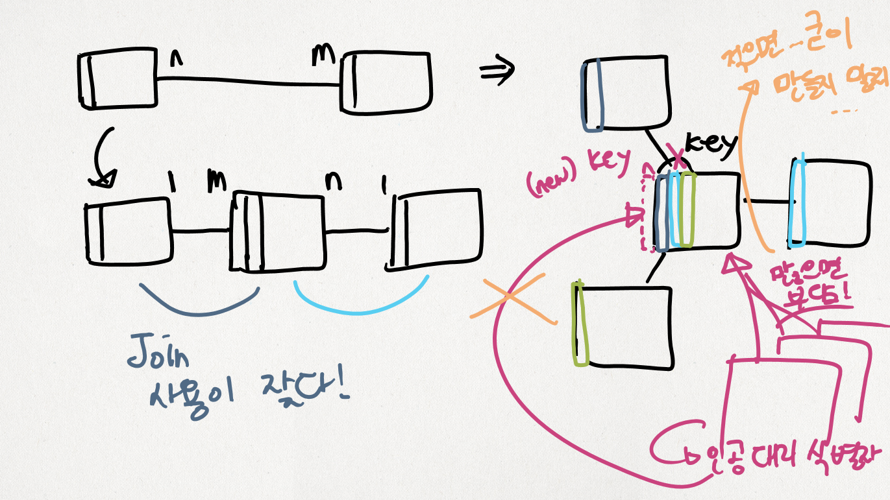

정보 시스템 설계 및 구축 2
==========================

수업전 잠깐 : 예상 수업 범위
============================

-	1부 논리설계
	-	1장 데이터 모델링 주요 개념
		-	엔티티타입, 속성, 식별자, 관계, 엔티티 슈퍼타입과 서브타입, 서브젝트 에어리어, 정규화, ERD 표기법

---

출석 부름

---

1장. 데이터 모델링 개념
=======================

데이터 모델링에 대한 전반적인 개념을 주욱 설명.

과정 : 업무 시스템 구축 흐름 (14p 그림)
---------------------------------------

이번학기동안 하는 게 데이터 모델링 부분.

-	ISP + BPR
-	분석
	-	**데이터 모델링** : 이번학기
	-	프로세스 모델링 : App 쪽
	-	→ (+합쳐서) → CRUD (상관 모델링)

3가지 관점에서의 모델링
-----------------------

-	데이터 관점
	-	업무와 데이터의 관계 : 업무가 어떤 데이터와
	-	데이터 간의 관계
-	프로세스 관점
	-	ex) 영업에는 뭐가 필요한지 뭘 해야하는지
-	상관 관점
	-	? 일처리방법 → 데이터 영향?

데이터 모델링 개요
------------------

### 데이터 모델링이란

(놓침)

`정보화 시스템을 구축하기 위해 어떤 데이터가 존재하는지 또는 업무에 필요한 정보는 무엇인지 분석하는 방법`

### 데이터 모델링 주체

-	참여자
	-	현업 업무전문가
	-	개발자 : SE, BA, DBA **모델러** : 규모가 작은 경우 개발자가 같이 하기도.
-	프로젝트 참여자 모두가 이해하고, **주체**여야.
	-	데이터 모델러만 이해해선 곤란.
	-	많은 경우 모델러만 방치... 곤란.
		-	`당신이 전문가니 당신이 다 만드세요!`
		-	→ 업무자의 의견이 반영되지 않게 됨!, 조직 특화정보가...
		-	모델러가 잘 구슬려서 의견을 들어야.
	-	바뀌는 요구사항과 밀리는 일정에 대해
		-	SI 사업 : 개발자 인건비가 많은 비용.
-	산출물 : ER 다이어그램.
	-	현업자도 이해할 수 있어야. → 현업자에게... 가르쳐야 함...
		-	`말 했으니까 다 끝났어` → 곤란
		-	ERD 이해의 쉬움 : 그리는게 어려운거지, 이해시키는건 크게 어렵지 않다
-	→ **의사소통**

### 데이터 모델링 기본 개념 (18p)

-	뭐 (What) - 엔티티
-	뭐 간의 관계 - 릴레이션..
-	뭐의 성격 - 엔티티의 어트리뷰트

1 엔티티 타입
-------------

### 엔티티 타입의 개념 : 엔티티 타입=?

여러가지 정의.

-	피터 첸의 정의
	-	현실세계를 컴퓨터로 구현하기 → 기본적인 사고 = **존재론** (온톨로지)
	-	존재론 → 식별
-	요약?
	-	변별할 수 있는 무언가
	-	정보 저장

---

-	→ 정의 → 업무에 필요하고 유용한 정보를 **저장하고 관리하기 위한 것**으로 **영속적으로 존재**하는 단위
-	엔티티 타입 ← 구조적 / 엔티티 ← 인스턴스
-	네모 모양으로 표시
	-	1:多를 표시 : crow-foot 표기법
		-	
	-	일반적인 것 : IDEEIX (IDE Extension) : 多 가 색칠 동그라미 꼴.

---

-	실제 과정은 어떨까?
	-	데이터 모델링 경진대회 같은 게 있음. 업무가 좌악~ 있다 → 이걸 기반으로 따로 분리해내야...
	-	책 처럼 처음부터 "강의실", "과목", "강사" 같이 있는 게 아님.

### 엔티티 타입의 특징

1.	반드시 필요, 관리하려는 정보
	-	Don't over : 현업에서 얘기도 안 했는데 개발자가 오버, 자가발전 하는 경우가 있다 : 엔티티가 될 거 같으면 막 쑤셔넣음 (찔린다...
		-	발주자들은 100 보다 120을 원함, 물론 20을 공짜로 해주길 원하지만, 20이 문제가 생기면 누가 책임을 지는가. (계약 포함?
		-	하지만 아리까리할때도 → 나중에 향후 발전을 고려해야해요! 라고 할 지도 몰라요 → 이런것도 계약 범위에 포함해둬야. (아님 중간에 계약 바꿔야?
2.	유일하게 식별 가능해야 (유일한 식별자로)
	-	식별자가 없다 : 인공적으로 만들기.
	-	중복 존재 X!
	-	식별의 문제상황 : 한 사람이 두 가지 일을 하는 경우? (겸직 : 총무, 재무?)
		-	직원 A 한 명에 대해 직원 A-1 (총무용), 직원 A-2 (재무용) 이 옳은가?
		-	→ 한 엔티티 타입에 넣으면 문제
		-	→ 별도의 엔티티에 분리
3.	집합 : 두 개 이상
	-	테이블 안에 row가 달랑 하나밖에 없는 걸 만들어야 할까? → 의미가 없다.
		-	ex) 회사의 그 회사 테이블, 병원의 그 병원 테이블. (...
4.	이용되어야 : 업무 프로세스(Business Process)가 엔티티 타입을
	-	안 쓰이면 결국 지우게 됨.
	-	업무 분석이 제대로 안 되었다는 반증 (업무 프로세스 모델링 부분이 미진...)
		-	→ 안 쓰이는걸 바로 삭제하는게 아니라, 업무 프로세스 도출이 덜 되거나 잘못된 부분이 있는지 먼저 찾아보고.
	-	insert, delete, update만 하고 select는 안 한다면? -_-;
	-	→ CRUD Matrix (Create, Retrieve, Update, Delete)를 그려야 하는 이유.
5.	속성 (Attribute) 이 있어야, 여럿 있어야.
	-	날씨 테이블 : 흐림, 맑음, 비용, 눈 옴 뿐이라면? **속성이 하나 뿐**이라면?
	-	→ `속성이 하나뿐인 엔티티 타입은 적절하지 않다`
	-	→ 차라리 Domain 의 Constraint를 지정하는 경우로.
	-	예외 : 날씨 가 다양한 값을 가질 수 있는 경우. : 코드 테이블...
		-	`책의 내용은 권장사항이다` → 에외가 있을 수 있음.
		-	`가이드라인을 벗어나는 경우 의심을 할 필요가 있다`
6.	관계가 있어야 (엔티티타입 간의) (한 개 이상의)
	-	하나만 달랑 있으면 무언가 잘못된 것
		-	과도한 엔티티 타입 도출
		-	관계 파악 미진 : 관계 도출을 빠트린 게 아닌가
	-	과도한 관계시 생략하기도 : 코드 테이블
		-	화면이 너무 작다... 관계선을 피해가면서 그리는게 힘들다
			-	잡담 : 제일 좋은 툴은 화이트보드... : 그리고, 사진찍고, Post-it 붙이고.
		-	

---

휴식

---

### 엔티티 타입의 분류

-	유무형 분류
	-	유형 (TANGIBLE) : 있음 : ex)사원, 물품
	-	무형 (CONCEPTUAL) : 손에 안 잡힘
		-	사건 (Conceptual) : ex) 주문, 청구
		-	개념 (Event) : ex) 조직, 장소
-	발생 시점에 따라
	-	기본 (FUNDAMENTAL entity type) : 이미 업무에 존재함
		-	양이 적다
		-	사원, 부서 등
	-	중심 (MAIN entity type) : 업무 진행의 핵심적 역할
		-	데이터가 많이 발생
	-	행위 (ACTIVE entity type) : 업무가 진행되면서 발생되는 엔티티 타입 (기본, 중심 엔티티 타입을 근간으로)
		-	일의 진행에 따라 발생되는 상태 변화라던가.
		-	문제점? : 모델링 초기에는 잘 도출되지 않을 수 있음. (나머지 둘은 쉽게.)
			-	처음부터 다 파악, 도출하려고 하지 않기! (물론 어느 시점에서는 멈춰야.)
			-	현업자가 말문 틔게 되는 정도에 따라 추가적으로 늘어날 수 있음.

### 엔티티 타입 명명

의사소통의 문제. ERD 목적 중 하나 = 소통

-	**현업에서 사용**하는 용어
	-	요즘은 한글 다 되니까 왠만하면.
	-	200개 엔티티 타입, 4000개의 속성 → 뭐 어떻게 구분할래? → 나중에 용어 정리 부분도 나옴.
	-	`ER 다이어그램을 그린다는건 소통의 문제`
		-	→ 현업 담당자가 이해할 수 있어야
		-	실 구현 개발자가 보고 이해할 수 있어야
-	약어 X (가능한한)
	-	상대가 약어를 섞어가며 대화하면... 뜬금없이 약어 묻기는 곤란!
	-	ex) dept (X) department (O), div (X), division (O)
	-	약어 사용이 잘난척 하는 걸로 보일 수 있음.
	-	변수명도... ...가능한한 약어 피하기.
-	단수 명사 (복수 X)
	-	종업원"들", 주문"들"... 미친.
-	유일
-	자연스럽게 (엔티티 타입이 생성되는) 의미가 담길 수 있도록.
	-	모델러가 나중에 빠지고 개발자만 개발하면.
	-	ERD SW는 문서화 기능이 발달되어있다.

---

점프! (→ 30p, 2 속성 스킵)

---

3 식별자
--------

-	특정 엔티티를 식별(구분)할 수 있는 도구 (엔티티 타입에서.)
-	(DB에서 PK, FK)

### 식별자의 분류

4가지.

-	대표성 여부 : \[주 식별자\], \[보조 식별자\]
	-	학생의 구분 : 학번 vs 주민번호 (외국인 없다고 가정), 군번
	-	목적에 부합하는 걸 (→ 학번 O, 주민번호 X, 군번 X)
	-	주 식별자 → PK
	-	유일성 보장해줘야 하는 애 → 보조 식별자. (AK : Alternative key) : DB에서, create unique index
		-	null 가능하면 null 있는건 빼고 unique 하도록. → ????? 어떻게?????
-	스스로 생성 여부 : \[내부 식별자\], \[외부 식별자\]
	-	종업원 →<- 부양가족
		-	종속 : Weak Entity Type
		-	이러한 식별자는 null일 수 없다 : FK (종업원이 없다면 존재 불가)
		-	종업원이 사라지면 부양가족도 사라진다
		-	→ *식별관계*
	-	내부 식별자는 스스로의 식별자가 만들어지는데 다른 엔티티의 영향을 받지 않음
	-	질문했음 : 부양가족번호 : **대리식별자**
		-	의미상 식별 : 툴, 표현 방법에서 기록 불가능할 수 있음.
			-	툴이 해줄수가 없어요...
		-	관계 자체에 주석 달아놓기!
		-	
	-	아무튼, 종업원 FK + 구분 (동생 1) 인 경우 두 개 합쳐서 하나의 PK.
	-	ERD의 목적 = 1. 너무 어렵지 않게, 2. 조치할 수 있게.
-	단일 속성 여부 : \[단일 식별자\], \[복합 식별자\]
	-	복합 식별자 : Fk, 구분 등등으로 여러개로 식별자를 구성해놓은 경우, 이 테이블을 여러 테이블이 참조하면........ 부담!
		-	→ 인공적인 식별자를 만든다 : **대리 식별자**
-	대체 여부 : \[원조 식별자\], \[대리 식별자\]
	-	직접 만든 ID (^o^)
	-	꼭 인공 식별자를 만들 필요는 없으므로, 잘 생각해보기.
		-	다른 엔티티 타입이 이걸 많이 참조하면 부담! → 만들기
		-	多 : 多 면 부담! → 만들기
		-	아님 안 쓰는 편이...
		-	
	-	대리식별자의 두 가지 방법
		-	하나로 합치기 : 주문 → 주문번호 = concat of 사업소코드 + 년,월 + 일련번호
		-	새로 하나 추가 : 방문실적 → 방문실적일련번호 (인공) + 이전의 값들 (방문일시, 방문장소코드, 방문자주민등록번호)
	-	대리식별자의 사용
		-	해당 테이블을 다른데서 참조 많이 하는데, PK가 여러개의 칼럼 조합
		-	→ where 구문이 복잡해진다 (= Join 비용이 크게 올라간다)
		-	→ 대리 식별자를 만들자! 라는 판단
	-	결국은 업무를 알고 있어야.

Documentation을 열심히 해야하고, 딴 사람이 해놓은 그걸 잘 봐야함.

`ERD로 얘기하고 싶었던 걸 읽어내야`

`프리랜서라고 다이어그램만 만들고 던져놓고 가면 안 되는 거죠`

`현업의 경험이 많이 있어야 좋은 판단을 할 수 있다` / `현업자와 (인간)관계가 좋아야함` → 자연스럽게 이야기를 들을 수 있으므로.

우리나라는 데이터 모델링에 비중을 별로 안 두지만, 외국은 엄청 둔다 → 연봉도 매우 높다. 또한, 정보 시스템 시장은 없어질리가 없다 → 정보시스템은 오래 써도 10년 이상 못 쓴다... → DB 모델러를 대우를 잘 해야? → 현장 경험이 쌓여야 좋은 모델링.

추가학습
========

-	PK 제약조건이 여러개의 칼럼(속성) 으로 구성된 경우
	-	각각 칼럼의 uniqueness를 보장하지는 않는다
	-	칼럼의 조합의 uniqueness는 보장함. (유일하게 식별)
	-	결정적으로, eXERD에서
		1.	FK가 있는 칼럼의
		2.	다른 칼럼(B)에 PK 지정했는데
		3.	별도로 다른 칼럼(B) 의 unique index를 추가할 수 있었음.
	-	[SQL 의 제약조건의 표현방식도 동일.](https://technet.microsoft.com/en-us/library/ms191236%28v=sql.105%29.aspx)
	-	당연하지만, 단 PK로 쓰인 칼럼들의 Not null은 강제함. (null과 조합해서 유일하게 식별하세요? 그럴리가.)
