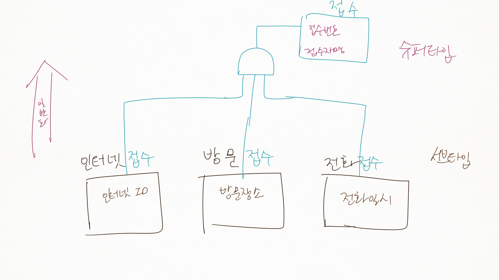
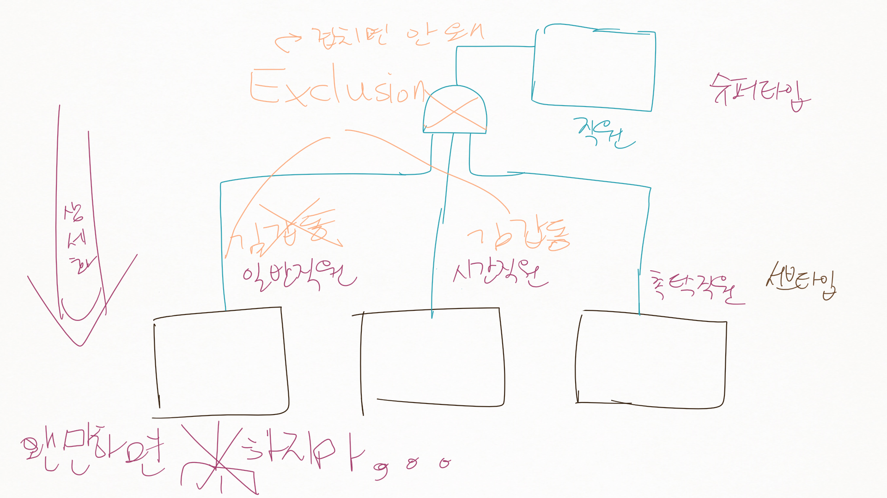
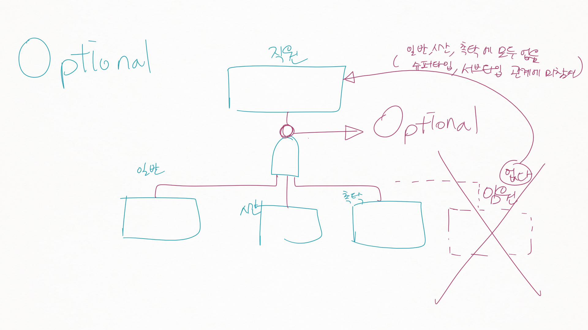
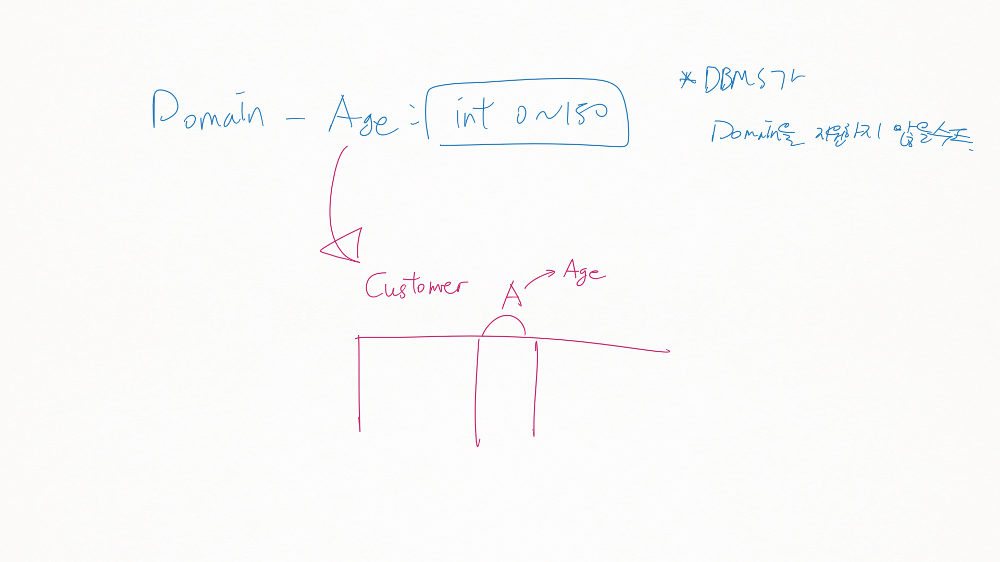
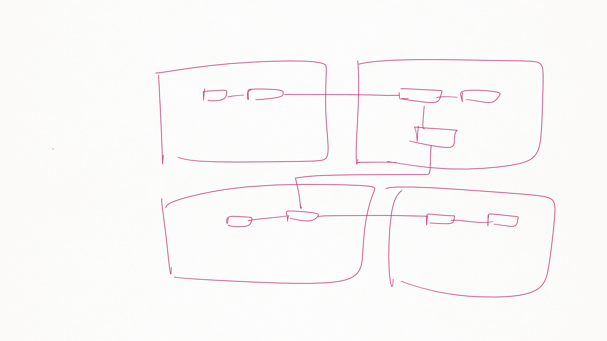

정보시스템설계및실습 3강
========================

1장. 데이터 모델링 주요 개념
============================

4 관계
------

-	정의 : 두 개의 엔티팁 사이의 논리적인 관계, 즉 엔티티와 엔티티가 존재의 형태나 행위로서 서로에게 영향을 주는 형태

### 관계의 분류

-	존재에 의한 관계
	-	부서 (DB팀) →\[소속한다\]→<- 사원 (황경빈)
		-	부서와 사원 : 소속한다, 소속된다.
	-	이미 있는 것만으로도.
-	행위에 의한 관계
	-	고객 (김경재) →\[주문한다\]→<- 주문 (CTA201)
		-	고객이 주문을 해야 발생되는 관계
	-	관계가 (누군가) 행위를 해야만 발생

### Pairing

-	관계는 Pairing 의 집합
-	Pairing : 관계의 인스턴스.
	-	Pairing 혹은 인스턴스라는 용어를 사용함.

### Membership

-	"부서" → 포함한다 ↔ 소속된다 ← "사원"
-	이름붙여진 관계에 대해
	-	각 엔티티가 어떤 관점으로 관계에 참여하는 것인가
	-	툴에서 각각 이름붙일 수 있기도

### 갯수 : Cardinality

-	모델링시 카디널리티 결정은 중요한 사항
-	엔티티끼리 서로 바라보는 관점이 다르다
	-	→ 카디널리티를 따질때는 **각자의 입장에서 각각 따져봐야**

#### 1:1 (one to one)

-	ex) \[구매신청\] → 신청한다 ↔ 작성한다 ← \[구매주문\]
	-	구매신청 → 구매주문 : 구매주문은 하나
	-	구매주문 → 구매신청 : 구매신청은 하나
	-	→ 1:1 임.
-	따로따로 뽑을것
-	A → B 가 한 개인지 **어떻게 파악**할 것인가
	-	데이터로 파악하면 안 됨 (참조는 할 수 있음)
		-	이러면 안 됨 : 데이터를 본다 → 관계를 본다 → 어라 1개씩이네
		-	엑셀 봅시다 그러고 데이터만 보고있으면 실패
	-	프로세스로 파악해야
		-	업무 프로세스의 목적을 감안 : 프로세스상 항상 1:1일 수 있다 → 비로서 1:1
		-	프로세스로 확신이 설 때.

#### 1:N (one to many)

-	ex) \[부서\] → 포함한다 ↔ 소속된다 ← \[사원\]
-	ex) 사원이 한 부서당 한 명이라 1:1 이지 않을까 → 지금의 사원이다 → 나중에 확장될수도.
	-	회사 규정상 한 부서에 한 명이라고 가정 → 1:1 이 되겠죠.
-	첨언 : 항상 관계는 인스턴스 한 계 입장상 봐야.
-	DB 로 만들었을때, F.K 를 부서에, 아님 사원에?
	-	N 쪽에 붙인다
	-	1 쪽에 붙이게 되는 경우 : Atomicity 미보장
-	F.K를 어디에?

#### M : N (Many to many)

-	ex) 주문 → 주문한다 ↔ 주문된다 ← 제품
-	F.K를 어디에?
	-	제품에 붙인다 : 제품 주문 기록을 봐야하는데? 제품에 주문을... atomicity?
	-	주문에 붙인다 : 주문을 눌렀는데 제품이 여러개 나와야 하는데? 주문에 제품을... atomicity?
	-	→ 새로 만들어야
-	M:N 관계 : 고민하지 말고 **새 테이블**을 만들어라
	-	양 쪽의 P.Key를 가져와서 새 테이블을 만든다

#### 관계 참여 방법 : 필수 여부 (Optional / Mandatory)

37p 지하철 이야기 읽어보기.

-	ex) 주문 → 포함한다 ↔ 포함된다 ← 상품 : (교수님 : 뭔가 이상한데?)
	-	하나의 주문에 대해 각각의 상품목록의 주문서를 만든다고 생각해보자
		-	키보드, 모니터, 프린터를 샀는데 키보드만의 주문서, 모니터만의 주문서, ...
-	표현법 : 동그라미가 있으면 Optional, 없으면 Mandatory
	-	N (F.K) : 1 (Mandatory : 먼데이토리 (웃음))
		-	1 쪽이 반드시 한 개 존재해야만 해
-	오른쪽의 1이 관계에 참여하지 않을수도 : 맞은편에 동그라미 표시
	-	1 : LG1 TV, 하나도 주문이 안 됨

-	ERD는 세상을 바라보는 방법
	-	카디널리티를 표현할 수 없기도 (N:1의 Optional을 1의 테이블에 표현 불가) : DB 설계자에게 이러한 부분이 전달될 수 있도록 조치해야

-	M : N의 양쪽 Optional 인 경우 : 인공 P.key를 만들어야 null 이 가능

### 관계 종류

#### 정상 관계

(냉무)

#### 자기 참조 관계

-	트리형 등. 트리 탑은 F.K가 null

#### 병렬 관계

-	두 엔티티 사이에 한 개 이상의 관계가 있읈도
-	ex) 고객 → 월세계약 ← 계약, 고객 → 전세계약 ← 계약

---

휴식

---

#### 슈퍼타입 - 서브타입 관계 → 5 에서.

5 엔티티 슈퍼타입과 서브타입
----------------------------

-	> 이거를 좀 더 일반화시키는 모습이 존재하더란 말입니다.
-	일반화 : 비슷한 엔티티타입으로부터 슈퍼타입을 도출
	-	인터넷접수, 방문접수, 전화접수 → 공통적인 일 (아마도 비즈니스 로직) 이 있더라 → 접수 엔티티를 도출
	-	
-	상세화 : 하나의 엔티티타입으로부터 여러 서브타입들을 도출
	-	직원 → 일반직원, 시간직원, 촉탁직원
	-	
-	업무의 존재
	-	서브타입에 대한 업무
	-	슈퍼타입에 대한 업무
	-	→ 둘 다 각각 존재한다
-	툴에서 : roll up, roll down
-	한 단계정도만 하라, 두 단계 이상 나뉘어지면 관리가 힘들어진다
-	엔티티는 겹치지 않게. (Exclusive)
	-	김갑동이 시간직원이면 일반직원일 수 없음
-	Optional 슈퍼타입 / 서브타입
	-	
	-	임원직원을 별도 서브 엔티티타입으로 만들지 않았을 경우.
	-	서브타입에 없는 직원, 즉 관계에 참여하지 않는 직원도 있을 수 있다
	-	(| 기호는 Exclusion 기호임.
-	Optional 이 없을 경우
	-	슈퍼타입 ↔ 서브타입 은 각각의 서브타입당 1:1, 1:1, 1:1 관계 : F.K는 어디에?
		-	→ 서브타입에 붙인다 (나 : 예에서는 슈퍼타입 1 : 서브타입 3)
		-	직원에 F.K를 붙이면 곤란 : 어떤 서브타입인지 알 수 있어요?
		-	ex) 직원번호가 F.K : 직원의 직원번호를 가리킨다!
-	Optional을 Relational-DB에서 어떻게 표현할까
	-	→ 표현할 수 없다, 표현되지 않는다
	-	→ F.K에 Null을 박 는다고 해도 슈퍼타입이 F.K라면 가능하겠지만 그러면 안 되므로
-	Inclusive 한 관계이면 슈퍼타입 갯수 < 서브타입 갯수의 합 일 수 있음 (하나의 슈퍼타입 엔티티 에 여러 서브타입 엔티티)

4로 돌아가서
------------

#### 주식별자, 비식별자 관계

-	나 : eXERD 초록줄 vs 갈색 점선줄
-	ex) 부서, 사원
	-	주식별자 타입 : 부서 (부서코드) → 사원 (P.Key : 부서코드(FK) + 사원번호)
	-	부식별자 타입 : 부서 (부서코드) → 사원 (P.Key : 사원번호) (별개로 부서코드(FK))

2 속성
------

-	업무에 필요한 엔티티에서 관리하고자 하는, 더 이상 분리되지 않는 최소의 데이터 단위

### 분류

#### 구성방식에 따라

샤샤샥 지나감.

-	PK
-	FK
-	일반 (PK, FK가 아닌 것)

#### **특성에 따라** (중요)

-	기본 속성 (BASIC)
	-	쉽게 파악되는 것들.
	-	> 업무로부터 추출한 모든 속성
	-	주민번호, 이름, 출신 초등학교 ...
-	설계 (Designed)
	-	> 업무에 필요한 데이터 이외에 데이터 모델링을 위해 업무를 규칙화하려고 속성을 새로 만들거나 변형하여 적용하는 속성
	-	코드 (CODE) (대표적인 설계 속성)
		-	코드는 코드이다
		-	분류하기 위한 목적 (cf. 번호는 유일하게 구분하기 위한 것)
			-	책에서 번호라고 해야할 부분에 코드라고 하는 부분이 있는데 이 점은 문제임
		-	ex) 부수면 수리해야하는 것들 : 창문 등을 AC 라는 코드로.
		-	ex2) 교과목 번호의 GE(공통코드), CE(컴공코드), CS(컴과코드)...
		-	DB 만들때 코드를 쓰는 일이 많다 → 코드를 디자인하는 것도 일임
	-	이것이 일반속성이냐 설계속성이냐 구분하기 힘든 부분들이 있음
		-	ex) 학번 등 (학생을 유일하게냐, 아님 학년 / 학과 분류냐)
-	파생 (DERIVED)
	-	> 다른 속성에 영향을 받아 발생하는 속성, 보통 계산된 값
	-	계산값, ...
	-	ex) 생년월일에 나이라고 하는 속성을 넣으면 → 매일 밤마다 나이를 한 살씩 올려주는 프로그램이 돌아가야
		-	이러한 프로그램이 안 돌아갔다 : 데이터베이스가 거짓말을 하게 된다.
	-	왜 만들까? 계산해서 조회하는 경우가 많을때. (효율)
	-	→ 유지 관리를 많이 해야하는 특징
	-	만들어야 할까, 만들지 말아야 할까?
		-	굳이 가이드라인을 잡는다면
			-	고객 테이블의 생년월일이 있으면 나이를 만들지 말자
			-	Derived 된 값들이 엔티티 안의 속성으로 존재한다면 만들지 말자 (1:1이면. 생일 즉 나이이니.)
			-	다른 테이블을 조회해서 Derived 된 값을 만들어야되는 상황이다 : 그 때는 만드는게 좋겠다.
				-	만들지 않는다면, 조회할 때마다 연산을... (시간이 많이 소요)

### 속성의 명명규칙

-	**해당 업무에서 쓰는 이름**을 부여
-	서술식 속성명 X
-	약어 X (가급적 제한)
-	엔티티 타입에서 유일하게 식별할 수 있도록
	-	당연한 이야기지만.
	-	교수님 권장사항 : 왠만하면 DB 전체에 걸쳐서 속성이 유일할 수 있도록.
		-	Join하는데 고생하지 않도록.
	-	내가 사용했던 것 : F.K는 반드시 해당 테이블의 이름을 붙이고, 그렇지 않은 경우 언급하지 않음 → 나중에 고생했음...
	-	번호가 아니라 제품 번호 등 Domain과 함께 목적에 맞게.
	-	

6 서브젝트 에어리어
-------------------

> 연관이 많은 엔티티타입을 그룹으로 묶어 표시하는 개념

-	양이 많아지면 쪼개라
	-	전체 모델링이 수월해진다
-	쪼개는 방법 (슬쩍 언급)
	-	정방향으로 : 분야별로
	-	순차적으로 : 일의 진행 상황에 따라
-	나중에 엮는 방법 (통합, 관리) 이 문제.
	-	도서관은 학생을 학생? 아님 Student?
	-	등록처에서는 학생이 아니라 등록생? 교무과에서는 휴학생도 관리해야!
	-	툴에서 커버

