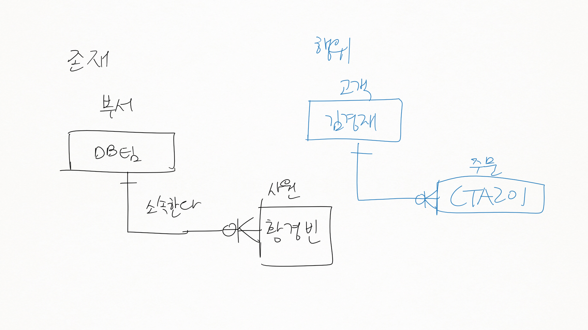
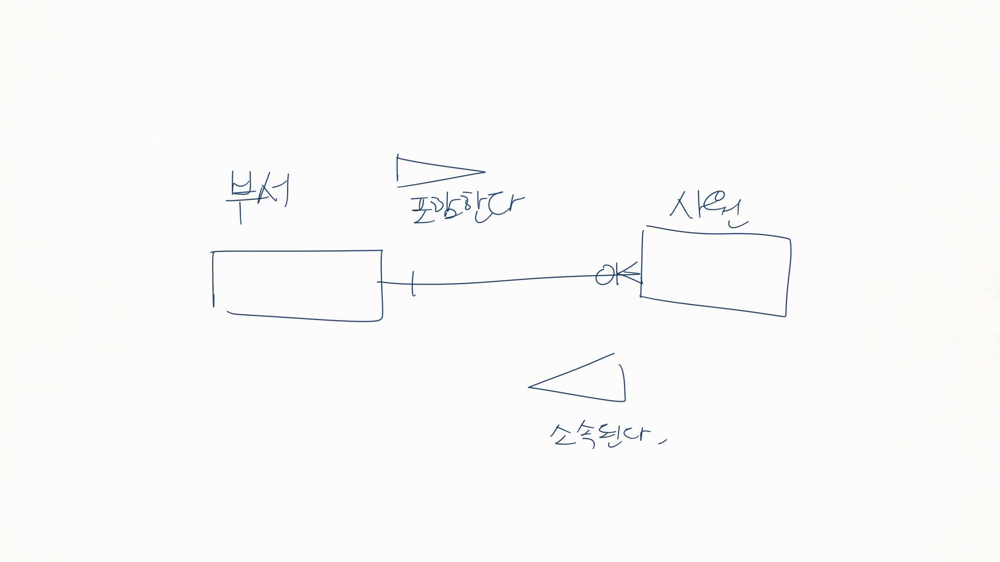
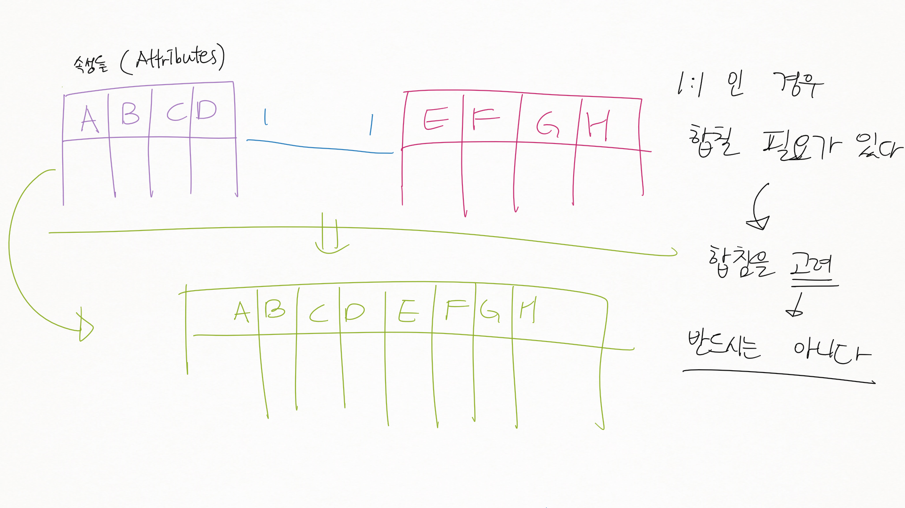
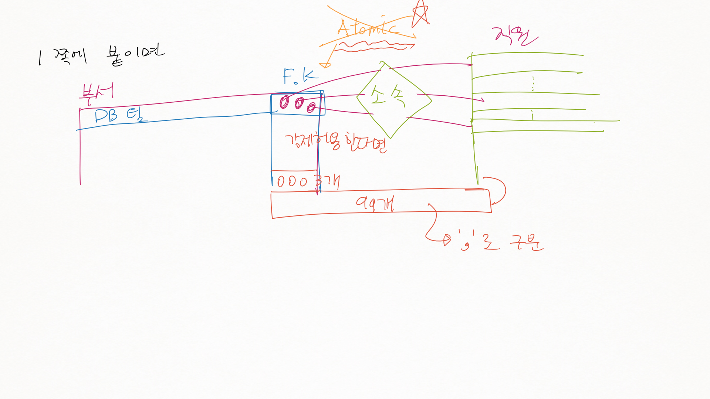
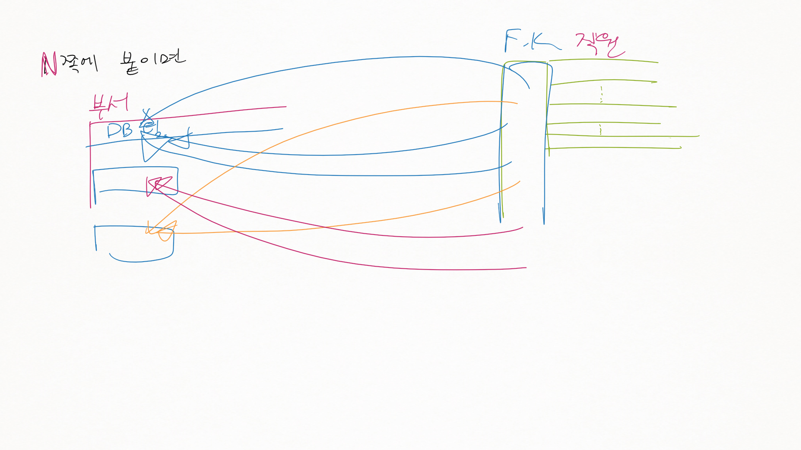
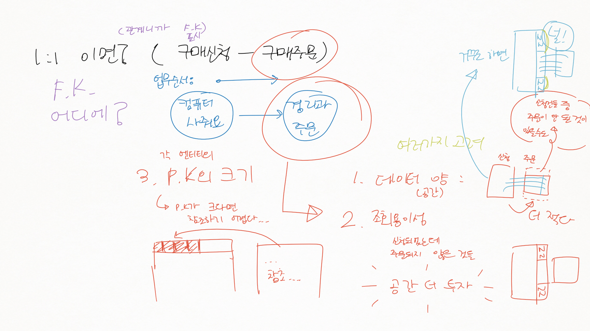
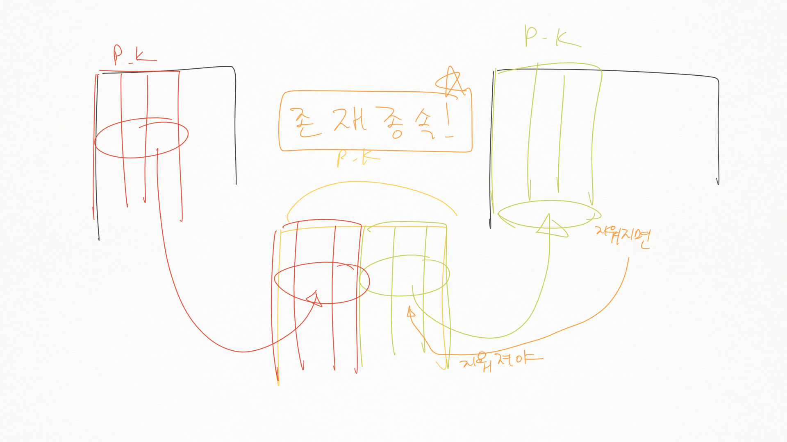
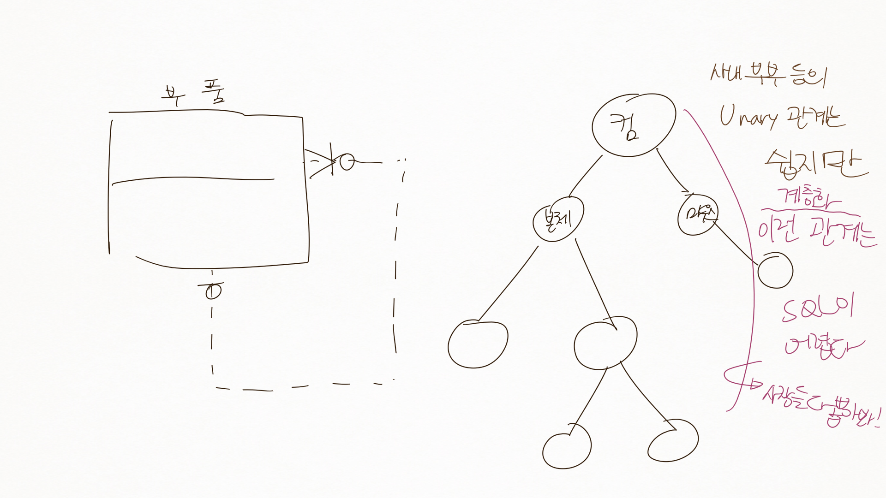

정보시스템설계및실습 3강
========================

1장. 데이터 모델링 주요 개념
============================

4 관계
------

-	정의 : 두 개의 엔티팁 사이의 논리적인 관계, 즉 엔티티와 엔티티가 존재의 형태나 행위로서 서로에게 영향을 주는 형태

### 관계의 분류

-	존재에 의한 관계
	-	부서 (DB팀) →\[소속한다\]→<- 사원 (황경빈)
		-	부서와 사원 : 소속한다, 소속된다.
	-	이미 있는 것만으로도.
-	행위에 의한 관계
	-	고객 (김경재) →\[주문한다\]→<- 주문 (CTA201)
		-	고객이 주문을 해야 발생되는 관계
	-	관계가 (누군가) 행위를 해야만 발생

### Pairing

-	관계는 Pairing 의 집합
-	Pairing : 관계의 인스턴스.
	-	Pairing 혹은 인스턴스라는 용어를 사용함.

### Membership

-	"부서" → 포함한다 ↔ 소속된다 ← "사원"
-	이름붙여진 관계에 대해
	-	각 엔티티가 어떤 관점으로 관계에 참여하는 것인가
	-	툴에서 각각 이름붙일 수 있기도

### 갯수 : Cardinality

-	모델링시 카디널리티 결정은 중요한 사항
-	엔티티끼리 서로 바라보는 관점이 다르다
	-	→ 카디널리티를 따질때는 **각자의 입장에서 각각 따져봐야**

#### 1:1 (one to one)

-	ex) \[구매신청\] → 신청한다 ↔ 작성한다 ← \[구매주문\]
	-	구매신청 → 구매주문 : 구매주문은 하나
	-	구매주문 → 구매신청 : 구매신청은 하나
	-	→ 1:1 임.
-	따로따로 뽑을것
-	A → B 가 한 개인지 **어떻게 파악**할 것인가
	-	데이터로 파악하면 안 됨 (참조는 할 수 있음)
		-	이러면 안 됨 : 데이터를 본다 → 관계를 본다 → 어라 1개씩이네
		-	엑셀 봅시다 그러고 데이터만 보고있으면 실패
	-	프로세스로 파악해야
		-	업무 프로세스의 목적을 감안 : 프로세스상 항상 1:1일 수 있다 → 비로서 1:1
		-	프로세스로 확신이 설 때.

#### 1:N (one to many)

-	ex) \[부서\] → 포함한다 ↔ 소속된다 ← \[사원\]
-	ex) 사원이 한 부서당 한 명이라 1:1 이지 않을까 → 지금의 사원이다 → 나중에 확장될수도.
	-	회사 규정상 한 부서에 한 명이라고 가정 → 1:1 이 되겠죠.
-	첨언 : 항상 관계는 인스턴스 한 계 입장상 봐야.
-	DB 로 만들었을때, F.K 를 부서에, 아님 사원에?
	-	N 쪽에 붙인다
	-	1 쪽에 붙이게 되는 경우 : Atomicity 미보장
-	F.K를 어디에?

#### M : N (Many to many)

-	ex) 주문 → 주문한다 ↔ 주문된다 ← 제품
-	F.K를 어디에?
	-	제품에 붙인다 : 제품 주문 기록을 봐야하는데? 제품에 주문을... atomicity?
	-	주문에 붙인다 : 주문을 눌렀는데 제품이 여러개 나와야 하는데? 주문에 제품을... atomicity?
	-	→ 새로 만들어야
-	M:N 관계 : 고민하지 말고 **새 테이블**을 만들어라
	-	양 쪽의 P.Key를 가져와서 새 테이블을 만든다

#### 관계 참여 방법 : 필수 여부 (Optional / Mandatory)

37p 지하철 이야기 읽어보기.

-	ex) 주문 → 포함한다 ↔ 포함된다 ← 상품 : (교수님 : 뭔가 이상한데?)
	-	하나의 주문에 대해 각각의 상품목록의 주문서를 만든다고 생각해보자
		-	키보드, 모니터, 프린터를 샀는데 키보드만의 주문서, 모니터만의 주문서, ...
-	표현법 : 동그라미가 있으면 Optional, 없으면 Mandatory
	-	N (F.K) : 1 (Mandatory : 먼데이토리 (웃음))
		-	1 쪽이 반드시 한 개 존재해야만 해
-	오른쪽의 1이 관계에 참여하지 않을수도 : 맞은편에 동그라미 표시
	-	1 : LG1 TV, 하나도 주문이 안 됨

-	ERD는 세상을 바라보는 방법
	-	카디널리티를 표현할 수 없기도 (N:1의 Optional을 1의 테이블에 표현 불가) : DB 설계자에게 이러한 부분이 전달될 수 있도록 조치해야

-	M : N의 양쪽 Optional 인 경우 : 인공 P.key를 만들어야 null 이 가능

### 관계 종류

#### 정상 관계

(냉무)

#### 자기 참조 관계

-	트리형 등. 트리 탑은 F.K가 null

#### 병렬 관계

-	두 엔티티 사이에 한 개 이상의 관계가 있읈도
-	ex) 고객 → 월세계약 ← 계약, 고객 → 전세계약 ← 계약
