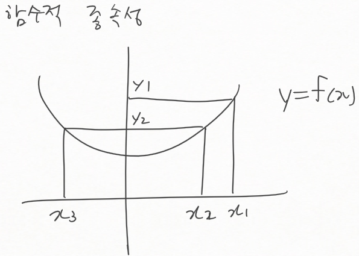

db04
====

1장. 데이터 모델링 주요 개념
============================

7 정규화
--------

-	지난시간 : 관계, 어트리뷰트

### 함수적 종속성 (Functional Dependency)

-	종속적
	-	`y=f(x)` : 한 개의 값을 준다 → 한 개의 결과가 나온다
-	**결정자 (DETERMINENT)** → **종속자 (DEPENDENT)**
	-	종속자 는 결정자 에 함수적으로 종속관계를 가지고 있음
	-	ex) 주민등록번호 → (이름, 출생지, 주소)
		-	cf) 주소 → 주민등록번호 는 불가
-	→ 식별자를 찾는데 활용. → 보통 P.Key로 사용됨
	-	모든 결정자가 P.Key가 되는 건 아니지만 그렇게 되는 경우가 많다
-	함수의 종속성
	-	속성간의 관계 / 하나의 테이블 안에 있는
	-	말하고자 하는 바 : 정규화 : 한 테이블에 결정자를 하나만 두자
		-	결정자 : 사실을 결정함
		-	→ **하나의 테이블에는 한 종류의 사실만 담는다**
		-	→ 정규화 임.

### 정규화에 대한 설명 및 예제

-	정규화 → 예전 과목때 배움...
	-	한 가지 사실을 한 곳에서만 표현하도록 하는 것
	-	원칙에 충실하게 데이터 모델링을 수행하면 정규화의 대부분을 해결할 수 있음
-	왜?
	-	읽기 vs 수정 (insert delete update) → 할 수 있도록
	-	→ 정규화 되어있지 않으면 DB에 넣을 수 없음
	-	→ 개체 무결성 제약조건, 참조 무결성 제약조건 (→ 테이블 여러개 → 정규화는 하나에 대해서 얘기.)
	-	→ 하나의 사실을 보장하기 위해 (삭제했는데 원치 않는 여러개가 지워졌다던가 / 집어넣으려는데 안 들어간다던가)
-	단점
	-	느려짐 (하나의 테이블을 여러개의 테이블로 쪼갬 → 나중에 조회하려면 Join 해야함 → 읽기 작업을 하는데는 안 좋음)
		-	DB의 90%는 읽는작업 → 그 90%가 느려짐.
	-	귀찮음, 성능도 떨어짐
		-	나머지 핫함 /

#### 정규화 과정들

-	1차 정규화 : 복수의 속성값을 갖는 속성 분리
-	2차 : 주 식별자에 종속적이지 않은 속성의 분리 → **부분종속** 속성을 분리
-	3차 : 속성에 종속적인 속성의 분리 / 이행적 종속 속성 (TRANSITIVE DEPENDENCY)을 분리
-	보이스 코드 정규화 : 다수의 주식별자 분리 → 하나의 주식별자만 존재
-	4차 : 다가 종속 (Multi-Valued Dependency) 속성 분리
-	5차 : 결합 종속(Join Dependency)일 경우는 두 개 이상의 N개로 분리
-	결정자와 종속자
	-	분리시 종속자는 분리, 결정자는 복사 → 어느 한 쪽이 F.Key 화
	-	1차 : 결정자 복사, 종속자 분리, (결정자 + 종속자) 를 P.K로, 복사\된 결정자가 F.Key
		-	부서, 사원번호, 취미
		-	취미 → "독서, 여행, 사진" → 다중값일수도, 아닐수도 있음. → 값에 현혹되지 말 것
	-	2차 : 결정자 분리, 종속자 분리, (
-	엔티티만 만들면 나중에 충분히 정규화된 테이블을 만들 수 있음
	-	처음에 ER 모델링 할 때 엔티티를 사용 → 충분히 정규화되어있는 테이블

---

휴식

---

#### 책 보고 과정 다시

-	테이블 : 주문목록
	-	제품번호
	-	제품명
	-	재고수량
	-	주문번호
	-	수출여부
	-	고객번호
	-	사업자번호
	-	고객우선순위
	-	주문수량
-	p.key 의 변경 : 제품번호 → 제품번호 + 주문번호
-	제품번호 → (결정) → 제품명 : **2차 정규화** : *주식별자에 종속적이지 않은 부분 종속 속성(Partial Dependency)의 분리*
	-	주문목록, 제품정보 (제품번호, 제품수량, 제품명) 의 두 가지 주제 : 부주제인 제품명을 빼낸다
		-	제품번호는 복사, 제품명 & 제품수량은 이동
		-	제품번호 : P.Key in 새 테이블 **제품** / F.Key in 주문목록
-	2차 정규화 : 함수적 결정 : 주문번호 → 결정 → 수출여부, 고객번호, 사업자 번호, 우선순위
	-	주문목록과 주문의 두 가지 → 분리
-	3차 정규화 : *속성에 종속적인 속성 분리*
	-	분리된 **주문** 이라는 테이블에 종속적인 부분이 있음
	-	고객 번호 → 결정 → 수출 여부 / 사업자 번호 / 우선 순위
	-	주문 (`*`) → 주문 (주문번호(pk), 고객번호(fk)) + 고객 (고객번호(pk), 수출여부, 사업자번호, 우선순위)
-	질문에 대해서 : 보이스콧 정규화
	-	
-	4차 정규화
	-	3개의 테이블이 관여
	-	
	-	이항관계이면 F.Key 잘 붙이면 되지만
	-	삼항관계이면, 카디널리티에 관계없이 무조건 3관계용 테이블을 만들어야!
		-	1:1:1, 1:1:N, 1:N:N, N:N:N 가능

### ERD 작업 순서

1.	엔티티타입을 그린다
2.	엔티티타입을 적절하게 배치한다
3.	엔티티타입간관계를 긋기
4.	관계명 기술 → 엔티티 입장에 맞춰서
5.	참여도 : 카디널리티,mandatory
6.	관계 필수 여부
