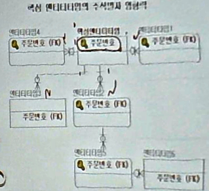

와 5강이다
==========

1부 논리설계 → 2장. 데이터 분석 및 모델링
=========================================

### 데이터 모델링 시 유의사항

-	오직 한 가지 절대적인 방법이 존재하지는 않음
	-	→ 결과가 한가지가 아님
-	실제 업무담당자와 공감대를!
	-	→ 업무담당자를 전문가로 봐야! → 귀를 기울여라!
	-	데이터 모델러가 리드하면 곤란 (모델러 맘대로 만들어질 수 있음)
-	데이터 분석단계에서 DB를 정의하고픈 유혹에서 벗어나야!
	-	→ 업무 자체의 분석에 중점을 둘 것
	-	→ 업무분석하면서 머릿속에서 for 루프 돌리고 있으세요? (바람직하지 않음)
	-	→ 모델링에만 집중하자!
-	프로젝트와 업무 사항에 부합하도록 모델링을 진행
	-	→ 더 만들지 마라 (혹은 추가로 계약) → 나중에 책임질래?

### 좋은 데이터 모델의 특징

-	해당 업무의 현재 모습 뿐만 아니라 → **계획, 정책, 전략**을 포함해야
	-	모델링은 카디널리티를 파악하는 것
	-	나중에 수정 가능하게, 구현 안 할 것이라도 향후 발전시킬 수 있게
-	명명법, 도메인 등 → 일관적으로, 정해진 규칙!
	-	도메인 정리의 중요성
		-	부서 → 컴공, 뭐시기, ...
		-	부서이름의 varchar2 → 40byte를 똑같이, 모든 테이블에 정의 가능
		-	join 같은 거 할 때도 → 형태가 같지 않으면 비교연산을 할 수가 없어,,,
-	업무 전문가가 참여 → 실무 내용이 충분히 포함되어야!
	-	데이터 모델러는 있는데 책임자가 없어요!!!!!! 왜!!!!!!!!! 모델러는 술 쳐먹으러 왔나요!!!!!!!!!!!!!
	-	→ 사업 개판됨
	-	소통이 잘 되야 뭘 만들어야 할지 알죠...
-	물리 설계로의 전환이 효율적으로 되도록
	-	→ 툴이 해줌 (웃음)
	-	DDL이 나오는걸 바로 쓰는 게 아니라 ... 그걸 또 보고 ... 하나의 블록에 데이터를 얼마나 채울것인가 (fill factor) 등...
	-	어떤 인덱스를 설정할 것인가
-	엔티티타입, 속성, 관계 등에 대한 업무차원에서의 (왜 있어야 하는지 / 객관적 증거)
-	확장 수용가능
	-	대충 만들고 조금씩 추가 → 나중에 DB가 ~~떡방아를 찍게 됨~~ 떡이 됨
	-	→ 역공학된게 ER 모델링하고 안 맞는다던가 (미친) → ER 모델러가 다른 부서로 갔거나 퇴사했다면!

① 엔티티타입 정의
-----------------

**엔티티타입 정의** → 관계 정의 → 식별자 정의 → 세부사항 정의 → 통합화 → 데이터 모델 검증

### 엔티티타입 선정 대상

> 엔티티타입을 찾아내는 작업은 마치 *검사가 범죄자의 증거 자료를 찾듯이* 모든 방법이 동원된다.

-	아직은 엔티티타입에만 집중
-	뽑아내는 곳
	-	장표 (보고서)
		-	엑셀 파일, 테이블, 화면보기 등
		-	→ 장표에 유혹 / 현혹되세요? (ㅋㅋㅋㅋ)
		-	→ 한 순간의 스냅샷
			-	문제 0 : (놓침...)
			-	문제 1 : 데이터만 보인다 → 엔티티타입이 가져야할 특징이 안 보일수도
			-	문제 2 : 화면은 이미 여러 테이블을 join 한 것임 → 찾고자하는 엔티티 타입은 아닐것임!
		-	현혹되지 말 것
	-	업무 기술서
	-	인터뷰
	-	DFD
		-	DFD를 통해 업무 분석을 진행하였다면 DFD의 Data Store 를 활용한다
	-	구 시스템
		-	현혹되지 말 것 ②
		-	참고
	-	현장조사
		-	업무 기술서에 없던게 나온다!
	-	업무 개선
		-	개선할 수 있는지 생각해보기

### 엔티티타입 선정 절차

-	절차
	1.	여러 자료 등에서 명사를 구분 (동사 말고)
		-	교수, 학생 vs 지도 (동사)
	2.	제거 : 불분명
	3.	제거 : 엔티티타입의 특성, 속성값인 것
	4.	제거 : 중복되는 명사
	5.	뭐 빠진거 없어?
-	기준
	-	업무에서 관리할 필요?
	-	자신만의 속성?
	-	스스로 혹은 다른걸로 지속적 생성됨?

### 예

> 인터넷 경매를 하는 IAutionCo 라는 회사는 경매할 물품에 대한 내용을 온라인으로 접수받고, 각 물품이 팔릴 수 있는 날짜를 정하여 (이 날짜를 경매 공고일이라고 함) 인터넷에 경매를 공고한다. 경매 공고일에는 역시 온라인을 통해 입찰인이 입찰된 물품을 매수 신청하고 매수 신청한 입찰인 중 최고가를 신청한 매수 신청인에게 물품이 낙찰된다. 물품 낙찰일로부터 1주일 이내에 낙찰대금을 은행계좌나 카드, 또는 직접 IAutionCo에 납부하지 않으면 낙찰은 자동으로 취소되고 차순위 금액을 신청한 매수 신청인에게 물품이 낙찰된다. 낙찰인은 1주일 이내에 대금을 납부하면 경매가 성사되었다고 하고, 매수 신청인에게 낙찰대금을 입금하여 경매 절차가 완료된다. 경매가 성사되는 경우 물품 가격의 2%를 IAuctionCo에 수수료로 납부해야 한다. 각 경매일에 경매가 진행된 결과는 자세하게 알 수 있어야 한다.

-	DB 진흥원? 에서 DB 모델링 경진대회에서 이런 시나리오가 아주 길...게...

#### 1 - 엔티티타입 도출 방법에 의해 엔티티타입을 선정한다

1.	시나리오에서 명사 구분
2.	개념 불분명, 광범위 제외
	-	인터넷 경매, IAuctionCo, 회사, 내용, 인터넷
3.	엔티티타입의 특성 / 속성 제거
	-	날짜, 경매 공고일, 최고가, 낙찰일, 낙찰대금, 은행계좌, 카드, 직접납부, 차순위금액, 물품가격, 2%, 수수료, 경매일
	-	직접납부는 좀 *까리까리*
4.	포괄적인 업무 프로세스 명사 제거
	-	온라인, 자동, 취소, 대금납부, 경매성사, 입금, 결과
5.	중복명사 제거
	-	입찰인 = 매수신청인, 매수신청 = 신청 (둘 중 하나씩)
6.	누락된 엔티티타입정보 유추
	-	경매물품 → 추가

---

-	관계 정의서 작성 → 꼼꼼하게 적는다 (아래에는 하나만 적었어요... 힘들어...)

| 엔티티 타입명 | 엔티티타입 설명 | **동의어 / 유의어** | 엔티티타입 구분 | 관련 속성 | 비고                           |
|---------------|-----------------|---------------------|-----------------|-----------|--------------------------------|
| 물품          | 설명(생략)      | 제품목록            | \-              | \-        | 장표 중 주문서의 내용이 포함됨 |

-	이런걸 잘 해야 함. 정말 안 하려고 하지만...

### 엔티티타입 확정

-	도출된 엔티티타입들의 적절성을 **업무담당자와 함께 검증**
	-	→ 현업 담당자들을 미리미리 깨울 수 있다!
	-	너무 늦게 깨우치면 나중에 뭐라뭐라 추가해주세요
	-	기업의 충성심 → 현업 담당자가 결국 나중에는 오버를... ㅋㅋㅋㅋ... 자기가 회사 운영하는듯이...
	-	→ 첨부터 얘기하지!
	-	→ 이야기할 기회를 줘야
-	도장이 안 찍혀있는만큼 돈이 덜 나감 : 나중에갈수록 검수를 꼼꼼하게 됨! ...
-	현장 사람들과 사이가 좋아야 함.

---

휴식

---

2 관계 정의
-----------

### 관계 정의에 대해

그대로 타이핑 →

-	업무기술서, 장표, 인터뷰 등 정리문서 등에서 동사를 구분한다
-	도출된 엔티티타입과 관게를 이용하여 관계정의서를 작성하도록 한다.
-	고객에게 질문하여 관계에 대해 더 세분화되고 정확하게 도출하는 작업을 한다
-	데이터모델링 툴(TOOL) 이나 칠판, 포스트잇을 이용하여 직접 모델을 그려본다
-	고객과 질문하고 협의하여 모델을 검토하는 시간을 갖는다.

→

-	담당자라도 이것이 관계인지 얘기하기 쉽지 않다...
-	→ 현업담당자와 얘기하면서 해야
-	모델러가 현업담당자가 관계인지 캐치 못 해도 캐치해야

### 관계 도출 과정

1.	동사 구분 : 관계 = 동사
	-	from 업무 기술서 등
	-	주어와 목적어가 있는 경우 관계일 소지가 높음!
	-	> 강사는 여러개의 강좌를 **강의할 수 있다**. *대학원*에서는 *여러 명의 강사*를 **기록하고 관리한다**. *대학원*에서 *과목 당* **개설한** *강좌*는 한 명의 강사가 **강의를 진행한다.**
2.	관계 정의서 작성
	-	방향, 참여도, 참여방법
	-	관계 정의서의 칼럼 : 기준 엔티티타입 / 관계 형태 (방향, 참여도, 참여 방법) / 참여 방법 / 관련 엔티티타입
		-	관계 형태
			-	방향성을 정해야
				-	> 각각의 사원은 한 부서에 속한다
				-	: 사원 → 부서
				-	> 각 부서에는 여러명의 사원이 존재할 수 있다
				-	: 부서 → 사원
			-	관계명을 적어주는것도 좋음
		-	참여 방법
			-	선택 : 0개 있을수도
		-	관련 엔티티타입
			-	관계 대상인 엔티티타입?
3.	고객에게 질문 → 관계를 좀 더 세분화, 정확하게 도출
	-	- 인터뷰로 묻는 방법
		-	아래 표 보기.
		-	예, 아니오로만 답할 수 있지 않도록 ㅠㅠ 경찰도 아니고 ㅠㅠ
		-	→ 현업 담당자가 말을 할 수 있게 하자! → 묘한 불쾌감이...
4.	ERD 그려보기
	-	데이터모델링 툴이나 칠판, 포스트잇(스티커메모) 등으로 직접 모델을 그려본다
	-	→ 데이터 모델링 툴은 화면이 좁죠 ㅠㅠ
5.	고객과 질문하고 협의하여 모델을 검토한다
	-	
	-	물어볼 점 : 회의를 할 때 뭘 물어볼지 정리해서 물어보는게 좋다 : 답할 준비를 하게 해주자 ㅠㅠ
	-	사람 수 : 사진은 사람이 너무 많아 ㅠㅠ : 한 5명 정도 → 많으면 모델러도 정리가 안 됨
		-	현업에서 책임을 질 사람을 불러야 → 아닌 경우 다른 사람을 부른다... 줄줄이... 모인다... 으악 → 말이 정리가 안 됨 / 뭔가 말해야 할 거 같은 기분! ← 상사 앞에 있다! ← 헤게모니가 벌어지기 시작 (헤게모니?) → 일을 떠안게 되는 것처럼 ㅠㅠ
		-	참여할 사람을 정확하게 정의해야!
		-	이야기할 부분을 미리 좀 얘기해줘야!
		-	→ 안 하고 냅두면 지들끼리 싸우고 얘기함 (오 마이 갓...)

| 하나   | 기준 엔티티타입 | 하나 or 여럿 | 관련 엔티티타입 | 선택 or 필수 | (선택 or 필수) | (선택 or 필수) |
|--------|-----------------|--------------|-----------------|--------------|----------------|----------------|
| 각각의 | 사원은          | 한           | 부서에          | 만           | 속할 수        | 있습니까?      |
| 각     | 부서에는        | 여러         | 사원이          | 항상         | 소속되어       | 있습니까?      |

③ 식별자 정의
-------------

### 주식별자의 영향력

-	핵심 엔티티타입의 주식별자 영향력 → 주문... 주문... 주문... → P.Key → 잘 정리해야
-	왜 : 다른데서 마구 참조돼요!
	-	

### 주식별자의 특징

-	엔티티타입의 **모든 엔티티들을 유일하게 구별** 가능해야
-	일단 **특정** 엔티티타입에 주식별자가 지정되면 **향후 변동이 없어야**
-	주식별자가 지정되면 **데이터 값이 반드시 존재**해야

### 주식별자의 정의

1.	해당 업무에서 자주 이용되는 속성 → 주식별자
	-	직원 : 직원번호 vs 주민번호 : 직원번호를 많이 쓴다!
	-	책이 까임 : 직원인데 P.Key가 _사원_번호 (이름 좀 정리..)
2.	명칭, 내역 등은 피함
	-	학과 이름 X, 학과 번호 O
	-	왠만하면 이름은 피합시다
	-	식별자를 할 때는 번호를 따로 만들어주는것이 좋다
	-	예) 부서 (**부서명**) →
		-	→ 부서 (**부서코드**) → 업무코드 (**코드** | 코드명(←부서명))
		-	→ 부서 (**부서일련번호** | 부서명)
		-	코드와 번호는 구분하라! 제발! (책에서도 혼용해서 사용... ← 곤란)
			-	코드 : 분류 목적
			-	번호 : 유일하게 선택
3.	자주 변하는 값 → 식별자 X (학생 → 전자메일...)
4.	구성 속성이 적을수록 바람직
	-	주식별자가 히익 7개! → 인공적인 식별자 *접수번호*를.
	-	복잡한 주식별자 예 : 엄청난 and 코드를 쓰실래요? (오 쉣)
	-	나중에 조회할 때 많이 한다면... → 역정규화의 예! (놓침 ㅠ)
		-	역정규화 (나중에 함) : 결재를 조회할 때 접수방법코드 / 신청자주민번호를 자주 접근한다면 결재에도 **복사**
			-	표를 합치는 게 아니라 칼럼을 중복시킴 → 무결성 생각해야...

### 외부식별자

관계를 통해 자식쪽에 생성되는 속성

-	외부 식별자 (F.K) →
	-	주식별자 역할 (P.K 구성)
		-	사원 (사원번호) -|→ - → 0|<- 발령(사원번호 (FK), 발령일자 | )
		-	사원 (사원번호) -|→ - → 0|- 임시직사원(사원번호 (FK)) (→ 1:1)
		-	주식별자가 되면 원본 쪽은 반드시 mandatory 됨. (필수)
	-	일반속성 역할 (일반속성 구성)
		-	접수 (접수번호 | ) -|→ - → 0|<- 목록 (목록번호 | 접수번호 (FK))
			-	접수가 없어져도 목록이 있으려면 → 접수에 optional을 걸어야 (-|0→)
-	foreign key (시작하는 쪽에 optional 을 쓸 때)
	-	on delete \[ cascade / set null / set default / restrict \]
	-	on update는 안 씀 → 잘 안 씀.
-	→ 결국 업무 흐름쪽이 판단이 되어야.
	-	(주식별자 역할을 하면 시작하는 쪽이 없으면 넣을 수 없다 : 근데 넣어야될 상황이라면?)

#### → 비식별자 관계를 도출하는 이유

-	자식 엔티티타입에 별도의... (아이고야 놓침)
	-	여러가지 상황을 고려해야 : 부모 없이 생성 가능성, 주식별자의 크기, ...

#### 상속 차단

읽어보기 바랍니다 (...)
