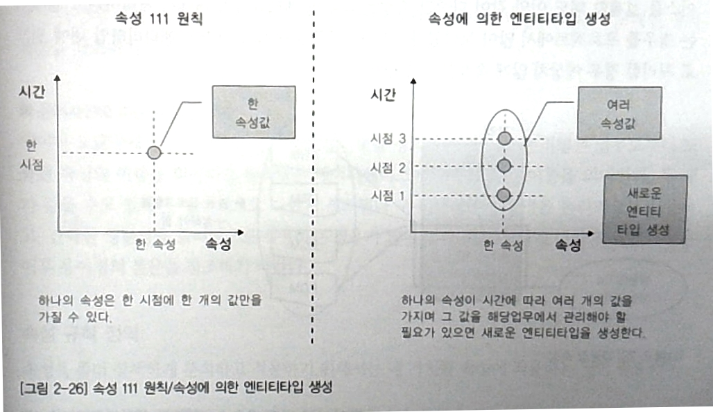
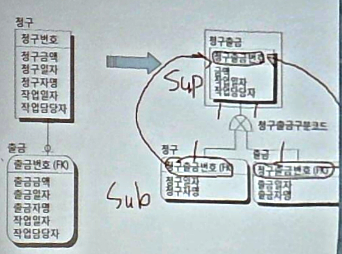
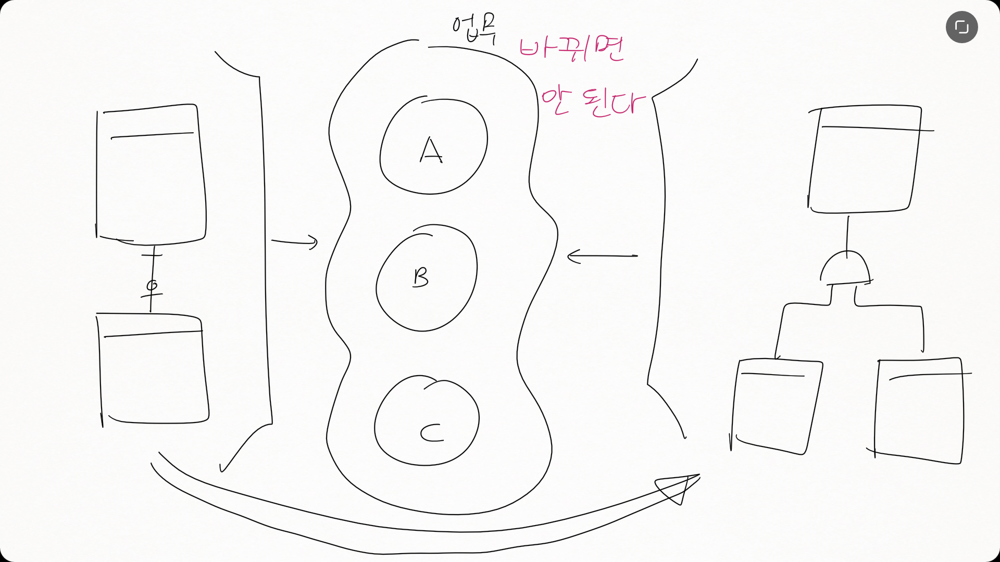
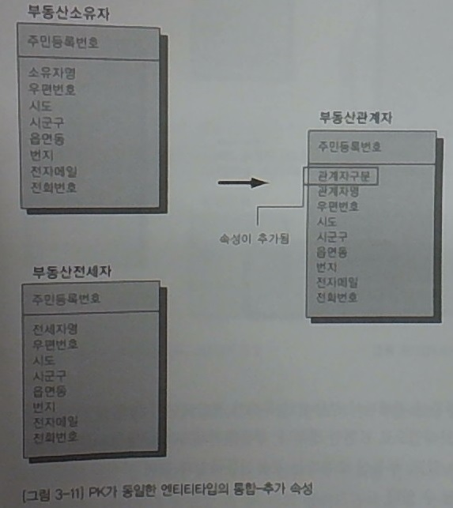

dblec06
=======

-	속성.

2장 데이터 분석 및 모델링
=========================

4 속성 정의
-----------

### 속성 상세 정의 : 언제 속성을 선정?

> 속성을 발견하는 작업은 개발 이전까지 **지속적으로** 진행되어야 하므로 데이터 모델링 단계에서 완벽하게 속성을 찾으려고 애쓰지 않아도 된다

-	단계들
	-	엔티티 타입 선정
	-	프로세스 모델링
		-	4장?
	-	상관 모델링
		-	CRUD?
		-	5장?
	-	현 시스템 분석
	-	업무자료를 수집하는 동안
-	특징
	-	진행하는 도중 새로 나오거나 잘못되었음이 판명될 수 있다
	-	속성은 ER 모델링이 충분히 진행되어야 확보됨
	-	→ 완벽하게 도출해야지~ 라고 하지 않기
	-	개발 후에는 어지간하면 추가 속성을 만들면 안 됨 : 꼬인다, 관리를 누가 할 지도.
	-	→ 개발 도중에 추가된 건 ERD에 반드시 반영해야!

#### 한 속성, 한 시점, 하나의 값

-	속성 111 원칙 :
	-	> 한 속성은 한 시점에 한 개의 값만을 가질 수 있다
	-	→ 가로축 속성, 세로축 시간 → 교차점
	-	> 교수님 : DB는 현실의 한 순간의 스냅샷임
-	시점에 따라 값이 바뀐다면
	-	ex) 속성 : 고객의 방문일자
		-	→ 속성이 다중값?! (방문일자1, 방문일자2, 방문일자3)
			-	→ 5번으로 늘려야 한다면?
			-	→ 많은 프로그램들을 수정해야 함 (...)
		-	→ 업무의 변화를 수용 가능하게 만들어야!
	-	→ 별도의 엔티티로 빼세요. (1:N)
		-	고객 -|-포함한다----포함된다-0|<-고객방문 (고객번호, 방문일시 | 방문내용)
			-	동일한 날짜에 여러번 방문한다 → p.key에 방문번호를 넣는다
		-	억지로 고객에 박아넣으려고 하지 마세요...

### 속성의 분류

-	기본 / 설계 / 파생
	-	기본속성 : 업무상 **수집된** 기본속성
		-	80%는 기본속성
		-	ex) 입학년도, ..
		-	한번 만들어진 뒤에는 어지간해선 **잘 바뀌지 않는다**
	-	설계속성 : 업무에 필요한 정보를 주기 위하여 시스템에서 **고안한** 속성
		-	인공적으로 만든 것
			-	ex) 학번, ...
		-	코드 등 (분류!) 같은 것들
		-	ex) *최찬휘* 의 학번을 만든다 : 1. 이름으로 sort 2. 앞 학생의 +1
		-	많은 경우 **다른 속성값의 영향**을 받음
			-	양이 많지는 않을 것.
	-	파생속성 : 다른 속성에 의해 **계산**되거나 **영향을 받아 생성**된 속성
		-	생일을 알면 나이를 계산할 수 있다
		-	*매번 계산하여 생성하지 않기 위해* 쓰임.
		-	ex) 금액총합, 이자 등
		-	**일관성의 문제**가 계속 발생한다
		-	많은 유혹이 발생... 가능하면 안 만들면.

### 속성 규칙 정의

1.	속성의 3분류를 정의한다
2.	필요 여부 정의 (not null?)
3.	기본값 정의 : null 혹은 기본값?
4.	반드시 정해진 값만 들어가야? → check 제약조건 (월화수목금남녀)

5 도메인 정의
-------------

-	도메인 : 값이 가질 수 있는 범위
	-	일관성 있게 DB에 접근하는게 가능해짐

### 도메인 구분과 도메인 타입

-	도메인 없이 type만 잡았다고 가정해봅시다!
	-	→ JOIN 하려는데 두 테이블의 string 길이가 다르다?! 혹은
	-	→ 거꾸로, where 주민번호 = 사원번호 / where 주민번호 > 사원번호 도 가능하다
-	→ 처음부터 주민번호, 사원번호 등을 아예 정의
	-	→ 나중에 DBMS가 도메인이 안 맞아요! 라고 해줄 수 있게 됨
-	→ DB를 **일관적으로 운영**할 수 있게 됨
-	잡담 : 우리 학교 포탈
	-	DB를 아무 생각 없이 만듦 → 전화번호에 하이픈을 넣어야되나 안 되나
-	4단계 도메인 구분 → *저자가 만든 거라던데 읽어보세요*

---

휴식

---

텀프로젝트?
===========

-	계획은 팀별로... 였는데
	-	엔티티 type이 20개 이상 나와야 하는데 → 시나리오 만들기가 어렵다 → 시나리오를 주겠습니다
-	시나리오는 A4 3페이지정도 될 것.
	-	팀마다 다른 시나리오
-	마지막 3주차. : 12, 13, 14주차
	-	1, 2주 전에 시나리오를 만들어서 줄게요
-	중간고사 끝나고 팀을 알려주세요
-	툴 eXERD : > 사용 설명서가 엉망
	-	시간이 가능하면 ERWin
-	발표 → 체크 → 수정 → 체크 → ... →
	-	최종 결과물 : 기말 시험때 제출

3장 실전 데이터 모델링 이슈
===========================

-	> 오랜만에 책을 읽어보니까, 저자의 글쓰기 능력 자체가 문제가 있는 거 같애
	-	> (내가) 이런 책을 안 써봤기때문에 뭐라고 하기 좀 뭐하지만서도, 교수가 쓴 것과 현업인이 쓴 게 다른 거 같애.
-	ERD 자체가 정답은 없다 → *권장사항*

1 M:N 관계 해소 방법
--------------------

-	M:N 관계 → 어떻게 해소할 것인가
	-	ER 모델링은 관계*까지만* 파악하는 것. ← M:N 카디널리티!
	-	→ DB로 갈 때에는 조치를 취해야
	-	ex) ERWin 에서는 중간에 관계용 테이블을 자동으로 만들어줌
-	해소법 : 통합법
	-	관계 엔티티타입 생성 (에 의한 통합)
	-	주식별자 (에 의한 통합)
	-	속성 (에 의한 통합)
-	M:N에 대하여.
	-	관계 해소를 위해 테이블을 만든다
	-	→ Join에 대한 부담이 계속 발생한다

### 통합 1 : 관계 엔티티타입 생성으로 분리

-	example
	-	요금 (요금번호) ->|------0|<- 납부번호 (납부번호)
		-	납부를 여러번 나눠서 할 수 있다면 : M:N
	-	요금 (요금번호) -|------0|-<- **요금납부**(요구번호-FK, 납부번호-FK | ) ->|---------|- 납부
		-	엔티티 분류 : 행위 엔티티
-	깔끔한 방법
-	생성된 관계 엔티티 타입
	-	**행위 엔티티 타입**인 경우가 많다
	-	식별자의 크기가 커지는 문제가 발생 : 관계 엔티티 타입을 참조하는 테이블이 많아지면...

### 통합 2 : 주식별자에 의한 통합

-	example
	-	같은 예
	-	요금 (요금번호 | ) -|----0|<- 납부 (납부번호, 요금납부순차번호 | 요금번호 (FK))
		-	주식별자가 변경됨!
-	특징
	-	Join 대상이 하나 더 적다 : 요금에 대한 납부사항을 확인하고 싶다 → 2개 (위엔 3개)
	-	M:1 의 부분을 ERD에서 파악하기 어렵다 : ERD를 잘 봐야.

### 통합 3 : 속성에 의한 통합

-	example
	-	납부가 최대 2회 발생하는 것을 이용한 속성 추가
	-	요금 (요금번호 | 납부번호1-FK, 납부번호2-FK ) ->|-->|--------0|-0|- 납부 (납부번호)
-	특징
	-	3회 이상이 되면 곤란

2 1:1 관계 해소법
-----------------

-	4가지 방법

### 1:1 통합 1 : 개별 엔티티타입 유지

-	예
	-	청구 한 번에 반드시 출금이 한 번이라면.
	-	청구 (청구번호 | 청구금액) -|----0|- 출금 (출금번호-FK | 출금일자)
		-	출금은 없을수도 있어서 optional `0` (동그라미)
	-	→ 하나로
		-	청구출금 (청구출금번호 | 금액, 출금일자)
		-	하나의 사실로 묶는다
		-	null 이 있다가 채워지는 방식

### 1:1 통합 2 : 부분 통합

-	금액, 일자등의 내용이 유용하게 쓰이는 경우.
-	→ 별도로 유지하거나, 합치되 둘을 구분할 수 있는 코드를 추가
-	청구 (청구번호 | 청구금액, 청구일자) -|---0|- 출금 (출금번호 | 출금금액, 출금일자, 청구번호-FK)
-	→ 청구출금 (청구출금번호, *발생순번* | 청구출금구분코드, 청구출금금액, 청구출금일자)
	-	발생순번이 필요할까? → 구분코드를 PK로 올리고 발생순번을 지우면.
	-	→ 청구출금 (청구출금번호, **청구출금구분코드** | 청구출금금액, 청구출금일자)

### 1:1 통합 3 : 걍 통합하지 말어

-	각각에 대한 업무가 명확히 구분되어 있는 경우.
-	통합하지 않고 두는 것이 바람직

### 1:1 통합 4 : 슈퍼 엔티티 타입 생성

| 청구          | 출급          |
|---------------|---------------|
| 청구번호 (PK) | 출급번호 (PK) |
| 청구일자      | 출급일자      |
| 청구금액      | 출급금액      |
| 청구자명      | 출급자명      |
| 작업일자      | 작업일자      |
| 작업담당자    | 작업담당자    |

-	청구와 출금을 할 수 있는 사람이 다르다고 생각해보자
	-	청구 → 시공담당자, 출급 : 총무
	-	발생은 작업 때문. → 똑같은 이야기를 하고 있다!
-	→ key가 같도록. 슈퍼타입 하나에 서브타입 하나씩만.
-	
-	참고 : X표시가 있으면 안 됨 → exclusive가 아니라 inclusive
	-	X 표시가 있으면 둘 중 하나만.
-	이렇게 줄이려면, 슈퍼타입 단위 (청구출금) 에서 업무가 있어야.
	-	→ 이렇게 한 이유가 있어야!
	-	자세히 보니 청구출금단위의 공통된 일이 있었다면.
-	잡담 : 중도금은 보통 ERD 제공 후에. 허나 그 뒤에 고쳐도 됨
	-	테이블을 고치면 ERD도 고칠 것
	-	ERD가 필요없다는 시스템 운영자들도 있음 → *어차피 보지도 않을 거!*
	-	10년 써야하니, 바꿔야하니 뭐나니...

3 엔티티타입 통합의 장단점
--------------------------

-	정규화와 조회
	-	정규화하면 조회하기가 어려워진다 / 데이터 관리가 쉬워진다
	-	통합하면 조회하기 쉬워진다 / 데이터 관리가 어려워진다
-	장 : **조회**
	-	종합 정보 조회에 용이
	-	불필요한 Join 제거 → 성능
	-	엔티티간 중복성 제거
	-	동일 규칙 적용시 한 번의 규칙만 적용
	-	ERD 간결화
	-	테이블 관리 개수가 줄어듦
-	단 : **관리**
	-	확장성이 유연하지 않음
	-	모델만으로 업무 흐름을 정확하게 이해하기 어려워짐
	-	데이터가 한 군데에 몰려 성능저하 가능
		-	청구 1000건 + 출급 900건 → 청구출급 1900건... 을 검색한다면
	-	제약조건 걸기 곤란해지기도
		-	청구출급 : 청구일자 / 출급일자가 다르다
			-	청구일자는 null 허용, 출급일자는 not null 이라면?
			-	→ N 인지 NN인지 분명하지가 않다
			-	→ 프로그램적으로 커버해줘야... trigger 등으로 : 원래 그대로 뒀다면 DBMS가 해줬을 일을 직접...

### 엔티티통합 : 생각해보기

-	통합으로,
	-	→ 업무 프로세스가 바뀌는가
	-	→ 사용자 인터페이스가 바뀌는가
	-	← 바뀌면 안 된다. 업무가.
		-	
	-	ISP / BPR {업무 분석} → ER Modelling
		-	구축할 업무 부분은 (정보시스템으로 뭘 할지는!) 이미 정리가 끝나있는 상황

### 통합 가이드라인

-	통합 고려의 절차 (슥 넘어감)
	1.	엔티티타입, PK, PK 업무 규칙
	2.	관계, FK, FK 업무 규칙
	3.	속성, 속성 업무 규칙

---

1.	P.Key가 동일한 엔티티 타입의 통합
	1.	사실 같은 엔티티였다면
		-	비슷한 속성, 엔티티인 경우.
		-	ex) 등록자, 접수자 → 등록자
		-	cf) 둘 사이의 관계가 있는 경우 (← 관계 말고!)
		-	사례) 둘이 나눠서 다른 이름으로 작업했는데 같은 엔티티였대요! 깔깔
			-	cf) 접수자가 접수를 받는 사람일 경우
	2.	속성은 다 똑같은데 업무가 다르면
		-	ex) 부동산소유자 + 부동산전세자 → 부동산관계자
			-	
		-	구분자용 속성을 추가함. (관계자구분)
			-	헷갈리지말기) 관계자구분이 P.Key가 되는게 아님
		-	(통합하면 유연성이 떨어져요!)
			-	→ ex) 부동산 소유하고있는데 거기에 전세하고 있을 경우 → 관계자 구분이 다중값
			-	→ 관계자 구분 값을 위로 올리면!
