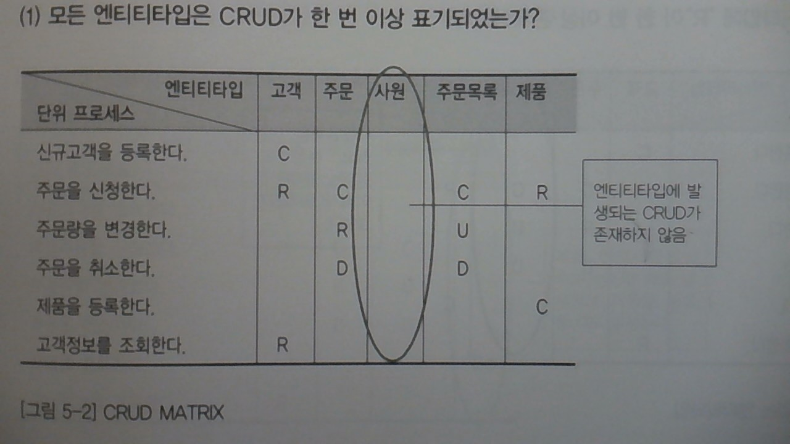

시험
====

-	다음주
-	배운데까지
-	과제 팀 알려주세요

3장. 실전 데이터 모델링 이슈 (...여기었)
========================================

3) 엔티티 타입의 통합
---------------------

### 엔티티 타입을 통합하는 목적

### 엔티티타입 통합시 문제점

### 엔티티타입을 통합하는 순서

#### (1) PK가 동일한 엔티티타입이다

#### (3) PK가, 일치하지는 않지만 도메인이 비슷하다

-	뭐냐 이거.
	-	PK : 불일치, but 도메인 비슷
	-	엔티티타입의 속성이 비슷
	-	→ 하나로 합침

작업요청 + 작업완료 → 작업관리

-	책의 맹점 : 요청과 완료를 관리에서 구분 불가 → 별도의 칼럼이 있어야...

#### (2) PK가 꼭 일치하지는 않지만 성격이 비슷하다

-	뭐냐 이거.
	-	PK : 일치 X
	-	엔티티타입의 _성격_이 비슷
	-	통합해도 나머지 PK가 Alternative Key가 될 수 있다 (AK)
	-	→ 하나로 통합

고객 + 할인대상고객 + 특별고객 → 고객

#### 엔티티타입 통합의 GuideLine

-	논리설계와 물리설계
	-	ER 모델링을 할 때에는 각각의 특색에 집중해서 명료하게 개발하기.
	-	물리 설계시에는 필요하다면 적극적으로 통합해야.
	-	→ "논리설계 → 물리설계"
	-	예 : 작업요청 + 작업완료 → 작업관리
		-	작업관리 테이블 만으로 요청 / 완료를 구분할 수 있을까
		-	양이 많지 않다면... → 경우에 따라 통합할수도.
-	통합의 첫 번째 기준은 트랜젝션이 통합하여 발생되는지, 분리되어 발생하는지에 대한 사전 조사 필요
	-	데이터양, 트랜젝션양이 많지 않으면 → 통합 유도

4) 코드 엔티티타입 설계 방법
----------------------------

### 코드화

-	코드와 번호는 구분하자
	-	번호 : 유일하게 식별
	-	코드 : 구분하는데 사용 : 체계적으로 구분해 운영할 필요가 있을 때
		-	구분하는데 용이하도록
	-	ex)
		-	부서의 이름만 자주 바뀌는 경우 : 이름 대신 부서 코드를.
-	코드 데이터 형식
	-	한 코드에 대해 한 가지 코드값이 반복
		-	코드의 명칭만 있다
		-	신청자구분 (코드 | 코드명)
	-	한 코드에 여러개의 속성이 반복
		-	코드의 설명이 있다
		-	부서 (부서코드 | 부서명, 부서역할, 부서위치, 부서장)

### 데이터 모델링 방법

#### 코드값 하나가 반복적으로 나타날 경우

-	→ 재모델
-	ex) 접수 엔티티타입과 관련 :
	-	신청자구분, 접수구분, 접수방법

---

1.	코드 구분에 대해 먼저 설계
	-	ex) 3개를 코드 (코드 / 코드구붐녕) / 상세코드 (코드 / 코드명) 의 2단계로 설계.
2.	상세 코드와 코드값을 조사
	-	각각의 값에 대해...
3.	엔티티타입을 설계
	-	코드구분 (코드구분 | 코드구분명, 코드규칙명) -|-----0|<- 상세코드 (코드구분 (FK), 코드 | 코드명, 코드규칙)
4.	(코드에 별도 제약이 있을 경우를 가정하여 설계)(Optional)

#### 한 가지 코드에 대해 여러개의 속성이 포함되어 나타나는 경우

-	......
-	.....
-	...스킵

5) 도미노 속성에 대한
---------------------

6) 메시지 엔티티 타입 설계
--------------------------

7) 이력 엔티티타입 설계 방법
----------------------------

-	변경사항 기록하기 (중요 업무의 경우에)

### 이력 데이터 발생의 세 가지 유형

-	변경이력
	-	주문 변경, 계약 변경
-	발생이력
	-	급여계산, 요금청구
-	진행이력
	-	공사진행, 접수진행

### 이력 데이터의 데이터 모델링 방법

-	요렇게.
-	교수님 마음에 안 듦 : 변경일자가 PK (웃음) → 변경순차번호...
	-	하루에 한 번만 바꿀 셈이냐!
-	잠깐 잡담.
	-	> 회사에 신뢰가 안 갈 때 : 급여사항의 변경이 있을 때. 실수로 더 줬어! 반납해! 등
-	업무가 융퉁성 있을 수 있도록...

### 진행 이력 모델링 시 주의사항

-	_종료일자_가 필요하다는 걸 잊지 않기
-	종료일자가 없는 경우 SQL도 복잡해진다

### 변경 이력 : 최신 변경에 대한 자료 조회가 많은 경우

-	하나의 주문사항에 대해 변경 이력이 여럿 발생하면.
-	최종적으로 변경한 값이 무엇인지 확인하려면.
	-	번호나 변경일자로 별도로 찾아야.
	-	→ group by 등으로 부담?!
-	→ 하나 더 주기 : **최신여부** 칼럼
	-	다만 변경이력을 삽입할 때 최신여부였던 걸 찾아서 제거해주는 부담이...

---

휴식

---

4장. 프로세스 모델링
====================

-	프로세스 모델링 : 위에 돌아가는 프로그램들, 어떻게 돌아갈 것인가
-	업무가 어떻게 돌아가야 하는가
-	상관모델링 : 서로의 상관관계 체크 : 어떤 데이터가 어떤 데이터를 접근하는가

What the heck of it?!
---------------------

> 정보 시스템을 구축하기 위해 해당 업무에 어떤 프로세스가 존재하는지 또는 업무 처리에 필요한 프로세스는 무엇인지 분석하는 방법

업무 기능 vs 업무 프로세스
--------------------------

-	업무 기능
	-	기업의 임무를 상위 차원에서 조명
	-	기업 조직에서의 주요 업무를 구분을 해놨다. 정도로
		-	ex) 영업, 회계, 제조 등 5개 ~ 10개 정도의 업무로.
-	업무 프로세스
	-	입력과 출력이 존재하는 업무 기능
	-	ex) **접수하다** 를 위해 ...
	-	접수라는 행위 → 접수정보 → 접수 엔티티타입에 접수정보 생성 → 접수 업무 프로세스다!

1) 업무 기능 분해
-----------------

### 업무 기능 분해

-	기업의 업무를 정보시스템이 구축할 수 있는 단위로 분해하는 것.
-	단위 프로세스로.

#### 단위 프로세스

-	정의
	-	실제 어플리케이션 차원의 구현단위
	-	DB에 영향을 미치는 **가장 작은 단위**
	-	단위 프로세스 도출의 최저 단위 → 트랜젝션을 보장하기 위한 단위
		-	누군가가 여기에서 저기까지 트랜젝션임을 정의해줘야 함
		-	→ 일종의 시방서로 취급.
-	특징
	-	실행될 경우 → 완전하고 의미있는 결과 나와야
	-	하나 이상의 응답이 있어야
	-	반드시 데이터와 연관되어 수행되어야

### 업무 기능 분해의 방식

-	여러가지
	-	업무 구체화, 생명주기 등
-	업무 구체화
	-	구체적으로.
		-	공사 관리 → (아파트 공사, 도로 공사, 하수도 공사)
		-	보험사고 관리 → (자동차사고처리, 화재사고처리, 질병사고처리)
	-	구체화된 경우 패턴 자체는 비슷하다. but... 각각이 접근해야할 데이터가 다를 수 있다
	-	*구체적인 업무는 무엇일까*
-	업무 생명 주기에 맞춰서
	-	제품관리 → (제품기획 → 제품연구계발 → 제품생산 → 제품의 분배 → 제품판매)
-	엔티티의 상태 변화로...
	-	수강 신청 → (수강신청 / 수강연기 / 수강취소 / 수강확정)
-	상황 대응
	-	보험금 지급 → (신청 접수 → 자격여부 판단 → 보험급 지급)

2) 단위 프로세스의 도출
-----------------------

### (1) 업무 데이터 무결성 : 완전하고 의미있는 결과가 나와야 한다

-	총무과에 학기 실습장비 신청에 대한 이야기.
	-	구매신청 : 구매 (구매신청 접수) → 구매목록 ( 구매목록 작성)
	-	→ 각각이 업무 프로세스...... 면 곤란
	-	ex) 출금과 입금이 별도의 프로세스인 경우?
	-	구매 신청해놨는데 목록이 없다던가. → 과도하게 분리된 경우...
-	→ 구매 + 구매목록 하는 걸 하나의 단위 프로세스로 도출해야.
-	둘 중 하나만 완료하고 커밋하면, All-or-nothing이 되지 않음.
-	→ 의미가 완전하게.

### ...

-	이런 것이다 까지만 이해하기.
-	→ 이런 일들은... ... 주로... 금융공학 / 산업공학 에서.
-	읽어보세요.

5장 상관모델링
==============

-	CRUD.
-	의미
	-	정보시스템 구축 목적 → 업무에 존재하는 정보 → 어떤 일들이 행해지는지 / 어떤 일에 의해 → 어떤 정보자원이, 어떤 영향을 받는지?
-	→ CRUD 매트릭스를 만들자

1) CRUD 매트릭스 상관 모델링
----------------------------

-	CRUD : Create, Read, Update, Delete
-	단위 프로세스가 → 엔티티 타입에 : 어떤 일을 하는지 기술
-	프로세스 / 엔티티타입 두 축. 각각의 관점에서 볼 수 있음
-	잘 정리된 표 : 여러 군데에서 쓰임~
	-	뒷단의 개발자들에게 좋은 정보가 됨.

### 점검 (1) : 엔티티타입에 CURD가 아무것도 없다?!

-	두 가지 의심
	-	엔티티타입을 괜히 도출했다
	-	단위 프로세스를 덜 뽑았다

### 점검 (2) : CREATE가 없어?! (엔티티 타입)

-	괜히 나오지는 않았을거다
	-	단위 프로세스 도출이 덜 되었구나

### 점검 (3) : READ가 없다면 (엔티티 타입)

-	단위 프로세스 도출이 덜 되었구나
-	delete, update가 없는 엔티티는 있을 수 있음 (READ-ONLY)

### 점검 (4) : 단위 프로세스에 CRUD가 아무것도 없다?!

-	의심 : 괜히 나온 단위 프로세스?
-	사실 너무 많다보니... → 주제가 너무 많아서 나눠서 CRUD를 만들수도 : 전체 다이어그램에서 있는지 여부가 중요
	-	일단 나왔다 : 의미가 있을것이다 : 다른 subject area에 있는지 한 번은 확인하고 지울 것. 무조건 지우지 말고...

### 점검 (5) : 엔티티타입 하나를 생성하는 프로세스가 두 개 이상?!

-	꼭 틀렸다고 할 수는 없다
-	→ 점검의 대상

### 권장사항 : 칼럼에 대한 CRUD도 만들기

-	속성 단위까지는... 좀... 고생이.. 양이...
-	→ 개고생. 그래서 그냥 권장사항
-	잡담
	-	유지보수 담당자는 1년 파견.
	-	그 뒤로는 운영자들.

---

시험
====

-	담주 금요일 이시간.
-	범위 : 5장까지
-	문제 :
	-	저자가 글 솜씨가 딸려서...
	-	꾹 참고 읽어보세요
-	문제 :
	-	객관식
		-	생각외로 점수가 잘 안 나오더라
		-	→ 마이너스 점수를 넣으니 점수가 좋지가 않아
		-	OS도 좀
	-	주관식 (설명하라)(는 문제가 좀 있을 거 같음)
		-	도 좀 넣음
	-	시나리오
		-	ER 다이어그램 그려보기 : 20~30분 정도 걸리는 거.
