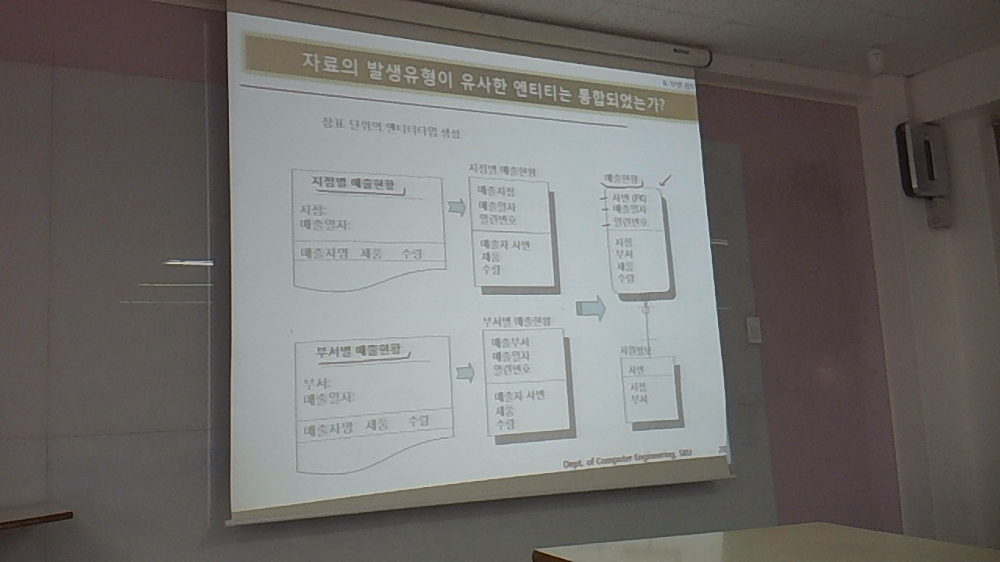

시험문제 해답
=============

1.	엔티타입의 특징으로 적절하지 않은 것
	-	업무프로세스와 독립적으로 존재하면 안 됨
2.	행위엔티티타입의 특징 중 적절하지 않은 것을 선택하시오
	-	기본 엔티티 타입과 다르게 도출하기 어렵다
3.	엔티티타입의 이름에 복수형 쓰지 마세요
4.	파생속성의 특징으로 적절하지 않은 것
	-	신중하게 도출
	-	계산되어 생성됨.
5.	주식별자의 특징
	-	갯수 왠만하면 줄이기
6.	엔티티타입의 선정
	-	장표 보고 현혹되세요?
7.	업무 현장 직접 방문
	-	자제하기? → 최대한 듣기, 선입견 없애기
8.	적절한 관계 도출
	-	관계는 주식별자 도출 후.
	-	장표 등에 자세히 나오지는 않는다.
	-	현업 담당자의 말을 잘 들어라. 리드하지 마라.
	-	관계 자체도 시간이 지나면서 언제든지 다시 바꿀 수 있다.
	-	엔티티타입 통합 결과에 대한 설명 중..
		-	미리 Join해놓은 것 : 부담 줄이기
		-	속성단위 제약이 힘들어질수도.
		-	체크해야할 조건이 증가할수도
9.	다대다 의 해소
	-	중간에 관계용 엔티티를 만든다
	-	M:N → 1:M N:1 에서, 1 쪽은 optional이 될 수 있을리가 없잖아
10.	정규화
	-	사실의 형태 = 함수적 종속적
		-	보이스 코드 노말 폼?
		-	하나의 테이블에는 하나의 결정자만 있어야 한다
11.	ERD 예제의 적절하지 않은 것 -
	-	제품 -|---0|<- 주문상세 → 주문상세는 모든 제품들의 제품번호를 가지고 있...지는 않다
12.	업무기능분해
	-	정보시스템 전체의 구현 목적 파악 = 제일 처음에 하는 일
13.	ERD 슈퍼타입 서브타입의 부적절한 2가지 (exclusive)
	-	직원 엔티티타입이 구분자 속성을 가질 경우 매우 편리하다
14.	주문 엔티티타입의 변경이력의 리모델링
	-	유연하지 않은 부분 : 변경일자는 하루에 한 번만.
	-	→ 순차번호를 추가, 일자를 내린다
	-	최종 여부
15.	사원 엔티티타입의 분해. 많은 자격증을 가질 수 있도록
	-	(사원번호, 자격증번호 | 자격증명)
	-	1차 정규화?
16.	예쁘게 시나리오를 그리세요
	-	수강 M:N 엔티티가 있는가 여부가 중요
	-	헌혹용 멘트? 들도 있으니 주의.

---

우리 ERWin 쓴데요! (90일 평가판)

---

(1) 모델 검토
=============

> 모델이 시스템의 업무적 요건을 적절히 반영되어있는지, 그리고 모델링의 일반적인 규칙을 준수하고 있는지를 검토하는 절차

-	누가 수행?
	-	모델링한 모델러
		-	작은 규모인 경우
	-	시스템 통합팀 / 품질보증팀
		-	큰 회사의 경우 : 전담팀이 따로 있다 (경험이 많음)
		-	→ 객관적으로 지적하기가 어렵다
	-	외부 감리
		-	외부 감리를 전담으로 하는 회사들도 있다.
		-	완전히 새로운 업무를 이해해야 하므로 어려운 부분이 있지만, 객관적으로 볼 수 있는 장점이 있음.
		-	교수님 : 결국은 감리도 을...이다
-	검토할 것들
	-	업무적 측면에서
		-	업무적 요건
		-	(누가 하는지)
		-	업무적 요건 충족을 주로 검토 → 요구사항 정의서, 업무기능 분해도, CRUD Matrix 같은 *분석 단계 산출물*을 사용
	-	모델 규약 측면에서의 검토
		-	데이터 모델링이 갖추어야 할 일반적인 규약 준수?
			-	M:N 등
		-	누가 : 품질보증팀, 제 3의 독립된 조직의 주관 하에.
		-	무엇으로 : 케이스툴(Case Tool)의 검증 기능이나 검토와 관련된 기타 도구
		-	검토 예
			-	속성 중복 : 다른 타입 / 크기, CONSTRAINT 를 가지는 중복된 속성?
				-	같은 건데 데이터타입이 같지 않다던가?
			-	엔티티 간의 관계가 M:N인거?
			-	이름?

① 엔티티타입 검토
-----------------

-	일종의 체크포인트들
	-	P.Key → 유일성?
	-	P.Key → 효율적?
	-	자료 발생유형이 유사 → 엔티티 통합 됨?
	-	병합 / 분리할 엔티티 타입?
	-	추가적으로 도출 / 불필요한 엔티티타입?
	-	주변 여러 엔티티타입의 공통 엔티티타입이면 어디가 원천인지 추적 가능?
	-	PK 순서는 성능 고려?

### 1) 선정된 P.Key가 업무적으로 발생하는 자료의 유일성을 보장하는가?

```
보험계약번경 (보험계약번호, 계약변경일자 | ~~)
↓
보험계약변경 (보험계약번호, 계약변경일자, 계약순번 | ~~)
```

-	모델러도, 현업 대상자도 점점 더 이해한다

### 2) 선정된 P.Key는 효율적인 모양?

```
사원 (사원명, 생년월일, 성별 ) -<-
↓
사원 (사원번호) -<-
```

-	여러개의 부모 엔티티 주제에 P.Key인 칼럼이 너무 많다! → 인공 속성?을 만든다

### 3) 자료의 발생유형이 유사한 엔티티는 통합되었는가?



-	두 개 결국 일치하는데, 따로 엔티티를 만들었다면.


-	통계성 있는... 데이터... → 제품별, 부서별, 분기별 *매출*
-	뽑아나와야 할 데이터를 별도의 엔티티타입으로 만들어놨다 : 정보시스템 자체가 융퉁성이 없다.

### 4) 병합 또는 분리되어야 할 엔티티타입은 존재하는가

```
보험금심의확정 → 보험금심의, 보험금확정
```

-	연속적인 업무절차를 가지는 엔티티타입들을 괜히 병합해둔 경우... ← 대부분이 부적절 (심의 및 확정)

```
매출전표 + 매입전표 → 전표
```

-	완전 대칭적인 업무를 가지는 엔티티타입을 왜 분리하셨어요?
-	반드시 이런 건 아니지만. 양쪽 다 고려해봐야

### 5) 엔티티타입이 추가적으로 도출되는 경우

-	분석하다 M:N이 나왔어요
-	엔티티타입을 1, 2, 3차 정규화 하는 도중에 분리
-	단위시스템간의 모델링을 통합하는 과정에서
	-	시스템간 연계 엔티티타입을 놓쳤다!
	-	유사한게 있었다!
-	(놓침...)
-	통계 목적
-	검증하고보니 필요없는 엔티티였어 → 제거

---

#### ① 단위 시스템 간에 중복된 엔티티타입 발생

| 시스템     | 엔티티타입명 | 엔티티타입명 | ... |
|------------|--------------|--------------|-----|
| 영업시스템 | 제품         | 거래처       | ... |
| 회계시스템 | 거래처       | 물품         | ... |

-	제품 ↔ 물품
-	거래처 ↔ 거래처

#### ② M:N

```
제품 ->|0 ---- |<- 공급자

↓

제품 -|- ---- 0|<- 공급자제품 ->|0 ---- -|- 공급자

                  현재가
                  수량
                  단위
                   ↑
                 없었다!
```

-	~~어차피 만들어야되는 거니 미리 준비~~
-	명시적으로 의미를 부여함
-	이렇게 해서 관계만의 속성이 보이는 경우도 있음!
-	M:N이 싫은데요?
	-	데이터 융퉁성 확보를 위해 많이 만들수밖에 없어요...

#### ③ 1,2,3차 정규화가 미흡하여 추가적인 엔티티타입이 도출되지 않음

##### 1차 정규화 →


-	중복된 값의 분리
	-	(복수의 속성값을 갖는 속성의 분리)
-	우리학교에도 많음. 쎄고 쎄... 이게 무ㅓ야

##### 2차 정규화 →


-	어째 하나의 엔티티에 두 개나 있다?
-	하나의 엔티티에 **부분종속** 되어있는 경우
	-	(주식별자에 종속적이지 않은 속성 분리) (**주식별자를 구성하는** 일부 속성에 영향)
-	주요? 결정자를 냅두고 다른 걸 뺀다. 뺀 아이에는 (FK) 붙임, 종속자가 빠짐.
	-	결과 : 각각 결정자가 하나씩만.
-	정규화 : 하나에 한 가지 사실만 담도록

##### 3차 정규화 →


-	속성에 의해 종속되는 속성...
	-	(속성에 종속적인 속성 분리)
-	1:1 뿐만 아니라 1:N도 가능하다.

#### ④ 자료 원천이 어느 엔티티타입인지 추적 가능?

> 엔티티타입이 주변 여러 엔티티타입의 공통 엔티티타입인 경우, 자료 원천이 어느 엔티티타입인지 추적할 수 있는가?


-	하지 않으면 하위 엔티티를 다 뒤져야됨. → 오래걸린다...
-	약성 개체를 기억하시는지 : 걸려있는 개체를 말하는 듯
	-	부양가족 : 사원번호, 가족구분
-	테이블을 따로따로 만들거에요? 어떻게 만들거에요? 이런 것도 결정해야 한다.

#### ⑤ PK의 순서는 시스템의 성능을 고려하여, 적절한 순서로 정의되어 있는가?

```
인사정보 (사번) -|- ---- 0|<- 급여이력 (지급년월, 사번 (FK))

                                              ↓

인사정보 (사번) -|- ---- 0|<- 급여이력 (사번 (FK), 지급년월)
```

-	사실 순서는 없지만. 뭐가 먼저일지.
	-	P.Key는 기본적으로 인덱스 생성 : B+ Tree 인덱스
	-	둘을 Join 하려는데... index - index 비교 vs index - non-index 비교
	-	→ 기본 : 가장 앞의 칼럼이 인덱스!
-	상속받은 칼럼을 제일 앞에 적기

---

```
사원정보
-------
사원구분
사번

↓

사원정보
-------
사번
사원구분
```


-	분산도가 높은 놈을 앞쪽에 두자 : index

---

```
인사정보 -|- 0|<- 발령 (발령년월, 사번(FK))
                          ↓
인사정보 -|- 0|<- 발령 (사번(FK), 발령년월)
```

-	범위 검색을 하는 경우
	-	→ 양이 많다!
	-	→ 좀 먼저 걸러줘! (첫번째에 적지 않기...)
-	앞에서 가져오는 갯수가 적을 수 있도록.
-	11주차 : 앞에 나와서 발표?
-	12주차 ~ 14주차 : 제출, 고치고, 제출, 고치고, ...
-	시험
-	15주차 : 최종 제출 (4가지정도 정의서)
