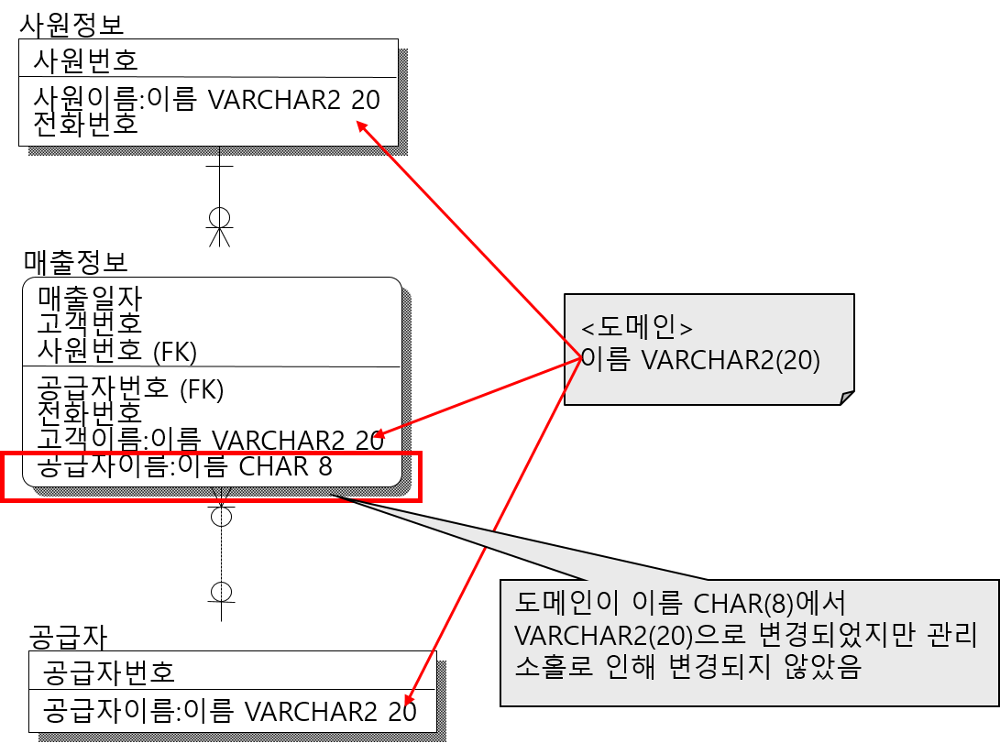

책 위주로 했었음.

-	지우는 동작에 대해...
	-	RESTRICT : 삭제하다가 중간에 그만
	-	NO ACTION : 삭제하다가 중간에 되돌리기? ← 기본
	-	→ 많은 DB 모델러에서 구분하지 않음
	-	none : 암것도 안 함

---

이미지 자료의 저작권은 출판사 및 저자, 수정을 가하셨을지도 모르는 교수님 등 적법한 자에게 있음.

데이터베이스 설계와 구축 개정판, 이춘식, 한빛미디어

---

6장. 모델 검토
==============

② 속성 검토
-----------

-	속성
	1.	정규화 (PK 빼고 전체 ERD에 안 중복)
	2.	반정규화 (성능 고려)
		-	파생속성 : 속성, 합계, 수량 등
		-	기타 시스템 관리 속성

### 살펴볼 사항들

-	1) 반정규화된 속성은 식별되는가
-	2) 반정규화는 시스템의 복잡도와 성능을 고려하여 적절하게 이루어졌는가
-	3) 명칭이 같은 속성의 타입과 크기는 동일한가
-	4) 내부적인 속성을 가지고 있는 속성은 없는가
-	5) 병합되어야 할 속성은 없는가
-	6) 전후 레코드간 영향을 미칠 수 있는 속성은 없는가
-	7) 감사, 통계 등을 고려하여 속성이 정의되었는가

### 정규화와 반정규화

-	정규화의 기본
	-	한 가지 사실은 한 곳에만 저장한다 (정규화로부터 시작하라)
	-	끝 = Boyce-codd normal form
-	역 / 반정규화
	-	정규화 후 다시 합치는 것
	-	꼭 쪼갰던 걸 다시 합치는 건 아님.
		-	자주 쓰이는걸 역정규화의 대상으로

### 1) 반정규화된 속성 식별가능?

-	무엇이 반정규화 속성인지 알아볼 수 있어야
	-	대규모 / 인수인계 등...

#### 주료 오류 유형 사례

##### (1) 반정규화 속성 : 실제로는 의미가 다르지만 이름이 같은 경우

-	Join 등의 목적으로 관계 엔티티에 칼럼을 역정규화 (복사) 해놨더니...
	-	전화번호(고객), 전화번호(사원정보), 전화번호(????)

### 2) 반정규화 적절? (시스템 복잡도, 성능)

-	반정규화 : 속도 목적, 여기저기에 칼럼 복붙
-	단점
	-	수정시 부하 발생 (여기저기도 다 갱신해야)
	-	잘못했다 무결성 깨짐 (실수로 수정 프로세스 빼먹으면)

#### 주요 오류 유형 사례

##### (1) 시스템 특성에 따르지 않은 과도한 반정규화

-	이력 엔티티타입 : 대체로 정보의 고정 시점이 있다 → 반정규화 GOOD
-	But 여기서 : 고정되는 부분이 (확정 이력이) 동일 → 부하가 배로 발생
	-	최초 하나만 역정규화하자....

##### (2) 역정규화 안해서 시스템 성능 ↓

-	계열사별 고객 ← + 행정동 (고객정보 에서)
-	계열사별 고객을 행정동 기준으로 검색하는데, 계열사별 고객이 엄청 많다면.

> 고객 정보 수는 천만건이 넘음, 행정동은 인덱스. 특정 계열사의 행정동별 우수 고객을 검색할때... 고객정보(행정동) 인덱스 → 고객번호(고객) → 고객번호(계열사별 고객) → 우수고객여부(계열사별 고객) ... 4차씩이나!

### 3) 이름같은 속성 → 타입과 크기 동일?

-	문제점
	-	자료의 무결성이 깨질 수 있음
	-	SQL 조인 시 연결고리 → 검색 조건에서 있는데 못찾을수도 있음

#### 주요 오류 유형 사례

##### (1) 크기의 불일치

-	사원정보의 사원명 = 10byte / 급여이력의 사원명 = 8byte
	-	사원정보 (읽음) → 급여이력 (씀) : 손실가능

##### (2) 타입의 불일치

### 4) 내부적인 속성을 갖는 속성

-	두 가지
	-	초기부터 내부적인 속성
		-	전화번호 (지역번호 + 국번호 + 일련번호)
		-	성명 (성 + 이름)
		-	주민번호 (생년월일 + 일련번호)
	-	필요에 따라 조합 (시스템, 업무상)
		-	문서번호 (문서발생부서 + 문서유형 + 날짜 + 일련번호)

#### 주요 오류 유형 사례

##### (1) 병합된 속성만 관리

-	내부 속성도 중요한 경우.

### 5) 병합되어야 할 속성? : 과도하게 쪼갠 경우

-	분리하거나, 합치거나. 필요에 따라. (위에도 적혀있음)

#### 주요 오류 유형 사례

##### (1) 범위조회가 많음 : 날짜 등

-	범위조회 : 값 자체가 범위가 되게 합친다 (나누면 더 힘듦)

### 6) 전후 레코드간 영향을 미칠 수 있는 속성은 없는가

-	파생 속성 중 : 누적값을 계산하는 경우 등

#### 주요 오류 유형 사례

##### (1) 이력 엔티티타입 (변경가능) 에 누적 정보 (합산 등) 가 관리되는 경우

-	이력에서 누적 정보를 상위로 뺀다

### 7) 감사, 통계 등을 고려하여 속성이 정의되었는가

-	말 그대로 전산화만 하지 말고 통계 등도 고려합시다

#### 주요 오류 유형 사례

##### (1) 코드화할 수 있으나 텍스트로 정의된 속성

-	자격증명
	-	ORACLE ADMI
	-	오라클 Admin (ORACLE)
	-	oracle admin.
	-	Oracle Administrator
-	좀 합치세요
	-	자격증명 → 자격증 코드

③ 관계 검토
-----------

-	관계 = 엔티티타입간 업무적 관계 정의
-	검증할 부분
	-	1) M:N 속성 → SQL로 못 만드니까 봐야됨
	-	2) 관계가 업무적 흐름과 규약과 일치하는지
	-	3) 업무적 흐름에 있는데 도출 안 한게 있는가
	-	4) 관계 표현이 적절한 수준인가

### 1) M:N 속성 → SQL로 못 만드니까

-	M:N인데 해결을 볼 수 없는 경우 (업무에는 없는데 새로운 시스템에서 M:N이 요구됨)

#### 주요 오류 유형 사례

##### (1) M:N : 새로운 부모 엔티티타입으로 잇는다

(그림 없음)

##### (2) M:N : 둘 중 하나를 All or Nothing 으로

-	결국 좀 더 단순하게 해결을 보려는 경우

##### (3) M:N : 자식 엔티티타입 만들기, 연결 (일반적)

### 2) 관계가 업무적 흐름과 규약과 일치하는지

-	두 종류의 관계
	-	정상 : 한 쪽이 필수인 관계 (Mandatory)
	-	비정상 : 둘 다 optional 인 경우 (필요할수도 있음, insert 등의 타이밍 문제)

#### 주요 오류 유형 사례

##### (1) FK 속성 생성이 자신보다 늦는데 Optional 이 아닌 경우

### 3) 업무적 흐름에 있는데 도출 안 한게 있는가

-	명확히 정의 안 되서 엔티티타입만 도출하고 관계는 나중에
-	단위시스템간 연계가... 안 정의...

#### 주요 오류 유형 사례

##### (1) 담당자 업무 협의 부족 → 단위시스템간 연계 엔티티타입 관계 미도출...

-	예 (각 시스템을 오가는 정보들)
	-	회계 시스템의 전표 정보 (여러가지)
	-	구매 자산이 창고로 입고되는 정보
	-	자산 이동 정보
	-	(인사 시스템의) 사원 및 부서 정보 ← 일반적으로 이용됨

### 4) 관계 표현이 적절한 수준인가

-	관계 표현은 어디까지가 적절한가

#### 주요 오류 유형 사례

##### (1) 코드 및 통계 엔티티타입과의 관계 연결

-	→ 연결은 되어있지만 표시는 안 한다 (엄청 많아 ㅠㅠ)

##### (2) PK를 여러단계로 상속받았는데 조상과 연결된 경우

④ 도메인 검토
-------------

-	볼 것
	-	도메인 정의가 적절한가, 관리는 잘 되는가
	-	도메인 변경에 따라 속성이 바뀌는가

### 도메인 정의가 적절한가, 관리는 잘 되는가

-	도메인 생성하는 기준
	-	업무적으로 동일한 정보속성이어야
	-	아니면 정말 일반적인 속성이어야
	-	→ 개념적으로 하나여야

#### 주요 오류 유형 사례

##### (1) 논리적 개연성 없이 데이터 타입하고 크기만 보고 하나로 정의한 도메인

-	도메인은 동일한 의미로 정의되어야

### 도메인 변경에 따라 속성이 변경되는가

#### 주요 오류 유형 사례

##### (1) 복잡한 데이터 모델에서 도메인 관리 소홀

-	속성 역정규화를 많이했는데 역정규화된 모든 속성에 반영하지 못한 경우
