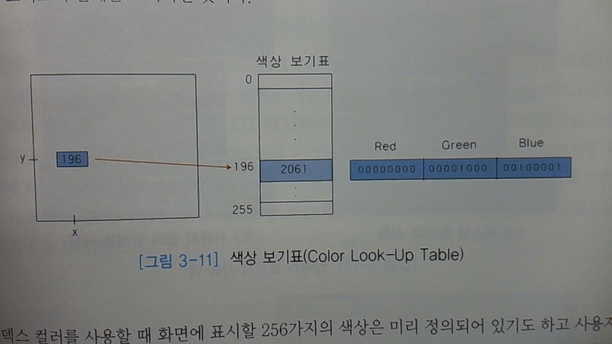
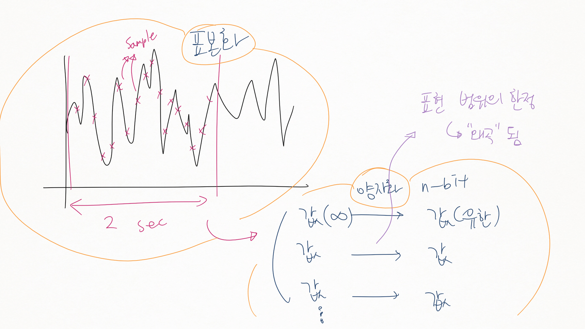

멀티미디어 4강
==============

-	거하게 지각. :)

### 2.4.3 압축 및 저장에 관한 표준

-	압축
	-	무손실 압축 (LossLess Compression) (→ 압축 비율이 낮음) : 원레 데이터 → 압축된 데이터 → (복원) = 원래 데이터
	-	　손실 압축 (Lossy　　Compression) (→ 압축 비율이 높음) : 원레 데이터 → 압축된 데이터 → (복원) != 원래 데이터
-	정지화상 (Still Image)
	-	JPEG (Joint Photographic Experts Group)
	-	PNG
	-	GIF : 회사에서 만듦 : 특허 문제
-	동영상
	-	MPEG : 1, 2, 4, 7, 21 정도만 있다고 봐야.
		-	1 : CD-ROM 품질 : Read-only → 재생시 쓸 수 없다 : 특징 → 쓰는 데 시간제약이 없음 / 읽는데 실시간 요구 (재생)
		-	2 : 화질이 좋아지면서 디지털 TV : 특징 → 읽기 쓰기 모두 실시간 요구
		-	1, 2, 4, 7, 21 방식이 다 다르다
		-	4 : 객체 기반 : 보안 업체에서 사용 : 영상 → 어... 이 제품 뭐야?!
		-	7 : 내용 기반 정보**검색** : 소녀시대 누구가 좋아하는 뭐는 뭐에요? 를 검색 : 동영상도 검색할 수 있도록 (Text, 영상, 오디오)
		-	4, 7 은 세계 IT 업체들이 돈 벌려고 눈 새빨개.. (표현봐...)
		-	21 : 전자상거래 요소 기술
			-	전자상거래 (e-commerce)
	-	기타 동영상 형식
		-	AVI : Audio Video Interleaved
		-	MOV : Apple QuickTime
		-	WMF : Windows Meta File
-	사운드
	-	MP3, WAV, AIFF, AU 등
		-	MP3 : 동영상 압축 표준 개발하다가 소리 표준 만듦 (필요하니까) : MPGE-1 Audio Layer 3)
		-	AIFF (Audio Interchange File Format)
			-	Apple의 `*.wav` 같은 것. (`*.ief`\)
		-	AU (Audio)
			-	Unix 표준 오디오 파일
			-	Java 프로그램에서 Audio 로 쓰기도 함.
	-	MIDI (Musical Instrument Digital Interface)
		-	디지털 악기 간의 인터페이스, 통신 프로토콜, ...
		-	개발 : 디지털 악기 제조업체 및 관련 산업체들의 *컨소시엄* 에서.

### 2.4.4 문서관련표준

-	SGML (Standard Generalized Markup Language)
	-	전자문서 표준
	-	구성 : 문자 종류 선언 / DTD (Document Type Definition) / 실제 문서 (Document Instance)
	-	HTML의 선조격? 발전하여 HTML이 됨?
-	HTML
	-	웹 상에서 이용되는 **하이퍼미디어** 문서를 기술하는 방식
	-	내용 기술시 SGML 사용
	-	(git 신경쓰는 사이에 진도나감...)
-	XML (eXtensible Markup Language)
	-	SGML이 어려움 → 많이 축소시킴
-	오피스 문서 표준
	-	ODF, OOXML

### 2.4.5 그래픽 관련 표준

1.	그래픽
	-	2차원, 3차원 물체를 묘사하고 저장하기 위한 그래픽 API (Application Program Interface) 를 규정
	-	OS 내부를 공개하지 않는데 어떻게 프로그램을 작성할까 → API (기능 인터페이스) 제공 : 이 기능 쓰려면 이걸 써 의 약속. : 소스를 공개할수는 없으니.
		-	OS는 많은 사람이 써야 빛나는 것.
		-	개발자를 위한 약속.
	-	OpenGL
		-	그래픽 API 중 대표적인 것.
		-	Silicon Graphics 사가 만든 2D / 3D 그래픽 표준 API 산업체 표준.
		-	컴퓨터 플랫폼, 운영체제에 독립적 API
			-	→ 널리 쓰인다
		-	함수가 250개 가량 : 단순 도형부터 복잡한 3차원 장면까지 생성가능
		-	활용 : (이걸 굳이 쓸 의미가 있나?) : 컴퓨터 게임, CAD (Computer Aided Design), 가상현실, 정보시각화, 비행 시뮬레이션 등 분야에서 사용
		-	표준화 관여자들 (기능 향상자들) : SIG, IBM, Intel, Microsoft 등
		-	M＄ Direct3D와 함께 시장 양분
		-	체스 그림... 잡담 : IBM의 AIP 컴퓨터 *Deep-Blue*
2.	VRML / X3D 표준
	-	가상현실
		-	현실세계와 같은 느낌이 나도록 조성한 가상의 환경 (컴퓨터로 조성) (Virtual Environment)
		-	세컨드 라이프에 대한 잡담.
	-	VRML (Virtual Reality Modeling Language)
		-	3차언 사이버스페이스를 텍스트 형태로 기술하기 위한 모델링 언어
		-	다양한 사용자와 상호작용 및 Java 등의 다른 언어와 연동 가능
	-	X3D (Extensible 3D)
		-	웹 환경에서 3D 그래픽스를 위해 XML에 기반하여 VRML을 확장한 표준
			-	셰이딩 관련도 있음.
		-	차세대 개방형 표준안

2.5 미디어 플레이어와 플러그인 (Plug-in)
----------------------------------------

### 플러그인과 플레이어

-	미디어 플레이어 (Player) : 플러그인 형태로 제공 (...?)
-	플러그인 : 브라우저 확장기능 : 미디어 데이터를 처리하여 재생
	-	저장 포맷에 따라 상이한 플러그인 사용
-	종류
	-	애니메이션
		-	Flash (어도비)
	-	비디오
		-	QuickTIme Movie
		-	RealPlayer
		-	곰플레이어
	-	이미지 / 그래픽
		-	Adobe SVG Viewer
		-	Quicktime 3D
	-	사운드
		-	Winamp, RealAudio, WMP
	-	문서
		-	Adobe PDF Reader
	-	기타
		-	VRML Cosmo Player
		-	QuickTime VR 등

제 2부. 멀티미디어 데이터의 처리
================================

각 매체별로 자세한 처리기술의 개요를 배움.

제 3장. 이미지와 그래픽 기술
============================

3.1 이미지와 그래픽의 기본 개념
-------------------------------

### 이미지와 그래픽

(스윽 지나감)

### 3.1.1 픽셀의 이해

-	Pixel
	-	Picture Element 의 합성어
	-	화면 구성의 가장 기본 단위
	-	이미지 = 픽셀의 집합, Bitmap 방식으로 저장
-	색상의 수
	-	RGB 적절히 배합 : RGB 색상모델
	-	색상 수 : 픽셀당 할당된 비트(Depth)에 비례 (2^k 개)
		-	비트수와 색상
			-	1 (흑백)
			-	4 (Indexed), 8 (Indexed)
			-	16 (하이컬러 : 5:5:5)
			-	24 (트루컬러 : 8:8:8)
			-	32 (트루컬러 + 알파 (8비트))
		-	알파 채널 : RGB 외의 투명도, 색상 정보 가지지 않음
		-	문제는 돈이다 : 결국 압축해야. → 용도에 따라 또 다름.

### 3.1.2 해상도 (Resolution)

-	장치 해상도 (Device resolution : 보통 인치 단위 → Dot per inch (dpi))
-	이미지 해상도 (Image resolution)

### 3.1.3 이미지와 래스터 vs 벡터 그래픽

-	래스터(Raster) 그래픽
	-	픽셀 단위로 저장하는 방식 : 이미지, 정지화상
	-	화면을 확대할 때 화질 저하 : 계단 현상.
		-	재깅 (Jagging) 현상 : 낮은 해상도의 모니터에서 사선이 계단형으로 나타나는 현상, 픽셀 깊이로 보완 가능
-	벡터(Vector) 그래픽
	-	일반적으로 파일 크기가 래스터 그래픽 방식에 비해 적다
	-	확대 축소시 화질 변화가 없음

### 3.1.4 컬러 모델 (Color Model)

-	한 가지 색상모델로 색의 모든 성질을 설명 못 함 → 여러 색상 모델을 정의, 상황에 따라 사용
-	RGB, CMY, HSV
-	3차원 좌표 시스템에 대응시켜 색상을 하나의 점으로 표시

#### RGB 모델

-	가산 모델 (Additive Model)
	-	색을 더해 색상을 생성 : 흰색 (1.0, 1.0, 1.0)
-	사용처 : 빛의 성질을 이용하여 컬러 표현하는 곳
	-	CRT 모니터 등

#### CMY 모델 (Cyan, Magenta, Yellow)

-	감산 모델 (Subtractive Model)
	-	3원색 시안 (청록), 마젠타 (자홍), 노랑 = RGB의 보색
	-	물체에서 반사되어 나오는 색상이 보인다 : 빼는 방식으로 계산.
-	사용처 : 물감 등의 색상을 흡수하여 반사하지 않는 성질을 가지는 곳
	-	컬러 프린터 등
-	CMYK (Kappa) (아니까 설명 패스)

#### HSV or HSB 모델

-	인간의 직관적 시각 모델과 흡사
	-	HSV : Hue, Satuation, Value (Brightness)
		-	색상
		-	채도 : 색이 깔끔한 정도? 색의 농도?
		-	밝기
	-	육각뿔, 원뿔 모양 좌표 시스템 (RGB나 CMY와는 다름)
	-	인간은 `128(H) * 130(S) * 23(B)` = 382720 색상 구별
-	RGB, CMY, HSV 모델 사이에 변환 가능!

#### 인덱스 컬러 (Indexed Color)

-	후진 컴퓨터도 8비트 색상까지는 나타낼 수 있음
-	팔레트, 색상 보기표 / 참조표 (CLUT : Color Look-Up Table) 이용
	-	미리 정의된 색상 사용
	-	CLUT에 R,G,B 값이 있음
	-	256 → 색상도 256개
-	시스템 팔레트와 사용자 정의 팔레트
	-	색상 수 제한!
	-	시스템 팔레트 : 색상이 고루 있지만 고정되어 있음 → 덜 부드러움
	-	사용자 팔레트 : 원하는 색상 → 좀 더 부드러움

3.2 입출력장치
--------------

### 3.2.1 이미지 스캐너 (Scanner)

-	은행 (문서 보관), 도서관 등에서 사용
-	원리 : 반사되는 빛을 CCD (Charge Coupled Device) 를 통해 받아들여 빛의 양을 측정
	-	CCD 입자의 정밀도에 비례

### 3.2.2 디지털 카메라

-	잡담 : 회사의 사라짐, 합병? : 디지털 카메라의 보편화 트렌드를 예측했으면서도 안 바뀌어 망한 회사.
	-	큰 회사도 의사결정을 잘못하면... 회사가 클 수록 잘못된 의사결정의 위험이 큼. 소니, 후지쯔, ... → 결정타 : 디카
-	저장은 대부분 JPEG 방식 (용량 문제)
	-	화질을 위해 TIFF나 CCD-RAW 도 지원
		-	CCD-RAW : CCD에서 캡처한 데이터를 다른 처리 없이 그대로.
-	컴퓨터와 접속
	-	과거 : 직렬 접속 방식 (RS232)
	-	요즘 : USB / FireWire (IEEE 1394)
		-	IEEE의 읽는 방식 : I 트리플 E
-	스마트폰 등을 통해 대중화

### 3.2.3 펜 입력장치

-	마우스보다 세밀한 작업
-	용도가 있겠죠

### 3.2.4 디스플레이

-	활성화율 (Refresh Rate)
	-	화면 갱신율 (초당 화면이 디스플레이 되는 회수). Hz 단위
	-	활성화율이 낮으면 화면이 심하게 깜빡임.
		-	일반적으로 75Hz 이상이어야 깜빡임을 못 느낌, VESA 권장은 85Hz
-	CRT : 전자총에서 전자빔 발사, RGB 사용
-	LCD : 근래에 널리 쓰임
-	차세대 디스플레이
	-	OLED : 유기 발광 다이오드
	-	전자잉크(e-ink), 전자종이(e-Papaer)
		-	휘어지는 (Flexible) 두루마리 디스플레이
		-	매우 얇고 가벼우며 전력 소모가 적음

### 3.2.5 프린터

-	충격 (Impact) 방식
	-	도트 매트릭스 방식 (대표적) : 프린터 리본에 망치가 충격을 가함
	-	→ 소음 및 인쇄품질 → 멀티미디어 시스템에 부적합
-	비충격 (Non-Impact) 방식
	-	레이저 방식
	-	잉크젯 방식

3.3 이미지의 처리와 압축
------------------------

### 3.3.1 이미지의 디지털화

-	아날로그 데이터 : 컴퓨터에서 직접 활용 불가 → 디지털로 변환시켜야
-	가장 기본적인 작업 2가지 : **표본화**, **양자화**

#### 1 표본화

-	연속 미디어 데이터 : 오디오, 비디오 : 시간에 대해 연속적
	-	무한개의 데이터 → 처리할 수 없다
	-	→ 아날로그를 디지털 데이터로 바꾼다 : 무한개를 유한개로 바꾼다
-	위치를 나타내는 연속된 데이터를 일정 간격으로 나눈다
	-	이미지 : 화소 단위로 쪼개는 것
-	뽑아내는 과정을 샘플링이라고 함

#### 2 양자화

-	각 위치의 값을 근사치화시키는 과정
-	연속적인 색상의 값을 이산치 (양자화 레벨, 화소값) 로 변환
-	양자화 에러 (Quantization Error) : 양자화 레벨이 불충분할 때 잘못된 모서리가 발생 가능
	-	계단 현상
-	사람이 눈치 못 챌 정도로 깊이가 깊으면 (?) ... → 못 알아채니 No Problem!
-	상세한 내용은 각각의 포맷에 대해 배울 때.

### 3.3.2 이미지 필터링 (Filtering)

→ 다음시간?
