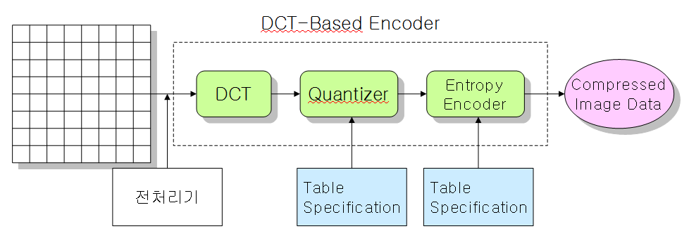
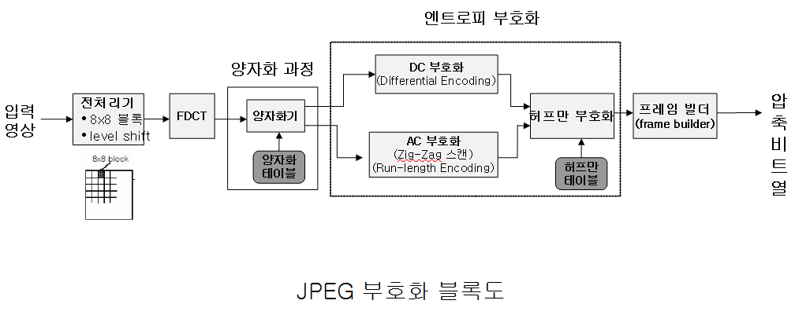
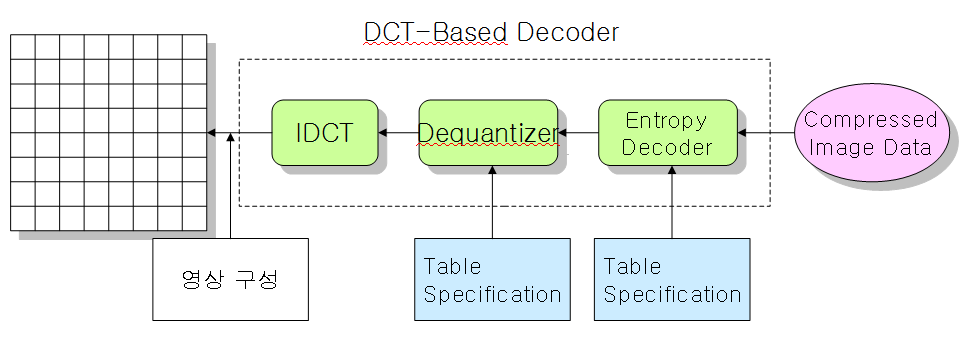

multimedia 05
=============

-	3 장 강의노트가 싹 갈림
-	복습
	-	RGB (모니터), YIQ (TV), CMYK (프린터)

3.3 이미지의 처리와 압축
------------------------

-	이후와 이어져있다
-	압축, 복원 = 결국 같은 말

### 3.3.1 이미지의 디지털화

-	아날로그 이미지
	-	표본화 → 양자화 → 코딩
	-	Sampling : 격자화
	-	Quantization : 수치화
	-	coding : 이진화, 부호화

#### 1 표본화 (Sampling)

-	데이터를 **일정 간격**으로 **나눈다**
-	이미지 : 일정 **위치** 간격
-	pixel : picture element : pel (줄여서)
-	dpi / pixel 해상도

#### 2 양자화 (Quantization)

-	연속적 값을 이산치로 변환
	-	이미지 : 각 화소의 밝기 또는 색을 숫자로 표현 (예 : 1비트, 8비트, 24비트)
		-	흑백 : 256레벨(8bit), X선 이미지는 1024레벨(10bit)
-	양자화 에러
	-	오류 : 계단화 등 → 텍스트로 치면 깨진 것 : 불충분한 양자화 단계일때

#### 3 Coding (부호화?)

-	픽셀값들의 → 압축

### 3.3.2 이미지 필터링 (Filtering)

-	이미지에 변환 → 특수효과 등
	-	편집, 복원 등 다양한 목표
-	윤곽선 추출 (Edge Detection) 필터
	-	grey 레벨이 급격하게 변하는 부분 감지 → 표시
	-	필터 : Sobel, Kirsch 알고리즘 등 사용
-	평균값 필터 (Average Filter)
	-	커널에서 평균값을 현재 픽셀값으로
	-	손으로 문지른 것처럼 흐려지는 효과
	-	잡음 감소 (Noise Reduction), 경계 흐릿하게 (Edge Blurring)
-	밝기 조절 필터 (Brightness Filter)
	-	픽셀에 곱함
-	예술적 필터 (Artistic Filter)
	-	예술적인 효과를 나타낼 수 있는 다양한 필터가 개발
-	히스토그램 평준화, 평활화 (Histogram Equalization)
	-	히스토그램 : 통계 : 각 명암값의 빈도수를 조사하여 이를 그래프의 높이로 표시한 것
	-	어두움 → 밝게, 밝음 → 어둡게 : 명암차이가 쉽게 구분
	-	명암차이를 균등하게 분포시키기

### 3.3.3 이미지의 압축

-	필요성 : 저장공간 절약, 빠른 전송
-	방법
	-	한 화소당 데이터 양 줄이기
	-	이미지를 구성하는 화소의 수를 줄이기
	-	데이터를 압축
		-	이미지 변질 최소화하며 데이터 크기 축소
		-	줄여도 눈치 잘 못 채는 부분 줄이기 (품질 저하 X) : JPEG
		-	이웃한 화소들이 같은 값을 가질 때 : GIF 압축

#### 1 GIF

Graphic Interchange format

-	GIF
	-	무손실 : 데이터를 안 까먹고 줄인다
	-	LZW (Lempel-Ziv-Welch) 알고리즘 사용
	-	수평으로 같은 색 갖는 이미지 → 압축효과 큼
-	RLE (Run Length Encoding) 알고리즘 : 무손실 압축

---

급해서 화장실

---

#### 2 JPEG (Joint Photographic Experts Group)

##### ④ DCT 변환 (Discrete Cosine Transformation)

-	2차원 평면공간의 픽셀값을 2차원의 주파수 정보로 Fourier 변환
	-	공간값 ↔ 주파수 값 변환 -
-	엔트로피 코딩
	-	컴퓨터에서 정보를 표현하는데 필요한 bit 수
-	JPEG 부호화 세부 과정
	-	정확히 이해해야
	-	오디오, 비디오 계속 이어짐

---

휴식

---

##### JPEG 부호화 과정

(PPT에서 캡처, 저작권 : 교수님 (아마))

#### JPEG 압축과정 (책)

1.	RGB 모델에서 YIQ 모델로 변경
	-	YIQ : Y (밝기, Luminance, Brightness), 색상 및 순도 (Purity) → I, Q
		-	흑백 TV는 밝기만 있다 → Y값만 쓴다 → 호환 목적
	-	데이터를 압축하고 코딩하는데 제일 중요한 것 : 사람 눈을 속이는 것
		-	색조 차이에 대한 정보는 눈에 안 띈다 → 좀 더 적게 할당
2.	YIQ의 매크로블록 (MacroBlock : 좀 크다) 화
	-	16 x 16 → 기존의 8 x 8 보다 크다 (Macro)
	-	\[4byte, 1byte, 1byte, 1byte\] 로 코딩 → 눈치 못 채게 줄이기
	-	Y는 풀로 코딩, IQ는 샘플링 → 줄인다 (16 x 16 → 8 x 8) → 서브샘플링
3.	매크로 블록을 8x8 블록화
	-	전처리기
	-	레벨 이동
		-	-128
4.	DCT 변환
5.	양자화
	-	무슨 표로 양자화...
6.	→ 양자화된 표?를 지그재그로 스캐닝
	-	모양이 왼쪽 위에 치우쳐있기에.
7.	엔트로피 코딩 (Entropy Coding)
	-	최종압축
	-	허프만 코딩을 많이 씀
		-	자주 나타나는 것 : 적은 비트, 드물게 나타나는 것 : 많은 비트

---

-	원래 수치와 복원된 수치가 같지 않을 수도 있음
-	뭔 소린지 모르겠다아아아

#### JPEG 2000

-	→ 얼굴인식기 등에서 쓰일듯?
-	웨이블릿(Wavelet) 변환 기반
-	주요 특징
	-	임의의 크기 및 위치 지원
	-	Scalability (확장성)
	-	ROI (Region of interest)
		-	특정 영역은 무손실, 나머지는 손실
-	고품질 영역에서 많이 쓰임

---

3.4 그래픽스
------------

### 3.4.1 문자 폰트 (Character Font)

-	래스터 폰트 (Raster Font)
-	벡터 폰트 (Vector Font)
	-	계산시간이 더 걸림

### 컴퓨터 그래픽스 (Computer Graphics)

-	컴퓨터 그래픽스
	-	없는 걸 컴퓨터로 그린 거.
-	영화, TV 등에서 사용
	-	쥬라기공원?

#### 컴퓨터 그래픽스의 구분

-	2차원 그래픽스
	-	점, 선 기반
-	3차원 그래픽스
	-	점, 선, 면
-	집중이 안 돼...
-	모든 현상을 수학적으로 표현하려 노력
-	인기있는 과에 대한 이야기?
	-	서울대 : 수학과 통계학과 → 빅데이터...

### 3.4.2 2D 그래픽스

-	개요
	-	모니터 출력 → 래스터

#### 종류

-	점
-	직선
-	다중선
-	원
-	타원
-	spline 곡선
	-	보간 곡선, 근사 곡선
	-	대표적으로 cardinal, bezier 가 있음

#### 채우기

#### 앤티-앨리어싱 (antialiasing)

-	계단현상 (→ 앨리어스 Aliased)
-	경계면의 픽셀을 배경과 혼합

### 3.4.3 3D 그래픽스

-	3차원 : 실감효과
-	3차원 그래픽 생성과정
	1.	모델링
	2.	2D에 투영
	3.	그리기 (렌더링)

#### 1 모델링 (Modeling)

-	모델링
	-	다각형으로 표현
	-	컴퓨터에 곡선이란 없다 → 촘촘한 직선
-	3차원 스캔에 의한 모델링
	-	철심 숨김 확인 → 3D 스캐너

#### 2 투영

평행투영법, 원근투영법

#### 3 렌더링

-	3차원 질감을 추가하여 현시감을 추가하는 과정
-	와이어프레임 이미지 → 음영있는 이미지
-	은면제거 (Hidden Surface Removal) → 안 보이는 곳 제거
-	쉐이딩 (Shading)
-	텍스처 매핑 → 재질 덧붙이기

---

-	새로운 현상을 표현한다 → 새로운 방법을 만든다 : 돈이 많이 든다
-	표현이 중요한 게 아니라, 사실감 있게 표현하는 것이 중요
-	JPEG 알아야.
