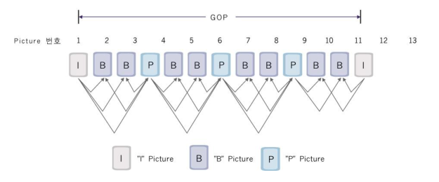
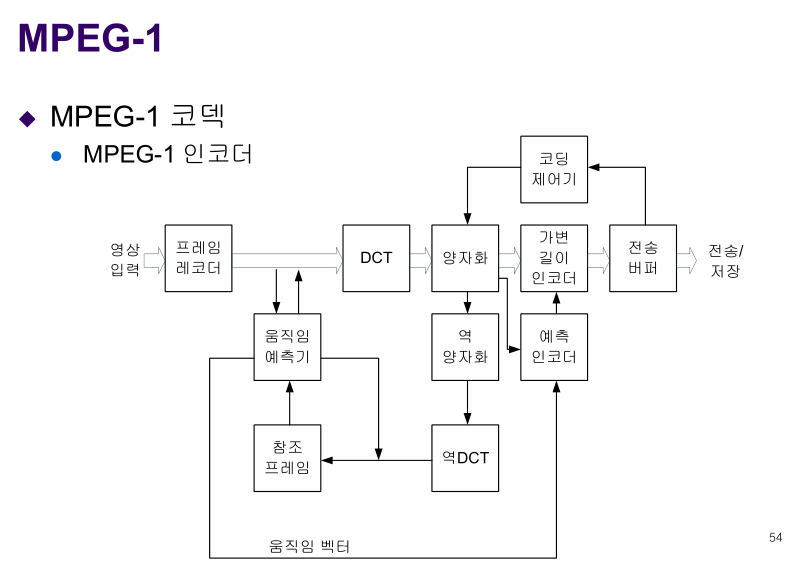

5장 애니메이션의 기술
=====================

6장 비디오 처리기술
===================

-	영상 (동화상) vs 화상 :
	-	화상 : 정지화상
	-	영상 : 정지화상들의 연속적 집합체
-	화면에 비디오 자료 보여주기
	-	TV : 명도, 색상 (Luminance, Chrominance)
-	프레임

6.1 비디오 처리기술
-------------------

### 6.1.1 디지털 비디오의 발전

-	VOD : video on demand
-	IPTV

6.2 비디오 처리 하드웨어
------------------------

> 다른 한편으로는 모바일 단말기를 이용하여 TV 프로그램이나 비디오 자료를 받아볼 수 있는 DMB 방송이 서비스되기 시작했다 ...

→ 195p

### 6.2.1 비디오 보드

-	비디오 보드 : PC에서 비디오 영상을 처리, 모니터 화면에 출력
-	비디오 오버레이 (Video Overlay) 보드 : 영상중첩 기술 → 컴퓨터 외부 + 내부 정보 합성, 출력
	-	TV 수신카드 : 한 화면에서 TV, Video 동시에 편집가능
-	프레임 그래버 : Frame grabber : CCTV, 영상인식시스템 등
-	영상 압축(Compression) / 복원(Decompression) 카드

### 6.2.2 비디오 저장장치

-	CD
-	DVD
-	블루레이
-	디스크 배열 (Array)
-	흑백으로 할 때보다 32배?!

6.3 디지털 영상처리
-------------------

### 6.3.1 영상의 전환과 특수효과

#### ① 영상의 전환

→ Fade

#### ② 영상합성 : 크로마키 합성

초록색 빼고 합성.. 해당 색을 제거하여 합성

#### ③ 특수효과

6.4 비디오의 압축 / 복원
------------------------

-	비디오 압축 또는 부호화
-	중복적인 걸 제거 등...
-	방법 : 손실, 무손실 (무손실 : 의료영상 등의 원본이 극도로 중요한 분야)
-	과정은 JPEG와 유사.
	-	원본 → 전처리 → 변환 → 양자화 → 코드할당 → 비트스트림

### 6.4.1 비디오의 압축 기술

-	압축 대상
	-	프레임 크기의 축소
	-	픽셀당 컬러 비트수의 축소
	-	프레임 수의 축소
-	비디오의 부호화 대상
	-	프레임 사이에 시각적 영향이 적은 부분의 정보량을 줄인다
	-	프레임간 예측 부호화
	-	움직임 보상 프레임간 예측 부호화

### 6.4.2 비디오의 압축 기술

-	MPEG
	-	레이어별 정보 다름...
	-	
-	3가지 압축법
	-	I : 기준되는 기본 정보 : Intra coded
	-	P : 예측 : Predictive coded
	-	B : 양방향 예측 : Bidirectional predictive coded
	-	10장마다 한 장을 원본을 코딩하고, 나머지는 전부 예측으로.
	-	

### 6.4.3 코덱

-	(인)코더 + 디코더
-	이런거 해주는 프로그램이 인코더, 디코더
-	잡음에 강함 : 편집해서... 으히히...
-	H.261
	-	이런 게 있었다
	-	차이나는 부분만 코딩하면 되니
-	H.264

### 6.4.2 비디오의 압축 기술

#### MPEG .. 왜 또 MPEG요...

-	MPEG (Moving Picture Experts Group)
	-	국제 표준?
	-	공식 명칭 : ISO/IEC, JTC1/... 알 게 뭐야!
-	1, 2, 3 (← 2로 흡수), 4, ....
-	MPEG-1
	-	bps?
	-	약 1.5Mbps
	-	구성
	-	시퀀스 헤더 → GOP → (두 개가반복) → 시퀀스 종료 코드
	-	픽처 그룹 : GOP : 10개~30개 정도의 픽처로 구성 : group of pictures?
		-	인트라 프레임 vs 비 인트라 프레임
		-	재생 순서와 영상 인코딩 순서는 다를 수 있음
	-	매크로 블록 : 큰 인코딩 단위
	-	4:1:1
	-	인코더, 디코더 다이어그램 : 움직임 예측 부분이 추가
	-	
-	MPEG-2
	-	더 많은 데이터 저장
	-	4:2:0, 4:2:2, 4:4:4 지원
	-	점진적 주사 vs 비월주사
		-	점진적 주사 : progressive scan
		-	비월주사 interlaced scan
			-	쭉~ 위에서 아래로 그리지 말고, 홀수 한번 짝수 한 번 그리자!
			-	→ 체감 fps가 향상
	-	프레임 DCT
		-	결국 지그재그 스캐닝 인데 지그재그의 각도가 달라지기도 함
	-	Profile 이 있음 : 다양한 품질에 따라 프로파일이 다름
		-	→ 15개 메뉴가 있으니 원하는 거 골라쓰세요
-	MPEG 4 : 객체 기반
	-	적절히 화면을 분해, 객체를 기록.
	-	MPEG-4 화면 합성... : 편집 → 재구성
	-	MPEG-4 비디오 객체의 응용
		-	애니메이션? 곡선 따위는 컴퓨터에 없다??
		-	허경영 합성 이야기.
-	MPEG 7 : 특징을 잡아서...
	-	ex)검색
-	MPEG 21 : 21세기
	-	전자상거래좀 해보자 : 돈으로 주고받을 수 있으면 궁극적!
	-	기기에 관계없이 주고받을 수 있게!

---

휴식

---

-	[뭔가 강의 영상](https://www.youtube.com/watch?v=qZAA2-W02QE)
-	창조 : 무에서 유 창조 : 인간은 절대 불가
-	창조적 : 창조를 흉내낸다 → 창의성 이라고 번역
	-	사람마다 다 다름
	-	네이버 : 새로운 것을 생각해내는 능력
		-	새로운 것은 뭐냐?
		-	생각은 뭐냐?
		-	→ 생전 듣도보도 못 한 건 못 만든다
		-	→ 익숙했던 걸 새롭게... **낯설게 하기** 낯설게 바라보기.
	-	Editology 라는 용어를 만든 사람.
	-	종속된 지식
	-	지식이란 다 편집이더라. 새로운건 하나도 없다
	-	*문화가 편집됐다!*
		-	정보는 넘쳐난다! → 그 어느때보다도 편집자가 중요
	-	편집자가 권력을 가진 세상이 되었다
	-	편집학 3가지
		-	자극
		-	정보
		-	지식
-	절반밖에 고릴라를 보지 못 함
	-	자극의 선택적 지각
	-	자신에게 필요한 것만 받아들인다
	-	근데 뭐가 필요한지는...?
-	야짤 → 인간은 인간이기 전에 동물이다 → 인간은 매일 발정기 → 인간의 동물적 본능?을 활용하는 아주 무서운 광고! → 종족번식만 생각해선. 변태...가 될 수 없다
-	도끼, 망치, 나무, 톱 중 하나만 빼보기
	-	나무를 뺀다 → 도구 vs 대상
	-	망치를 뺀다 → 나무를 베는데 사용하는 도구가 아님
	-	똑같은 정보인데 분류하는 방식이 다르다!
		-	abstract knowledge
		-	practical knowledge
-	컴퓨터 자판을 다시 생각하다?
	-	쿼티 자판...
	-	마우스 → 날아가는 생각을 잡는다
	-	멍때리기 대회 : 멍때릴때가 가장 창조적
		-	열심히 한다 → 비창조적 : 정해진 무언가를 하고있다는 뜻!
		-	멍하니 있다면 사실 아무 생각도 안 하는 게 아니라 가장 창조적인 생각을 함
	-	세계 최초의 마우스의 레플리카 ← 스티브 잡스 : GUI! ← 고작 4만불에 저작권을 사갔다!
	-	마우스가 엄청나게 세상을 바꿨다
	-	책 *디지로그* - 이어령 ← 존잘님
	-	생각을 표현하기 위한 완벽한 작업공간!
-	텍스트의 세계 → 하이퍼텍스트의 세계로 넘어감!
-	포스코노미 / 택소노미 : 분리한다, 분류한다!
	-	새로운 분류체계가 일반인들에게!
	-	바나나, 호랑이, 침팬지 중 하나 빼면?
	-	일반적 : 바나나 : 동물, 식물
	-	foxonomy? : 호랑이를 뺀다 : 안 먹으니까!
	-	컴퓨터와 마우스가 나오기 이전에 있었다! : 원숭이가 백두산이 되는 것
		-	빨개요 - 현아 ← 이걸로 노래를!
	-	그러한 결과들이 현실속에서 일어나기 시작! ← 조용히...변화... ← 지식 권력으로서의 대학이 몰락하기 시작
-	미네르바! : 전문대 출신이 이렇게 자세히 알아요?!
-	인간을 문화 사회적 맥락 속에서 이해해야 한다
	-	흔한 컵과 얼굴 착시 : **내가 결정해야 한다!**
	-	← 맥락속에서 결정되는 것처럼 착각한다!
	-	색상착시 : A와 B의 색이 같다 라고 말할 수 없다! : 맥락을 빼놓고 말하면 안 된다!
	-	왜 내 삶의 맥락을 왜 내가 지배하지 못하냐 이거지!
-	맥락이 바뀌면 전혀 다른 사람이 된다
-	내 인생을 내맘대로 살아봤나? ← 아니에요! 내가 결정한 적이 없더라고!
	-	제일 하기 싫은 일 : 애들 가르치는게 제일 싫었다
	-	폼나게 그만뒀는데 월급이 안 나와 ㅋㅋㅋㅋㅋㅋㅋ
	-	어렸을 때 하고싶었던 거 하면 제일 행복하다
-	삶의 맥락이 바뀌었다! : 생각이 180도 바뀌었다
	-	너무 외로웠지만 ... 너무도 행복했다
	-	한국인 : 외로운게 무서워서 관계로 도피

> 인간은 외로움이 본질
>
> 외로움을 감내해야 관계도

-	창조적 삶을 위해서는 나를 위한 시간이 필요하다
	-	저녁이 있는 삶, 주말이 있는 삶
	-	유태인 : 뛰어난 노동철학 : 쉼의 철학 : 안식일
	-	유태인 한국인 입양아
	-	유태인이 창의적인 이유 : 잘 쉬기 때문
-	열심히 해서 되는 게 아니다!
	-	외로움, 휴식, 자기반성
