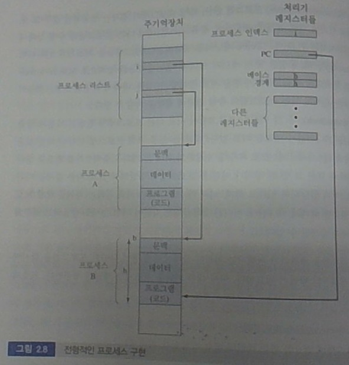
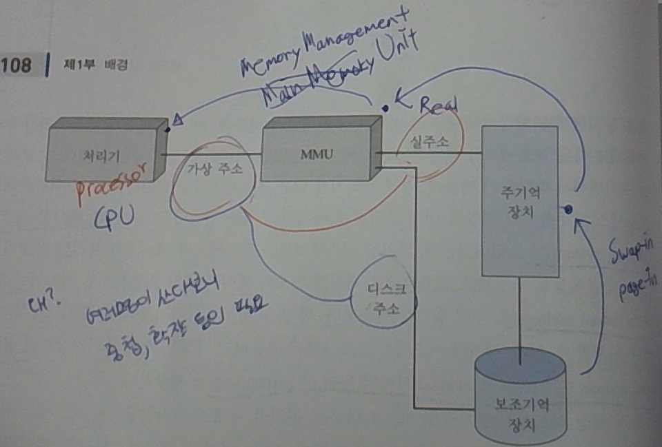
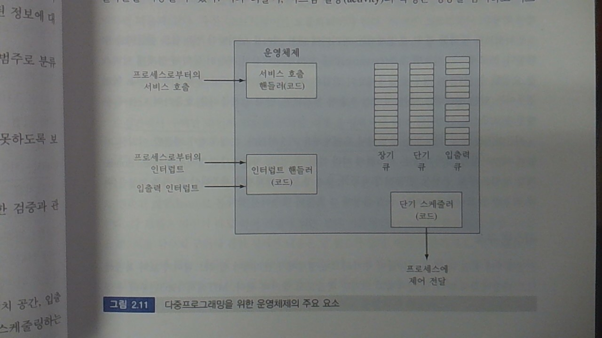
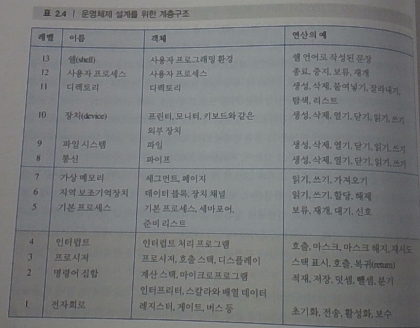
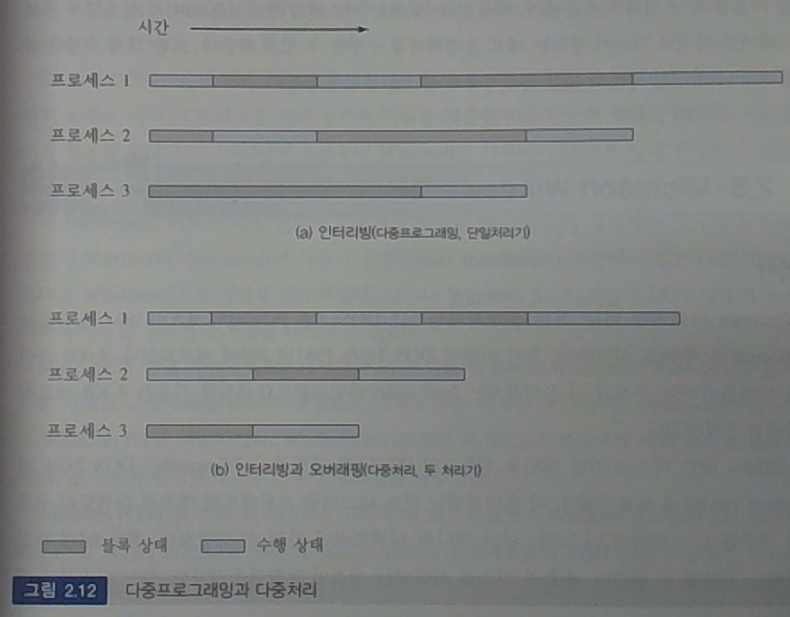
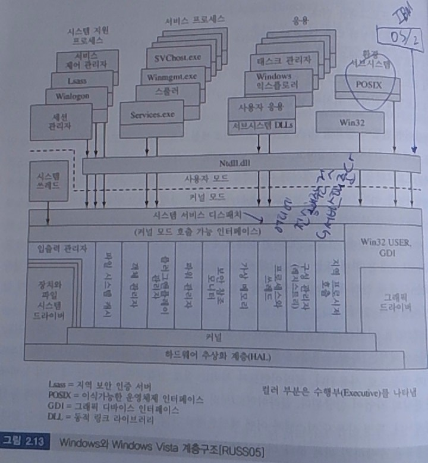
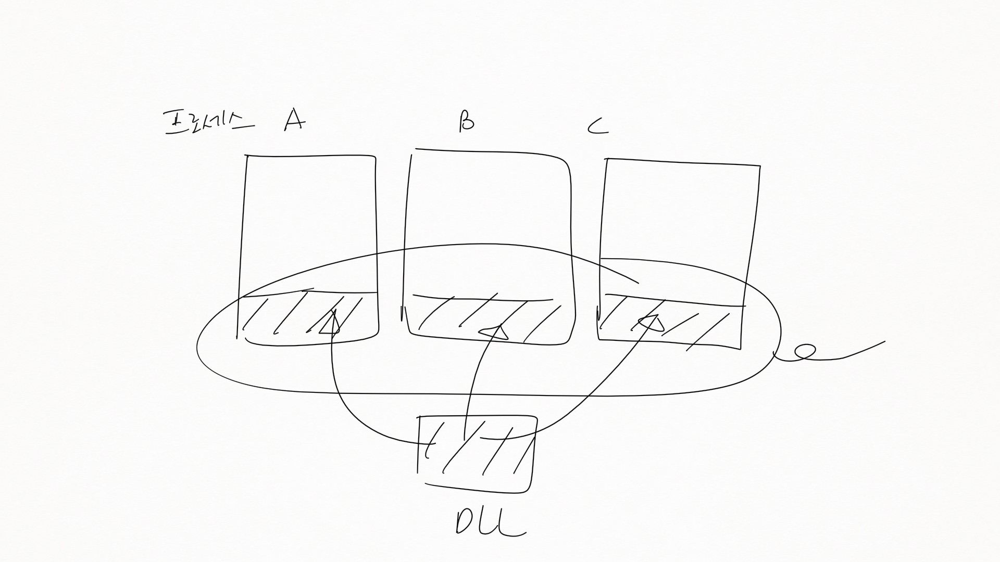

운영체제 4강
============

-	from 100 page

2.3 주요 성과
-------------

-	외울 필요는 없이, *그게 운영체제다*
	-	프로세스
	-	메모리 관리
	-	정보 보호 및 보안
	-	스케줄링 및 자원 관리
	-	시스템 구조

### 프로세스

-	Multics 설계자들이 쓴 이름
-	Job 보다는 더 일반적인 개념
-	설명
	-	수행 중인 프로그램
	-	컴퓨터 상에서 수행 중인 프로그램의 인스턴스 (instance)
	-	처리기에 할당되어 수행갤 될 수 있는 개체 (entity)
	-	단일 순차 수행 스레드, 현재 상태, 연계된 시스템 자원 등에 의해 특정지어지는 활동 단위
-	
	-	PSW
	-	설명 놓침. 아마 프로세스의 분리에 대한 설명인듯?
-	프로세스의 **상태(state)**
	-	일 한다, 쉰다, ...
	-	프로세스의 문맥 내에 저장됨

### 메모리 관리

-	5가지 주요 의무
	-	프로세스 분리
	-	자동 할당 및 관리
	-	모듈식 프로그래밍 지원
	-	보호 및 접근 제어
	-	장기 저장
-	가상 메모리
	-	메인 메모리의 용량에 상관없이 돌아가기 (500MB 이든, 2G이든)
	-	Virtual address, Physical address
		-	가상 메모리가 있다 → 가상 주소가 있다 → 없는데 있는 것처럼.
		-	
	-	페이징 시스템에서는 페이징 단위, 세그먼트 시스템에서는 세그먼트 단위.
		-	데이터를 이렇게 주고받는다 정도만 알아두고 나중에 계속.
	-	필요할 때만 불러옴 (on-demand load) (with file system)

### 정보 보호와 보안

-	가용성 (Availability)
-	기밀성 (Cojnfidentiality)
	-	승인 받지 않은 사람은 접근 불가
-	데이터 무결성 (Data Integrity)
	-	비승인자 접근시 데이터가 깨지지 않는다던가
-	신빙성 (Authenticity)

### 스케줄링과 자원 관리

-	스케줄링?
	-	비서의 비유
	-	프로세스를 스케줄해준다 = 자원을 관리한다 = 자원을 할당한다 = 운영체제가 뭐다?
-	스케줄링 모델
	-	
	-	큐 구조로 관리
		-	단기 / 장기 / 입출력 : 보통 세 가지 큐로 분류
		-	사람의 뇌에 대한 비유
		-	단기 큐 (Short-term Queue)
			-	ready. 수행 준비 상태의 프로세스들 (주 기억장치에 로드된 것들 중)
		-	장기 큐 (Long-term Queue)
			-	CPU 사용을 위해 대기하고 있는 작업들
		-	입출력 큐 (I/O Queue)
			-	입출력을 위해 대기중인 프로세스
		-	→ 프로세스가 세 큐 간을 왔다갔다 한다 = 프로세스의 상태가 왔다갔다 바뀐다
		-	잠깐의 비유
			-	Unix가 99% C로 짜인 것에 대해 : (?)
			-	`여러분 자체가 운영체제인 것처럼 생각하고 공부해봐` : 어떻게 효율적으로, 잘 서비스 해줄까?

### 시스템 구조

-	추상화 되어있음
-	계층적 구조
	-	이 복잡한 구조를 계층화, 추상화.
	-	우리는 fopen()만 쓸 줄 알면 된다 느낌.
-	
	-	레벨 4 : 인터럽트
	-	레벨 13 : 쉘 (Shell) : 명령어 처리기
	-	→ `존재하지 않는 명령어입니다.`를 보여주는 녀석

2.4 최근 운영체제로의 발전
--------------------------

-	방아쇠 (Triggering)
	-	신규 하드웨어 → (64bit / SMP, NUMA, Clustering / High-speed bus and network / Increasing size and variety of memory storage)
	-	신규 어플리케이션 → (Multimedia, internet, security)
	-	임베디드 시스템
	-	OS는 광범위하므로 어떤 게 OS임을 따져도 어렵고 무의미 : 범위 다양
	-	신규 HW
		-	64-bit CPU : x86-64 (AMD) / IA-64 (Intel) : 2^32 배 만큼 늘어남.
			-	x86은 286, 386, 486, 586, 686 ... 을 줄인 말
-	새로운 방식의 접근 (New approach)
	-	왜?
		-	부려먹으려다 보니 자꾸 업그레이드
		-	→ 새로운 접근
	-	마이크로커널 아키텍처
		-	필요한 핵심기능 빼고 다 빼기
			-	IPC (Interprocess Communication)
			-	기본적인 스케줄링 등
		-	그 외 기능은 *서버 라는 이름의 프로세서*로 : 응용 프로그램과 동일 취급
	-	멀티스레딩 (multithreading)
		-	스레드 : 경량 프로세스
		-	→ 하나의 프로세스는 여러 스레드로 나뉘어진다
		-	비유 : 사람이 하나라도 하는 일은 많다 : 핵심 기능만으로 줄여서......
		-	→ 뒤의 4장에서 나옴
	-	대칭형 다중처리 (SMP : Symmetric Multiprocessing)
		-	
		-	돌다가 - 기다리다 - 돌다가 - 기다리다
		-	여러 프로세스가 있다 : 프로세서 갯수는 한정적
		-	다중 CPU 대신 many core (코어가 256개, ...), multicore (코어가 8개, ...) 가 많이 쓰임.
		-	게임, 항공우주분야, 유전자 분석 등.
	-	분산 운영체제 (Distributed Operating System)
		-	지리적으로 떨어져있다! → 를 다룸

M＄ Windows 역사
----------------

-	DOS : Disk Operating System
-	종류
	-	일반사용자용
	-	기업용, 전문가용, 서버용
	-	임베디드용 / 모바일용
		-	Windows CE : 임베디드용 (모바일용)
		-	Windows XP Embedded
		-	Windows Mobile
	-	나머지야 다 아실테고.
-	윈도우즈 아키텍처
	-	
	-	커널 모드 / 유저 모드
	-	**디스패치** (Dispatch) : 서비스를 제공해준다 : 디스패쳐가 서비스를 디스패치 해준다 라고 표현함.
	-	POSIX : Portable OS interface
		-	막 고치더라도 이건 지키자 : 호환 목적
	-	IBM OS/2 : 시장에서 실패.
-	운영체제 구조 (윈도우즈의?)
	-	하드웨어 추상화 계층 (HAL) : 하드웨어를 추상화 → OS와 하드웨어 독립
	-	환경 서브시스템 : POSIX, Win32/WinFX 등...
		-	
		-	DLL : Dnyamic Link Library : 실행 파일에 붙여지지 않고, DLL file에 독립적으로 있다가 프로그램이 실행될 때 link 되어 사용됨.
		-	↔ cf) Static Link Library (정적 링크 라이브러리) : 컴파일시 포함됨
	-	몇 개 놓침

2.6 전통적인 Unix 시스템
------------------------

-	운영체제를 시스템 커널이라고 부른다
-	샤샤샥 지나감...

2.7 최근의 UNIX 시스템
----------------------

2.8 Linux
---------

-	리누스 토발즈 아저씨
-	Unix와 비슷하다
-	Linux가 성공한 가장 큰 이유 : FSF 후원 아래 **무료**
	-	FSF의 목적 : 무료 고품질, 안전하고 플랫폼 독립적인 소프트웨어
	-	
	-	→ 이러한 것들로 구성되어 있 다
-	리눅스의 시스템 호출 (함수)
	-	버전마다 명령어가 조금씩 다르므로 주의

2.EX RTOS
---------

-	발음 : 알토스
-	실시간 운영체제 : 사용자 요청을 딜레이 없이 처리
	-	딜레이의 정의를 따지면 애매해짐
-	쪼금은 배울것임.

---

5분 휴식

---

Linux 사용법 타임!
------------------

-	책 덮고 따라하세요
-	IP는 별도로 적어서 보관

배운 명령어
-----------

-	passwd
-	pwd : 현재 경로 : print working directory
-	프롬프트 : 빤짝빤짝 (웃음)
-	커서 : 명령어를 입력시킬 자리
-	ls
	-	r : reverse
	-	R : recursive
	-	l : long listing type
	-	a : all
-	cat : contatenate : 사슬로 잇다, 연결하다 : 화면에 출력
	-	cat > 파일이름 → 파일로 출력을 저장
	-	Ctrl + D로 빠져나옴
-	mv 명령어로 파일 이름도 바꿀 수 있음 (하던대로.)
	-	mv test.txt test2.txt
-	mkdir
-	cp
-	rmdir
-	vi 쪼끔.
	-	i : insert
	-	a : add
	-	o : 현재 다음 줄부터
	-	O : ...
-	gcc -o 실행파일이름 소스파일이름
-	파일 디렉토리 계층구조
-	리눅스 실습 예제 라는 파일 → 그대로 타이핑해서 실행해보기 (다음시간 오기 전에)
