os05
====

오늘의 그림은 PPT에서. **저작권주의** (교재에 거의 종속)

교재 → PEARSON *운영체제 내부구조 및 설계 원리 제6판* - Wiliam Stalings

3장. 프로세스 description and control
=====================================

프로세스?
---------

154p 중간부분

> 프로세스는 수많은 요소들로 구성된 개체로도 생각될 수 잇다. 프로세스의 두 필수 적인 요소는 **프로그램 코드**(동일한 프로그램을 수행하는 서로 다른 프로세스들이 공유할 수 있는 부분) 및 그 코드와 연계된 **데이터의 집합**이다. 처리기가...

-	프로세스
	-	실행중인 프로그램
	-	(...놓침)
-	메모리 구조
-	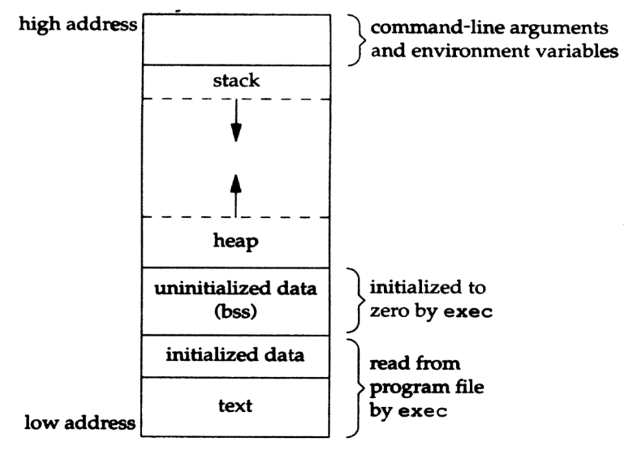
	-	힙 (heap) : 포인터를 이용해 동적으로 주고받는 부분
-	PCB
	-	Process Control Block
	-	운영체제가 관리
	-	수행 프로세스를 인터럽트한 후, 프로세스 수행을 재개할 수 있도록 정보 유지
	-	Process = 프로그램 코드 + 관련 data + PCB
-	프로세스의 식별 → PCB (그림 3.1)
	-	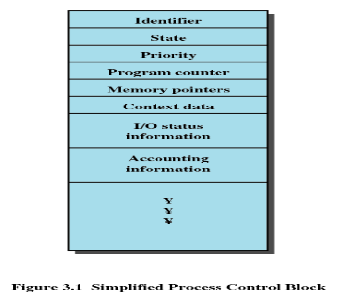
	-	하나의 C언어의 Structure
	-	식별자 → 프로세스 유일 식별
	-	상태 → 프로세스 의 상태
	-	생략

3.2 프로세스 상태
-----------------

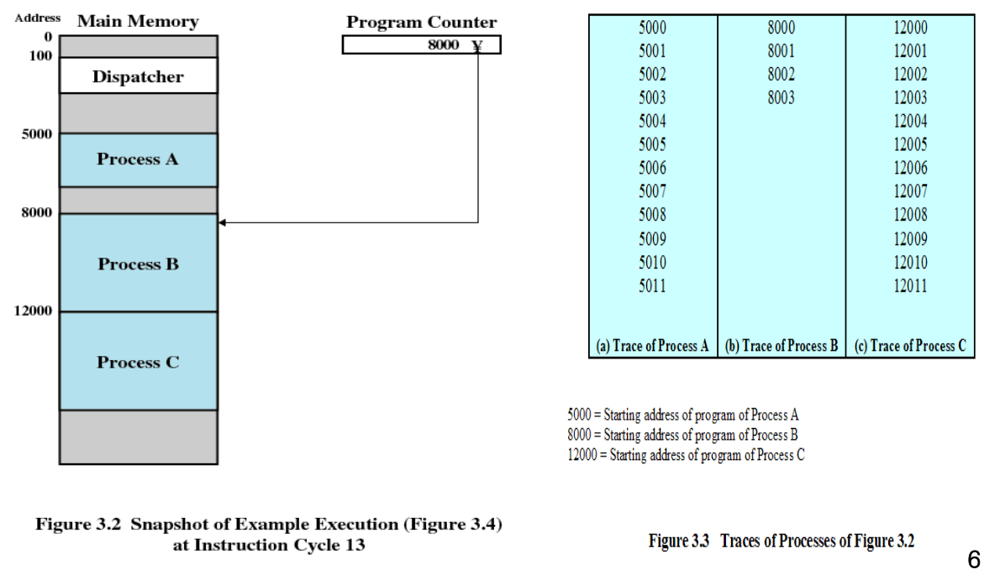

-	프로세스를 교체해주는 디스패처(Dispatcher) 프로그램이 있음
-	프로세스 Level
	-	프로세스 궤적 : 프로세스의 수행 명령어 리스트
	-	→ 다음에 이거 실행해야지? 혹은 뭐 실행했는지
-	시스템 Level
	-	시스템도 수행해야죠...
-	시간도 (Timing diagram) -
	-	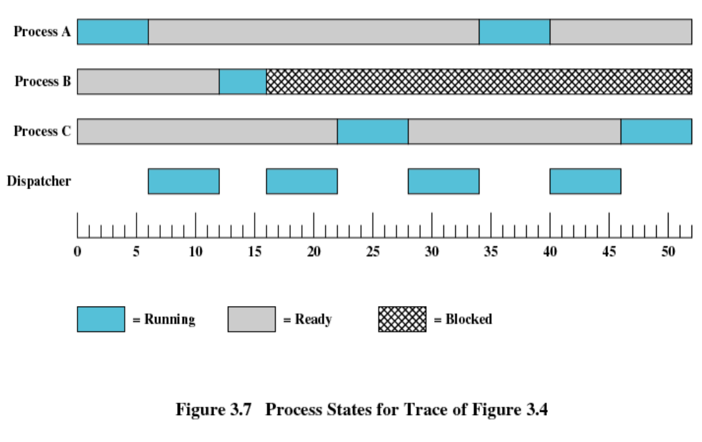
	-	디스패처가 넘겨주고 등.
-	프로세스 상태 : Two-State 프로세스 모델 (2-상태)
	-	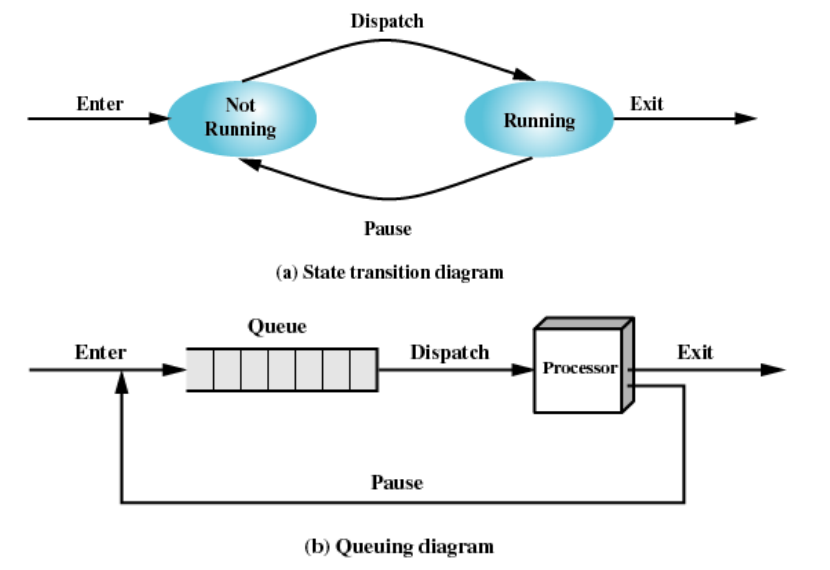
	-	수행 / 비수행
	-	큐에는... → 뭐가 들어있나? : 프로세스 목록..이겠죠?
	-	→ 다행히 맞네요. PCB 혹은 PCB를 가리키는 포인터 값을 가짐

### 프로세스의 생성과 종료

-	프로세스의 생성
	-	프로세스 모델로 들어가기
	-	방법
		-	기존 프로세스가 spawn → fork() / exec()
		-	OS가 만듦
		-	대화형 로그온 → 사용자가 터미널 로그온
		-	...생략 → 교재 160p 표
-	프로세스의 종료
	-	방법
		-	산술 오류 등

### 다섯 상태 모델 (Five-State Model)

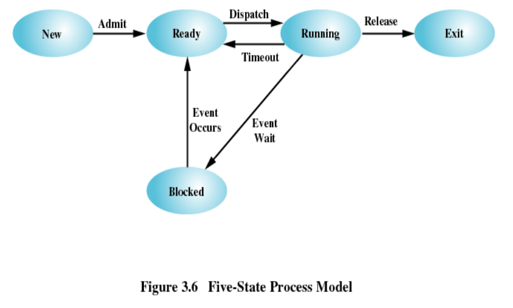

-	5상태
	-	생성 new
	-	준비 ready
	-	수행 running
	-	블록 blocked
	-	종료 exit
-	상태의 변환
	-	준비 (ready) → 수행 (Running) : **dispatch**
	-	수행 (Running) → 준비 (Ready) : **preempt** (타임아웃 / 좀 더 높은 우선순위 발생)
-	다섯 상태 프로세스 모델
	-	큐를 하나 혹은 여러개 → 시스템마다 다름
	-	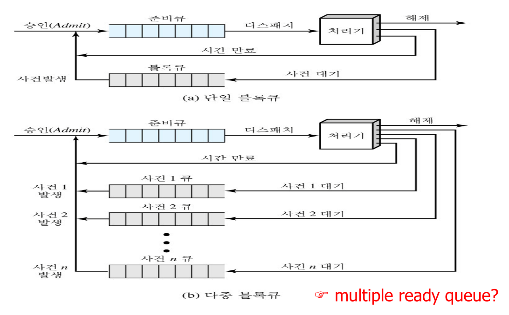

### 보류된 프로세스 (Suspended Process)

-	스와핑 (Swapping)
	-	메모리 교환.
	-	swap-in, .swap-out을 합쳐서 이렇게 부름
	-	왜 하는가? → 메모리에 빈공간이 필요해! → 더 느린 저장소와 교환
-	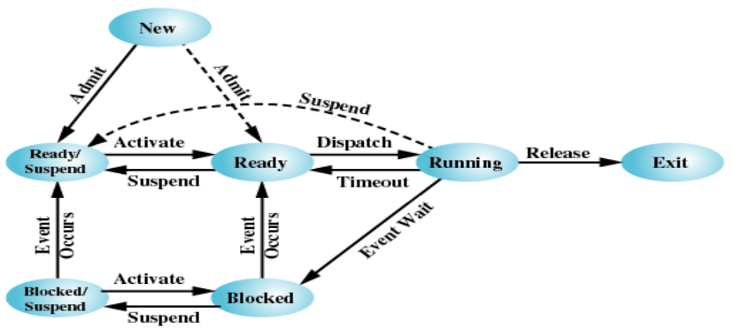
	-	하나가 추가? → 갯수가 중요한게 아니라, 동작방식의 변화에 주목
	-	→ **사건 (event) 발생** → 큐 → ...

3.3 프로세스 기술 (Process Description)
---------------------------------------

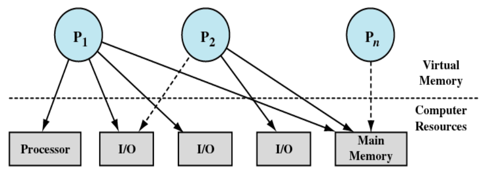

-	OS란 : 프로세스와 자원의 관리
	-	화살표 : 자원 요청
	-	사람도 자원 요청이 겹친다 → 자원이 무한대가 아니다!
	-	세 프로세스인데 어떻게 쓰게 나눠줘야 할까?

### 운영체제 제어 구조

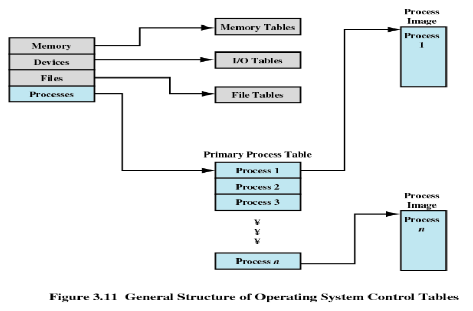

-	139p : FAT (File Allocation Table) → VFAT (Virtual ~)
-	OS가 관리하는 테이블
	-	메모리 테이블 (설명안함)
	-	파일 테이블 → 파일 존재여부와 보조기억장치에 저장된 파일의 위치, 현....(생략)
	-	프로세스 테이블
	-	책의 나머지 부분에서 주욱.

### 프로세스 제어 구조

-	UID : UserID
-	PID : ProcessID
-	PPID : Parent Process ID
-	프로세스 이미지 제어블록
-	프로세스간 통신 : IPC

### 프로세스 속성?

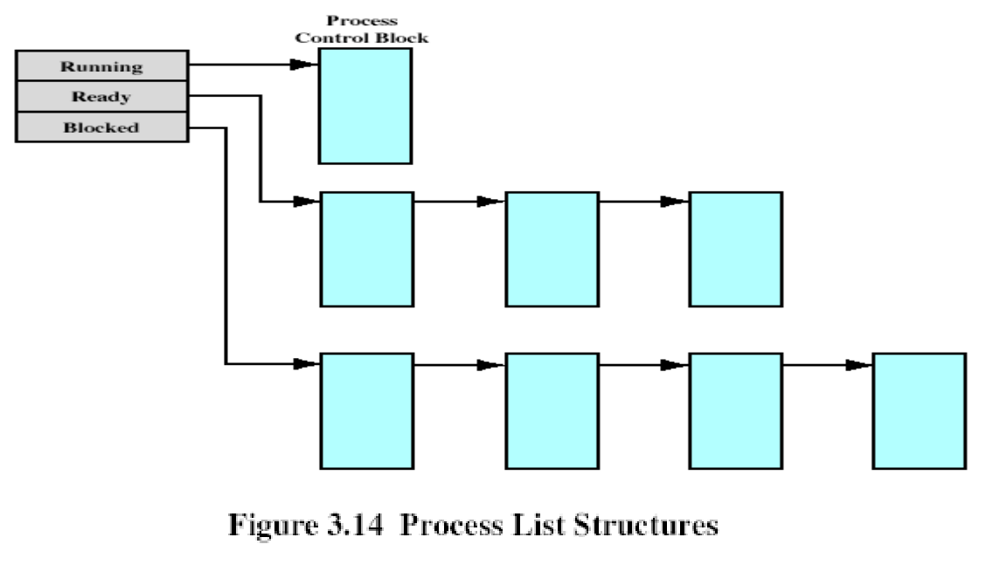

-	큐로 묶어진다

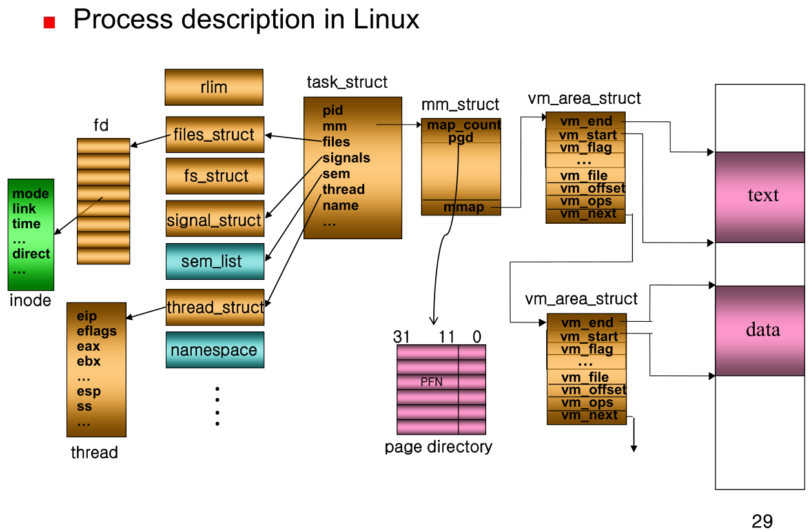

-	시스템 구현마다 이름이 다 달라진다
	-	inode →기본적인 프로세스 구조가 기술된 것
	-	리눅스가 이런 방식으로 구성되어있다를 눈으로 보시라

3.4 프로세스 제어
-----------------

### 수행 모드

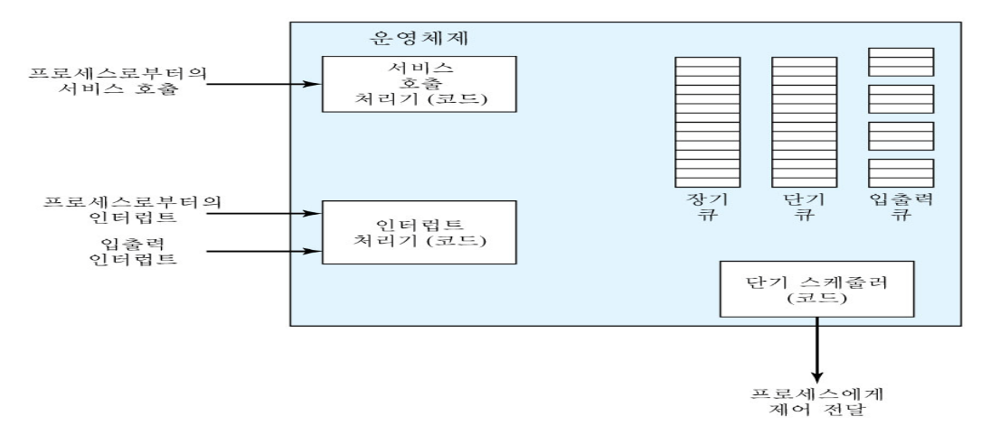

-	크게 사용자모드 이냐, 아니냐
-	사용자 모드 : 권한을 덜 가짐 → 엉뚱한 짓을 했나, 안 했나
-	그 외
	-	3가지?
-	언제 모드를 바꾸나?
	-	사용자 프로그램으로부터 OS 및 PCB 와 같은 주요 OS 테이블들을 보호하기 위해 2 가지 모드 사용
-	CPU를 preemption 해서 다른 프로세스에게 dispatch 해주는 것 = 인터럽트로...
-	모드 표현 : psw에 한 비트로 기록

### 프로세스 교환 (process switching)

-	프로세스 변경의 원인 (trigger)
	-	클럭 인터럽트 & 최대 time slice 초과 : running → ready
	-	I/O 인터럽트 → block → ready
	-	Memory Fault (Miss와 유사 : 없는 주소 찾으러감) : running → block
-	교재에서 정리
	-	현재 수행중인 프로세스로부터 **제어를 넘겨받을 때**마다 발생.
	-	유발자
		-	시스템 인터럽트
			-	인터럽트
				-	클록 인터럽트
				-	입출력 인터럽트
				-	메모리 Fault → 없는 곳을 엑세스 시도 : 프로그램 죽음
			-	트랩

### 프로세스 상태 변경 (Change)

-	프로세스의 상태 = 어떤 큐의 멤버냐.
-	→ 상태를 바꾼다 : 저쪽 큐에서 빼고, 이쪽 큐에 집어넣으면 바뀜
-	프로세스 변경 과정 (교재 189p)
-	자료 : 프로세스는 동시에 여러개를 돌린다 정도만.
	-	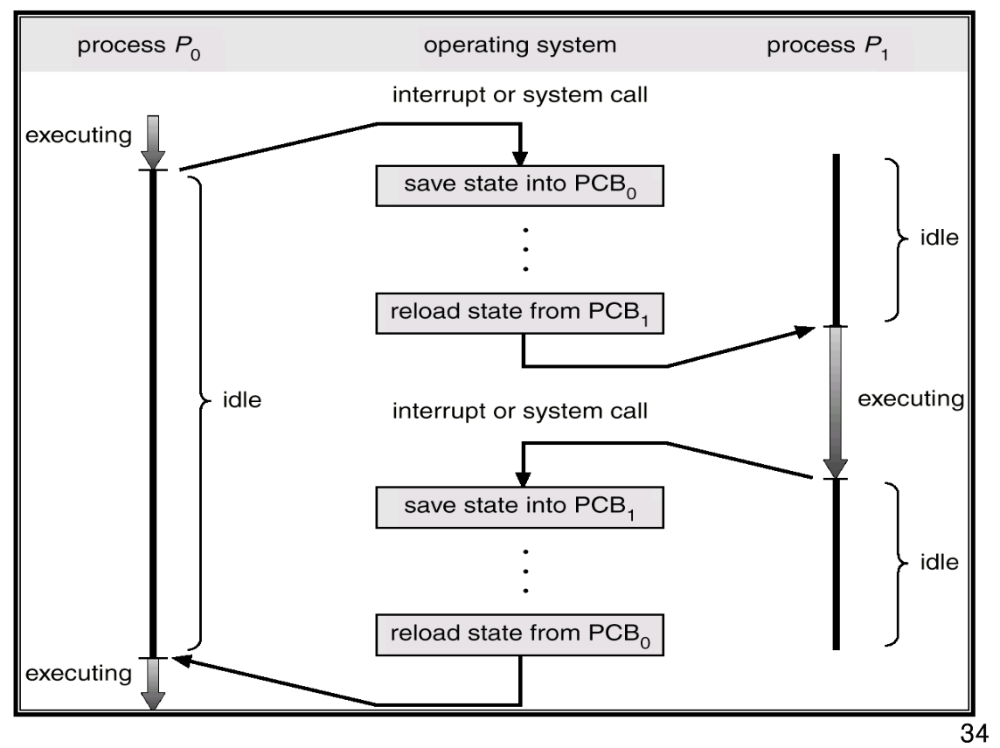
-	프로세스를 만든다 → 사람 태어난것과 유사... 이름 지어준다던가...

---

10분 짧은 휴식

---

Linux 실습
==========

1 : `fork()` / `exec()`
-----------------------

```cpp

/* LINUX 실습 예제 #1 - fork() system call test를 통해
parent느 child process 의 id를 return 받고,
child process는 0을 return 받음 */

#include <stdio.h>
#include <sys/types.h>
#include <unistd.h>

int glob =6 ; /* 외부 변수 초기화 */
int main() {
   pid_t pid;
   int var =88;
   printf(" Before fork() \n");
   if ( (pid = fork()) <0 )
	printf(" fork() error! \n");
   else if (pid ==0) {  /* child */
	glob++;
	var++;
    }
    else
	sleep(2);  /* parent */
    printf(" pid= %d, glob = %d, var =%d \n", getpid(), glob, var);
    exit(0);
}
```

-	`fork()` : 새로운 프로세스 생성, 자식 낳기
	-	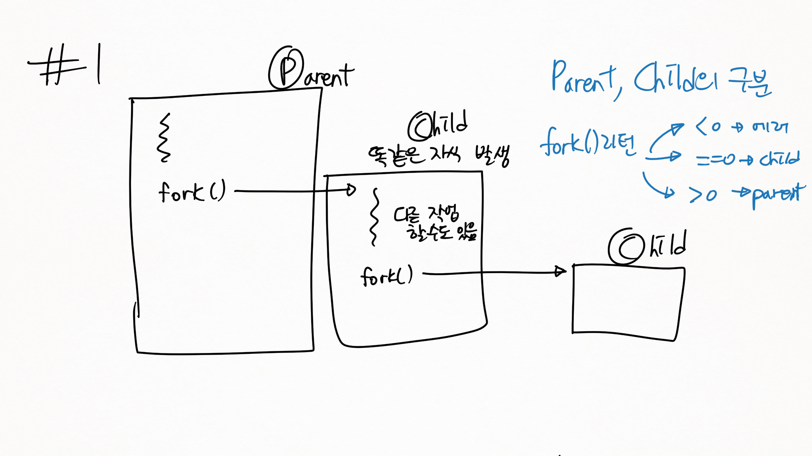
	-	항상 나와 부모의 pid를 가지고 있는 셈
-	우린 fork()가 실패할 일이 없지만, 국민은행 전산실에서 fork()를 한다면... (성공보장 X)
-	`getpid()`
-	fork() : 카피해서 가져감
-	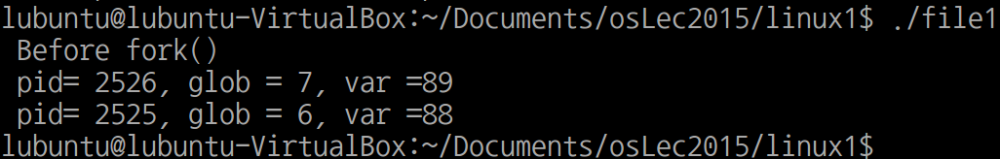
-	> On success, the PID of the child process is returned in the parent, and 0 is returned in the child.

2 : fork 예 2
-------------

```cpp
/* LINUX 실습 예제 #2 - fork() system call test를 통해
2개의 process를 동시 실행 확인 */

#include <stdio.h>
#include <sys/types.h>
#include <unistd.h>

int main() {
   pid_t pid;
   char *message;
   int n;
   printf (" fork program starting ! \n");
   pid = fork();
switch(pid)  {
     case -1 :
	printf (" fork failed \n");
	exit(1);
    case 0 :
	message= "This is child process";
	n= 5;
	break;
    default :
	message= "This is parent process";
	n= 3;
	break;
    }
   for ( ; n>0; n-- ) {
	puts(message);
	sleep(1);
   }
   exit(0);
}
```

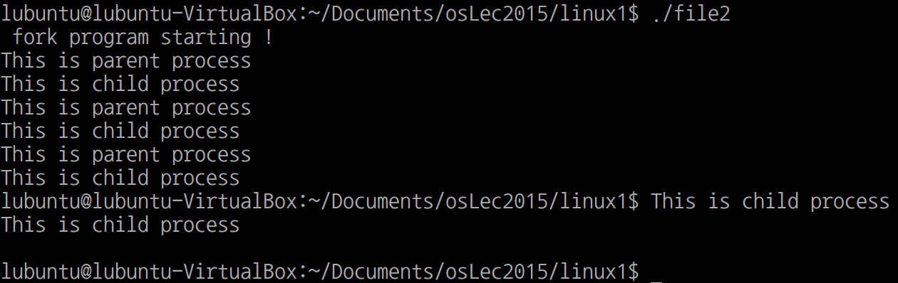

3 : system()
------------

-	너무 많이 나와서 -a (all) 옵션은 제외

```cpp
/* LINUX 실습 예제 #3 - "system" library function을 이용하여
새로운 프로세스 생성  확인 */
#include <stdio.h>
#include <sys/types.h>
#include <unistd.h>
#include <stdlib.h>

int main() {
   printf (" Running ps with system \n");
   system ("ps -x");
   printf (" I am done ~~~\n");
   exit(0);
}
```

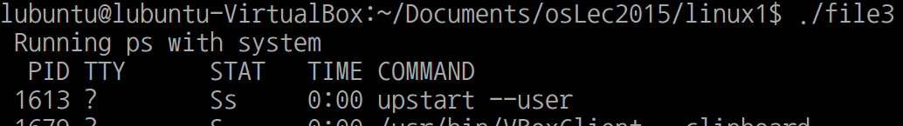

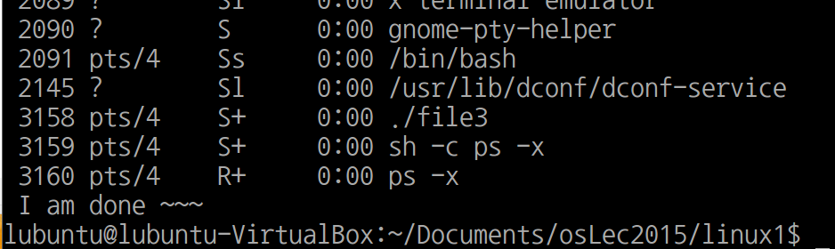

-	명령어 해석기가 Shell 이다
-	TTY : 입력의 상태
-	PS : Process Status (내 수행화면에는 STAT 이라고 나옴)
-	`system()` → 명령어 실행
-	`system("ps -x &")` → `&` 은 백그라운드 프로세스로.

4 : `execlp( , , , 0)`
----------------------

```cpp
/* LINUX 실습 예제 #4 - "exec" 함수는 현재 프로세스를 path 나 file 인수에 지정된 new process로 replace  확인 */

#include <stdio.h>
#include <sys/types.h>
#include <unistd.h>
#include <stdlib.h>

int main() {
   printf (" Running ps with execlp \n");
   execlp ("ps", "ps", "-ax", 0);
   printf (" I am done ~~~\n");
   exit(0);
}
```

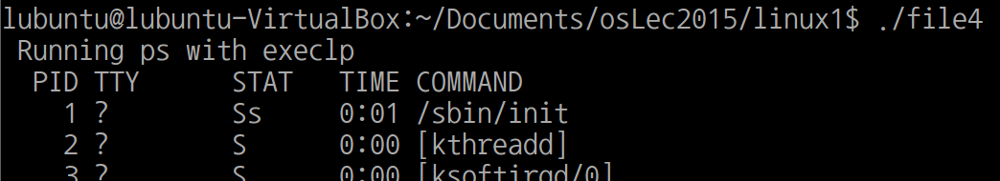

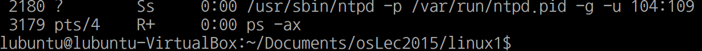

-	`exec()` : Parent 프로세스를 대체함! (자신은 사라짐!)
-	`execlp()`, `execlv()` 등... → man 보자...나중에...

번외
----

-	`$ gcc -o 파일이름 출력이름`
-	`$ gcc 파일이름` → 없던게 만들어졌다! → `파일이름.out` → 기본 출력 이름?
-	makefile은 다음 시간에. (학생들 상태가 감당 못할듯)

첫 번째 숙제
============

-	홈페이지에.
-	화면 캡처해서 PPT로 만들기.
-	아무것도 모르는 사람에게 설명하기 → 한 줄 한줄 주석달기 → 한 줄 한 줄 설명하라는 소리.
-	PPT 시작전에 폴더에 넣어놓기, 출력해오기
-	저번학기 인터넷처럼 → 이 줄 니가 설명해봐 → 설명가능 → 제출한걸로 침.
-	첨 숙제여서 엄청 친절하게 해주시...

```
수업시간에 배운 fork() system call 을 활용한 멀티프로세싱 예제입니다.
학번 홀수/짝수에 따라 프로그래밍 소스코드, 실행결과 등을 설명할수 있는

발표 PPT 파일을 제출하고 설명하시오.
마감일은 항상 과제 부여후 1주후인 담주 강의시간까지 제출하세요
```

-	홀수
	-	`waitpid()` → fork 2회
	-	빈칸채우기
-	짝수
	-	`wait()`
-	시험 문제가 이것...
