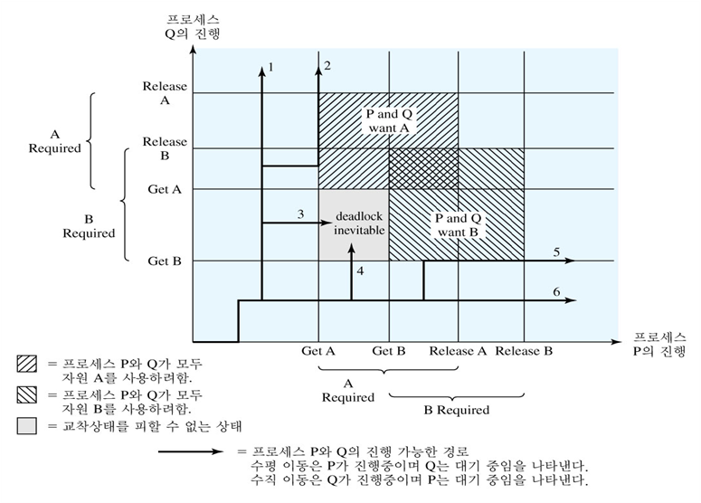
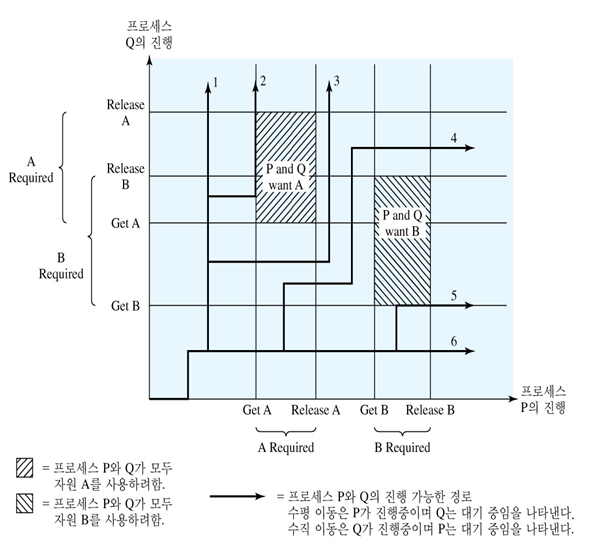
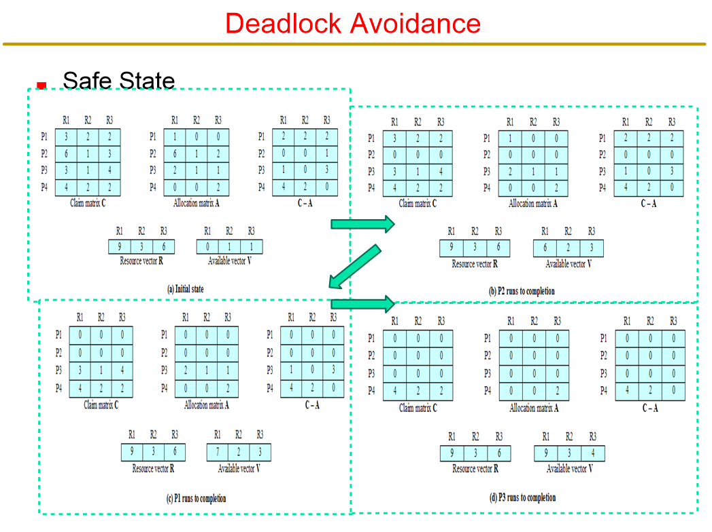
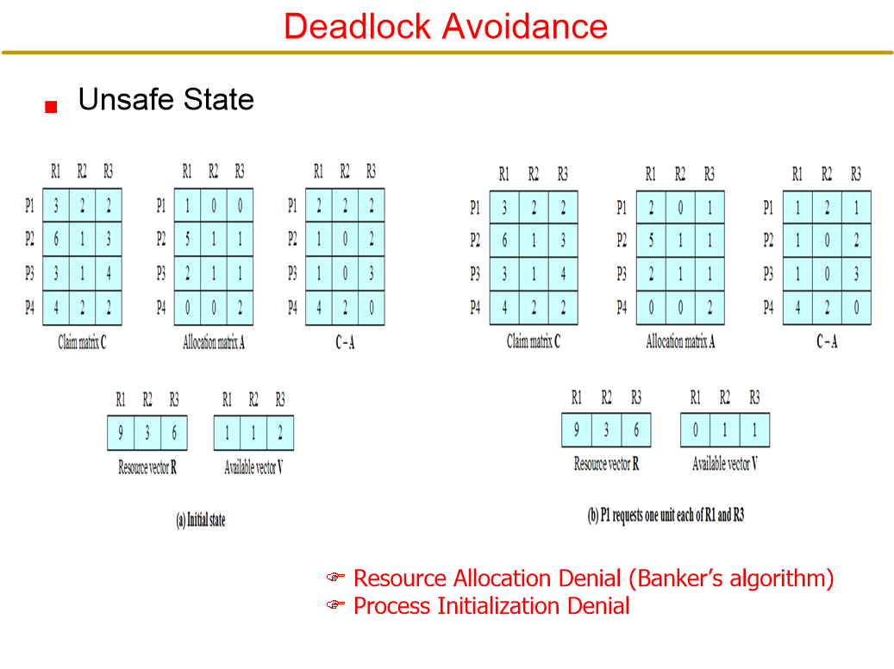
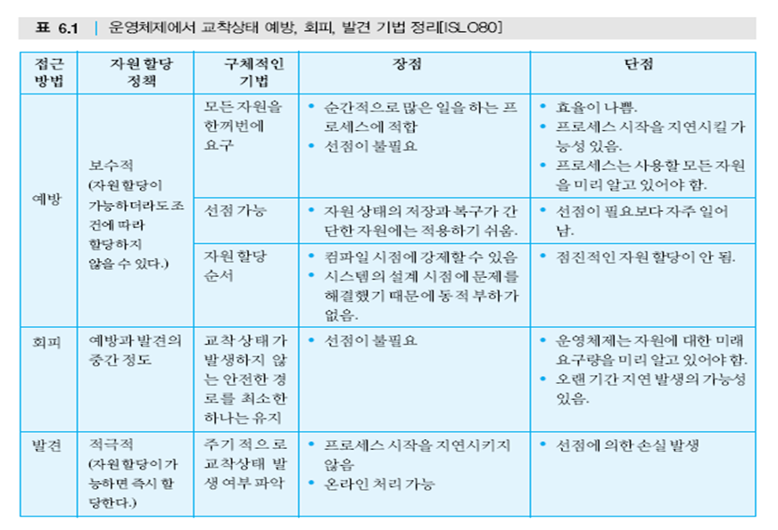

운영체제
========

-	지난시간 : 상호동기화 등
-	자료는 교수님 PPT (교재 자료인듯) 에서. 저작권 주의

6장. 병행성 : 교착상태와 기아상태
=================================

(Concurrency : Deadlock and Starvation)

6.1 교착상태 원리
-----------------

342p

-	교착상태 (Deadlock)
	-	프로세스들 → 영구적으로 블록
	-	그림 6.1 (343p) : 교차로에 막힌 차들
-	왜?
	-	한정된 자원을 서로 쓰려다보니

```
Process P   Process Q
...         ...
Get A       Get B
...         ...
Get B       Get A // 서로 A와 B를 풀어주기만 기다리고 있음!
...         ...
Release A   Release B
...         ...
Release B   Release A
...         ...
```





### 재사용 가능한 자원

-	자원의 종류
	-	재사용 가능한 자원 (reusable)
	-	소모성 자원 (comsumable) → 생산후 소멸됨
-	재사용 가능한 자원 ← 교착상태를 일으킨다
	-	다른 프로세스가 사용할 수 있도록 반납!
	-	처리기, 입출력 채널, 주/보조 기억장치. 장치(device), 파일, 데이터베이스, 세마포어 등의 자료구조 등
-	이런걸로 교착상태 예
	-	메모리 할당
	-	디스크와 테이프를 이용한 백업 (잡담 : 저녁시간마다 차로를 막히게 했던 테이프를 실은 퀵서비스들)
	-	통신 : 요청이 블로킹인 경우, 계속 기다린다...

### 소모성 자원

### 정리

> 모든 유형의 교착상태를 효과적으로 해결하는 단일한 전략은 없다

-	예방, 회피, 발견 (6.2 / 6.3 / 6.4)
-	그 이전에 자원 할당 그래프 / 교착상태 발생의 네 가지 조건

### 자원 할당 그래프

-	그림
	-	자원 : 사각형
	-	프로세스 : 원
	-	자원의 인스턴스 : 점 (각 자원의 가용 갯수)
-	병렬성 === 동시성
-	cycle 존재 : Deadlock 발생
-	인스턴스 (instance) : 자원의 갯수

### 교착상태의 조건

-	조건
	1.	상호 배제 (mutual exclusion) : 공유불가 : 한 순간에 한 자원은 한 프로세스만이
	2.	점유 대기 (hold and wait) : 욕심쟁이 : 이미 자원을 요구한 프로세스가 다른 자원을 요청하며 기다리고 있음
	3.	비선점 (no preemption) : 돚거불가 : 프로세스에 의해 점유된 자원을 다른 프로세스가 강제적으로 빼앗을 수 없음
	4.	환형 대기 (circular wait) : 니꺼내놔 : 프로세스간에 닫힌 연결(closed chain) 이 존재 = ← 자원 할당 그래프에서 환형 (cycle) 이 만들어지는 것
-	교착상태 가능 vs 교착상태 발생
	-	1~3 : 필요조건 (가능)
	-	1~4 : 필요충분조건 (4는 1~3에 의해 발생)
-	해결 방법
	1.	예방 (prevent)
	2.	회피 (avoid)
	3.	발견 (detect)

6.2 교착상태 예방
-----------------

-	운영체제 설계할 때 애초부터 교착상태가 발생할 가능성을 없애자
-	→ 원인 제거
-	방법
	-	간접적 : 1~3 막기
	-	직접적 : 환형대기 막기 (4)
-	실제로...
	-	상호 배제 조건 없애기 ← 불가
	-	점유대기 ← 모든 자원을 한 순간에 요청
	-	비선점 ← 할당 안 되면 나머지 내 자원도 반납 (프로세스가 / 운영체제가)
	-	환형대기 ← 자원 할당 순서를 정한다... ★

6.3 교착상태 회피
-----------------

-	시스템의 상태 구분 (안전 / 안 안전)
	-	안전 : 교착 안 발생하는 실행경로가 있음
	-	unsafe : 경로 없음 (어떻게 해도...)
-	이 방법에서 안 하는 것 : 예방
	-	1~3 발생조건은 허용
	-	자원 할당 순서를 미리 정하지도 않음
-	방법 : 안전하게 실행
	-	프로세스 시작 거부 : 프로세스가 원하는 자원이 교착상태 가능성이 있다면 아예 시작을 안 함
	-	자원 할당 거부 : 수행중에 추가적으로 요구하는 자원이 교착상태 가능성이 있다면 아예 할당을 안 함

### 안전한 상태를 결정하기

-	358 page 그림 6.7



-	→ 끝내는게 가능한 프로세스에만 자원을 필요한만큼 전부 주어 끝낸다
-	→ 이런 Safe 한 시퀀스가 있으면 시스템은 데드락에 안 걸린다



-	안전하지 않은 경우
-	→ 안전한 자원 할당 알고리즘



-	→ 알고리즘

### 교착상태 회피가 아닌것, 맞는 것

-	불안전한 상태 → 반드시 교착상태가 발생하지는 않음
	-	발생을 예측, 회피 : (X)
	-	가능성을 예측, 회피 : (O)

6.4 교착상태 발견
-----------------

-	발견하면 회복 : 낙관적인 방법

### 교착상태 발견 알고리즘 (todo)

-	4가지 과정 (todo)
-	예 (todo)

### 교착상태 회복 알고리즘 (todo)

-	4가지 회복방법 (todo)
-	3번에서 죽이는 대상 (todo)

6.5 교착상태에 대한 통합적인 전략
---------------------------------

-	악 윽 엑 많고 복잡하다
-	자원은 돈이다
	-	데드락이 덜 중요해진 이유 : 기술의 발전
	-	문제가 발생하면! (국민은행 전산실 등)
		-	현실적 : 자원을 엄청 많이 준비 (걍 퍼준다)
		-	죽을 때 : 그냥 죽는 게 아니라 메모리, PC, 레지스터 등을 쏟아내고... (← dump를 쏟아냄) ← 이런 일을 하는 사람들이 system programming 하는 사람들
		-	죽으면서 데이터를 저장하고 죽는다 (죽는것도 시간걸림)
-	일부는 시스템에 구성되어있지만, 오늘날 시스템에서는 예방 등의 일부는 현실적으로 맞지 않음


6.6 식사하는 철학자 문제 (Dining Philosophers Problem)
------------------------------------------------------

-	하는 일 : 생각하기 / 스파게티 먹기 두 가지
-	프레임
	-	똑같은 프레임 : 정치판에서의 프레임 전쟁?
	-	담배피면서 기도하는 개신교인
		-	담배 피면서도 기도한다니 굉장한 신도구나!
		-	이놈은 기도하면서 담배피다니 참!
	-	먹지못해 생각하는가 / 생각하지못해 먹는가
-	제약조건
	-	포크 혹은 젓가락이 **두 개** 필요하다
	-	자기껀 하나밖에 없다 : 옆에 있는 걸 집어야! : 포크 = 공유자원

### 해결법 : 세마포어

```c
/* 식사하는 철학자 프로그램 */
semaphore fork[5] = {1};
semaphroe room = {4};
int i;
void philosopher (int i) {
  while (true) {
    think();
    wait (room);
    wait (fork[i]);
    wait (fork [(i+1) mod 5]);
    eat();
    signal (fork [(i+1) mod 5]);
    signal (fork[i]);
    signal (room);
  }
}
(todo)
```

### 모니터를 이용한 해결방법

(todo)

6.7 Unix의 병행성 기법
----------------------

-	기법들
	-	파이프
	-	메시지
	-	공유 메모리
	-	세마포어
	-	시그널

### 파이프

-	환형 버퍼 구조
-	생산자-소비자 모델
	-	을 갖는 두 프로세스 간의
	-	통신 기능
-	읽고 쓰기
	-	한 프로세스는 파이프에다 데이터를 넣고 (씀)
	-	한 프로세스는 파이프에서 데이터를 꺼냄 (읽음)

### 메시지 ★

-	프로세스간의 통신
-	msgsnd와 msgrcv 라는 시스템 호출
-	메시지를 사용하려는 프로세스들은 메이시 큐를 생성

### 공유 메모리

-	가상 메모리 상의 공통 메모리 객체
-	프로세스간 통신 기법 중 가장 빠른 기법
-	다양한 접근 제어
-	운영체제에서 상호 배제를 제공하지 않음

### 세마포어

-	좀 더 일반적인 세마포어가 Unix System V 에서 제공
-	요청이 원자적으로 수행됨을 커널이 보장

### 시그널

-	비동기적인 사건의 발생을 프로세스에 알리는 소프트웨어적인 방법이다
-	프로그램 짜기

```c
#include <signal.h>
#include <stdio.h>
#include <unistd.h>

void ouch(int sig) {
	printf ("Ouch! - I got Signal! : %d\n", sig);
	(void) signal(SIGINT, SIG_DFL);
}

int main() {
	(void) signal (SIGINT, ouch);
	while(1) {
		printf("Hello Operating Systems!!!!!!!!!\n");
		sleep(1);
	}
}
```

-	신호를 줘서 해당 함수로 점프
-	헉.. 어메이징 : 프로그램과 대화한다 (단순히 실행하는 것이 아니라) → 신호 처리
-	프로세스간에 이렇게 신호를 주고받는다.

과제
====

-	세마포어 (홀수)
-	공유메모리 (짝수)
	-	주소가 다르게 찍히더라고. 이유를 모르겠어
-	새삼스레 기말고사 준비하지 마시고 프로그램 공부 열심히 하세요
