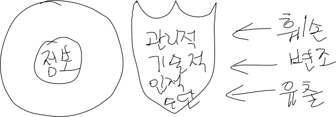
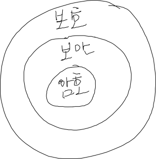
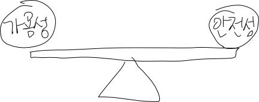

암호론 2
========

-	짧은 줄 유머. zzzzzzzzzz 고조선 시대 wwwwwwww
-	회원가입 등 → 컴퓨터에 저장된 개인정보, 수십억 투자한 고급기술 등
	-	→ 악의적으로 가지려는 사람들
	-	→ 보안 철저 : 정보들을 지키자
	-	→ 완전 감추는 게 아니고, 허가 있는 사람들은 볼 수 있어야.
	-	→ 관리자 : 도덕성!
-	수 없이 많이 생성되는 데이터들, 신상털기 등...
-	→ 어떻게 보호할건지

파트 1 : 암호
=============

-	01. 정보보호
-	02. 암호의 세계
	-	암호 : 어두운, 기호 : 약속되지 않은 기호로 본래의 데이터를 표현.
-	03. 암호의 역사
-	04. 대칭암호
-	05. 블록 암호 모드 : 암호화되는 암호의 단위에 따라서.
-	06. 공개키 암호
-	07. 하이브리드 암호 시스템 : 공개키 암호와 대칭키 암호의 잡종.
	-	암호 시스템 : 여러가지를 포함하는 무언가. 암호를 위해 준비된 체계?

파트 3 에 대해
==============

PGP 등의 네트워크가 섞인 부분은 1학기때 하기 힘들 듯.

01 정보보호
===========

01 네트워크 사회와 정보보호
---------------------------

-	스마트 워크
-	요즘은 SNS가 더 무섭다 : 연애인들의 극단적인 선택 등
-	금고는 요즘 금방 다 부숴버림 : 물리적 공학은 한계가 있다 : 어떻게 보안? 잠이 안 오는 최고 경영자

### 1.1 업무 패턴의 변화

-	옛날 업무패턴 : 전부 수기(손)로.
	-	월급봉투에서 이메일 명세서와 통장으로.
-	네트워크를 통한 업무 처리
	-	이메일, 오디오, 비디오, 인스턴트 메시지, 소셜 미디어, 텍스트 메시징
	-	잠 자지 않는 카톡...
	-	면 대 면 (face-to-face) 하는 양이 줄어듬.
	-	악플 등에 대한 잡담

그 요인은...

### 1.2 인터넷 환경

-	알파넷이 인터넷으로 : 전세계로 가는 인터넷
-	ICT 활용하는 정도를 나타내는 지표 : E-readiness
	-	수능 문제 유출에 대한 이야기.
	-	연결성, 기술적 인프라, 비즈니스 환경, 사회 문화적 환경, 법률적 환경, 정부 정책과 비전, 소비자와 비즈니스 분야 적용도
	-	똑똑한 젊은이들의 촌 농사 온라인 직매 이야기
-	교과서 : 막 바뀌고 있다 라는 내용.

### 1.3 스마트워크

-	굳이 왜 출근해? 재택근무 등 : 업무시간의 자유성 등
-	시간, 공간 자유성
-	스마트워크센터
	-	생산성 향상, 일자리 창출, 교통량 감소, 고령화 / 저출산 문제 해결 (되긴 커녕)
-	월급타서 집 어떻게 삽니까?! (결혼 X) → 카푸어 족 등 → 사교육 폐지?!
	-	불쌍한 대학생들, 남학생들, 결혼 못 하는 잡담... 세상 이야기. 결혼 포기한 사람들의 모임 등
	-	교육에서부터가 문제가 있지 않은가
-	자료전송의 빈번화
	-	안전하지 않은 통신이 빈번화
	-	→ 정보보호문제 대두
-	요즘 꿈을 원대하게 가지면 죽습니다.
	-	어렵다고 안 할수는 없다 : 남들 다 뛰어가는데...
	-	안 할 수는 없다ㅏㅏㅏㅏㅏㅏ

### 1.4 무슨 일이 벌어지는가?

-	네트워크를 통한 업무 (가 상당히 많아졌다)
	-	심지어 홈쇼핑...
	-	인터넷 쇼핑, 인터넷 뱅킹, 이메일 사용, 개인정보 제공, 생물학적 정보 제공, 유틸리티 활용, 프로그램 설치, 첨부된 파일 실행...
	-	모바일 뱅킹 만든 카이스트 교수가 통장 하나만 달랑 사용하고 인증서 하나도 발급 안 받는 이야기
	-	모바일 뱅킹은 왠만하면 하지 마세요.
	-	유전자 검사라던가. ...
-	위험하지 않을까? 이거 괜찮은걸까? → 뭔가 공격을 당할 수 있지 않을까? → 예비책 : 보안

### 1.5 무엇이 두려운가?

-	누가 내 걸 다 지우면? 훔쳐가면?
-	정보노출, 정보변경, 위장 (B인 척 하기),
-	정보전달의 지체 (괜히 트래픽 만들어서 방해), 송신 / 수신 부정 (주문 헸는데 안 했다고 한다던가 아님 거꾸로), DoS 공격 (수많은 요청 : 서비스 포기하고 서버 사망 ,
-	신원 정보, 신용카드 사용, 온라인 송금, 전자상거래, 이동전화 통신...
-	포렌식 : 수사 기법

02 정보보호
-----------

정보보호를 알려면 정보를 알아야함.

### 2.1 정보보호란?

-	사전적 의미 : 책
-	정보?
	-	넓은 의미 : 모든 데이터.
	-	좁은 의미 : 데이터가 디지털화된 것.
-	정보보호.
-	
-	보호 > 보안 > 암호 (그림)
-	
-	그림 : 정보의 가용성과 안전성
	-	
	-	가용성 : 쉽게 접근 가능
	-	안전성 : 안전.
	-	부잣집 들어가는데 생기는 복잡한 절차 : 그 안에 중요한 것 : 보안 : 접근하기 쉽지 않다
	-	→ 안전성을 강화하면 가용성이 떨어진다 → 적절한 균형을 찾아야.

### 2.2 정보보호의 역사

-	외국 시골의 답답한 인터넷 이야기
-	요즘은 WWW 세대 : 원하는 정보를 언제 어디서나.
-	60년대 : 냉전시대 : 전쟁 정보의 보안 (무기 등)
-	70년대 : 게인 컴퓨터, 네트워크 확산 시대 : 암호 풀기 쉽게 만든 튜링머신.
-	그래픽의 발전 등
-	→ 시대벌로 보호해야할 것들이 있더라
-	→ 요즘은 금융, 전자상거래 등.

#### 60년대 : ARPANET

-	Rand Report R-609
	-	보안 개념의 등장
	-	사용자 권한 등
-	MULTICS : 보안에 중점을 둔 최초의 시스템
-	현대 암호는 나온지 얼마 안 됐다 : 근데 벌써 막 깨지고 있음 : 양자 암호, 홍채 인식, 지문 인식 등... (부정확성 얘기까지.)

#### 70년대 : 애플 컴퓨터와 5인치 플로피 디스크.

-	저장 장치의 발전에 대한 이야기. USB 이동식 디스크

#### 80년대 : 네트워크.

-	네트워크 보안이 대두

#### 90년대 : WWW

-	표준화 필요성 대두 : 다 다른방식으로 지켰다
-	물리적 보안이 주류

#### 2000년대 : 금융거래 등

-	네트워크 보안...
-	물리적 보안이 깨젔다

#### 현재 : 무선 네트워크와 이동성

-	보안 개념 부족
-	유선보안에서 무선보안으로
-	보안 교육이 필요하다
