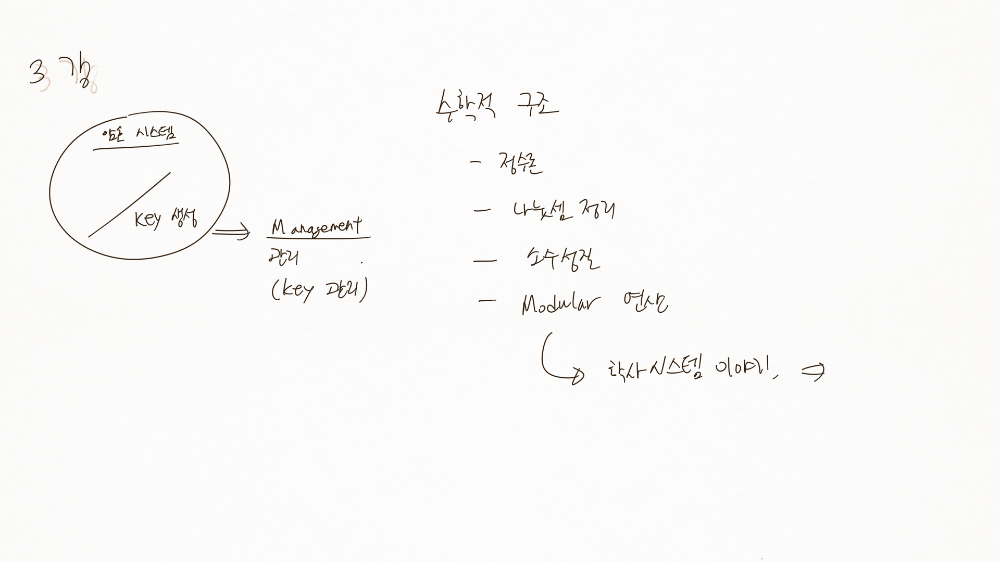
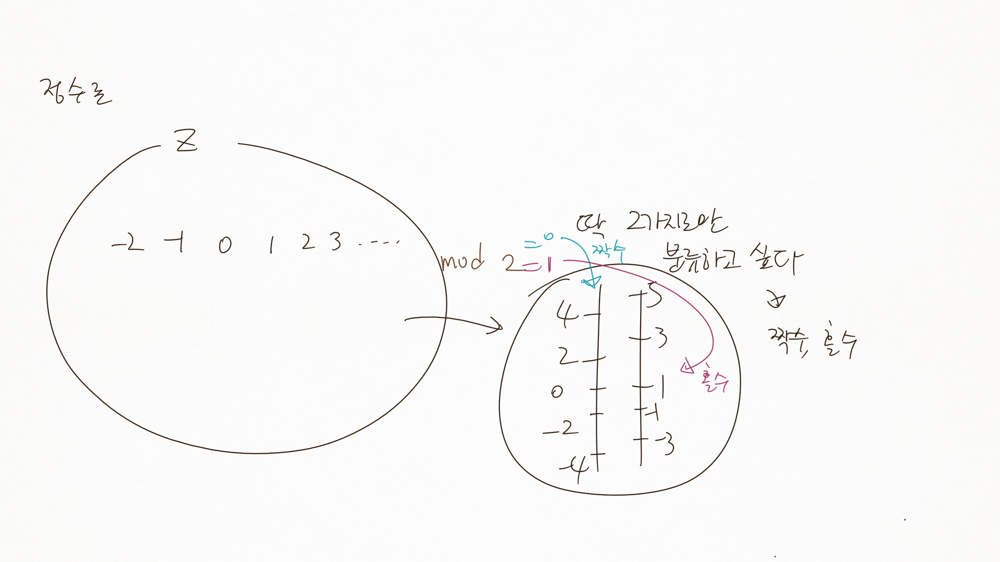
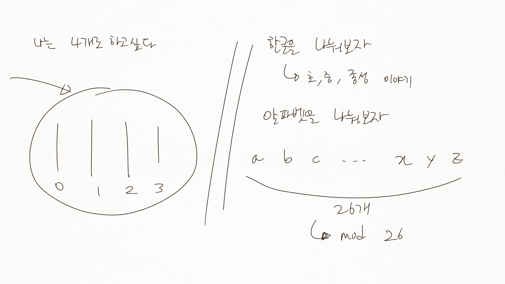
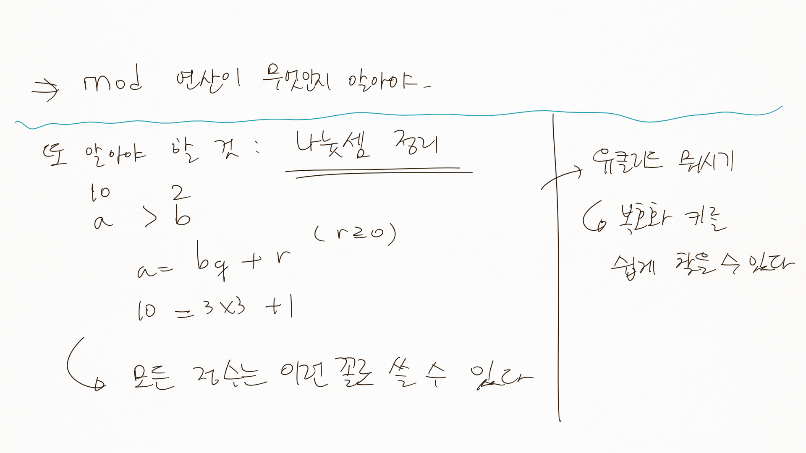
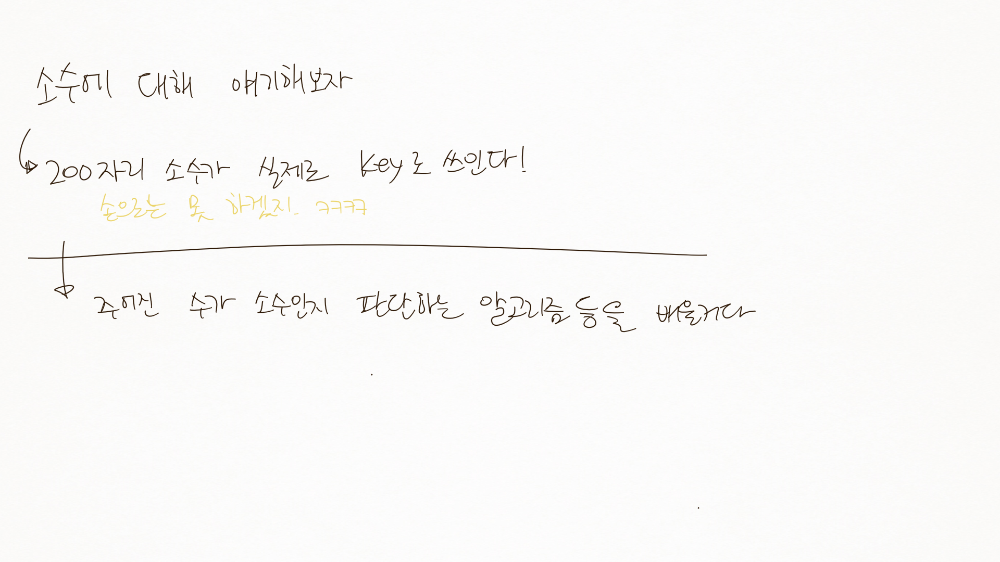
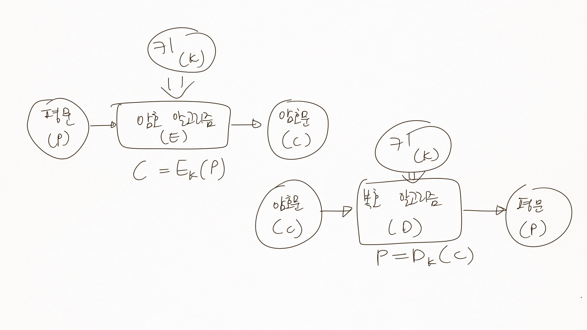
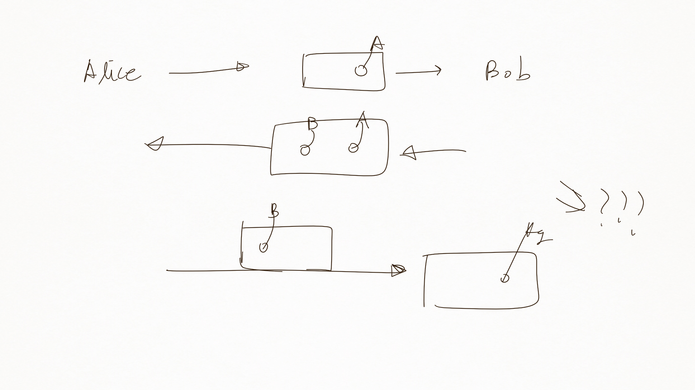

암호론 03
=========

-	제목의 인덴트 하나씩 줄임.
-	정수론 등의 기본 수학이 되어야 고전암호를 배울 수 있음 (곧 배울 예정)

2장 암호의 세계
===============

SECTION 02 암호
---------------

### 2.1 암호 시스템의 요소

-	평문 (plaintext)
-	암호문 (ciphertext)
-	암호화 / 복호화 알고리즘 (encryption / decryption algorithm)
	-	주어진 수가 소수인지 파악하는 알고리즘 등을 배울거다
-	키 (key) : 복호화할 때 사용
	-	키가 뭐에요?
	-	`무슨 일이 있으면 노예를 보내겠다. 머리카락을 깎아봐라. 머리에 내 메시지가 담겨있을거다`
	-	왕재산 사건 : 요즘 북한군은 지령을 동영상으로 보낸다
	-	key 관리하는 부분이 중요.

    

### 2.2 암호 시스템의 기호적 표현

-	`C = E_k(P)`
	-	평문 P를 키 K를 이용하여 암호화하여 (E) 암호문 C를 얻는다
	-	C : cipher
-	`P = D_k(C)`
	-	암호문 C를 키 K를 이용하여 복호화하여 (D) 평문 P를 얻는다

↓ 그림으로

섹션 03 대칭 암호와 공개 키 암호
--------------------------------

`카이사르 왕이 썼던 암호화 알고리즘도 배워볼거다`

### 목차

-	키 교환 알고리즘
	-	
-	대칭키와 비대칭키
-	하이브리드가 뭔지 보자 (간단한 거 보낼땐 은행에서도...)

### 3.1 암호 알고리즘

-	암호화 알고리즘 : 평문을 암호문으로 만드는 절차, 암호화 과정
-	복호화 알고리즘 : 복호화 과정

아이고 내 인생아... 필기 다 놓치네

### 3.2 키

-	암호 알고리즘의 키 : 매우 긴 숫자
-	2진화된 숫자로 변경하여 사용
-	암호키의 안전
	-	키가 안전하다 = 적이 알아낼 수 없다
	-	0~9 2자리면 100개만 시도해보면 암호를 알 수 있다
	-	요즘 은행 암호는 4자리 → 10^4개 : 비밀번호가 겹칠 수 있 : 맞출 확률 = 4/10000 → 0.0025???
	-	키가 길수록 안전해질것이다

### 3.3 대칭 암호와 비대칭 암호

-	대칭 암호 (symmetric cryptography)
	-	암호화, 복호화 키가 동일
-	비대칭 암호 (asymmetric cryptography)
	-	암호화, 복호화 키가 서로 다름
	-	DES
	-	송신자 (키 한 쌍), 수신자 (키 한 쌍)
		-	(개인키, 공개키) 쌍
			-	→ 수학적으로 밀접한 연관
-	공개키 암호 (public-key cryptography)
	-	키 중 공개키는 공개 → 이름이 공개키

### 3.4 하이브리드 암호 시스템

-	암호의 목표 3가지
	-	기밀성
	-	무결성
	-	가용성
-	→ **가용성**의 중요성
	-	느리면 못 써먹음
	-	그렇다고 보안이 안 되면...
	-	→ 적절히 조합
-	하이브리드 암호
	-	대칭 암호와 공개 암호를 조합
	-	→ 장점 조합
-	한국의 보안에 대해.
	-	주민번호 = 중국에
	-	아이핀 = 최근에 털림
	-	암호는 **언젠간 다 뚫림** → 암호는 깨지라고 있는거다
	-	과제... 한수원...

`가급적 수학은 배제중`
