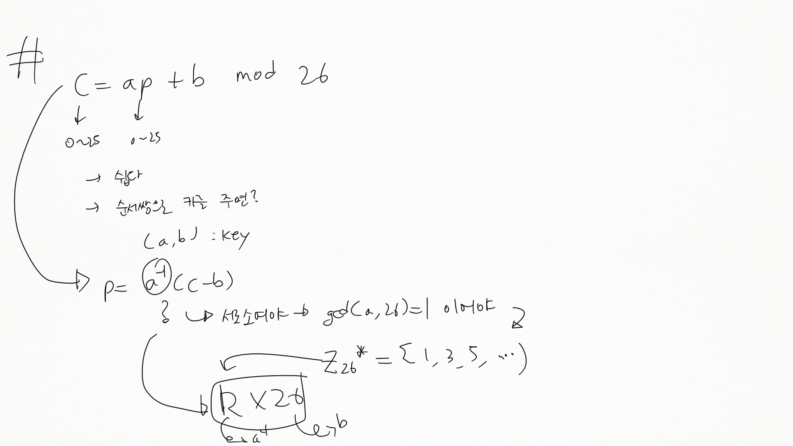
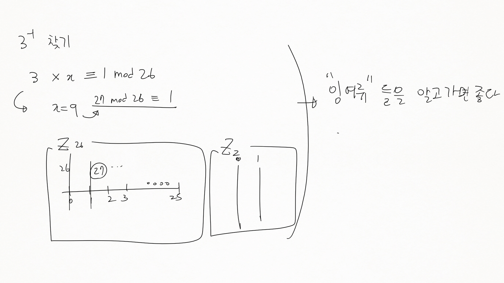
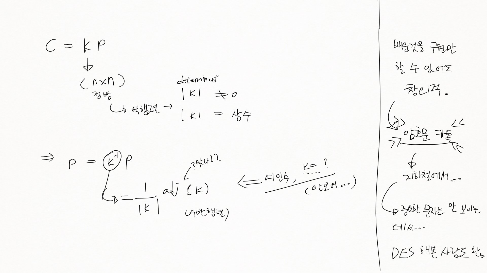

암호론 5
========

-	순열
-	enigma의 key 갯수 → A ~ Z : 단어 갯수에 따라 다름? → 26!
-	목표 : 암호 알고리즘 전체를 이해하는 것보다는 암호의 어느 부분이 중요한지, 암호로써 해결할 수 있는건 뭔지 등을.
	-	컴퓨터학부에서 제일 먼저 배워야되는게 뭘까요 :
		-	컴퓨터 시스템 ← OS 배워야 ← 정확하게 알아야
		-	네트워크 계층에 대해 배워야
		-	시스템이 네트워크로 물려있을 때...
		-	정당한 사람인지, 허가받은 사람인지... → 암호 기술
	-	→ 제일 많이 공부해야하는게 암호론이 아니다
		-	→ 암호가 왜 든든한지.
	-	보안에 대해서 알아보라는 숙제 등 → 큰 걸 봐야. → 문제가 어디서부터인지
	-	암호는 함부로 만들 수 없다
		-	암호가 국가표준으로 들어가기까지 엄청난 임상실험비용이 들어감
-	항상 key 관점에서 볼 줄 알아야
	-	전수조사 → 요즘 컴퓨터로는 금방...
	-	키가 많으면 찾는데 오래걸린다 → key가 안전성을 판단해준다 → 이런 관점으로 보라

정수론에 관하여
---------------

-	컴퓨터의 모든 데이터는 정수로 : ! 조차도
-	→ 나머지 구하기, gcd() 알고리즘, 디오판투스 방정식 → 묘비명에 써놓은 방정식
-	암호를 좀 파려면 정수 쪽을 파야.
-	이런 암호 알고리즘이 실제로 활용됨

에니그마, 짧게
--------------

-	다중 치환 암호 → 빈도수 측정을 못 하도록
-	Permutation (순열) 을 이용한 암호 → 자연수를 늘어놓을 수 있는 갯수
	-	! (Factorial) → 경우의 수, 가짓수

오늘 : 섹션 05부터, 그 전에 비장느르부터.

잠깐 잡담
---------

-	aero기술? 회사의 고통? RND 센터? → 자문 구하기? → 수학에서 막힘!
-	연구소 쪽으로 갈 사람은 수학이나 물리를 놓으면 안 됨

곱셈 암호
---------

-	평문과 암호문은 Z_26의 원소, 키는 Z_26\* 의 원소 → 서로소여야 키가 될 수 있다 → mod 연산의 역원
-	
-	
-	암호 담당자 → **암호 상품이 많음** → 어떤 암호 상품을 사야 할까에 대한 걸 판단해야...
	-	→ 가용성
	-	인적 보안은 따로 해야

아핀 (Affine) 암호
------------------

-	공간상 벡터를 평면으로 긋는다 → 하나의 선 → 항상 직선 → 아핀 변환이라고도 함 (영상쪽)

플레이페어 (Playfair) 암호
--------------------------

-	이동 규칙에 따라서 표를 따라 암호화, 복호화
-	표 자체가 키가 됨
-	I/J는 평문에 가깝게 해석...

비지니르 (Vigenere) 암호
------------------------

-	문자를 하나의 키로 간주
-	코드북
	-	키 모음
	-	: 하나의 책을 정해서, 거기에 나오는 N자리 글자를 암호로 쓰자
	-	유명한 책을 사용하기도 함 : 노인과 바다, 성경 등
-	key가 PASCAL 이면 6개 단위로 PASCAL 을 더하고 (암호화) 뺌 (복호화)
	-	→ 평문에서의 빈도수가 암호문에서 나타나지 않음
-	Vigenere 표
	-	다중 문자로 흩어진다
	-	가로 → 원문, 세로 → key → cross 일치하는게 암호문

비지니르 암호의 해독 : Kasiski 테스트
-------------------------------------

-	분석하는 방법이 다양
-	3개씩 끊었을때 반복되는 녀석들이 있더라
-	공약수 사용 → 키의 길이가 배수임
-	에니그마 → 암호를 만든다 →
	-	→ 이런 걸 하다보니 계산기가 나오더라 zzzz → 컴퓨터!
		-	예전까지만 해도 수학 → 전산학이었음...
		-	→ 용어제한 풀림 → 정보통신학과
		-	소프트웨어 (컴과) / 미들웨어 (컴공) / 하드웨어 (전자과)

힐 암호
-------

-	키를 행렬로. → 역행렬을 갖는 정방행렬이어야 함
-	
-	바쁘다고 하지만 실제로는 안 바쁨
	-	10x10의 역행렬 구하는 프로그램을 짠 이야기
	-	바쁘다는 핑계, 뭐든지 바쁜 와중에 해야 (웃음)

로터 (Rotor) 암호
-----------------

-	디스크를 회전시킴
-	→ 이걸 사용한게 에니그마

---

이 외에도 키가 없는 전치암호 등도 나오는데 → 순열? → DES 암호 등도 나옴. DES : 전치행렬. 고전암호를 이해할 수 있다 = 현재암호를 이해할 수 있다

---

휴식

---

-	잡담 : 건강할 때 운동을 하세요 / PT체조를 10분씩만 해도..
-	요즘 웃찾사가 개콘이랑 붙음- ← 테니스 얘기하다 나왔음
-	건전한 육체에 건전한 정신이 깃든다 ← sound body sound mind?

섹션 5 전치 암호와 치환 암호
----------------------------

-	전치 암호 : Permutation (순열) → 자리 바꾸기
-	다음시간에 에니그마의 예제를 전XX 군이.. 10~15분 사이에 발표를.

### 5.1 전치 암호 (Transposition cipher)

-	자리, 위치를 바꾸는 것
-	행렬의 전치? 를 생각하면.
-	평문과 암호문이 1:1 대응.

### 5.2 치환 암호

-	교환규칙이 1:1이 아니어도 무방
-	전치 암호 ⊂ 치환 암호

섹션 6 암호 알고리즘과 키
-------------------------

### 6.1 암호 알고리즘과 키를 분리하는 이유

| 암호명                     | 암호 알고리즘                                                                                         | 키                                                                |
|----------------------------|-------------------------------------------------------------------------------------------------------|-------------------------------------------------------------------|
| 시저 암호                  | 평문의 각 문자를 지정한 문자 수 만큼 평행이동                                                         | 평행이동하는 문자 수                                              |
| 단일 치환 암호             | 치환표에 따라 알파벳 변환                                                                             | 치환표                                                            |
| 에니그마 (통신키의 암호화) | 기계 → 플러그 보드의 연결선, 3장의 로터 순서, 각 로터의 설치 각도에 따라 알파벳 변환                  | 1) 플러그 보드의 연결선 2) 3장의 로터 순서 3) 각 로터의 설치 각도 |
| 에니그마 (통신문의 암호화) | 플러그 보드의 연결선, 3장의 로터의 순서 고정한 에니그마 기계 → 각 로터의 설치 각도에 따라 알파벳 변환 | 각 로터의 설치 각도                                               |

→ 암호 알고리즘과 키를 분리해서 생각한다!

-	암호 알고리즘 안에는 변경 가능한 부분이 반드시 포함
-	변경 가능한 부분이 키에 포함

---

연습문제는 해봐야.

CHAPTER 4 대칭 암호
===================

-	Section 01 문자 암호에서 비트열 암호로
-	일회용 패드 → 절대 해독 불가능한 암호 → OTP
-	DES란? → x-box가 공개 → 깨짐
-	트리플 DES → 복호화가 거꾸로 오래걸림 → 가용성 ↓
-	AES 선정 과정
-	Rijndael

Java 혹은 C로 구현해볼 수 있음 → 가능한 사람을 모아서 그룹으로...

Section 01 : 문자 암호에서 비트열 암호로
----------------------------------------

-	1.1 : 부호화
-	1.2 : XOR → XOR 연산이 많아졌다

### 1.1 부호화

-	암호 → 컴퓨터 사용 필수 → 손으로 한다고요? 16라운드...
-	midnight 를 각각 ASCII / Unicode 등으로 부호화 (나중에 주어지기만 하면 됨)
	-	ex) m → 0x6d → 0b0110_1101
-	암호화가 아니라 부호화임

### 1.2 XOR

-	XOR 은 Exclusive OR 혹은 엑스 오 아 라고 부름
-	기호 : (+) (동그라미 +) → 다르면 1, 같으면 0
-	비트열 XOR

#### 암호화 / 복호화의 순서와 매우 비슷

-	키 : B, 암호문 : A
-	암호화 : A (+) B
-	복호화 : A (+) B

#### XOR은 그림을 마스크한다

-	안 보이는데 은닉할 수 있다 (근데 여기서는 그거 하자는게 아니고...)

섹션 2 일회용 패드 : 절대 해독 불가능한 암호
--------------------------------------------

### 2.1 일회용 패드란?

-	→ 일회용 패드는 전사 공격에서 키 공간을 모두 탐색해도 해독 불가
-	비트당 하나의 키로 XOR 연산. 암호화, 복호화 모두.

### 2.4 해독할 수 없다

-	시간이 문제가 아님
-	전사공격을 해도 이게 맞는 평문인지 알 수 없다 → 모든 조합이 가능, 모든 패턴이 등장
-	→ 해독할 수 없지만, 키 관리가 어렵다

### 2.5 일회용 패드는 왜 안 쓰여요?

-	키 관리가 개판이라서요.
	-	키 배송
		-	키 길이가 통신문 길이와 같다
		-	키를 안전하게 보낼 수 있는 방법이 있다면 평문을 그냥 안전하게 보내고 말지...
	-	키 보존이 어렵다
		-	보존 잘 되면 차라리 평문을 그냥...
	-	키 재이용
		-	과거에 사용한 (랜덤한 = 확률적인) 비트열을 다시 쓰면 절 대 안 돼!
	-	키 동기화
		-	키 전송할때 키가 하나라도 어긋나면...
	-	키 생성
		-	난수를 대량으로 생성할 필요
		-	의사난수 x, 실제 난수!

섹션 3 DES 암호 : 그대~로 적용되더라 → 다음시간에.
--------------------------------------------------
