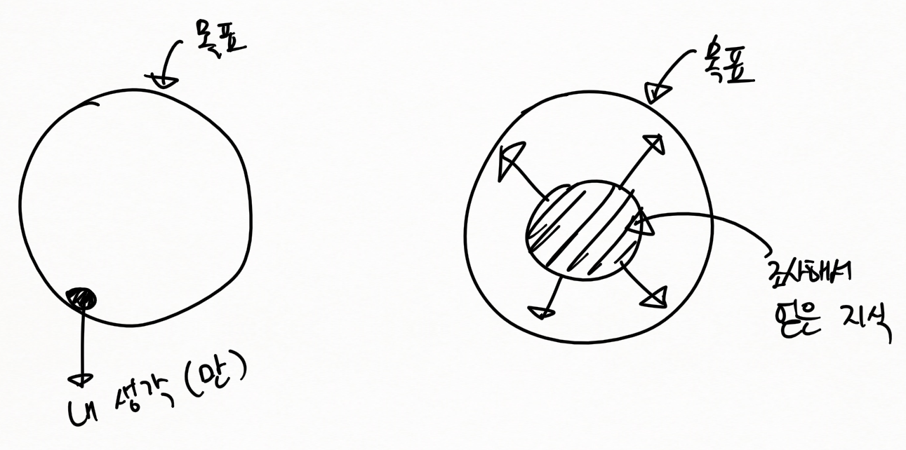

프로젝트 실무
=============

나 → 발표
---------

-	시연을 어떻게 할 건지 등
-	작품에 포커스

종합적 코멘트
-------------

-	계획서 수정해서 4월말 정도에 한번 더 → 시작은 해야...
-	계획 → 조사 →
	-	계획
	-	조사 → *상품을 개발한다* 라는 생각
		-	시장조사 (상품가치로서) (← 작품) (← 경제적인 부분)
		-	**핵심**기술조사 (← 작품에 포함되지 않더라도 : 유사한 분야로 갈 수 있도록 (안다와 모른다의 차이는 큼))
-	어떻게 찾을까
	-	검색 → 입맞에 맞는 정보가 잘 나오지 않음 → 포탈사이트 등에 의존...하면 좋은 자료를 바로 찾기 쉽지 않음
		-	관련자료가 있는 사이트를 알아내야?
		-	추천사이트 : [ITFIND](itfind.or.kr) → IT에 관련된 기술들을 찾아주는 사이트 → 분야별로 잔뜩... 검색할수도
			-	포털 뉴스 찾는 느낌이면 X, → 조사방식 전문적으로 → 배운다
				-	상식만으로는 만들 수 없다 → 충분한 관련조사가 필요
				-	동향 등등 → 전문적인 문서들이..
			-	특허 검색 : 특허가 알게 모르게 많아서 걸 린 다
				-	지금 내가 생각하는거 → 전세계 수백만명이 생각한다 → 없다고 가정하고!
				-	완성해서 팔았더니 특허소송!
				-	IT 특허 → 국제로 걸어야... 국제로 찾아봐야...
			-	학술논문검색
				-	논문에 좋은 자료 많음
			-	표준정보검색
				-	Sony가 망한 이유 : 국제 표준을 따르지 않음 (MPEG, JPEG 등의 압축기술?) → 리드할때는 괜찮지만, 삐꺾하면 주변이 따르지 않음
				-	삼성의 이유 : 다 종속되어있 → 삼성이 표준화 작업에 늦음
			-	열심히 읽어보다보면... → 석사학위논문 같은 거 하나 잡고 공부해보면
				-	
					-	혼자서 생각만으로만 하면 쬐~끔밖에 못함 : 씨앗이 커야!
			-	동영상도 있어! → 비전 등...
			-	IT 전자도서관인 셈
		-	이런 사이트가 많이 있어!
	-	IT 관련 정부부서
		-	미래창조과학부 → SW쪽, SW컨텐츠쪽
		-	산업자원부 → HW쪽
		-	(non-IT : ) 컨텐츠 → 문화관광부
	-	특허청 → 검색...
		-	특허를 보다보면 아이디어가 생겨요
		-	외국 특허 → 유료....

---

-	다음시간 발표 ? 하는건가? 발표자료 준비해와야하나?
	-	산업동향
		-	크게 중요하지는 않음?
	-	핵심기술
		-	디테일하게.
		-	너무 Broad 하게 찾지 말고, 작품에 근접하게.
	-	→ 기껏 졸업작품 만들었는데 노동집약적이이라던가
-	쳤는데 안 나오면 상품으로서 가치가 없...

---

-	다음시간 알아오기 → 발표
	-	산업기술동향 : 가장 근접한 범위 내에서 조사
	-	ㅁㄴㅇㄹ
-	3주 내내 수요일에 하게 생김...
	-	다음주, 다다음주 둘 다 수요일수업.
