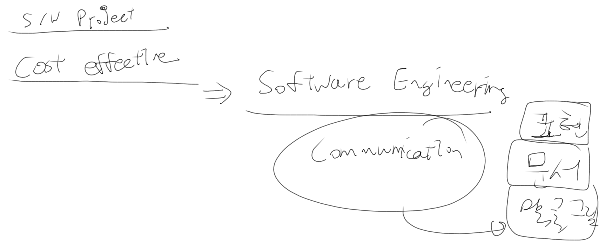

소프트웨어공학 01
=================

-	중간중간 실습을 하기 위해 우르르 올라오는 문제 때문에 강의실에서 하기로.
-	수업 도중에 컴퓨터를 만질 일은 없다?
-	지각은 쪼개서 30분 단위로 입력. (15분 늦어도 0.5시간 지각)
-	밤늦게 문자 X
-	결석은 결석이다 : 공적인 거, 증빙 가능한 걸 제외하고는 모두 결석처리.
	-	상 등의 경우는 딱히 말하지 않아도 됨
-	010-3250-7547 (노정규 교수님)
	-	[이메일](mailto://jkrho@skuniv.ac.kr)
	-	[강의홈페이지](http://cswin.skuniv.ac.kr)
-	등록금에는 질문 값도 포함되어있다 라는 말의 재귀

---

-	!@#$%^&*()_+
-	~!@#$%^&*()_+
-	주석 활용, 인터넷 활용

---

-	다른 방식의 사고방식, 처음엔 어려워한다.
-	교육을 통해 코딩이 어려운 게 아니라는 것을
-	→ 좀 더 이해하기 쉬울 것
	-	다 경험하고 온 아이의 답안.

SW 공학이란
-----------

-	지금까지 겪어왔던 것들
-	코딩 포함이지만, 여기선 이미 많이 해봤으니 제외하기로.
-	분석설계, 테스팅 툴 등으로 실습
-	형상관리 : 서브버전 (SVN) 으로 진행
-	UML : SW 설계에서 다뤘다고 생각, 나오긴 나오지만 주로 다루지는 않음
	-	과제로 나올수도 있음. (기초과목)
-	기초지식, 자질, 요구사항 : 코딩, 프로젝트를 많이 해본 사람

교재
----

-	Software Engineering 소프트웨어 공학 8
	-	전부 진도 나가지는 않고, 참고로.
	-	학기 끝나고 책 버릴거면 605호 앞 / 안에 ㅋㅋㅋㅋㅋㅋㅋ
-	강의노트 : cswin (홈페이지)

SW 공학을 왜 듣는가
-------------------

-	*사람이란 바른 말이라도 듣기 싫은 말을 하면 싫어함.*
-	SW 프로젝트를 하는데 필요한 지식과 기술들
	-	SW 개발의 전반에 걸쳐 여러가지 활동에 대해 배움
	-	→ 때론 뜬구름잡는 이야기, 여기저기 삐쭉삐쭉
-	일관된 목표 : SW 프로젝트를 **cost-effective**하게 만들기
	-	cost : 시간, 인력, 품질 등의 **자원**(resource)(돈 뿐만 아니라) : 자원을 적게 ↓
	-	effective : 품질 ↑, 사용성 ↑, 신뢰도 ↑ : 얼마나 좋은 SW를
	-	→ 얼마나 좋은 SW를 자원을 적게 사용하여 만들 수 있느냐
-	이런걸 무슨수로? → Software Engineering
	-	실무적
	-	사회 진출 전에 알고나가면 좋음
-	후배들의 성장 막기 : 버그 잡아주기 : 방향만 잡아줘야.
	-	KOSTA 고생이 시간낭비가 아니라 실력향상이다
-	SW 프로젝트를 망하지 않으려고. (잘 하려고가 아니라!)
	-	왜 망하는가
		-	너무 많은 사람이 참여
		-	요구사항이 계속 중간에 변한다 : 실컷 해놨더니 고치래, 다시 해놨더니 또 고치래 : 해놓고보니 원래거랑 비슷해!
	-	→ 좀 더 편하고 매끄럽게 개발하기 위한 것.
-	가장 핵심적인 단어만 뽑아보기 : **커뮤니케이션**(Communication, 의사소통)을 잘 해야
	-	의사소통 : 말, 글, 그림 : **문서** → 결국 문서를 만드는 것.
	-	혼자 하면 필요없지 않느냐 : **표현**을 하면 계단을 올라가는 셈, 발전.
	-	팀원간의 커뮤니케이션 + 스스로와의 커뮤니케이션 ← 말, 글, 그림 : 표현

---

