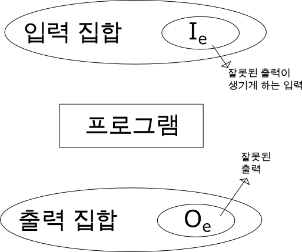
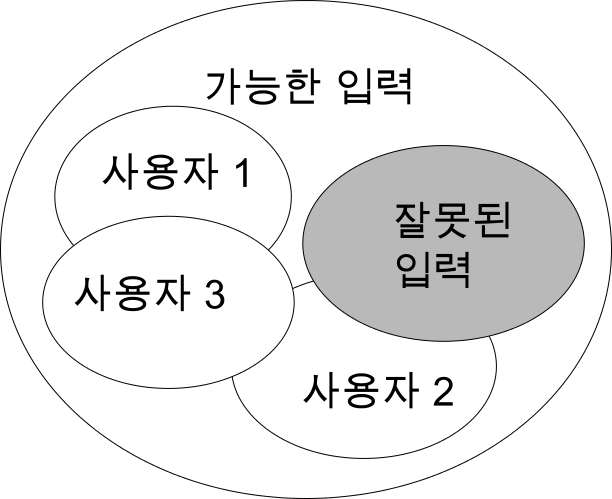
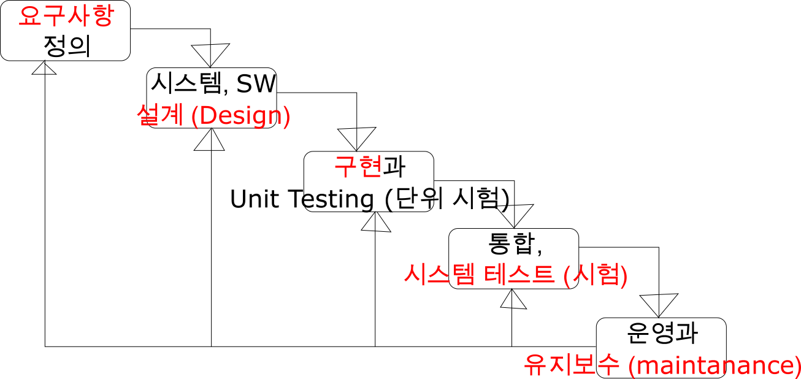

소프트웨어 공학 3
=================

-	생활영어 : Nature's call @ urban dictionary
-	프로그래밍 못 하면 프로그래밍 당한다 @ 조선일보
	-	비전공자가 듣는 컴퓨터공학 개론이 하버드대의 최대 인기 과목
	-	실라버스 : C++, DB, 웹 까지 모든걸 다 다룸. -> 훑어보기
	-	대학 강의 공개에 올라와있을 것.
		-	4학년들이 배울 건 없지만, 뭘 배우는지 볼 수 있음
		-	코딩 교육 붐
	-	SW 공학 설계 잘 하셨어요 (...전 공학과인데요.)
	-	SW가 제어하는 세계가 올 것
	-	사물인터넷
		-	모든 사물에 하드웨어가 아니라... **SW를 심겠다** 라는 것.
	-	프로젝트를 해봤다는 사실이 중요
		-	뭘 해봤다는 것이 중요하지는 않음

3.3 가용성과 신뢰성
-------------------

### 복습

-	기간 중 보장이 적으면 신뢰도 ↑
-	결함 → 오류 → 고장

### 계속



```cpp
int absolute (int n)
{
  // 문제 : 절대값을 반환하는 코드를 짜시오.
  return n<0 ? -n : n ;
}
```

-	절대값 함수가 잘 동작하는지 확인하고 싶음 : 어떤 값을 넣어야할까
	-	1 → 1
	-	-1 → 1
	-	3 → 3
	-	-2 → 2
	-	-5 → 5
	-	0 → 0
-	fault 방지의 테스트 방법
	-	validation
		-	정상값의 정상 결과가 나오는지 테스트?
	-	defect
		-	잘못된 출력을 나오도록 하는 입력을 찾는 게 목적
		-	나중에 더 나옴
-	예제에 대해.
	-	`[INT_MIN       -1] [0] [1      INT_MAX]`
	-	입력값의 카테고리를 만들어서 테스트.
	-	중요 : boundary
		-	INT_MIN, -1, 0, 1, INT_MAX

### 사용자와 신뢰도



-	사용자 그룹에 따라 신뢰도가 다르다
-	코드의 사용 빈도에 따라 오류 개선시 신뢰도 향상 정도가 다르다

---

3.4 안전성
----------

-	`시스템은 고장이 나더라도 사람 혹은 시스템 환경에는 결코 손상을 입혀서는 안 된다`
-	`신뢰할 수 있는 왜 소프트웨어가 항상 안전한 것이 아닌가` (84p)
	1.	요구사항은 완전하지 않다
		-	사람이 하는 일 : 요구사항도 완벽할 수 없다
	2.	하드웨어 오작동
	3.	사람이 잘못된 입력
		-	잘못된 입력 시 그에 따른 처리를 해야
		-	시키는 대로 한다고 꼭 안전한 SW는 아니다 → 이런 것도 Spec에 들어가야.
		-	ex) 랜딩 기어를 안 내리고 동체착륙한 사건 → 부기장한테 시켰다
			-	기본적인 원칙을 지키지 않음
			-	기본을 안 지켰을때 문제가 생길 수 있음, 지켜라.
			-	→ SW 를 조금만 더 잘 만들었으면. : 착륙 여부를 판단해서 랜딩기어를 자동으로...
		-	ex) 부모님들의 ~하지마라 : 자식들은 당해봐야 안다

### 안전성 용어

그림 3.8 안전성 용어

| 용어 | 설명 |
|------------|
| 사고 | 피해를 입히는 예상치 못한 사건 혹은 사건의 연속 |
| 위험 | 원인이 되는 잠재적 조건 |
| 손실 | 사고로부터 생긴 손실의 양 |
| 위험 정도 |  |
| 위험 확률 |  |
| 위험도 |  |

---

1. 위험 회피
    - 위험이 일어나지 않게 설계
2. 위험 탐지와 제거
    - 사고 발생 전에 위험 발견, 제거할 수 있게.
3. 손실 제한
   - 피해를 최소화하는 방제 기능이 있어야

## 3.5 보안성

- 보안성
    - 외부의 공격으로부터 자신을 방어하는 시스템의 능력을 나타내는 시스템의 속성
    - 공격 → **피해** → 보안 정도에 관계없이 *가용성, 신뢰성, 안전성* **↓**
        - 이유 : *가용성, 신뢰성, 안전성* 보장이 처음에 설치된 시스템과 같다는 걸 전제로 하기에
- 피해
    1. 서비스 거부
    2. 프로그램과 데이터의 망실
    3. 비밀 정보의 노출
- 보안 달성법
    1. 취약점 회피
        - ex) 문 : 문 안으로 들어오지 못하게 막기 (도어락)
    2. 공격 탐지와 중립화
        - ex) 문 : 들어오는 걸 감지 (보안 시스템의 적외선 센서)
        - IDS (Intrusion Detection System)
    3. 노출 제한
        - ex) 망 분리 : 공무원 등? (여전히 취약점 : USB 등으로 옮기기에)
        - 방화벽

---

그림 3.9 보안성 용어 (88p), 보지도 않고 지나감.

| 용어 | 설명 |
|------------|
| 노출 (유실, exposure) |  |
| 취약점 |  |
| 위협 |  |
| 통제 |  |

---

# 제 4장 소프트웨어 프로세스 (Software Process)

- 크게 4가지
    1. 명세 (specification)
    2. 설계 (design)
    3. 검증 (validation)
    4. 진화 (evolution)

## 4.1 소프트웨어 프로세스 모델

- 모델 : *대동소이하게 다들 폭포수 모델에 기반.*
    1. 폭포수 모델 (Waterfall Model)
    2. 진화적 개발
    3. 컴포넌트 기반 소프트웨어 공학 (**CDB** : Component Based Development)
        - > 교수님 : CDB 라는 말은 SI 업체 가면 자주 들을 듯

### 4.1.1 폭포수 모델



- 방법론
    - Method 1
        - 폭포수와 비슷, 단계 이름이 다르고 데이터 설계 자체에 더 중점.
        - 데이터가 중요 ( ex : 학사 시스템 )
        - 엔더슨 컨설팅 사에서 이름 지음
    - 무슨 짓을 해도 폭포수에서 벗어나지 않는다
    - 용어 2개
        - **AS-IS** : 현재의 시스템
        - **TO-BE** : 이후의 시스템 : 이후에 이렇게 만들거다 라는 계획
    - `회사이름-1 개발방법을 쓰겠다 → 쫄지 말라, 결국 폭포수 조금 변형이다`
    - CDB *→ 아무것도 아니다*
        - 설계 단계에서 Use-case diagram 부터 그리는 것, Seq-diagram, ... 여러 다이어그램 그리는 것.
