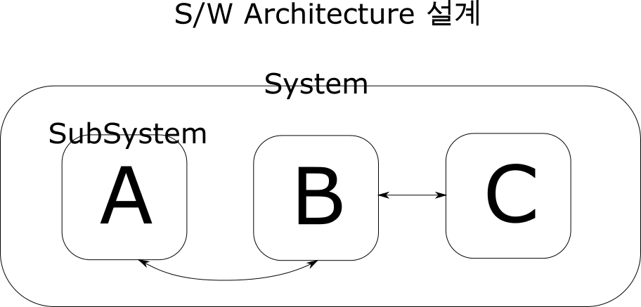
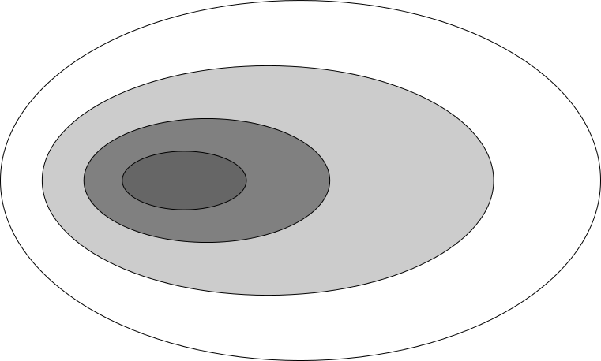
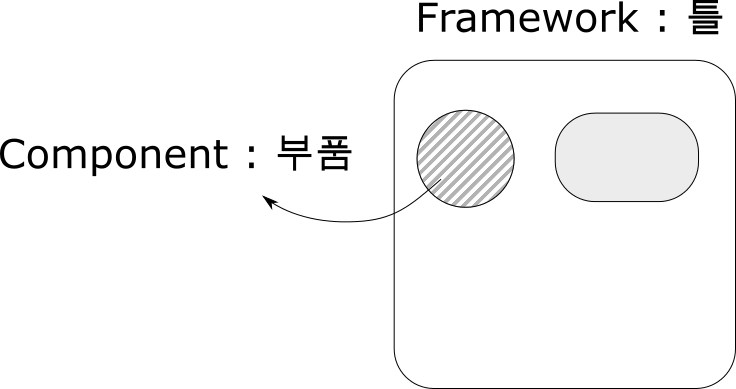
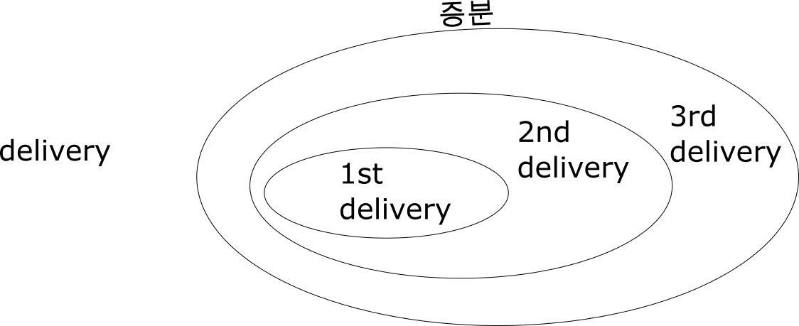

소프트웨어 공학 3
=================

-	생활영어 : Nature's call @ urban dictionary
-	프로그래밍 못 하면 프로그래밍 당한다 @ 조선일보
	-	비전공자가 듣는 컴퓨터공학 개론이 하버드대의 최대 인기 과목
	-	실라버스 : C++, DB, 웹 까지 모든걸 다 다룸. -> 훑어보기
	-	대학 강의 공개에 올라와있을 것.
		-	4학년들이 배울 건 없지만, 뭘 배우는지 볼 수 있음
		-	코딩 교육 붐
	-	SW 공학 설계 잘 하셨어요 (...전 공학과인데요.)
	-	SW가 제어하는 세계가 올 것
	-	사물인터넷
		-	모든 사물에 하드웨어가 아니라... **SW를 심겠다** 라는 것.
	-	프로젝트를 해봤다는 사실이 중요
		-	뭘 해봤다는 것이 중요하지는 않음

3.3 가용성과 신뢰성
-------------------

### 복습

-	기간 중 보장이 적으면 신뢰도 ↑
-	결함 → 오류 → 고장

### 계속


```cpp
int absolute (int n)
{
  // 문제 : 절대값을 반환하는 코드를 짜시오.
  return n<0 ? -n : n ;
}
```

-	절대값 함수가 잘 동작하는지 확인하고 싶음 : 어떤 값을 넣어야할까
	-	1 → 1
	-	-1 → 1
	-	3 → 3
	-	-2 → 2
	-	-5 → 5
	-	0 → 0
-	fault 방지의 테스트 방법
	-	validation
		-	정상값의 정상 결과가 나오는지 테스트?
	-	defect
		-	잘못된 출력을 나오도록 하는 입력을 찾는 게 목적
		-	나중에 더 나옴
-	예제에 대해.
	-	`[INT_MIN       -1] [0] [1      INT_MAX]`
	-	입력값의 카테고리를 만들어서 테스트.
	-	중요 : boundary
		-	INT_MIN, -1, 0, 1, INT_MAX

### 사용자와 신뢰도


-	사용자 그룹에 따라 신뢰도가 다르다
-	코드의 사용 빈도에 따라 오류 개선시 신뢰도 향상 정도가 다르다

---

3.4 안전성
----------

-	`시스템은 고장이 나더라도 사람 혹은 시스템 환경에는 결코 손상을 입혀서는 안 된다`
-	`신뢰할 수 있는 왜 소프트웨어가 항상 안전한 것이 아닌가` (84p)
	1.	요구사항은 완전하지 않다
		-	사람이 하는 일 : 요구사항도 완벽할 수 없다
	2.	하드웨어 오작동
	3.	사람이 잘못된 입력
		-	잘못된 입력 시 그에 따른 처리를 해야
		-	시키는 대로 한다고 꼭 안전한 SW는 아니다 → 이런 것도 Spec에 들어가야.
		-	ex) 랜딩 기어를 안 내리고 동체착륙한 사건 → 부기장한테 시켰다
			-	기본적인 원칙을 지키지 않음
			-	기본을 안 지켰을때 문제가 생길 수 있음, 지켜라.
			-	→ SW 를 조금만 더 잘 만들었으면. : 착륙 여부를 판단해서 랜딩기어를 자동으로...
		-	ex) 부모님들의 ~하지마라 : 자식들은 당해봐야 안다

### 안전성 용어

그림 3.8 안전성 용어

| 용어      | 설명                                            |
|-----------|-------------------------------------------------|
| 사고      | 피해를 입히는 예상치 못한 사건 혹은 사건의 연속 |
| 위험      | 원인이 되는 잠재적 조건                         |
| 손실      | 사고로부터 생긴 손실의 양                       |
| 위험 정도 |                                                 |
| 위험 확률 |                                                 |
| 위험도    |                                                 |

---

1.	위험 회피
	-	위험이 일어나지 않게 설계
2.	위험 탐지와 제거
	-	사고 발생 전에 위험 발견, 제거할 수 있게.
3.	손실 제한
	-	피해를 최소화하는 방제 기능이 있어야

3.5 보안성
----------

-	보안성
	-	외부의 공격으로부터 자신을 방어하는 시스템의 능력을 나타내는 시스템의 속성
	-	공격 → **피해** → 보안 정도에 관계없이 *가용성, 신뢰성, 안전성* **↓**
		-	이유 : *가용성, 신뢰성, 안전성* 보장이 처음에 설치된 시스템과 같다는 걸 전제로 하기에
-	피해
	1.	서비스 거부
	2.	프로그램과 데이터의 망실
	3.	비밀 정보의 노출
-	보안 달성법
	1.	취약점 회피
		-	ex) 문 : 문 안으로 들어오지 못하게 막기 (도어락)
	2.	공격 탐지와 중립화
		-	ex) 문 : 들어오는 걸 감지 (보안 시스템의 적외선 센서)
		-	IDS (Intrusion Detection System)
	3.	노출 제한
		-	ex) 망 분리 : 공무원 등? (여전히 취약점 : USB 등으로 옮기기에)
		-	방화벽

---

그림 3.9 보안성 용어 (88p), 보지도 않고 지나감.

| 용어                  | 설명 |
|-----------------------|------|
| 노출 (유실, exposure) |      |
| 취약점                |      |
| 위협                  |      |
| 통제                  |      |

---

제 4장 소프트웨어 프로세스 (Software Process)
=============================================

-	크게 4가지
	1.	명세 (specification)
	2.	설계 (design)
	3.	검증 (validation)
	4.	진화 (evolution)

4.1 소프트웨어 프로세스 모델
----------------------------

-	모델 : *대동소이하게 다들 폭포수 모델에 기반.*
	1.	폭포수 모델 (Waterfall Model)
	2.	진화적 개발
	3.	컴포넌트 기반 소프트웨어 공학 (**CDB** : Component Based Development)
		-	> 교수님 : CDB 라는 말은 SI 업체 가면 자주 들을 듯

### 4.1.1 폭포수 모델


-	방법론
	-	Method 1
		-	폭포수와 비슷, 단계 이름이 다르고 데이터 설계 자체에 더 중점.
		-	데이터가 중요 ( ex : 학사 시스템 )
		-	엔더슨 컨설팅 사에서 이름 지음
	-	무슨 짓을 해도 폭포수에서 벗어나지 않는다
	-	용어 2개
		-	**AS-IS** : 현재의 시스템
		-	**TO-BE** : 이후의 시스템 : 이후에 이렇게 만들거다 라는 계획
	-	`회사이름-1 개발방법을 쓰겠다 → 쫄지 말라, 결국 폭포수 조금 변형이다`
	-	CDB *→ 아무것도 아니다*
		-	설계 단계에서 Use-case diagram 부터 그리는 것, Seq-diagram, ... 여러 다이어그램 그리는 것.

---

휴식

---

#### 폭포수 모델 cont

폭포수 모델? 무슨 질문이 나왔는데??????

95p, 폭포수 모델의 주요 단계.

-	주요 단계
	1.	요구사항 파악(분석) & 정의 (요구사항 = Architecture)
		-	아키텍처가 먼저 나오는 경우도, SW 디자인이 먼저 나오는 경우도.
	2.	시스템과 SW 설계 (Design)
		-	SW 아키텍처 설계
			-	
			-	> 영차영차 만들자 하면 안 되겠죠.
			-	단계
				1.	System을 구성하는 Subsystem 들을 식별 (identify)
				2.	각 Subsystem의 기능 (= spec)
				3.	Subsystem 간의 Interface (= 관계)
		-	→ 아키텍처 설계가 끝나면 서브 시스템 설계를 해야.
		-	*요즘은 다들 비슷한 설계 → 할 게 별로 없다*
	3.	구현과 단위 시험
		-	잘 동작하는지 확인.
		-	ex) 절대값 함수가 잘 동작하는지
	4.	통합과 시스템 시험
		-	조각조각을 합쳐가며 잘 되는지 테스트
	5.	운영, 유지보수
		-	현실적으로 문제가 발생.
-	폭포수 모델의 철학 및 특징
	-	철학 : 해당 단계의 결과(산출물, artifact)는 **문서**
	-	진도 (이정표, milestone) 측정을 산출물로 → 관리자로서 편함
		-	장점
			-	둘러댈 수 없다
			-	진행 정도의 측정이 용이
		-	단점
			-	문서 오버헤드가 크다
			-	문서만 가지고 장난치는 경우가 생김
				-	ex) 쓸데없는 내용, 과거 내용 복붙 등
			-	문서를 안 고치고 진도를 나가기도.
	-	*실제로 각 단계들은 중첩되고 서로에게 정보를 준다*
		-	요구사항의 변경 등이 계속 일어남 ← SI / 팀장 등... ← 갑질이 아니라 요구사항은 원래 바뀜.
		-	실제로는 일련의 반복...
-	폭포수 모델의 문제점
	-	(위에 적은듯)
-	적용하기 좋은 프로젝트
	-	요구사항이 잘 이해되고, 개발도중 급격하게 변경되지 않는 경우에 사용

### 4.1.2 진화적 개발 (Evolutionary Development)



덕지덕지 붙이기법.

-	개발 방법 유형
	1.	실험적 개발
		-	잘 알려진 요구사항에서 시작
		-	고객이 제안한 새로운 기능을 차츰 추가
	2.	쓰고 버리는 프로토타이핑
		-	실험 : 잘 모르는 요구사항을 실험.
-	단점
	1.	프로세스가 보이지 않는다 ← **문서가 없으니** *(lack of process visibility)*
		-	*바빠죽겠고 문서 만들 시간도 없는데 **커뮤니케이션**도 안 된다면*
	2.	구조가 엉망이 되기도 *(시스템은 종종 제대로 구조화되지 못한다)*
	3.	*빠른 프로토타이핑 등의 별도 기술이 필요하기도*
-	개선법
	1.	카드, 칠판 등을 사용 *← 커뮤니케이션*
		-	ex) 어떤 오류가 있어요!, 지금 이슈들! 등을 포스트잇으로.
		-	> 노정규 교수님 : 소프트웨어 프로젝트를 망하게 하는 방법 : 개발자들이 혼자 프로그래밍에(만) 집중하게 하면 망한다
	2.	재구조화 (refactoring) *← 구조 엉망 해결*
-	적용하기 좋은 프로젝트
	-	소규모~중규모 시스템 (50만 라인 정도)
	-	옛날 책이라... : 요즘에는 프레임워크가 발달해서 직접 짜는 코드가 아주 적기도.

---

> 전체는 워터폴, 서브 프로젝트들은 진화적 모델을 쓰는 것이 적합하겠다

-	애자일 : 13장, XP(eXtreme Programming) 등
-	절차와 산출물이 복잡

### 4.1.3 컴포넌트 기반 소프트웨어 공학



-	재사용 기반. 부품(component)과 틀(framework)을 사용하여 재사용
-	KOSTA 교육 들었던 거에 대한 이야기?
	-	결국 게시판? → 비즈니스 로직을 빼고 대부분이 비슷함 (UI, 틀 → 프레임워크)
		-	프레임워크 : 조합해서 내용물을 채워넣는데 쓰이는 틀. *내 로직만 채워넣겠다*
-	용어만 알아두고 가자
	-	**부품** 을 사용하여 조합
	-	COTS (Commercial-off-the-shelf) system : 상용(기성품) 소프트웨어 *(→ 아마 프레임워크 등?)*
	-	legacy system
-	(어째 4단계 있는 건 설명 자체를 안 하고 넘어감)

4.2 프로세스 반복
-----------------

1.	점증적 인도 (incremental delivery)
2.	나선형 개발 (spiral development) → 언급하지 않겠다

### 4.2.1 점증적 인도

여기서 인도 = delivery



-	단계?
	1.	요구사항의 개괄적 파악
		-	> 점증적 개발 프로세스에서 고객은 *개괄적*으로 *시스템에서 제공할 서비스를 식별*한다.
	2.	우선순위 구분
		-	> 그들은 어떤 서비스가 가장 중요하고 중요하지 않은지를 인식한다.
	3.	우선순위 높은 걸 먼저 개발
		-	논외 : 다만 안 해본 걸 먼저 해봐야 : 나중에 못 할 수도
	4.	완성된 거 먼저 고객에게 인도
		-	→ 고객이 똑똑해진다
		-	다만 이 단계에서는 추가 요구사항을 적용하지는 않음 (시스템 증분(incremental)) → 다른 증분으로.
-	장점
	1.	고객이 모두 완성될때까지 기다릴 필요 X
	2.	고객이 똑똑해짐 → 추가적 시스템 요구사항의 정보를 얻을 수 있음
	3.	전체 프로젝트 실패에 대한 위험성이 적음
	4.	핵심이 더 많이 테스트됨
-	단점
	-	증분(incremental)이 비교적 작아야 함
	-	각 증분이 시스템 **기능을 제공**해야 함
-	점증적 방법의 변형 : XP (eXtreme Programming)
	-	매우 작은 증분을 개발, 인도
