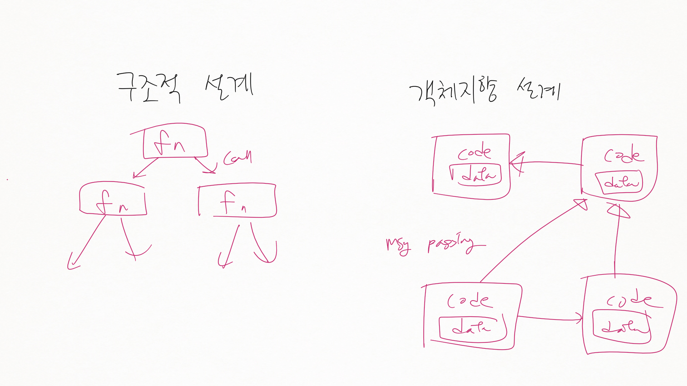
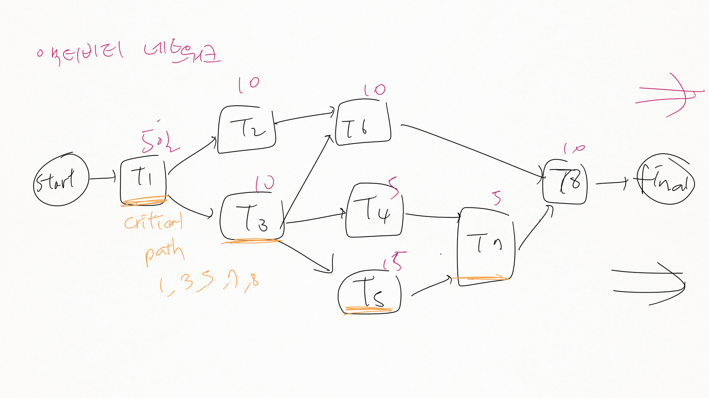
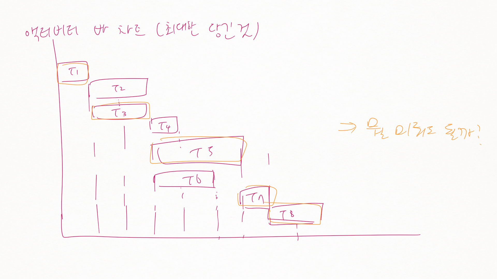
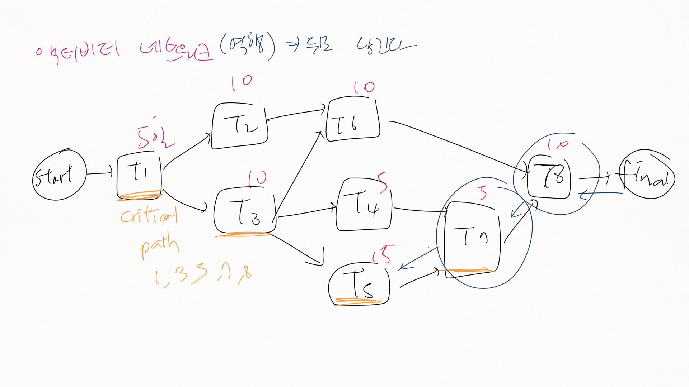
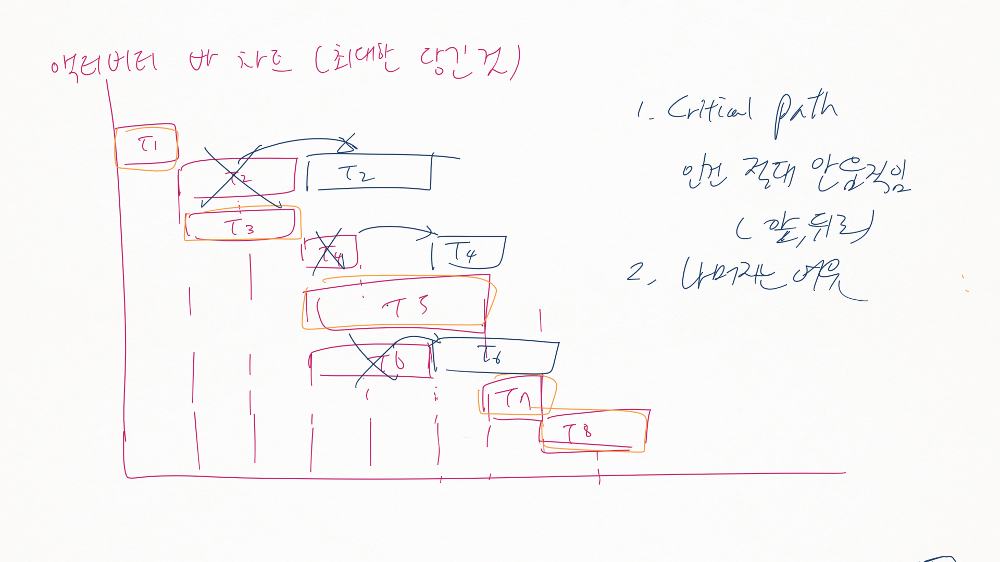
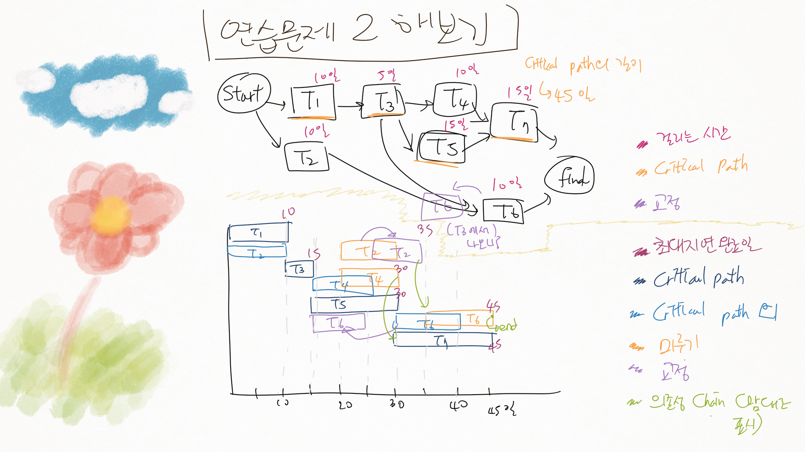
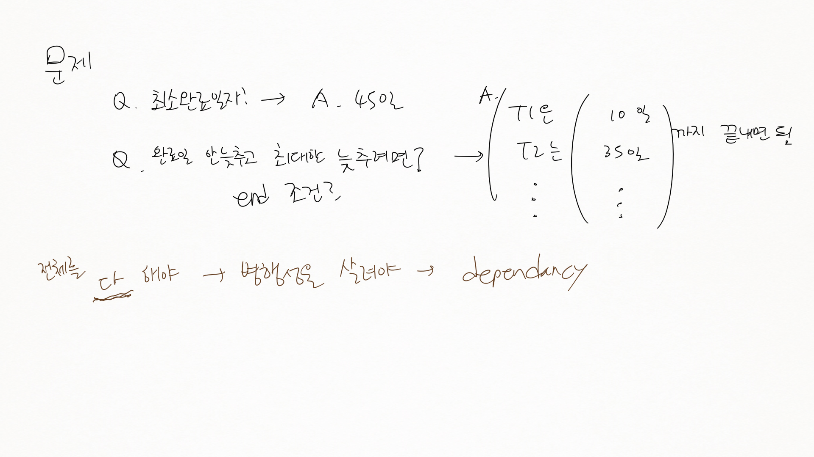

SW04
====

4.3 프로세스 활동
-----------------

### 4.3.1 소프트웨어 명세화

-	시스템에서 요구되는 서비스를 정의하고 이해하며, 시스템 운영, 개발의 제약을 찾아내는 프로세스
	-	요구사항 (찾기)
	-	제약조건 (찾기)
-	요구사항 공학 (Requirements Engineering)의 4가지 단계
	1.	타당성 조사
		-	예산 → 돈, 인력, 제작가능능력 등
		-	비즈니스 관점 → 비용 효과
		-	비용 적음, 신속하게 → 안 들지는 않음
	2.	요구사항 추출과 분석 (elicitation / analysis)
		-	주어지지 X, 추출 O
		-	ex) 학사관리 시스템
		-	토론
			-	현재 시스템 파악 (관찰, 직접 사용, 문서 보기 등)
			-	벤치마킹
			-	프로토타입 → 사람에게 물어본다
			-	기존 사용자에게 물어본다?
		-	파악하기
			-	기존 시스템 관찰
			-	사용자 관찰 / 인터뷰 (하면 못 답할수도)
		-	산출
			-	시스템 모델
			-	프로토타입
	3.	요구사항 명세화 (specification)
		-	산출물 : 문서
		-	사용자 요구사항 / 시스템 요구사항
			-	사용자 요구사항 : 고수준 : 최종 사용자 / 고객이 알아볼 수 있도록
			-	시스템 요구사항 : 상세히 : 개발자 맘대로 혹은 개발자 멍 때리지 않도록
	4.	요구사항 검증 (validation)
		-	검증 : CCC
			-	실현 가능?
			-	일관성? (Consistancy)
			-	완전성? (Completancy)
		-	수십 수백가지가 나올텐데

### 4.3.2 소프트웨어 설계와 구현

-	1~3은 지난시간에 설명함
-	1~3을 합쳐 아키텍처 설계라고 볼 수 있음
-	단계
	1.	아키텍처 설계 : 서브시스템 도출 / 관계 식별
	2.	추상 명세화 : 서브시스템 추상 명세, 제약조건
	3.	인터페이스 설계 : 인터페이스 & 문서화 → 모호성 X
	4.	컴포넌트 설계
		-	(컴포넌트 = 단위. 클래스가 될 수도, 다른 무엇이 될 수도. 정해지징 ㅏㄶ음)
	5.	데이터 구조 설계
	6.	알고리즘 설계
-	5~6 은 따로 설명할 게 없

---

#### 구조적 설계 (Structured Methods)

-	> `왠 생뚱맞게 나왔` `나왔으니 설명`
-	*기능 지향 설계* / *객체 지향 설게* 를 위해 나옴
-	UML 을 만들기 위해 통합됨
-	갑자기 Divide and Conquer
	-	
	-	구조적 설계
		-	함수 기능으로 쪼개진 시스템
	-	객체지향 설계
		-	서로 상호작용하는 객체로 보는 것
		-	책임 있음
-	시험 vs 디버깅
	-	시험 : 결점 존재 발견
	-	디버깅 : 결점 위치 찾기 & 수정

### 4.3.3 소프트웨어 검증 (Validation)

-	번역이 여기저기 난리임.
-	증명 (Verification) vs 검증 (Validation)
	-	증명 (Verify) : 명세(spec)에 맞는지 확인
	-	검증 (Valid) : 요구사항에 맞는지
-	시험 프로세스의 단계
	1.	컴포넌트 (혹은 단위) 시험 (test)
		-	해당 단위를 테스트하기 위한 프로그램을 짠다
	2.	시스템 시험 : 통합 후
		-	통합 후 시험
		-	(부품간의 인터페이스를 잘못 짰을 수 있음 ← 사람이 하는 일)
		-	종류
			-	예기치 않은 상호작용!
			-	컴포넌트의 인터페이스 문제
		-	단계적 통합 하기도 (크면 특히)
	3.	인수 시험
		-	***고객 데이터로 테스트***
		-	> 그 문제를 해결하라고 연봉 주고 데려다놓은 것 : 그 문제를 해결하라고 데려다놓은 것 : 세상은 예상치 못한 일들 한가득 : 문제 해결 능력을 키워야
		-	> 집념과 끈기가 제일 중요
		-	> 대기업에서 있었던 일
			-	> 부장~차장급 : 원래 자기 업무가 아니더라도 어떻게든 해결해야겠다 생각
			-	> 능력이 출중한 신입사원 : 자기가 맡은 업무가 아니라고 답하고 퇴근
			-	> 부장~차장급 : 자기들이 하는게 맞음 : 어떻게 하는지 노하우가... : 어깨 넘어로 배워야 하는데 맡은일이 아닌데요? 하고 가버리는...
			-	> 문제를 잘 해결하는것이 중요하다
			-	> 문제 해결력을 키워야 : 프로젝트를 해봐야 : 프로젝트 열심히 하세요 : 학점과 전혀 관계X
		-	알파, 베타 시험
			-	알파 : 고객이 시스템 요구사항 구현한건지 / 시스템 개발자 / 고객이 동의할때까지.
			-	결정적인 차이점
				-	베타 : 잠재적인 고객에게 던지는 것
				-	→ 통제되지않은 고객에게.
				-	엉뚱하다 : 다양한 상황이 나온다?
				-	→ **통제 여부**

### 4.3.4 소프트웨어 진화

-	중요하지 않음..
-	개발과 유지보수
	-	떼어놓고 생각 X
	-	개발과 유지보수의 구분이 X
	-	연속적인 것으로 생각해야

제 5장. 프로젝트 관리
=====================

-	activity 바 네트워크 그리기
	-	화살표 그리기!
	-	(Start) 동그라미 그리기 → 의존성 X → ... → (Finish) 동그라미 적기

5.3 프로젝트 일정관리
---------------------

### 5.3.1 바 차트와 액티비티 네트워크

-	책 
-	액티비티
-	각 액티비티마다 걸리는 시간
-	가장 오래걸리는 길 :
-	Duration
	-	**가장 긺 : Critical Path**
-	액티비티 네트워크와 액티비티 바 차트
	-	가능한 빠른 길을 찾아보자
	-	미뤄도 되는 일이 뭘까
-	바 차트
-	
-	
-	
-	
-	연습문제 2 해보기
	-	
		-	액티비티 네트워크의 배치는 중요치 않음
		-	바 차트를 그릴때 화살표를 기준으로 그려야
	-	
-	Critical Path : 아무리 최대한 줄이더라도 줄일 수 없는 기간의 path.
	-	아무리 열심히 해도 프로젝트는 Critical Path 만큼 걸린다
-	Activity의 duration을 줄인다고 가정하지는 않는다!
-	책 보기
	-	종속성, dependancy
	-	Critical Path (임계 경로)
		-	임계경로에 있음 → 지연 = 전체의 지연
		-	임계경로에 없음 → 지연 != 전체의 지연

### 과제

-	141p 5.6
-	홈페이지의 연습문제 : 실제 스케줄을 잡아보기 (동시에 2개만 가능) : 가장 빨리 끝내기
	-	Critical Path 를 밀어야 하는 경우 밀어도 됨 - (교수님 기억에는 안 밀어도 되었다던데..)
	-	서로 답이 다를 수 있음
	-	실제 스케줄로 확 고정시켜버리기. 미룰 수 있습니다 라는 표시를 하지 말 것.
-	홈페이지의 연습문제 2 : 역으로 액티비티 네트워크 그리기
	-	빗금 : 이동가능
	-	Critical Path : 2, 3, 5, 7
	-	dependency 갯수를 최소한으로 줄이기 (답이 여러개가 나올 수 있음)
		-	3 → 6으로 가는 dependency를 추가로 긋는 짓은 하지 말 것
-	과제 기한 : 다음주까지, 종이로 인쇄해서. 손으로 그려도 상관없음
	-	표지 만들지 말 것 → 표지를 넘기게 하지 말라

### 5.2.2 이정표와 산출물

-	진도관리, 비용 산정을 위해 문서가 필요 (건설이 아님)
-	이정표 (milestone)
	-	짧은 완료 보고서
	-	추상적으로 적지 말고 구체적으로
-	산출물
	-	고객에게 전달해야 하는 프로젝트 결과물
		-	물론 소스코드도.
	-	산출물이 보통 이정표 (→ 보고서 등)
	-	모든 산출물이 이정표는 아님 → 내부 상태 관리를 위한 보고서라던지.
