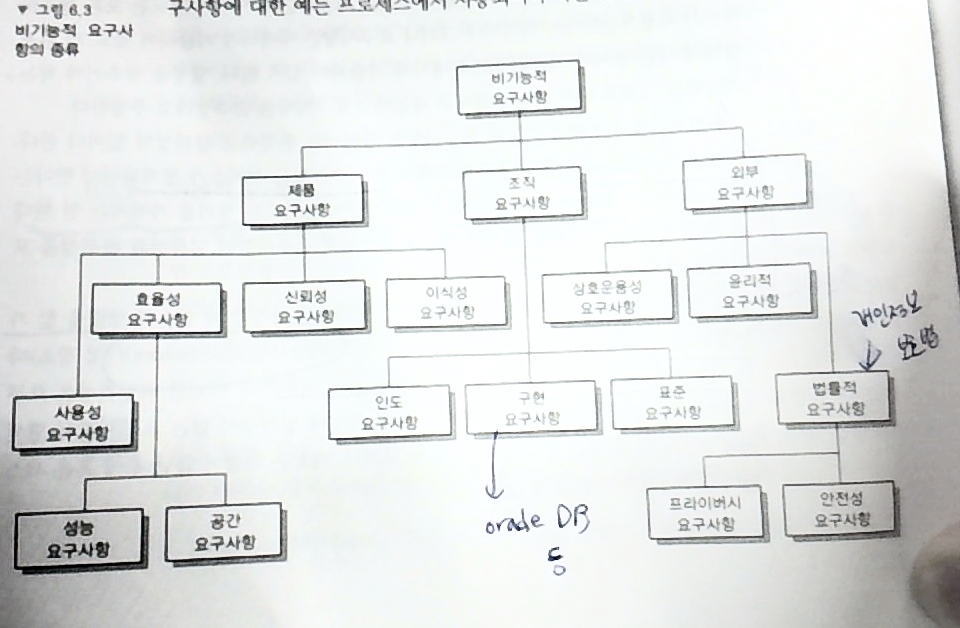

5장 110p?
=========

-	복습?
-	프로젝트 ∋ 액티비티, 액티비티가 모두 완료 = 프로젝트 완료
-	마일스톤은 복잡하니 제외하고 그림

5장 프로젝트 관리
=================

5.3 프로젝트 일정관리
---------------------

### 5.3.1 바 차트와 액티비티 네트워크

-	교재로 진행
	-	131p 그림 5.6
	-	132p 그림 5.7

5.4 위험 관리 (Risk management)
-------------------------------

위험 말고 불확실성. 번역...

-	뭘 하던 리스크는 발생
-	프로젝트 관리자는 위험을 관리해야 (← 안 하면 망함)
	-	예상치 못한 일이 일어날 것을 예상
	-	→ 대응책을 생각해두기
-	ex) 시험기간 공부를 여유 없이 준비해두면 나중에 비용이 더 듦 (돈 뿐만이 아니라)
-	위험 종류
	1.	프로젝트 위험 → 프로젝트 일정 / 자원에 영향을 미치는 것
		-	핵심 개발자가 개발 도중 회사를 떠난다던가
	2.	제품 위험 → 제품 자체가 잘못되었을 위험
		-	제품이 동작하지 않는다던가
	3.	비즈니스 위험
		-	경쟁사가 우리보다 비슷한 제품을 빨리 내놓는다던가
-	example (5.9)
	-	직원 이직 : 프로젝트
	-	관리 변경 : 프로젝트
	-	하드웨어 활용불가능 : 프로젝트
	-	요구사항 변경 : 프로젝트 및 제품
	-	명세화 지연 : 프로젝트 및 제품 : 나오는것도 늦은데 바뀌기까지 하면...
	-	규모 과소 추정 : 프로젝트 및 제품
-	> 위험 관리는 대부분의 프로젝트가 직면하고 있는 본질적인 **불확실성** 때문에...
-	침착하게 위험(불확실성)에 대처하는 단계
	1.	리스크 식별
	2.	리스크 분석
	3.	리스크 계획 수립
	4.	리스크 감시
-	교수님 : 시험에 안 나오는 얘기지만 인생을 위해 한 마디
	-	잘 나갈때를 주의해야. 그 때가 가장 위험하다
	-	IMF 등이 어떻게 보면 불안이지만 기회이다
	-	잘 나갈때 안 좋은 때를 생각 안 한다
	-	→ 안 좋은 상황이 올 수 있음을 생각, 대비해야.
	-	> 되면 좋고, 안 되면(도) 더 좋고
	-	→ 실패를 두려워하지 말라?
	-	실패 → 문책당할 걸 두려워하지 말라 → 실패에 대한 책임은 사장이 지겠다
	-	실패라도 해본 사람은 뭔가 배운 게 있다
-	실패하는 SW 프로젝트가 많다 : 늦었지만 납품했다던가
-	implicit → explicit
	-	머릿속에 있는 걸 머리 밖으로 꺼내 구체화하라
	-	: 다른 사람에게 알려줌 / 나 스스로도 파악
	-	**구체적**, **명시적** 으로 만들라

> 연애도 (너무 계산적인 거 같지만) Risk 관리를 좀 하시라.

2부 요구사항
============

6장 소프트웨어 요구사항 (Requirements)
======================================

-	요구 공학 (Req. Eng.)
	-	요구사항 : 시스템에 의해 제공되는 서비스 & 운영상의 제약조건
	-	→ 요구 공학 : 요구사항을 \[찾아냄, 분석, 문서화, 검사\]
-	종류
	-	사용자 요구사항
		-	고수준의 추상적 요구사항
		-	제공 서비스 & 운영 제약조건
		-	표현 : 다이어그램, 자연어
	-	시스템 요구사항
		-	시스템의 **상세한** **기능**, **서비스**, 운영상의 **제약 조건**
		-	목적 : SW 개발자에게 ~~던져주기~~.

| 수준 ＼ 내용 | 기능적 (Services function) | 비기능적 (Constraints) |
|-------------:|:--------------------------:|:----------------------:|
|       사용자 |  **추상적**, 사용자 대상   |                        |
|       시스템 |   **상세**, 개발자 대상    |                        |

-	ex) 사용자 요구사항 : *관리* → 시스템 요구사항 : 관리가 뭔지 여러 항목으로 *자세히 설명*

6.1 기능적 요구사항
-------------------

1.	기능적 요구사항
	-	- ~ 해야한다 뿐만 아니라 ~ 하지 **말아야 한다**도 포함
2.	비기능적 요구사항
	-	서비스, 기능에 대한 제약
	-	시간적 제약, 개발 프로세스와 표준 등
3.	도메인 요구사항
	-	*시스템의 응용 도메인에서 생긴 요구사항*
	-	전문가는 이런 게 있다는 걸 당연해서 미처 생각 못 함
	-	찾아내려 노력해야

### 6.1.1 기능적 요구사항

-	기능적 요구사항
	-	기능 & 서비스 서술
	-	소프트웨어의 종류 / 예상 사용자 / 시스템 종류 / 소프트웨어 사용처 에 따라 달라짐
	-	기능적 사용자 요구사항 : 추상적 (~ 기능이 있다)
	-	기능적 시스템 요구사항 : 아주 자세하게 (예외사항까지도)
-	명세의 특징
	-	완전성 (completeness) : 요구되는 모든 서비스가 정의
		-	실수, 생략할 수 있으니
	-	일관성 (consistency) : 모순되는 정의 가지면 X
		-	이해당사자 (stake-holder) 마다 요구사항이 다를 수 있음

### 6.1.2 비기능적 요구사항

-	비기능적 요구사항
	-	창발성을 명세화 (성능, 보안성, 가용성, ...), 제약조건 규정
	-	기능과는 무관한 것들 : 전체적으로 봤을때.
	-	emergent property : 시스템 밖으로 나타나는 성향? ← ???
	-	→ 시스템의 **제약조건**
-	비기능적 요구사항 불만족 → 전체 시스템 사용 불가
	-	RTOS가 실시간으로 응답을 못 한다던가 (← 가상메모리를 일반적으로 안 씀)
		-	가상메모리 → ? : 논리적 공간 → 속임수 : 스와핑 (메모리와 디스크의 영역을 서로 교환) → 시간이 많이 걸린다 : RTOS에서는 잘 안 한다
		-	프로세스 → 스레드 → 스레드로 관리 안 하고, 태스크 라는 이름으로.
		-	가상화 → 프로세스가 다른 프로세스에 영향 X but RTOS 는.....
		-	한 프로세스가 자원을 다 먹는다던가 하는 일은 없음

---

비트 교육 (25명)
================

-	채용할 회사에서 면접
-	고용노동부 교육비 100% + 학교 공간 지원
	-	전에 창조아카데미 = 서울시, 이번거 = 정부
-	회사 면접을 먼저 보고 교육 이루어짐

---

휴식

---

잡담
====

-	공부를 못 해도 사회적으로 성공한 친구들의 특징 : 줄 잘 탐?
-	작은 회사라도 자기가 뭔가 할 수 있으면.
-	교수님들 뒤에서도 이야기 통함?
-	비즈니스 세계에서는 싫은 전화라도 받아야.

### 6.1.2 비기능적 요구사항

-	종류
	1.	제품 요구사항
	2.	조직 요구사항
		-	구현 요구사항 : 오라클을 써라, 공개 SW를 써라 등
	3.	외부 요구사항
-	잡담 : 정부에서 공개 소프트웨어 활성화에 굉장히 적극적
	-	오라클 쓰지 말자

→ 그림

-	그림 6.6 (153p) 보며 요구사항 척도 확인.

### 6.1.3 도메인 요구사항

-	시스템 엔지니어는 이해하기 어려움
-	도메인에 있는 자들은 너무나도 당연해서 말 안 해줌

6.2 사용자 요구사항
-------------------

-	> 자세한 지식이 없는 사용자도 이해할 수 있도록
-	사용자 내부에서가 아닌 외부에서 봤을 때.
-	자연어로 씀 : 말을 잘 써야
-	표준 양식을 사용하라 →?

6.3 시스템 요구사항
-------------------

-	> 시스템 설계 시작 시점에 소프트웨어 엔지니어에 의해 사용될, 사용자 요구사항을 확장한 버전
-	시스템 구현을 위한 계약서의 일부로 사용될 수 있음
-	이상적 : 외부 동작, 운영 제약을 간단히 기술
	-	→ 요구사항에 설계가 들어오면 안 된다 (현실적으로는 불가능)
-	표현법이 있으니 읽어보시고...
-	방법 : **표준 양식**을 사용하는 게 좋겠다

그림 6.12 : 표준 양식을 사용한 시스템 요구사항 명세

| 인슐린 펌프 / 제어 SW / SRS / 3.3.2 |                                                 |
|-------------------------------------|-------------------------------------------------|
| 기능                                | 인슐린 양 계산                                  |
| 설명                                | 당 수치가 3~7 사이의 안전 지역에 있으면...      |
| 잔뜩 생략함                         |                                                 |
| 액션                                | 당 수치가 안전적이거나... →.... .... 뭔소리여 → |

그림 6.13

| 조건                    | 동작         |
|-------------------------|--------------|
| 혈당치가 감소 (r2 < r1) | CompDose = 0 |
| 생략                    |              |

-	방법 : UML 시퀀스 다이어그램 : **사용 시나리오**를 명확히 기술
-	→ 과제 : 고객, ATM, DB의 시퀀스 다이어그램 그리기
	-	예외는 생각하지 말고 (돈이 없다, 고장이다) → 잘 된 사례만
	-	책에 있는 걸 그대로 베끼면 안 되고 ATM에서 실제로 거래를 하면서.
	-	관찰해보면 알 수 있을지도.
	-	StarUML을 집에다가... → 구글 검색 (구버전 5.0 쓰세요)
		-	ShowSecNum 끄고, ShowActivation 끄기
	-	ex)
		-	→ 출금거래선택() →
		-	← 카드 넣으시오() ←
		-	→ 카드 넣음() → 유효한 카드인지 체크 →
		-	← 금액을 입력하시오() ←
		-	→ ...
		-	직접 해보고 그려오기
		-	하나하나가 다 화살표!

6.5 요구사항 문서
-----------------

... (놓침)

7장 요구공학 프로세스
=====================

-	요구 공학의 4가지 단계
	1.	타당성 조사 : 도움되는 프로젝트?
	2.	요구사항 발견 / 추출, 분석
	3.	명세화
	4.	검증

7.1 타당성 조사 (Feasibility test)
----------------------------------

-	조사하는 방법
	1.	조직의 전체 목표에 공헌?
	2.	현재 있는 리소스로 제작가능?
	3.	다른 시스템과 통합? (시스템은 혼자 돌지 않는다)
-	6가지 질답 (174p)

7.2 요구사항 추출 및 분석
-------------------------

-	조직의 다양한 부류의 사람들이 참여
	-	→ 이해당사자 (StakeHolder)
-	왜 요구사항 추출이 어려운가
	1.	모른다
		-	얻고자 하는게 뭔지
		-	비용이 얼마나 드는지 → 비현실적인 요구
	2.	암묵적인 지식을 사용하여 표현
		-	끌어내야.
	3.	다른 표현, 충돌하는 여러 입장의 요구사항
	4.	정치적 요소
	5.	동적인 비즈니스 환경
-	요구사항 추출, 분석작업 프로세스
	1.	발견
	2.	분류, 구성 (분류를 잘 하는게 능력)
		-	보통 : 서브 시스템 기준
	3.	우선순위 설정과 협상
	4.	문서화
-	문서화 부담 줄이기 : 표, 카드 형태 등

시험
====

-	잠정적으로 화요일 6시를
