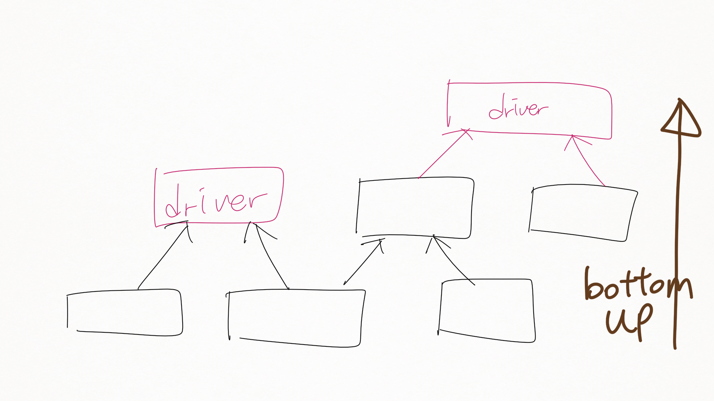
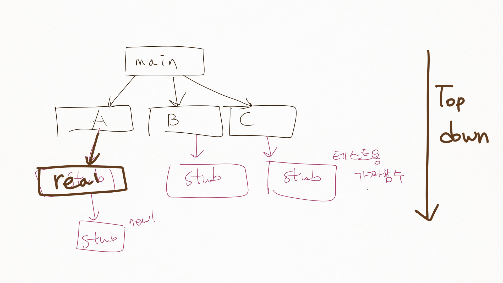

복습
====

v & v confi.... 했고요
----------------------

-	563p 옛날에 했던 테스트도 다시 한다
	-	수정시 새로운 결함이 따라올 수 있다 → 테스트를 다 짜놔라
	-	당장 출시해야하는 경우 되는곳은 고치지 않기

22.2 소프트웨어 검사
--------------------

### 22.2.1 프로그램 검사 프로세스

> 모두 상이한 배경을 가진 팀원들이 프로그램의 소스코드를 신중하게 **한 줄 한 줄씩** 검토하는 것을 기초로 한다

-	한줄한줄씩
	-	비용 → 현실적으로 불가
-	왜
	-	논리적 오류
	-	잘못된 조건
	-	조직 / 프로젝트 표준에 맞지 않는 코드
-	그림 22.5 : 현실적으로 저런 거창한 검사를 할 수는 없다
	-	낭독 : 그냥 눈으로 읽는 것 하고 낭독하는 것과는 다르다 : 천천히 가면서 같이 본다 : 정말 중요한 오탈자 찾기
-	검사 점검항목 (그림 22.7)
	-	데이터 결함
		-	변수는 모두 사용되기 전에 선언?
		-	상수는 모두 이름이 있음?
	-	제어 결함
		-	case문의 break가 있는가
		-	등
	-	입출력 결함
		-	모든 입력변수가 쓰였는지
	-	인터페이스 결함
		-	매개변수의 순서가 달랐다던지 ← 사람이 찾아야
		-	형 일치 ← 컴파일러가 찾아줌
	-	기억장소 관리 결함
		-	연결된게 수정되면 다른 데이터도 수정되는가
	-	예외관리 결함

22.3 자동화된 정적 분석
-----------------------

-	정적 분석기 : 프로그램에서 **가능한 결함과 이상을 찾아내는** 소프트웨어
	-	결함일 수 있다 (가능성)
	-	정적 분석기는 언어 컴파일러가 제공하는 오류 검출 기능을 보완
-	찾아주는 결함 : 그림 22.8 (572p)
	-	데이터 결함
	-	제어 결함
	-	입출력 결함
	-	인터페이스 결함
	-	기억 장소 관리 결함
-	하는 일
	1.	제어 흐름 분석 : 출구가 여러개인 반복문 / 도달할 수 없는 코드를 식별, 강조
	2.	데이터 사용 분석 : 변수 사용 등 : 초기화를 안 하고 썼다던지
	3.	인터페이스 분석 :
		-	강타입 언어인 경우 컴파일러가 확인
		-	C 같은 약타입 언어는.. (안습)
	4.	정보 흐름 분석 : 입출력 변수 사이의 종속성 식별
	5.	경로 분석 : 가능한 모든 제어경로 확인
-	메모리 관리는 신뢰도의 악의 축
	-	Java 같은 최신 언어에선 아예 오류를 발견하는 대신 회피해버린다
	-	C, C++은....

22.4 증명과 정형기법 (스킵)
---------------------------

---

-	야간까지 해서 보강을 합시다
-	월요일... : 18일 4:30분 ← 정적 분석의 실습 ← 혼자 해봐도 되겠다면 할 수 없지 뭐 -_-

---

23장 소프트웨어 시험
====================

-	목적
	1.	Validation test : 요구사항 만족?
	2.	Verification (defect) test : 결함(fault)이나 결점(defect) 을 발견
		-	S가 괴롭...잠깐 예제가 좀 뭐시기한데
		-	괴롭히면 (스트레스를 주면) 본성이 나옵니다
-	시험 종류
	-	컴포넌트 시험 (소프트웨어 개발자)
		-	언제 별개의 시험팀이 로직을 다 익히겠어요
	-	시스템 시험 (시스템 시험)
		-	블랙박스 시험, 스모크 테스트 (← ???) 등
-	검증시험 vs 결점시험
	-	검증시험
	-	결점시험
		-	입력값 → 출력값 : ~~일본을~~ 코드를 공격한다!
		-	결점이 없다면 결점 시험을 제대로 못 한 것 : 결점이 없는 경우는 없다
-	시험으로 완벽을 검증은 불가
	-	> 시험은 오류의 존재만을 보일 수 있는 것이지, 오류가 존재하지 않는다는 것을 보일수는 없다 - 다익스트라
-	목표, 목적 :
	-	시스템 개발자와 고객에게 소프트웨어가 **운영되어 사용하기에 충분히 훌륭하다**라는 것을 확인시키는 것
-	시험 프로세스의 일반적인 모델
	-	시험사례 (Test Case)
		-	가능한 모든 경우를 시험할수는 없다
		-	→ 효과적으로 지혜롭게 골라야
-	example
	1.	메뉴를 통해 접근하는 모든 시스템 기능들이 시험되어야
	2.	동일한 메뉴를 통해 접근하는 기능의 조합(예 : 텍스트 포맷팅) 등이 시험되어야
	3.	사용자 입력 제공 → 정확한 입력, 부정확한 입력 모두를 가지고 모든 기능이 시험되어야
-	개발팀에서 생각해내는데에는 한꼐 → 베타테스팅 필요

23.1 시스템 시험
----------------

-	책에서는 3 단계로.
	-	단위시험: Component (unit) testing : 컴포넌트의 기능을 시험
	-	통합시험: Integration (unit) testing : 컴포넌트간의 인터페이스를 시험 : 조립한 것
	-	시스템시험: System (unit) testing : 시스템의 기능을 시험
-	책의 챕터가 조금 일반과는 다르게 되어있다
	-	통합 시험 + 시스템 시험 = 시스템 시험
	-	시스템 시험 = 릴리즈 시험 (배포 시험?)
-	종류
	1.	통합 시험 (integration testing)
		-	시스템의 소스 코드에 접근...하긴 하는데 목적은 이게 아님
		-	인터페이스 테스트가 목적
		-	하다가 컴포넌트 버그를 찾을수도.
	2.	릴리즈 시험 (release testing)
		-	블랙박스 시험 : 내부를 보지 않고 시험
		-	→ 어떻게 시험?
		-	명세서 (요구사함 명세서) 로 테스트!
-	109 page 그림 매몰 비용?
	-	그림이 꺾어져있는 이유는 명세가 테스트때 쓰이기 때문.
	-	잡담 : 여러분은 다 까먹잖아요 : 비트교육 실무에 대한 잡담. : 교육을 열심히 받으면 취업가능 : 집중적인 프로젝트 경험이 필요! :
		-	기술면접 문제 → 프로젝트 뭐 해봤냐 : 왜 물어봤냐 = 경험
		-	→ 마쎄이? 를 실전에 활용해본 경우, 어떤때는 어떻게하고... (300이하 마쎙? 금지 등?)

---

휴식

---

비트 교육에 대한 잡담

컴퓨더과학과 학생의 벤처가 성공한 케이스 : Doublew 게임즈 (더빌유게임즈, 창업 멤버) ← 사람 계속 뽑는다

→ 사실 성공한 이유는 클라우드 기술..

충남대 교수 등...

코딩 실력은 평준화 → 커뮤니케이션 능력 / 사회에서는 외모도 중요 : Buisness friendly 한 성격과 외모..

소프트웨어 공학 잡담 : 경험해보지 않은 걸 하므로 뜬구름잡는 느낌

→ 결론은 프로젝트를 많이해봐라

---

### 23.1.1 통합시험

-	두 가지 통합방법
	-	하향식 통합 (top-down integration)
	-	상향식 통합 (bottom-up integration)
-	다른 컴포넌트를 흉내내고 시스템이 실행되도록 하는 추가적인 코드
	-	Stub (하향식)
	-	Driver (상향식)
	-	Skeleton
-	회귀시험 (regression testing) : 합칠때마다 더 테스트, 또 테스트하라
	-	그림 23.3
	-	새로운 시스템 기능을 증명하기 위해 필요한 새로운 시험뿐만 아니라 이전의 증분들에 관하 ㄴ시험을 다시 실시하는것이 중요하다는 의미이다. 기존의 시험을 다시 실시하는 것을 회귀시험 이라고 한다.

### 23.1.2 릴리스 시험

-	릴리스 시험 (= 기능 시험, functional testing)
-	그림 23.4 블랙박스 시험
-	입력을 **나누려고** 시도하라 : 목표는 시스템 고장 확률이 가장 높은 입력 선택
	-	휘태커(Whittaker) 아저씨의 시험 경험 지침 요약
		1.	시스템이 모든 오류 메시지를 생성할 수 있도록 하는 입력을 선택한다.
		2.	입력 버퍼의 오버플로르 ㄹ야기하는 입력을 설계한다.
		3.	동일한 입력이나 일련의 입력을 아주 여러번 반복한다 (ex :← 오버플로우 등의 문제)
		4.	타당하지 않은 출력이 생성되도록 한다
		5.	계산 결과를 매우 크게 혹은 매우 작게 만든다
-	최선의 방법 : 시나리오 기반 시험, : 다수의 시나리오를 고안하여 시나리오로부터 시험 사례를 개발

### 23.1.3 성능 시험

-	성능 시험
	-	시스템이 원하는 부하를 처리할 수 있다는 것을 보장하도록 설계되어야
	-	시스템 성능이 받아들일 수 없게 될 때까지 부하를 서서히 증가시키는 일련의 시험을 계획하는 것을 포함
	-	죽을 때까지 괴롭히는 것. ← 서서히 괴롭히면서 결국 죽인다 ← 숨어있던 본성이 드러난다 (결함들이 밝혀짐)
-	tps를 달성해야 : Transactions per Second
-	운영 프로파일 : 시스템이 처리할 작업의 실제적인 혼합을 반영하는 시험 집합
	-	성능 요구사항이 달성되었는지의 여부를 시험하기 위해 구성
	-	실제 비율로 테스트한다는 의미.
	-	ex) DB에서 과목신청시 SQL 문이 하나가 아닐 수도 있음. → atomicity 가 보장이 되어야
-	엔터프라이즈 수업 : WAS는 glassfish 사용
	-	트랜젝션이 더 잘 보장됨?
	-	ex) 계좌이체 : WAS, EJB 등은 계좌이체 등의 트랜젝션 atomicity를 지원
-	스트레스 시험
	-	스트레스 시험은 점점 부하를 올려 죽을때까지 시험
	-	목적 : 안에 숨어있던 버그들... 어둠을 밝히기 위한 목적

23.2 컴퓨넌트 시험
------------------

-	컴포넌트?
	-	scope : (졸았음)

23.2.1 인터페이스 시험
----------------------

-	테스트하는 종류 (1~4, 597p)
	1.	매개변수 인터페이스
	2.	공유 메모리 인터페이스
	3.	프로시저 인터페이스
	4.	메시지 전달 인터페이스
-	오류 종류
	1.	인터페이스 오용 : 매개변수들의 순서나 개수가 틀린 경우
	2.	인터페이스 오해 : 명세를 오해 : 잘못된 동작
	3.	(실시간 시스템)에서 공유 메모리나 메시지 전달 인터페이스를 사용할 때 발생
		-	실시간 시스템에서는 메모리가 곧 공유 메모리
-	테스트 설계의 일반지침
	1.	매개변수들의 값이 범위의 양 끝에 있도록 시험 집합을 설계하라
	2.	포인터가 인터페이스로 전달될 때, null 포인터 매개변수를 가지고 인터페이스를..
	3.	프로시저 인터페이스를 통하여 호출될 때 장애를 일으키도록 시험을 설계
	4.	스트레스 시험을 메시지 전달 시스템에서 사용 : 실제로 발생할 것 같은 것보다 더 많은 메시지를 생성하는 시험 설계 ← 타이밍 문제 등
	5.	여러 컴포넌트들이 공유 메모리를 통해 상호작용할ㄸ ㅐ, 이 컴포넌트들이 활성화되는 순서가 다양하도록 시험을 설꼐하라 2.

23.3 시험 사례 설계
-------------------

1.	요구사항 기반 시험 (requirements-based testing) ← 요구사항을 만족?
2.	분할 시험 (partition testing) ← 입력 분할, 출력 분할을 식별
3.	구조 시험 (structural testing) ← 프로그램 구조에 관한 지식을 이용

### 23.3.1 요구사항 기반 시험

요구사항이 만족되었는지 관찰자가 점검할 수 있도록 시험을 설계

### 23.3.2 분할 시험

-	공통적인 특성을 갖는 다수의 상이한 부류로 구분할 수 있다
	-	→ 동등 분할 (equivalence partition)
	-	→ 동등 영역 (equivalence domain)
-	동등 분할의 테스트
	-	각 분할마다 시험 사례를 선택 (테스트)
		-	경계값
		-	중간값
		-	각 분할마다 적어도 하나 이상은 테스트 해보자! ← 테스트가 안 되는 분할이 없게 하자!
	-	ex) 그림 23.9 (603p)
