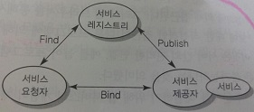
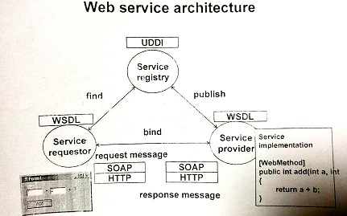
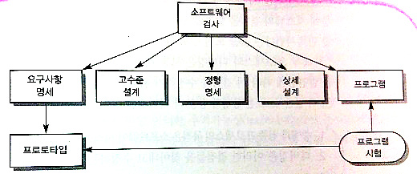

12장 분산 시스템 아키텍처
=========================

12.4 조직간의 분산컴퓨팅
------------------------

### 12.4.1 피어 투 피어 아키텍처

-	정의
	-	원칙적으로 클라이언트와 서버 사이의 구분이 없음
	-	거대한 컴퓨터 네트워크의 계산능력과 저장장치를 이용할 목적
-	비집중 아키텍처 : 지역적으로 묶임
-	반집중 아키텍처 : 일부 노드가 서버 역할 (피어간 교신설정 돕기, 계산 결과 조정)
-	단점 : 보안성, 신뢰성 → 그리 중요하지 않은 시스템에서 사용

### 12.4.2 서비스 지향 시스템 아키텍처

-	그림 12. 17 서비스 지향 시스템의 개념적 아키텍처
	-	
-	웹 기반 재사용 → 서비스 제공자와는 독립적
-	웹 서비스의 재사용 관련 표준 프로토콜 (XML 기반)
	-	
	-	SOAP (Simple Object Access Protocol) : 웹 서비스간의 구조적 데이터 교환에 관한 구조 정의
		-	**데이터 교환**
	-	WSDL (Web Services Description Language) : 웹 서비스의 인터페이스가 표현될 수 있는 방식 정의
		-	**인터페이스**
	-	UDDI (Universal Description, Descovery and Integration)
		-	: 서비스 요청자가 서비스를 발견하기 위해 사용하는
		-	서비스 기술 정보를 어떻게 구성할 수 있는지를 정의하는
		-	**디스커버리** 표준

22장 증명과 검증 (V & V, Verification & Validation)
===================================================

도입
----

-	V & V
	-	verification (증명) (specific) : 제품을 올바르게 생성하고 있는가
		-	→ Spec과 일치하는가
	-	validation (검증) (broader) : 올바른 제품을 생성하고 있는가
		-	→ 가치있는, 필요한 프로덕트를 만들고 있느냐
	-	목적 : 신뢰! (이 SW가 목적에 적합하다)
		-	세 가지 요소에 의해 바뀜 (SW 기능, 사용자 기대, 시장 상황)
-	분석법
	-	검사 (Inspection) : **본다** : 문서, 설계도, 코드 등을 분석, 점검
		-	실행 X, 정적 검사, 모든 단계에 적용가능
	-	시험 (Testing) : **실행한다** : 출력과 운영동작 검토
		-	실행 O, 동적 검사, 실행 가능한 결과물이 있어야
	-	
-	시험 (Testing) 두 가지 방법
	-	검증 시험 (Validation Testing) : 원하는 프로그램인가 (결과가 요구사항에 맞는지) → 24장 (중대한...)
	-	결점 시험 (Defect Testing) : 결점 없나 (결과가 명세서에 맞는지) → 23장
-	디버깅 vs (V & V)
	-	V & V : 결점이 있다
	-	디버깅 : 결점을 찾아서 고친다
-	재검사 / 회귀 시험 (결점 시험에서)
	-	결점 발견 → 오류 수정 → 다시 시험
	-	경험적으로, 수정이 많다 = 새로운 결함 / 불완전
	-	→ 고비용 → 테스트 케이스... 으음... 23장?

(X 안함) 22.1 증명과 검증 계획 수립
-----------------------------------

22.2 소프트웨어 검사
--------------------

-	검사 > 시험 인 이유 세가지
	-	시험 : 오류가 오류를 낳는다 → 검사는 신경쓸 필요 X
	-	불완전성 OK : 실행 안 되는 버전도 검사가능
	-	품질 고려 가능 : (표준 준수, 호환성, 유지보수성 등)

### 22.2.1 프로그램 검사 프로세스

> 모두 상이한 배경을 가진 팀원들이 프로그램의 소스코드를 신중하게 **한 줄 한 줄씩 검토** 하는 것을 기초로 한다

-	레알 한 줄 씩 검사
-	팀으로 (사무....)
	-	저자, 소유자 : 쓴놈
	-	검사자 : 검사하는놈
	-	낭독자 : 읽는놈
	-	서기 : 뭐했는지 기록하는놈
	-	의장 / 중재자 : 관리, 결과 보고하는놈
	-	수석 중재자 : 결과 보고받고 검사 기획하는놈
-	필요한 거
	-	명세서
	-	조직 표준에 친숙하기
	-	컴파일되는 코드를 모든 팀원에게
-	하는거
	-	결함을 **발견만 한다**, 수정제안 하지 마
-	결함 부류
	-	데이터 결함
	-	제어 결함
	-	입출력 결함
	-	인터페이스 결함
	-	기억 장소 관리 결함
	-	예외 관리 결함
-	검사 > 시험, 검사 > 시험, 검사 > 시험 (2배의 시간절약 : 책이 주장)

22.3 자동화된 정적 분석
-----------------------

-	검사의 일부는 자동화 가능
-	정적 분석기 : 프로그램에서 **가능한** 결함과 이상을 찾아내는 소프트웨어
	-	아닐 수도 있다 (가능성)
	-	컴파일러를 보완
-	하는 일
	1.	제어 흐름 분석 : 흐름 : 출구가 여러개인 반복문 / 도달할 수 없는 코드를 식별, 강조
	2.	데이터 사용 분석 : 변수 사용 등 : 초기화를 안 하고 썼다던지
	3.	인터페이스 분석 : 함수 호출시
		-	강타입 언어인 경우 컴파일러가 확인
		-	C 같은 약타입 언어는.. (안습)
	4.	정보 흐름 분석 : 입출력 변수 사이의 종속성 식별
	5.	경로 분석 : 가능한 모든 제어경로 확인
-	메모리 관리는 신뢰도의 악의 축
	-	Java 같은 최신 언어에선 아예 오류를 **발견하는 대신 회피** 해버린다
	-	C, C++은....

### 22.3.플러스 CppCheck를 이용한 정적 분석

-	도구 → 설정 → 전문가 설정 체크 (VS2013은 필요없음)
-	도구 → 외부 도구 → 추가
	-	명령 : 프로그램, 인수: `--template vs $(ItemPath)` , 초기 디렉터리 : `$(ItemDir)` , 출력창 사용에 체크

23장 소프트웨어 시험 (testing)
==============================

도입
----

23.1 시스템 시험
----------------

### 23.1.1 통합 시험

### 23.1.2 릴리즈 시험

### 23.1.3 성능 시험

23.2 컴포넌트 시험
------------------

### 23.2.1 인터페이스 시험

23.3 시험 사례 설계
-------------------

### 23.3.1 요구사항 기반 시험

### 23.3.2 분할 시험

### 23.3.3 구조 시험

### 23.3.4 경로 시험

### 23.3.플러스 : JUnit, EclEmma를 이용한 테스팅

17장 신속한 소프트웨어 개발
===========================

도입
----

17.1 애자일 기법
----------------

17.2 익스트림 프로그래밍까지
----------------------------

29장 형상 관리
==============

29.5 형상관리를 위한 CASE 도구
------------------------------

### 29.5.1 변경 관리를 위한 지원

### 29.5.2 버전 관리를 위한 지원

### 29.5.3 시스템 구축을 위한 지원

### 형상관리 배포자료

### CVS를 이용한 형상 관리

31장 서비스 지향 소프트웨어 공학
================================

도입
----

배포자료
--------

과제
====
